# Attività di query comuni in Power BI Desktop
La finestra **Editor di query** di Power BI Desktop include alcune utili attività usate comunemente. Questo documento illustra queste attività comuni e fornisce i collegamenti per accedere a ulteriori informazioni. 

Le attività di query comuni illustrate in questo documento sono:

* Connettersi ai dati
* Effettuare il data shaping e combinare i dati
* Raggruppare le righe
* Trasformare colonne tramite Pivot
* Creare colonne personalizzate
* Eseguire query su formule

Per completare queste attività, verranno usate alcune connessioni dati. I dati sono disponibili per il download o la connessione, nel caso in cui si voglia provare a eseguire autonomamente queste attività.

La prima connessione dati è una cartella di lavoro di Excel. L'altra è una risorsa Web, che viene usata anche in altri contenuti della Guida di Power BI Desktop e a cui è possibile accedere da questo indirizzo:

[*http://www.bankrate.com/finance/retirement/best-places-retire-how-state-ranks.aspx*](http://www.bankrate.com/finance/retirement/best-places-retire-how-state-ranks.aspx)

La procedura necessaria per connettersi a entrambe queste origini dati coincide con l'inizio delle attività comuni di Query.

## Connettersi ai dati
Per connettersi ai dati in Power BI Desktop, selezionare il pulsante **Recupera dati** nella scheda **Home** della barra multifunzione. Power BI Desktop visualizza un menu con le origini dati più comuni. Per un elenco completo delle origini dati a cui Power BI Desktop può connettersi, selezionare il pulsante **Altro** nella parte inferiore del menu. Per altre informazioni, vedere [Origini dati in Power BI Desktop](https://docs.microsoft.com/en-us/power-bi/desktop-data-sources).

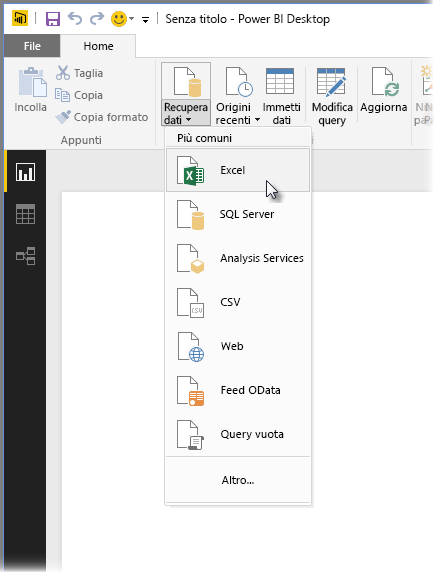

Per iniziare, selezionare **Excel** e passare alla cartella di lavoro, quindi selezionarla. Query esamina la cartella di lavoro e visualizza quindi i dati trovati nella finestra **Strumento di navigazione** .

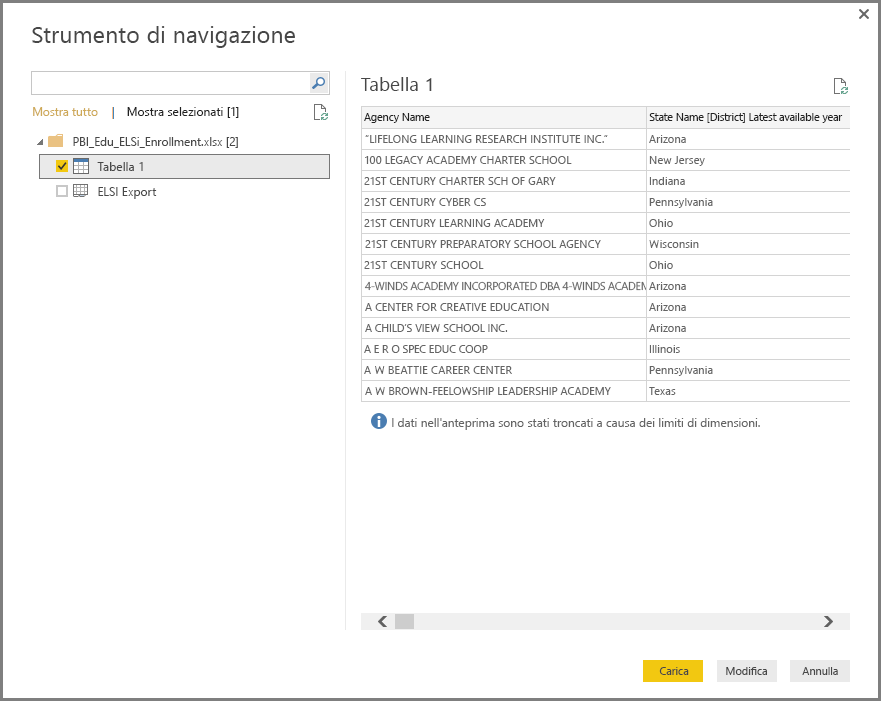

È possibile selezionare **Modifica** per modificare i dati o effettuare il *data shaping* prima di caricarli in Power BI Desktop. La modifica di una query prima del caricamento è particolarmente utile quando si lavora con set di dati di grandi dimensioni che si intende ridurre prima del caricamento. A tale scopo, selezionare **Modifica**.

La connessione ai diversi tipi di dati è estremamente semplice. Provare ora a connettersi a una risorsa Web. Selezionare **Recupera dati \> Altro** e quindi **Altro \> Web**.

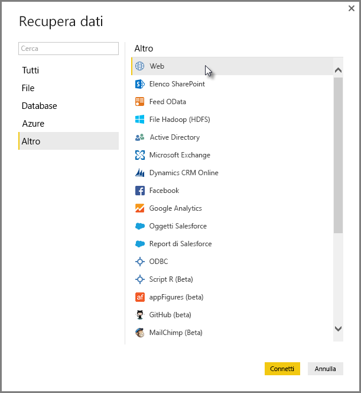

Viene visualizzata la finestra **Da Web** in cui digitare l'URL della pagina Web.

Scegliere **OK**. Come in precedenza, Power BI Desktop esamina la cartella di lavoro e visualizza i dati trovati nella finestra **Strumento di navigazione**.

Le altre connessioni dati sono simili. Se per stabilire una connessione dati è necessaria l'autenticazione, Power BI Desktop richiederà di immettere le credenziali appropriate.

Per informazioni dettagliate sulla connessione ai dati in Power BI Desktop, vedere [Connettersi ai dati in Power BI Desktop](https://docs.microsoft.com/en-us/power-bi/desktop-connect-to-data).

## Effettuare il data shaping e combinare i dati
L'Editor di query consente di effettuare facilmente il data shaping e di combinare i dati. Questa sezione include alcuni esempi su come effettuare il data shaping. Per una dimostrazione più completa di ogni passaggio relativo al data shaping e alla combinazione dei dati, vedere **[Data shaping e combinazione di dati in Power BI Desktop](https://docs.microsoft.com/en-us/power-bi/desktop-shape-and-combine-data)**.

Nella sezione precedente sono stati caricati due set di dati, una cartella di lavoro di Excel e una risorsa Web. Dopo il caricamento nell'Editor di query, la visualizzazione è simile alla seguente, con la query della pagina Web selezionata (tratta dall'elenco delle query disponibili elencate nel riquadro **Query** sul lato sinistro della finestra Editor di query).

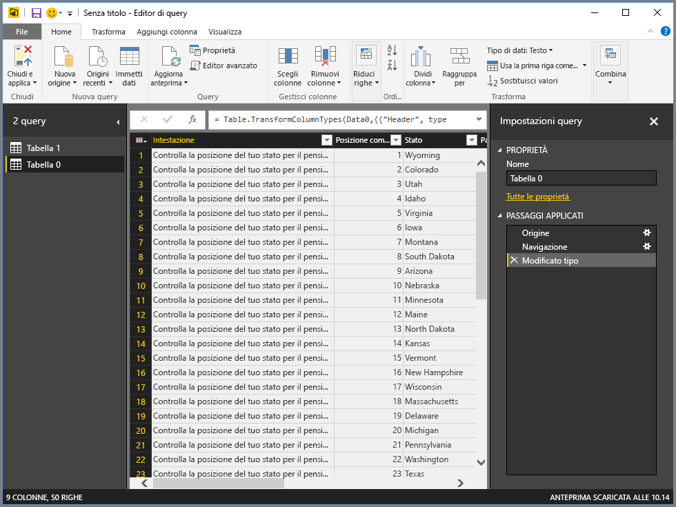

Quando si effettua il data shaping, si modifica la forma e il formato di un'origine dati in base a esigenze specifiche. In questo caso la prima colonna *Header* non è necessaria, di conseguenza è possibile rimuoverla.

Nell' **Editor di query**molti comandi sono disponibili nella barra multifunzione e nei menu sensibili al contesto accessibili facendo clic con il pulsante destro del mouse. Quando, ad esempio, si fa clic con il pulsante destro del mouse sulla colonna *Header*, il menu visualizzato contiene una voce per rimuovere la colonna. È anche possibile selezionare la colonna e quindi scegliere il pulsante **Rimuovi colonne** nella barra multifunzione.

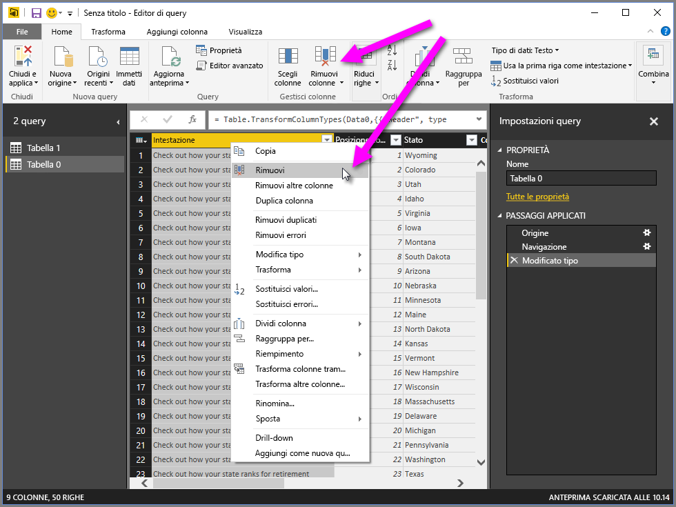

È possibile effettuare il data shaping dei dati in questa query in molti altri modi, ad esempio rimuovere un qualsiasi numero di righe dalla parte inferiore o superiore, aggiungere o dividere colonne, sostituire valori ed eseguire altre attività per impostare l'Editor di query in modo da ottenere i dati desiderati.

## Raggruppare le righe
Nell'Editor di query è possibile raggruppare i valori di più righe in un unico valore. Questa funzione può essere utile ad esempio quando si vuole riepilogare il numero di prodotti offerti, le vendite totali o il numero di studenti.

In questo esempio verranno raggruppate le righe di un set di dati relativo alle iscrizioni scolastiche. I dati provengono da una cartella di lavoro di Excel e ne è stato effettuato il data shaping nell'Editor di query in modo da ottenere solo le colonne necessarie. È inoltre stata rinominata la tabella e sono state eseguite alcune altre trasformazioni.

Per conoscere il numero di agenzie (che includono distretti scolastici e altri enti di formazione, come i distretti regionali e così via), presenti in ogni stato, selezionare la colonna *State Abbr*, quindi scegliere il pulsante **Raggruppa per** nella scheda **Trasforma** oppure **Home** della barra multifunzione. Il pulsante **Raggruppa per** è disponibile in entrambe le schede.

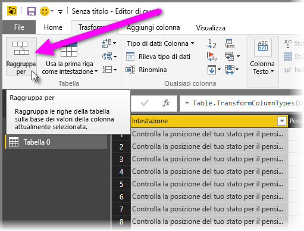

La finestra **Raggruppa per** verrà visualizzata. Quando l'Editor di query raggruppa le righe, viene creata una nuova colonna in cui inserire i risultati di **Raggruppa per** . Per modificare il funzionamento di **Raggruppa per** , è possibile usare:

1. *Raggruppa per*: colonna in cui effettuare il raggruppamento. L'Editor di query sceglie la colonna selezionata, ma in questa finestra è possibile selezionare qualsiasi altra colonna della tabella.
2. *Nuovo nome di colonna* : l'Editor di query suggerisce per la nuova colonna un nome basato sull'operazione applicata alla colonna raggruppata, ma è possibile specificare un qualsiasi altro nome.
3. *Operazione* : specificare qui l'operazione applicata dall'Editor di query.
4. *Aggiungi raggruppamento* e *Aggiungi aggregazione*: queste opzioni vengono visualizzate dopo aver selezionato l'opzione **Avanzate**. È possibile eseguire operazioni di raggruppamento (azioni **Raggruppa per**) su più colonne ed eseguire più aggregazioni, il tutto nella finestra **Raggruppa per** e in un'unica operazione. L'Editor di query crea una nuova colonna (sulla base delle selezioni in questa finestra) che opera su più colonne. 

Selezionare il pulsante **Aggiungi raggruppamento** oppure **Aggiungi aggregazione** per aggiungere più raggruppamenti o aggregazioni a un'operazione **Raggruppa per**. Per rimuovere una colonna o un'aggregazione, selezionare l'icona **...** ed **Elimina**, quindi procedere e provare a effettuare questa operazione per verificarne l'effetto.
   
   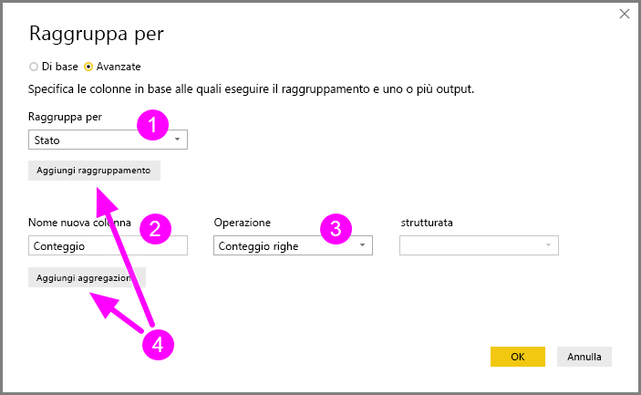

Quando si fa clic su **OK**, l'Editor di query esegue l'operazione **Raggruppa per** e restituisce i risultati. Esaminando l'esempio, è ora possibile notare la presenza di oltre 1000 agenzie in Ohio, Texas, Illinois e California.

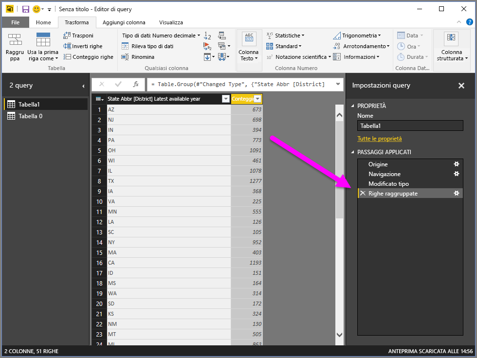

Con l'Editor di query poi è sempre possibile rimuovere l'ultima operazione di shaping selezionando la **X** accanto al passaggio appena completato. Provare e sperimentare, ripetendo il passaggio se i risultati non sono soddisfacenti, finché i dati nell'Editor di query non sono quelli desiderati.

## Trasformare colonne tramite Pivot
Con Power BI Desktop è possibile trasformare colonne tramite Pivot e creare una tabella che contiene i valori aggregati per ogni valore univoco di una colonna. Se ad esempio si vuole conoscere il numero di prodotti diversi presenti in ogni categoria di prodotto, è possibile creare rapidamente una tabella che consente di ottenere questo dato.

Esaminiamo un esempio. La tabella **Prodotti** seguente è stata impostata in modo da visualizzare solo prodotti univoci (per nome) e la categoria a cui appartengono. Per creare una nuova tabella che visualizza il numero di prodotti presenti in ogni categoria in base alla colonna *CategoryName* , selezionare la colonna, quindi scegliere **Colonna pivot** nella scheda **Trasforma** della barra multifunzione.

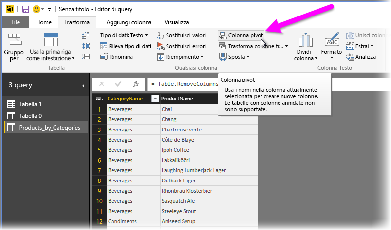

Viene visualizzata la finestra **Colonna pivot** in cui sono indicati i valori di colonna che verranno usati per creare nuove colonne (1). Quando poi si espande **Opzioni avanzate** (2), è possibile selezionare la funzione che verrà applicata ai valori aggregati (3).

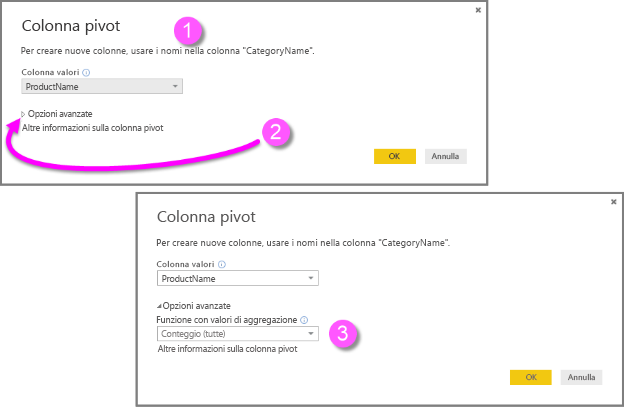

Quando si fa clic su **OK**, Query visualizza la tabella in base alle istruzioni di trasformazione fornite nella finestra **Colonna pivot** .

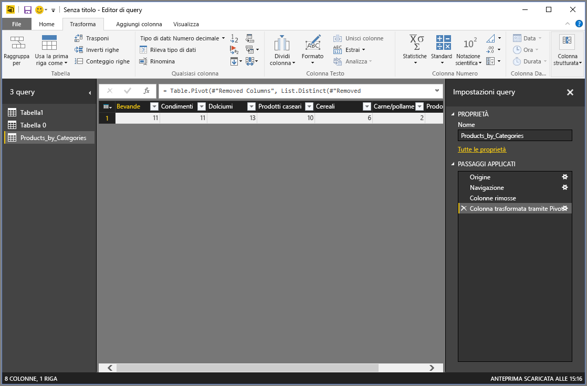

## Creare colonne personalizzate
Nell'Editor di query è possibile creare formule che agiscono su più colonne della tabella e inserire i risultati di tali formule in una nuova colonna personalizzata. Con l'Editor di query creare colonne personalizzate è semplicissimo.

Nell'Editor di query selezionare **Colonna personalizzata** nella scheda **Aggiungi colonna** della barra multifunzione.

Verrà visualizzata la finestra seguente. Nell'esempio seguente verrà creata una colonna personalizzata denominata *Percentuale di ELL* che calcola la percentuale di studenti totali che studiano inglese.

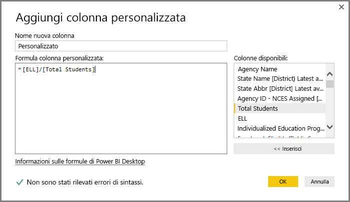

Come in qualsiasi altro passaggio applicato nell'Editor di query, se la nuova colonna personalizzata non fornisce i dati cercati, è sufficiente eliminare il passaggio dalla sezione **Passaggi applicati** del riquadro **Impostazioni query** selezionando la **X** accanto al passaggio **Aggiunta colonna personalizzata** .

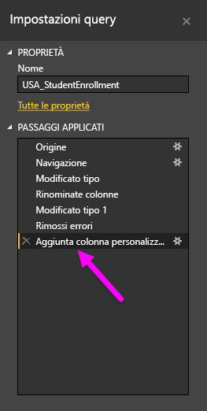

## Eseguire query su formule
È possibile modificare i passaggi generati dall'Editor di query e creare formule personalizzate per controllare la connessione e lo shaping dei dati in modo più preciso. Ogni volta che l'Editor di query esegue un'azione sui dati, la formula associata all'azione viene visualizzata nella **barra della formula**. Per visualizzare la **barra della formula**, selezionare la casella di controllo accanto a **Barra della formula** nella scheda **Visualizza** della barra multifunzione.

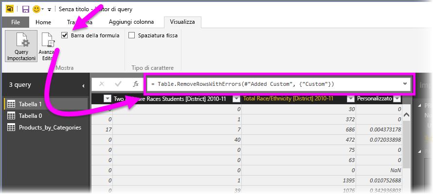

Nell'Editor di query tutti i passaggi applicati per ogni query vengono mantenuti in formato testo che è possibile visualizzare o modificare. Per visualizzare o modificare il testo di una qualsiasi query, usare l' **Editor avanzato**, visualizzato quando si seleziona **Editor avanzato** nella scheda **Visualizza** della barra multifunzione.

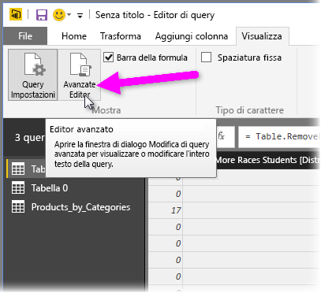

Questa è la finestra dell'**editor avanzato** con i passaggi associati alla query **USA\_StudentEnrollment**. Questi passaggi vengono creati nel linguaggio delle formule di Power Query, noto anche come **M**. Per informazioni, vedere [Informazioni sulle formule di Power Query](https://support.office.com/article/Learn-about-Power-Query-formulas-6bc50988-022b-4799-a709-f8aafdee2b2f?ui=en-US&rs=en-US&ad=US). Per visualizzare la specifica del linguaggio, vedere [Microsoft Power Query for Excel Formula Language Specification](http://go.microsoft.com/fwlink/?linkid=320633) (Specifica del linguaggio delle formule di Microsoft Power Query per Excel).

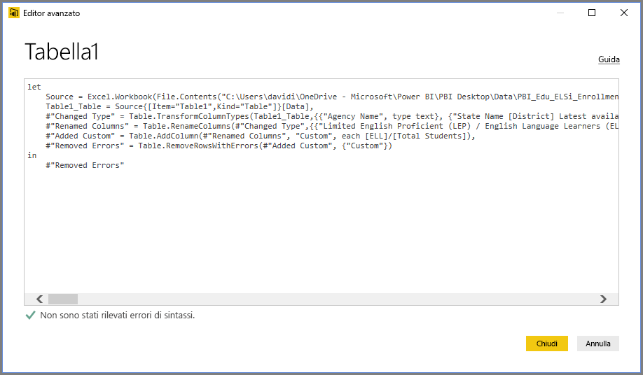

In Power BI Desktop è disponibile un set completo di categorie di formule. Per altri dettagli e informazioni di riferimento complete su tutte le formule dell'editor di query, vedere [Power Query Formula Categories](https://support.office.com/en-in/article/Power-Query-formula-categories-125024ec-873c-47b9-bdfd-b437f8716819) (Categorie delle formule di Power Query).

Le categorie delle formule per l'Editor di query sono le seguenti:

* Numero
  * Costanti
  * Informazioni
  * Conversione e formattazione
  * Formato
  * Arrotondamento
  * Operazioni
  * Casuale
  * Trigonometria
  * Byte
* Testo
  * Informazioni
  * Confronti di testo
  * Estrazione
  * Modifica
  * Appartenenza
  * Trasformazioni
* Logico
* Data
* Ora
* DateTime
* DateTimeZone
* Durata
* Record
  * Informazioni
  * Trasformazioni
  * Selezione
  * Serializzazione
* Elenco
  * Informazioni
  * Selezione
  * Trasformazione
  * Appartenenza
  * Operazioni su set
  * Ordinamento
  * Medie
  * Aggiunta
  * Valori numerici
  * Generatori
* Tabella
  * Creazione di tabelle
  * Conversioni
  * Informazioni
  * Operazioni su righe
  * Operazioni su colonne
  * Appartenenza
* Valori
* Operazioni aritmetiche
* Tipi di parametro
* Metadati
* Accesso ai dati
* URI
* Formati binari
  * Lettura di numeri
* Binario
* Righe
* Espressione
* Funzione
* Errore
* Operatore di confronto
* Barra di divisione
* Funzione di combinazione
* Funzione di sostituzione
* Tipo

## Passaggi successivi
Power BI Desktop offre infinite possibilità. Per altre informazioni sulle capacità disponibili, vedere le risorse seguenti:

* [Introduzione a Power BI Desktop](desktop-getting-started.md)
* [Panoramica delle query con Power BI Desktop](desktop-query-overview.md)
* [Origini dati in Power BI Desktop](desktop-data-sources.md)
* [Connettersi ai dati in Power BI Desktop](desktop-connect-to-data.md)
* [Effettuare il data shaping e combinare i dati con Power BI Desktop](desktop-shape-and-combine-data.md)

