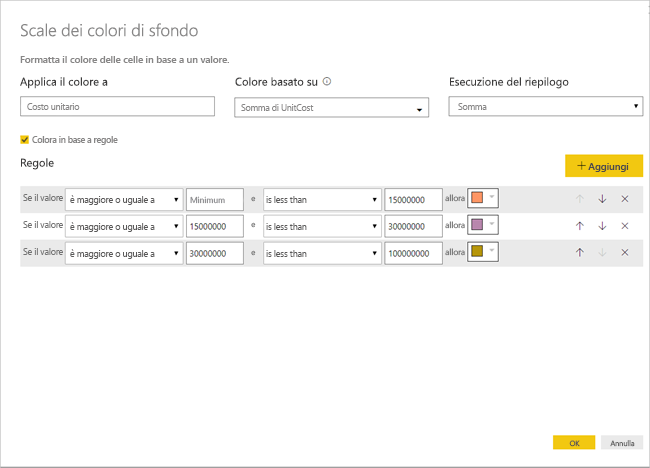

# Formattazione condizionale nelle tabelle 
La formattazione condizionale nelle tabelle consente di specificare colori delle celle personalizzati in base ai valori della cella o ad altri valori o campi, e anche di usare sfumature. È anche possibile visualizzare i valori delle celle con barre dei dati. 

Per accedere alla formattazione condizionale, nel contenitore **Campi** del riquadro **Visualizzazioni** in Power BI Desktop selezionare la freccia rivolta verso il basso accanto al valore nell'area **Valori** che si vuole formattare o fare clic con il pulsante destro del mouse sul campo. È possibile gestire la formattazione condizionale solo per i campi nell'area **Valori** dell'area **Campi**.

Le sezioni seguenti descrivono le opzioni di formattazione condizionale. È possibile combinare una o più opzioni in un'unica colonna di tabella.

> [!NOTE]
> Se applicata a una tabella, la formattazione personalizzata sostituisce tutti gli stili della tabella personalizzati applicati alle celle formattate in modo condizionale.

Per rimuovere la formattazione condizionale da una visualizzazione fare di nuovo clic con il pulsante destro del mouse sul campo, selezionare **Rimuovi formattazione condizionale** e selezionare il tipo di formattazione da rimuovere.

## Scale dei colori di sfondo

Se si seleziona **Formattazione condizionale** e quindi **Scale dei colori di sfondo** viene visualizzata la finestra di dialogo seguente.

È possibile selezionare un campo del modello dati sul quale basare i colori, impostando **Colore basato su** su tale campo. È anche possibile specificare il tipo di aggregazione per il campo selezionato mediante il valore **Esecuzione del riepilogo**. Il campo da colorare è specificato nel campo **Applica il colore a**. È possibile applicare la formattazione condizionale a campi di testo e campi data, purché si scelga un valore numerico come base per la formattazione.

Per usare valori di colore discreti per intervalli di valori dati, selezionare **Colora in base a regole**. Per usare uno spettro dei colori lasciare disattivata l'opzione **Colora in base a regole**. 

### Colora in base a regole

Quando si seleziona **Colora in base a regole** è possibile immettere uno o più intervalli di valori, ognuno con un colore impostato.  Ogni intervallo di valori inizia con una condizione *Se il valore*, una condizione di valore *e* e un colore.

Le celle di tabella con valori in ogni intervallo vengono riempite con il colore specificato. La figura seguente visualizza tre regole.

La tabella di esempio ora ha un aspetto simile al seguente:

### Colori corrispondenti a valori minimo e massimo

È possibile configurare i valori *Minimo* e *Massimo* e i colori corrispondenti. Se si seleziona la casella **Divergente**, è possibile configurare anche un valore *Centro* facoltativo.

La tabella di esempio ora ha un aspetto simile al seguente:

## Scale dei colori carattere

Se si seleziona **Formattazione condizionale** e quindi **Scale dei colori carattere** viene visualizzata la finestra di dialogo seguente. Questa finestra di dialogo è simile alla finestra **Scale dei colori di sfondo**, ma modifica il colore del carattere invece del colore di sfondo della cella.

La tabella di esempio ora ha un aspetto simile al seguente:

## Barre dei dati

Se si seleziona **Formattazione condizionale** e quindi **Barre dei dati** viene visualizzata la finestra di dialogo seguente. 

Per impostazione predefinita l'opzione **Mostra solo barra** è deselezionata, pertanto la cella della tabella visualizza sia la barra sia il valore effettivo.

Se è selezionata l'opzione **Mostra solo barra** la cella della tabella visualizza solo la barra.

## Formattazione a colori in base al valore del campo

È possibile usare una misura o una colonna che specifica un colore, usando un valore di testo o un codice esadecimale, per applicare tale colore allo sfondo del colore del carattere di una tabella o un oggetto visivo matrice. È anche possibile creare logica personalizzata per un determinato campo e fare in modo che tale logica applichi il colore desiderato al tipo di carattere o allo sfondo.

Ad esempio, nella tabella seguente è presente un colore associato a ogni modello di prodotto. 

Per formattare la cella in base al relativo valore di campo, selezionare la finestra di dialogo **Formattazione condizionale** facendo clic con il pulsante destro del mouse sulla colonna *Colore* per tale oggetto visivo e in questo caso, scegliere **Colore di sfondo**  dal menu. 

Nella finestra di dialogo visualizzata selezionare **Valore del campo** nell'elenco a discesa **Formatta per**, come illustrato nell'immagine seguente.

È possibile ripetere il processo per il colore del carattere e il risultato nell'oggetto visivo sarà un colore a tinta unita nella colonna **Colore**, come illustrato nella schermata seguente.

È anche possibile creare un calcolo DAX in base alla logica di business, che restituisce codici esadecimali diversi in base alle condizioni preferite. Si tratta in genere di un'operazione più semplice rispetto alla creazione di più regole nella finestra di dialogo Formattazione condizionale. Si consideri il campo *ColorKPI* nell'immagine di esempio seguente.

Si potrebbe quindi impostare il valore del campo per **Colore di sfondo** nel modo seguente.

Si potrebbero quindi ottenere risultati simili alla matrice seguente.

Esistono molte altre varianti che è possibile creare, semplicemente usando l'immaginazione ed espressioni DAX.

Per colorare gli oggetti visivi è possibile usare uno dei valori elencati nella specifica dei colori CSS in [https://www.w3.org/TR/css-color-3/](https://www.w3.org/TR/css-color-3/):
* codici esadecimali a 3, 6 o 8 cifre, ad esempio #3E4AFF. Assicurarsi di includere il simbolo cancelletto (#) all'inizio del codice. "3E4AFF" non viene accettato. 
* Valori RGB o RGBA, ad esempio RGBA(234, 234, 234, 0.5)
* Valori HSL o HSLA, ad esempio HSLA(123, 75%, 75%, 0.5)
* Nomi dei colori, ad esempio Green, SkyBlue, PeachPuff 

## Considerazioni e limitazioni
Quando si lavora con la formattazione condizionale nelle tabelle, è necessario tenere presenti alcune considerazioni:

* La formattazione condizionale viene applicata solo ai valori di un oggetto visivo **Matrice** e non è applicabile a subtotali o totali complessivi. 
* La formattazione condizionale non viene applicata alla riga **Totale**
* Tutte le tabelle che non hanno un raggruppamento vengono visualizzate come righe singole che non supportano la formattazione condizionale.
* Se si usa il formato sfumatura con valori max/min automatici o la formattazione basata su regole con regole percentuali e i dati contengono valori NaN, non è possibile applicare la formattazione condizionale. NaN significa 'Not a number' (non un numero). La causa più frequente è un errore di divisione per zero. Per evitare errori di questo tipo è possibile usare la [funzione DIVIDE() DAX](https://docs.microsoft.com/dax/divide-function-dax).

## Passaggi successivi
Per altre informazioni, vedere l'articolo seguente:  

* [Suggerimenti e consigli per la formattazione dei colori in Power BI](visuals/service-tips-and-tricks-for-color-formatting.md)  

