# Usare la formattazione condizionale nelle tabelle 

La formattazione condizionale delle tabelle in Power BI Desktop consente di specificare colori delle celle personalizzati (incluse le sfumature) in base ai valori dei campi. È possibile rappresentare i valori delle celle anche con barre di dati o icone KPI, nonché come collegamenti Web attivi. È possibile applicare la formattazione condizionale a qualsiasi campo di testo o dati, purché sia basata su un campo con un valore costituito da un numero, un nome colore, un codice esadecimale o un URL Web. 

Per applicare la formattazione condizionale, selezionare una visualizzazione di tipo **Tabella** o **Matrice** in Power BI Desktop. Nella sezione **Campi** del riquadro **Visualizzazioni** selezionare la freccia GIÙ accanto al campo dell'area **Valori** che si vuole formattare oppure fare clic con il pulsante destro del mouse sul campo. Selezionare **Formattazione condizionale** e quindi il tipo di formattazione da applicare.

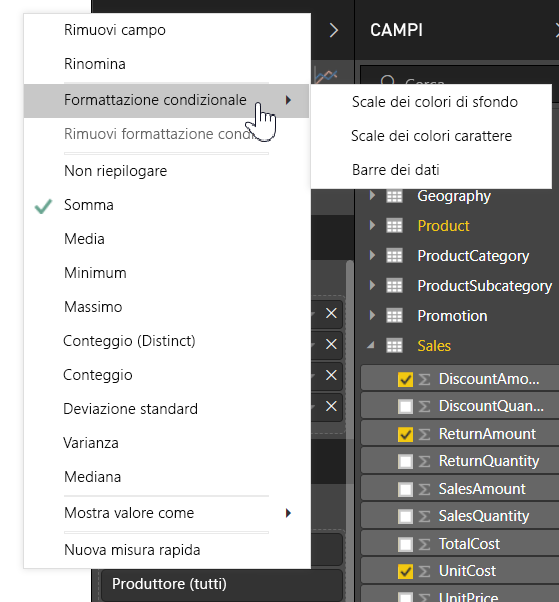

> [!NOTE]
> Con la formattazione condizionale viene sostituito qualsiasi colore di sfondo o di carattere personalizzato applicato a una cella formattata in modo condizionale.

Per rimuovere la formattazione condizionale da una visualizzazione, selezionare **Rimuovi formattazione condizionale** dal menu a discesa del campo e selezionare il tipo di formattazione da rimuovere.

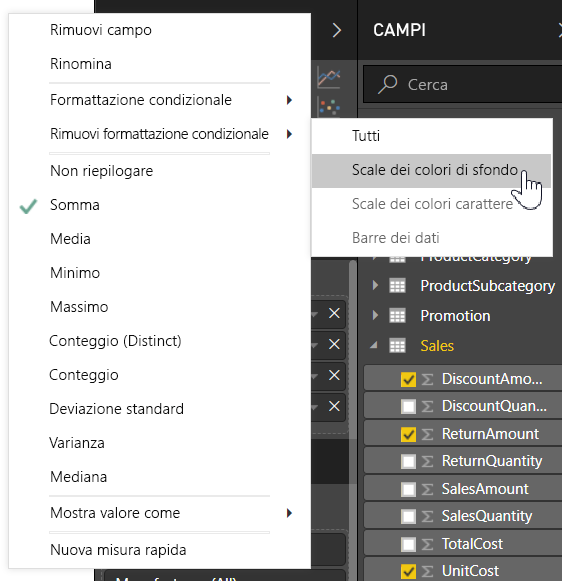

Le sezioni seguenti descrivono le varie opzioni di formattazione condizionale. È possibile combinare più opzioni in un'unica colonna di tabella.

## Formattare il colore di sfondo o del carattere

Per formattare il colore di sfondo o del carattere di una cella, selezionare **Formattazione condizionale** per un campo e quindi scegliere **Colore di sfondo** o **Colore carattere** dal menu a discesa. 

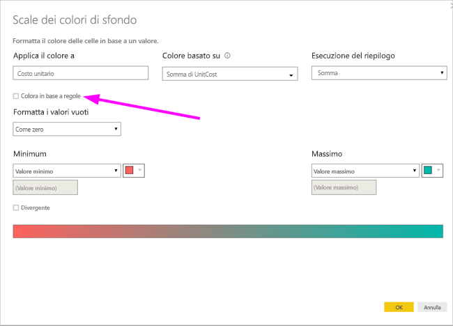

Viene visualizzata la finestra di dialogo **Colore di sfondo** o **Colore carattere** con il nome del campo da formattare nel titolo. Dopo aver selezionato le opzioni di formattazione condizionale, scegliere **OK**. 

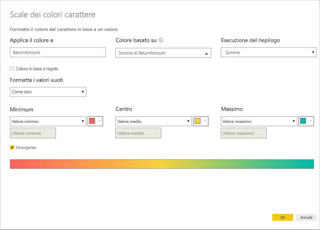

Le opzioni delle finestre di dialogo **Colore di sfondo** e **Colore carattere** sono le stesse, ma si ripercuotono, rispettivamente, sul colore di sfondo e sul colore del carattere della cella. È possibile applicare al colore del carattere e al colore di sfondo di un campo sia la stessa formattazione condizionale sia una formattazione diversa. Se il carattere e lo sfondo di un campo vengono impostati sullo stesso colore, il carattere si fonde con lo sfondo e nella colonna della tabella sembra che siano presenti solo i colori.

## Colore per scala dei colori

Per formattare il colore di sfondo o del carattere della cella in base alla scala dei colori, nel campo **Formatta per** della finestra di dialogo **Colore di sfondo** o **Colore carattere** selezionare **Scala dei colori**. In **In base al campo** selezionare il campo sul quale basare la formattazione. È possibile basare la formattazione sul campo corrente o su un campo del modello con dati numerici o di colore. 

In **Riepilogo** specificare il tipo di aggregazione da usare per il campo selezionato. In **Formattazione predefinita** selezionare una formattazione da applicare ai valori vuoti. 

In **Minimo** e **Massimo** scegliere se applicare la combinazione di colori in base ai valori minimi o massimi dei campi oppure sui valori personalizzati immessi. Nell'elenco a discesa selezionare i campioni colore da applicare ai valori minimi e massimi. Selezionare la casella di controllo **Divergente** per specificare anche un valore e un colore per **Al centro**. 

Di seguito è illustrata una tabella di esempio con la formattazione dello sfondo con scala dei colori basata sulla colonna **Affordability**:

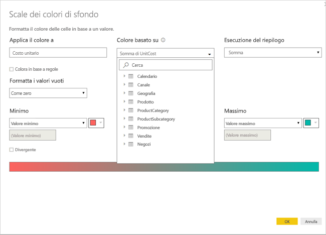

Di seguito è illustrata una tabella di esempio con la formattazione del carattere con scala dei colori basata sulla colonna **Affordability**:

## Colora in base a regole

Per formattare il colore di sfondo o del carattere della cella in base a regole, nel campo **Formatta per** della finestra di dialogo **Colore di sfondo** o **Colore carattere** selezionare **Regole**. Anche in questo caso, nella sezione **In base al campo** viene visualizzato il campo su cui deve essere basata la formattazione e nella sezione **Riepilogo** viene visualizzato il tipo di aggregazione relativo al campo. 

In **Regole** immettere uno o più intervalli di valori e impostare un colore per ciascuno di essi. Ogni intervallo di valori presenta una condizione *Se il valore*, una condizione di valore *e* e un colore. In ogni intervallo di valori, gli sfondi o i caratteri delle celle sono colorati con il colore specificato. Nell'esempio seguente sono presenti tre regole:

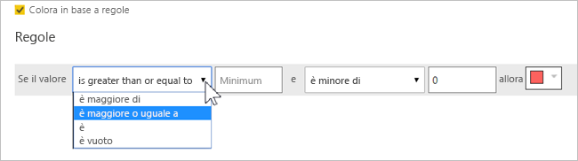

Di seguito è illustrata una tabella di esempio con la formattazione dello sfondo con regole basata sulla colonna **Affordability**:

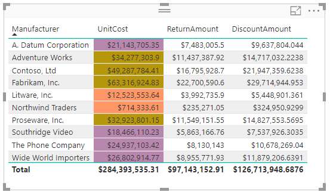

## Colore per valori colore

Se si ha un campo o una misura con i dati relativi a un nome di colore o un valore esadecimale, è possibile usare la formattazione condizionale per applicare automaticamente questi colori allo sfondo o al carattere di una colonna. È possibile usare anche la logica personalizzata per applicare un colore al carattere o allo sfondo.

Il campo può usare qualsiasi valore di colore elencato nella specifica dei colori CSS in [https://www.w3.org/TR/css-color-3/](https://www.w3.org/TR/css-color-3/). Questi valori di colore possono includere:
- Codici esadecimali a 3, 6 o 8 cifre, ad esempio #3E4AFF. Assicurarsi di includere il simbolo cancelletto (#) all'inizio del codice. 
- Valori RGB o RGBA, ad esempio RGBA(234, 234, 234, 0.5).
- Valori HSL o HSLA, ad esempio HSLA(123, 75%, 75%, 0.5).
- Nomi di colori, ad esempio Green, SkyBlue o PeachPuff. 

Nella tabella seguente, a ogni stato è associato un nome di colore: 

Per formattare la colonna **Colore** in base ai valori dei campi, selezionare **Formattazione condizionale** per il campo **Colore** e quindi selezionare **Colore di sfondo** o **Colore carattere**. 

Nella finestra di dialogo **Colore di sfondo** o **Colore carattere** scegliere **Valore del campo** nel campo a discesa **Formatta per**.

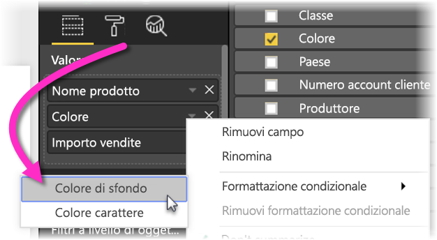

Di seguito è illustrata una tabella di esempio con la formattazione di **Colore di sfondo** per Valore del campo basata sulla colonna **Colore**:

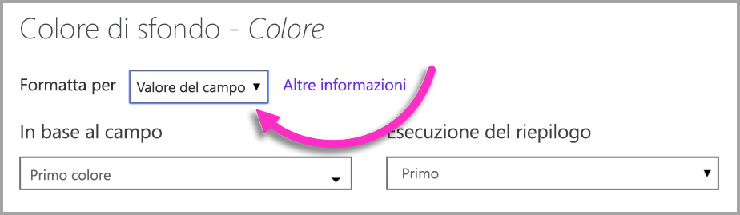

Se si usa anche **Valore del campo** per formattare il **Colore carattere** della colonna, il risultato sarà un colore a tinta unita nella colonna **Colore**:

## Colore basato su un calcolo

È possibile creare un calcolo DAX in grado di restituire valori diversi in base alle condizioni della logica di business selezionate. La creazione di una formula DAX costituisce in genere un'operazione più veloce rispetto alla creazione di più regole nella finestra di dialogo Formattazione condizionale. 

La formula DAX seguente, ad esempio, applica valori di colori esadecimali a una nuova colonna **Affordability rank** in base ai valori della colonna **Affordability** esistenti:

Per applicare i colori, selezionare la formattazione condizionale **Colore di sfondo** o **Colore carattere** per la colonna **Affordability** e basare la formattazione sulla cella **Valore del campo** della colonna **Affordability rank**. 

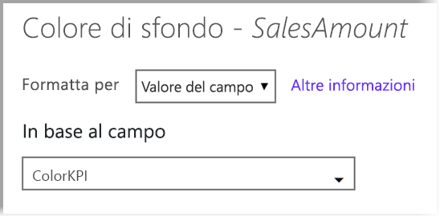

Di seguito è illustrata una tabella di esempio con il colore di sfondo della colonna **Affordability** basato sul valore calcolato per **Affordability rank**:

È possibile creare molte altre varianti combinando l'immaginazione con alcune espressioni DAX.

## Aggiungere barre dei dati

Per visualizzare le barre dei dati in base ai valori delle celle, selezionare **Formattazione condizionale** per il campo **Affordability** e quindi scegliere **Barre dei dati** nel menu a discesa. 

Nella finestra di dialogo **Barre dei dati**, l'opzione **Mostra solo barra** è deselezionata per impostazione predefinita e nella cella della tabella vengono visualizzate sia le barre sia i valori effettivi. Per visualizzare solo le barre dei dati, selezionare la casella di controllo **Mostra solo barra**.

È possibile specificare i valori **Minimo** e **Massimo**, i colori e la direzione della barra dei dati e il colore degli assi. 

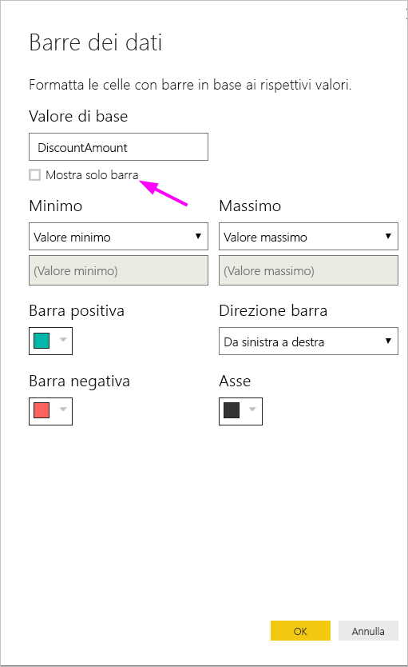

Di seguito è illustrata una tabella di esempio con le barre dei dati applicate alla colonna **Affordability**:

## Aggiungere icone

Per visualizzare le icone in base ai valori delle celle, selezionare **Formattazione condizionale** per il campo e quindi scegliere **Icone** nel menu a discesa. 

Nella finestra di dialogo **Icone**, in **Formatta per** selezionare **Regole** o **Valore del campo**. 

Per formattare in base alle regole, selezionare i valori desiderati per **In base al campo**, **Riepilogo**, **Layout icona** e **Allineamento dell'icona**, un'icona per **Stile** e una o più **Regole**. In **Regole** immettere una o più regole con una condizione *Se il valore* e una condizione di valore *e* e selezionare un'icona da applicare a ogni regola. 

Per formattare in base ai valori dei campi, selezionare i valori desiderati per **In base al campo**, **Riepilogo**, **Layout icona** e **Allineamento dell'icona**.

Nell'esempio seguente vengono aggiunte icone in base a tre regole:

Seleziona **OK**. Di seguito è illustrata una tabella di esempio con le icone applicate alla colonna **Affordability** in base alle regole:

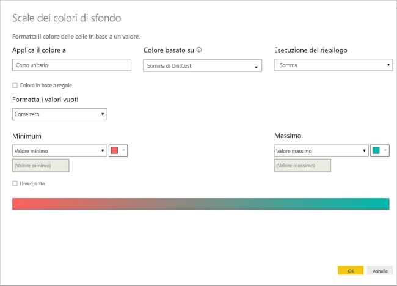

## Formattare come URL Web

Se è presente una colonna o una misura che contiene URL di siti Web, è possibile usare la formattazione condizionale per applicare gli URL ai campi come collegamenti attivi. Nella tabella seguente, ad esempio, è presente una colonna **Sito Web** con URL di siti Web per ogni stato:

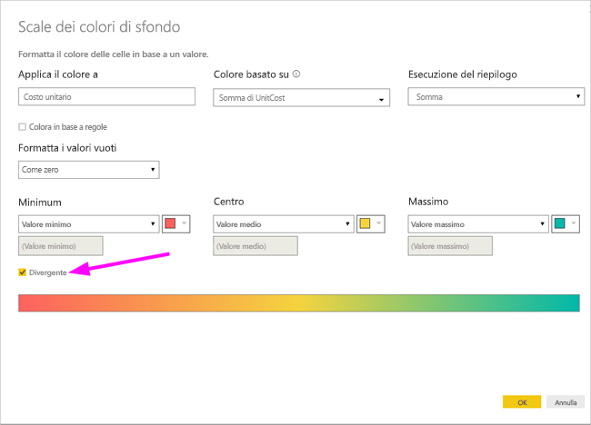

Per visualizzare ogni nome di stato come collegamento live al relativo sito Web, selezionare **Formattazione condizionale** per il campo **Stato** e quindi selezionare **URL Web**. Nella finestra di dialogo **URL Web**, in **In base al campo** selezionare **Sito Web** e quindi scegliere **OK**. 

Con la formattazione **URL Web** applicata al campo **Stato**, ogni nome di stato è un collegamento attivo al relativo sito Web. La tabella di esempio seguente presenta la formattazione **URL Web** applicata alla colonna **Stato**, **Barre dei dati** condizionali e la **Formattazione di sfondo** applicata alla colonna **Affordability**. 

## Considerazioni e limitazioni
Quando si lavora con la formattazione condizionale nelle tabelle, è necessario tenere presenti alcune considerazioni:

- La formattazione condizionale si applica solo ai valori degli oggetti visivi Tabella o Matrice e non si applica ai totali, ai subtotali o alla riga **Totale**. 
- Tutte le tabelle che non hanno un raggruppamento vengono visualizzate come righe singole che non supportano la formattazione condizionale.
- Non è possibile applicare la formattazione della sfumatura con valori minimi o massimi automatici o la formattazione basata su regole con regole percentuali se i dati contengono valori *NaN*. NaN significa "Not a number" (non un numero). La causa più frequente è un errore di divisione per zero. Per evitare errori di questo tipo è possibile usare la [funzione DIVIDE() DAX](https://docs.microsoft.com/dax/divide-function-dax).
- Per la formattazione condizionale è necessaria un'aggregazione o una misura da applicare al valore. È questo il motivo per cui viene visualizzato "First" (Primo) o "Last" (Ultimo) nell'esempio **Color by value** (Colore in base al valore). Se il report viene compilato facendo riferimento a un cubo multidimensionale di Analysis Services, non sarà possibile usare un attributo per la formattazione condizionale, a meno che il proprietario del cubo non abbia creato una misura che fornisce il valore.

## Passaggi successivi

Per altre informazioni sulla formattazione dei colori, vedere l'articolo seguente: [Suggerimenti e consigli per la formattazione dei colori in Power BI](visuals/service-tips-and-tricks-for-color-formatting.md)  

