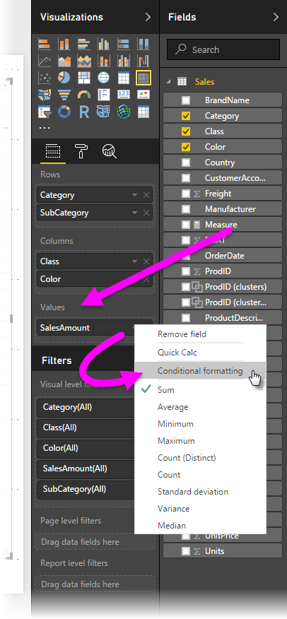
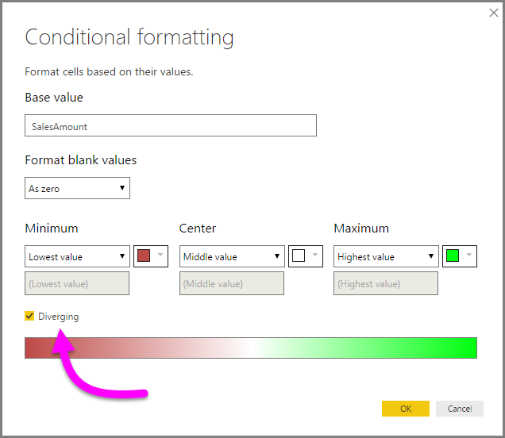
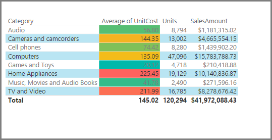
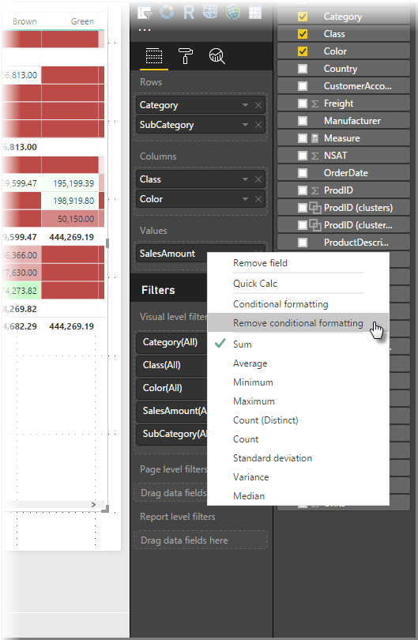

# Formattazione condizionale nelle tabelle
Con la formattazione condizionale per le tabelle, è possibile specificare colori di sfondo personalizzati in base ai valori della cella o ad altri valori o campi e usare sfumature. Per accedere alla formattazione condizionale, nel contenitore **Campi** del riquadro **Visualizzazioni** in Power BI Desktop selezionare la freccia rivolta verso il basso accanto al valore nell'area **Valori** che si vuole formattare o fare clic con il pulsante destro del mouse sul campo. È possibile gestire la formattazione condizionale solo per i campi nell'area **Valori** dell'area **Campi**.

Nella finestra di dialogo visualizzata, è possibile configurare il colore, così come il valore *minimo* e *massimo*. Se si seleziona la casella **Divergente**, è possibile configurare anche un valore *Centro* facoltativo.

È anche possibile scegliere la sfumatura di colore di un campo in base al modello di dati. È possibile anche specificare il tipo di aggregazione per il campo selezionato. Il campo selezionato viene specificato nel campo **Applica il colore a**, in modo che sia possibile tenerne traccia.

Se applicata a una tabella, la formattazione personalizzata eseguita con la procedura descritta sopra sostituisce tutti gli stili della tabella personalizzati applicati alle celle formattate in modo condizionale.

È anche possibile applicare la formattazione condizionale a campi di testo e data, purché si scelga un valore numerico come base per la formattazione. 

Per rimuovere la formattazione condizionale da una visualizzazione, è sufficiente fare nuovamente clic con il pulsante destro del mouse sul campo e selezionare **Rimuovi formattazione condizionale**.

