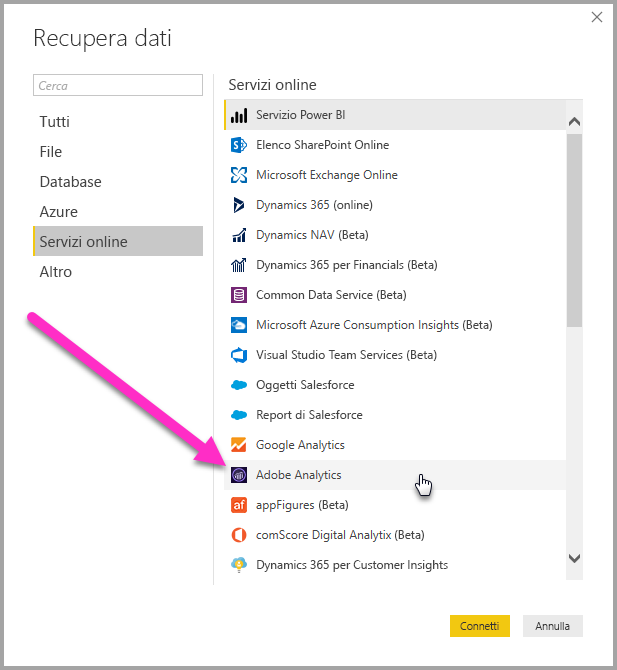
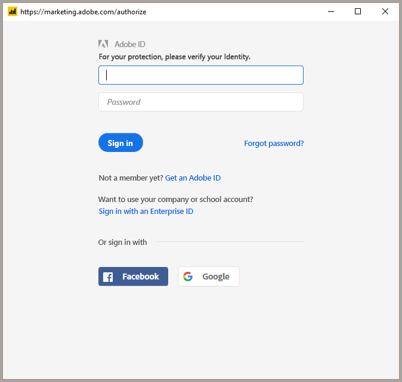
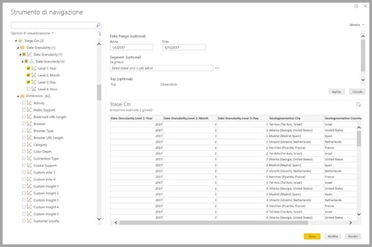
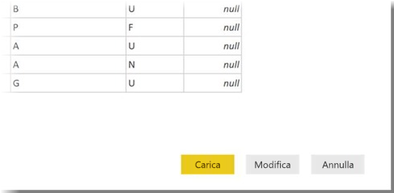

# Connettersi ad Adobe Analytics in Power BI Desktop 
In **Power BI Desktop** è possibile connettersi ad **Adobe Analytics** e usare i dati sottostanti esattamente come qualsiasi altra origine dati in Power BI Desktop. 

## Connettersi ai dati di Adobe Analytics
Per connettersi ai dati di **Adobe Analytics**, selezionare **Recupera dati** nella barra multifunzione **Home** in Power BI Desktop. Selezionare **Servizi online** nelle categorie a sinistra per visualizzare **Connettore di Adobe Analytics**.

Nella finestra di **Adobe Analytics** visualizzata selezionare il pulsante **Accedi** e specificare le credenziali per accedere all'account di Adobe Analytics. Sarà visualizzata la finestra di accesso di Adobe, come illustrato nella figura seguente.

Quando richiesto, inserire il nome utente e la password. Dopo aver stabilito la connessione, è possibile visualizzare in anteprima e selezionare più dimensioni e misure all'interno della finestra di dialogo **Strumento di navigazione** di Power BI per creare un unico output in formato tabulare. È anche possibile specificare tutti i parametri di input necessari per gli elementi selezionati. 

È possibile **caricare** la tabella selezionata, che importa l'intera tabella in **Power BI Desktop**, oppure è possibile **modificare** la query, che consente di aprire **Editor di query** in modo da filtrare e perfezionare il set di dati da usare e quindi caricare il set di dati perfezionato in **Power BI Desktop**.

## Passaggi successivi
È possibile connettersi a molti tipi di dati usando Power BI Desktop. Per altre informazioni sulle origini dati, vedere le risorse seguenti:

* [Che cos'è Power BI Desktop?](desktop-what-is-desktop.md)
* [Origini dati in Power BI Desktop](desktop-data-sources.md)
* [Effettuare il data shaping e combinare i dati con Power BI Desktop](desktop-shape-and-combine-data.md)
* [Connettersi a cartelle di lavoro di Excel in Power BI Desktop](desktop-connect-excel.md)   
* [Immettere dati direttamente in Power BI Desktop](desktop-enter-data-directly-into-desktop.md)   

