# <a name="analyze-azure-cost-and-usage-data-in-power-bi-desktop"></a>Analizzare i dati sui costi e i dati di utilizzo di Azure in Power BI Desktop

Power BI Desktop può connettersi ad Azure e ottenere dati approfonditi sull'utilizzo dei servizi di Azure da parte dell'organizzazione. In tal modo è possibile creare misure e report personalizzati per capire e analizzare meglio le spese per Azure.

Power BI attualmente supporta la connessione agli account di fatturazione contratto Enterprise e contratto del cliente.

Gli utenti con contratto Enterprise devono connettersi con il connettore Informazioni dettagliate sul consumo di Azure. Gli utenti con account contratto del cliente devono connettersi con il connettore Gestione costi di Azure.

## <a name="connect-with-azure-consumption-insights"></a>Connettersi con Informazioni dettagliate sul consumo di Azure

Informazioni dettagliate sul consumo di Azure consente di connettersi agli account di fatturazione contratto Enterprise di Azure.

Questa sezione illustra come connettersi e ottenere i dati necessari e come eseguire la migrazione tramite il connettore di Azure Enterprise. La sezione offre anche il mapping delle *colonne dei dettagli di utilizzo* disponibili nell'API **ACI** (Informazioni dettagliate sul consumo di Azure).

Per connettersi usando il connettore di **Azure Consumption Insights** è necessario avere accesso alle funzionalità Enterprise nel portale di Azure.

Per connettersi con il connettore di **Azure Consumption Insights**, selezionare **Recupera dati** nella barra multifunzione **Home** in **Power BI Desktop**. Selezionare **Online Services** nelle categorie a sinistra per visualizzare **Microsoft Azure Consumption Insights (Beta)**. Selezionare **Connetti**.


Nella finestra di dialogo visualizzata, specificare il *numero di registrazione*.

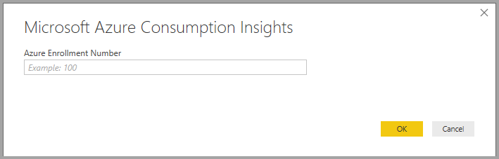

* È possibile ottenere il numero di registrazione da [Azure Enterprise Portal](https://ea.azure.com), nella posizione indicata nella figura seguente:
  
  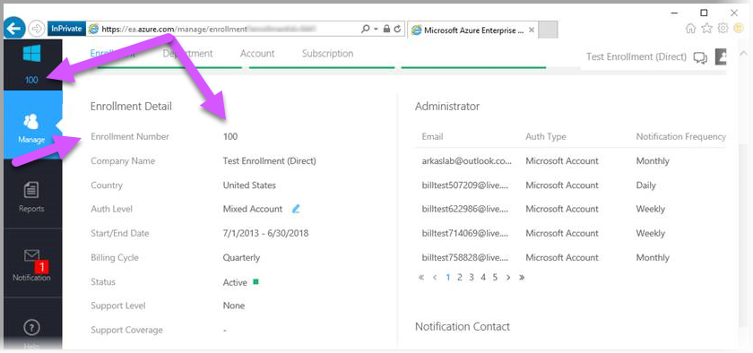
  
  Questa versione del connettore supporta solo le registrazioni Enterprise di https://ea.azure.com. Le registrazioni per la Cina non sono attualmente supportate.

Specificare quindi la *chiave di accesso* per la connessione.

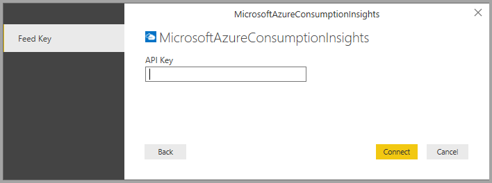

* La chiave di accesso per la registrazione è reperibile in [Azure Enterprise Portal](https://ea.azure.com).
  
  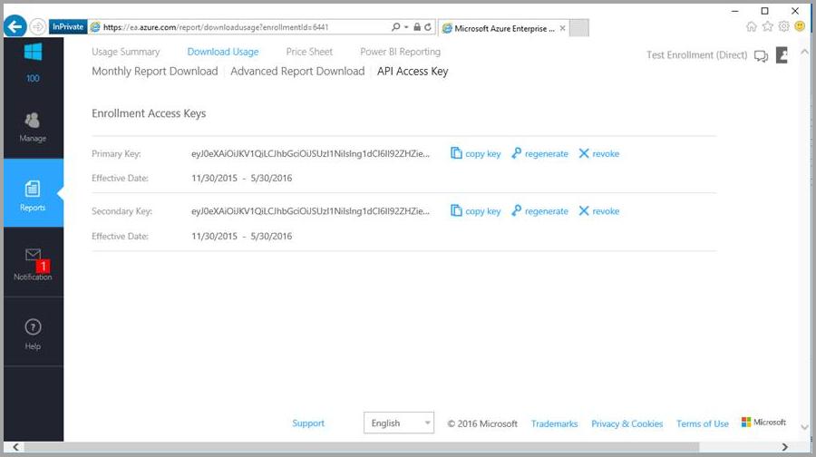

Dopo aver specificato la *chiave di accesso* e selezionato **Connetti**, verrà visualizzata la finestra **Strumento di navigazione** con nove tabelle: 
* **Budgets**: fornisce i dettagli sui budget per visualizzare i costi effettivi o l'utilizzo rispetto ai target di budget esistenti. 
* **MarketPlace**: indica gli addebiti per Azure Marketplace basati sull'utilizzo.
* **PriceSheets**: indica le tariffe applicabili in base al contatore per una registrazione.
* **RICharges**: indica gli addebiti associati alle istanze riservate negli ultimi 24 mesi.
* **RIRecommendations_Single**: fornisce le raccomandazioni per l'acquisto di istanze riservate in base alle tendenze di utilizzo di una sottoscrizione singola negli ultimi 7, 30 o 60 giorni.
* **RIRecommendations_Shared**: fornisce le raccomandazioni per l'acquisto di istanze riservate in base alle tendenze di utilizzo di tutte le sottoscrizioni negli ultimi 7, 30 o 60 giorni.
* **RIUsage**: fornisce i dettagli del consumo per le istanze riservate nell'ultimo mese.
* **Summaries**: fornisce un riepilogo mensile di saldi, nuovi acquisti, addebiti per il servizio Azure Marketplace, rettifiche e addebiti per la quantità in eccedenza.
* **UsageDetails**: fornisce una suddivisione delle quantità utilizzate e degli addebiti stimati per una registrazione.

È possibile selezionare una casella di controllo accanto a qualsiasi tabella per visualizzare un'anteprima. È possibile selezionare una o più tabelle selezionando la casella di controllo accanto al nome, quindi selezionare **Carica**.

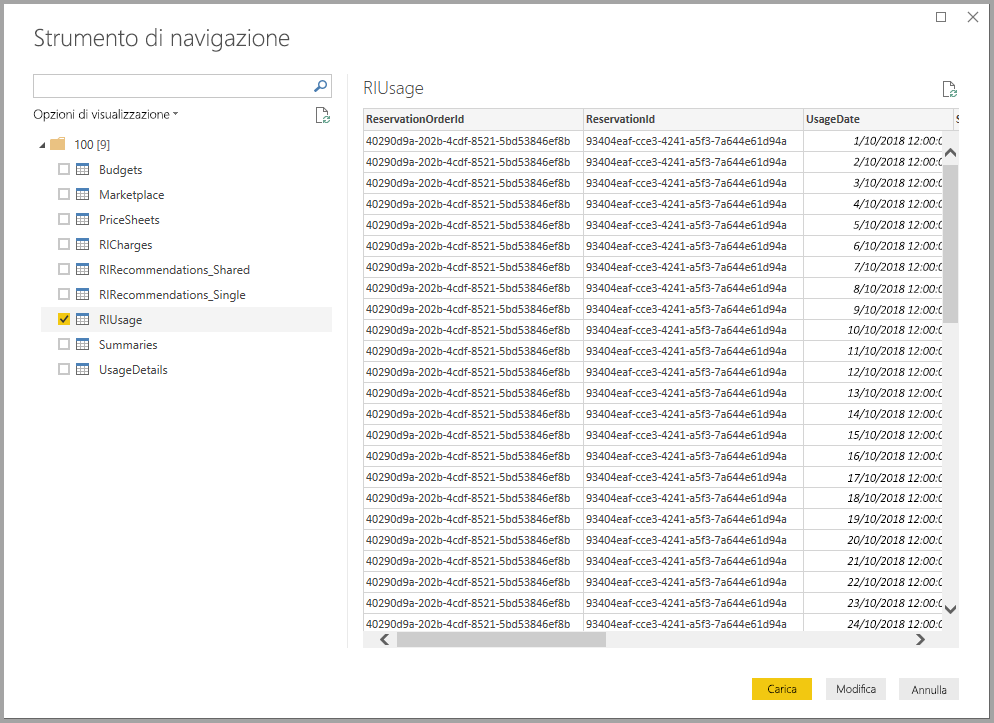

> [!NOTE]
> Le tabelle *Summary* e *PriceSheets* sono disponibili solo per la chiave API a livello di registrazione. I dati in queste tabelle sono per impostazione predefinita i dati del mese corrente per *UsageDetails* e *PriceSheets*. Le tabelle *Summaries* e *MarketPlace* non sono vincolate al mese corrente.
> 
> 

Quando si seleziona **Carica**, il report viene caricato in **Power BI Desktop**.


Dopo aver caricato i dati selezionati, è possono visualizzare le tabelle e campi selezionati nel riquadro **Campi**.

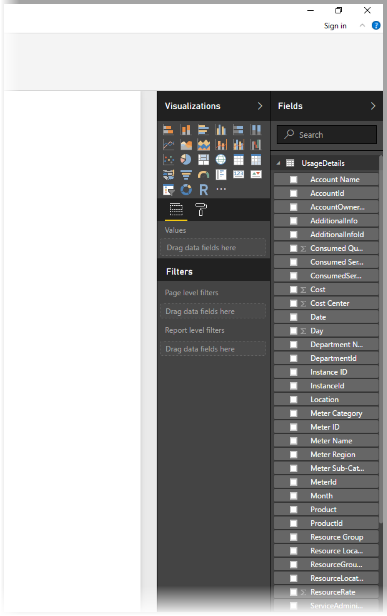

## <a name="using-azure-consumption-insights"></a>Uso di Azure Consumption Insights
Per usare il connettore di **Azure Consumption Insights** è necessario avere accesso alle funzionalità Enterprise nel portale di Azure.

Dopo aver caricato correttamente i dati usando il connettore di **Azure Consumption Insights**, è possibile creare misure e colonne personalizzate usando l'**Editor di Query** e creare oggetti visivi, report e dashboard che possono essere condivisi nel **servizio Power BI**.

Azure include anche una raccolta di query personalizzate di esempio che possono essere recuperate tramite una query vuota. A tale scopo, nella barra multifunzione **Home** di **Power BI Desktop** selezionare la freccia a discesa **Recupera dati** e quindi selezionare **Query vuota**. Questa operazione può anche essere eseguita nell'**Editor di Query** facendo clic con il pulsante destro del mouse sul riquadro **Query** a sinistra e scegliendo **Nuova query > Query vuota** dal menu visualizzato.

Nella **barra della formula** digitare quanto segue:

    = MicrosoftAzureConsumptionInsights.Contents

Viene visualizzata una raccolta di esempi, come illustrato nell'immagine seguente:

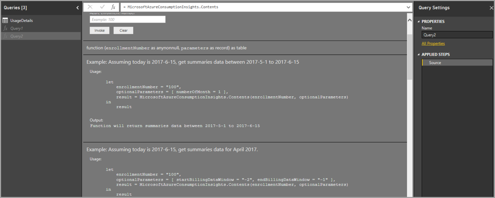

Per usare report e creare query, seguire questa procedura:

* Per definire il numero di mesi a partire dalla data corrente, usare *numberOfMonth*
  * Usare un valore compreso tra uno e 36 per rappresentare il numero di mesi da importare, a partire dalla data corrente. È consigliabile recuperare non più di 12 mesi di dati, per evitare di superare le soglie dei vincoli di importazione e il volume di dati massimo consentito per le query in Power BI.
* Per definire un periodo di mesi in una finestra di tempo cronologica, usare *startBillingDataWindow* e *endBillingDataWindow*
* *Non* usare *numberOfMonth* insieme a *startBillingDataWindow* o *endBillingDataWindow*

## <a name="migrating-from-the-azure-enterprise-connector"></a>Migrazione dal connettore di Azure Enterprise
Alcuni clienti hanno creato oggetti visivi con il *connettore di Azure Enterprise (Beta)*, che verrà sospeso e sostituito dal connettore di **Azure Consumption Insights**. Il connettore di **Azure Consumption Insights** offre funzionalità e miglioramenti che includono i seguenti:

* Origini dati aggiuntive disponibili per *Riepilogo saldi* e *Acquisti del Marketplace*
* Nuovi parametri avanzati, ad esempio *startBillingDataWindow* e *endBillingDataWindow*
* Prestazioni e velocità di risposta migliori

Per facilitare la transizione al connettore di **Azure Consumption Insights** e conservare il lavoro già svolto con la creazione di dashboard o report personalizzati, la procedura seguente illustra come eseguire la migrazione al nuovo connettore.

### <a name="step-1-connect-to-azure-using-the-new-connector"></a>Passaggio 1: Connettersi ad Azure usando il nuovo connettore
Il primo passaggio consiste nel connettersi usando il connettore di **Azure Consumption Insights**, descritto nei dettagli in precedenza in questo articolo. Selezionare **Recupera dati > Query vuota** nella barra multifunzione **Home** in **Power BI Desktop**.

### <a name="step-2-use-the-advanced-editor-to-create-a-query"></a>Passaggio 2: Usare l'Editor avanzato per creare una query
In **Editor di Query** selezionare **Editor avanzato** dalla sezione **Query** della barra multifunzione **Home**. Nella finestra **Editor avanzato** visualizzata immettere la query seguente:

    let    
        enrollmentNumber = "100",
        optionalParameters = [ numberOfMonth = 6, dataType="DetailCharges" ],
        data = MicrosoftAzureConsumptionInsights.Contents(enrollmentNumber, optionalParameters)   
    in     
        data

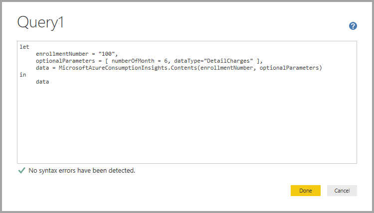

Sarà ovviamente necessario sostituire il valore di *enrollmentNumber* con il numero di registrazione effettivo, reperibile da [Azure Enterprise Portal](https://ea.azure.com). Il parametro *numberOfMonth* indica il numero di mesi di dati da recuperare a partire dai dati correnti. Usare zero (0) per il mese corrente.

Dopo la selezione di **Fine** nella finestra **Editor avanzato** l'anteprima si aggiorna, visualizzando nella tabella i dati dell'intervallo di mesi specificato. Selezionare **Chiudi e applica** e tornare indietro.

### <a name="step-3-move-measures-and-custom-columns-to-the-new-report"></a>Passaggio 3: Spostare misure e colonne personalizzate nel nuovo report
Sarà necessario spostare nella nuova tabella dei dettagli le colonne personalizzate o le misure create. Seguire questa procedura.

1. Aprire Blocco note o un altro editor di testo.
2. Selezionare la misura da spostare, copiare il testo dal campo *Formula* e inserirlo nel Blocco note.
   
   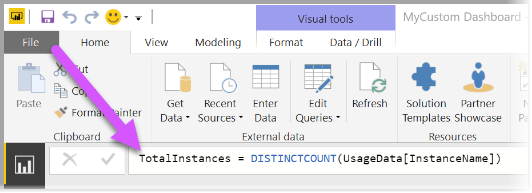
3. Rinominare *Query1* la tabella dei dettagli originale.
4. Creare nuove misure e colonne personalizzate nella tabella facendo clic con il pulsante destro del mouse sulla tabella e scegliendo **Nuova misura**, quindi tagliare e incollare tutte le misure e le colonne archiviate.

### <a name="step-4-re-link-tables-that-had-relationships"></a>Passaggio 4: Collegare nuovamente le tabelle con relazioni
Molti dashboard hanno tabelle aggiuntive che vengono usate per operazioni di ricerca o filtro, ad esempio le tabelle di date o le tabelle usate per progetti personalizzati. Ristabilendo tali relazioni si risolve la maggior parte dei problemi rimanenti. Seguire questa procedura.

- Nella scheda **Creazione di modelli** di **Power BI Desktop** selezionare **Gestisci relazioni** per visualizzare una finestra che consente di gestire le relazioni nel modello. Collegare nuovamente le tabelle in base alle esigenze.
   
    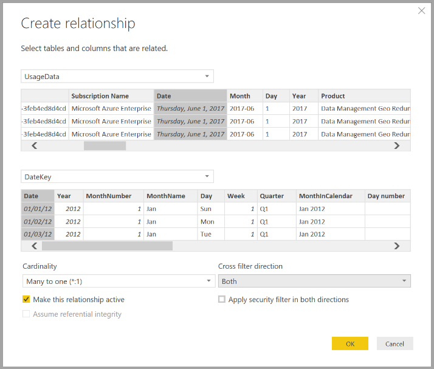

### <a name="step-5-verify-your-visuals-and-adjust-field-formatting-as-needed"></a>Passaggio 5: Verificare gli oggetti visivi e modificare la formattazione dei campi in base alle esigenze
A questo punto della procedura, la maggior parte degli oggetti visivi, delle tabelle e dei drill-down originali dovrebbe funzionare come previsto. Potrebbe essere tuttavia necessario apportare alcune modifiche di lieve entità alla formattazione per ottenere l'aspetto desiderato. Esaminare ogni dashboard e oggetto visivo per verificare che l'aspetto sia quello desiderato.

## <a name="using-the-azure-consumption-and-insights-aci-api-to-get-consumption-data"></a>Uso dell'API Azure Consumption Insights (ACI) per ottenere dati sul consumo
Azure offre anche l'[**API Azure Consumption Insights (ACI)**](https://azure.microsoft.com/blog/announcing-general-availability-of-consumption-and-charge-apis-for-enterprise-azure-customers/). È possibile creare soluzioni personalizzate per la raccolta, la creazione di report e la visualizzazione di dati di consumo di Azure tramite l'API ACI.

### <a name="mapping-names-and-usage-details-between-the-portal-the-connector-and-the-api"></a>Mapping di nomi e dettagli di utilizzo tra il portale, il connettore e l'API
Le colonne e i nomi dei dettagli presenti nel portale di Azure sono simili nell'API e nel connettore, ma non sempre identici. Per chiarire questo aspetto, la tabella seguente illustra il mapping tra l'API, il connettore e le colonne visibili nel portale di Azure. La tabella indica anche se la colonna è obsoleta. Per altre informazioni e definizioni di questi termini, vedere il [dizionario dei dati di fatturazione di Azure](https://docs.microsoft.com/azure/billing/billing-enterprise-api-usage-detail).

| Connettore ACI / ContentPack ColumnName | Nome colonna API ACI | Nome colonna EA | Obsoleta/presente per compatibilità con le versioni precedenti |
| --- | --- | --- | --- |
| AccountName |accountName |Account Name |No |
| AccountId |accountId | |Sì |
| AcccountOwnerId |accountOwnerEmail |AccountOwnerId |No |
| AdditionalInfo |additionalInfo |AdditionalInfo |No |
| AdditionalInfold | | |Sì |
| Consumed Quantity |consumedQuantity |Consumed Quantity |No |
| Consumed Service |consumedService |Consumed Service |No |
| ConsumedServiceId |consumedServiceId | |Sì |
| Costo |cost |ExtendedCost |No |
| Centro di costo |costCenter |Centro di costo |No |
| Data |data |Data |No |
| Giorno | |Giorno |No |
| DepartmentName |departmentName |Department Name |No |
| DepartmentID |departmentId | |Sì |
| ID istanza | | |Sì |
| InstanceId |instanceId |ID istanza |No |
| Località | | |Sì |
| Meter Category |meterCategory |Meter Category |No |
| Meter ID | | |Sì |
| Meter Name |meterName |Meter Name |No |
| Meter Region |meterRegion |Meter Region |No |
| Meter Sub-Category |meterSubCategory |Meter Sub-Category |No |
| MeterId |meterId |Meter ID |No |
| Mese | |Mese |No |
| Product |prodotto |Product |No |
| ProductId |productId | |Sì |
| Resource Group |resourceGroup |Resource Group |No |
| Resource Location |resourceLocation |Resource Location |No |
| ResourceGroupId | | |Sì |
| ResourceLocationId |resourceLocationId | |Sì |
| ResourceRate |resourceRate |ResourceRate |No |
| ServiceAdministratorId |serviceAdministratorId |ServiceAdministratorId |No |
| ServiceInfo1 |serviceInfo1 |ServiceInfo1 |No |
| ServiceInfo1Id | | |Sì |
| ServiceInfo2 |serviceInfo2 |ServiceInfo2 |No |
| ServiceInfo2Id | | |Sì |
| Store Service Identifier |storeServiceIdentifier |Store Service Identifier |No |
| StoreServiceIdentifierId | | |Sì |
| Nome sottoscrizione |subscriptionName |Nome sottoscrizione |No |
| Tag |tags |Tag |No |
| TagsId | | |Sì |
| Unit Of Measure |unitOfMeasure |Unit Of Measure |No |
| Anno | |Anno |No |
| SubscriptionId |subscriptionId |SubscriptionId |Sì |
| SubscriptionGuid |subscriptionGuid |SubscriptionGuid |No |

## <a name="connect-with-azure-cost-management"></a>Connettersi con Gestione costi di Azure

Questa sezione illustra come connettersi all'account di fatturazione contratto del cliente.

Per connettersi con il connettore di **Gestione costi di Azure**, selezionare **Recupera dati** nella barra multifunzione **Home** in **Power BI Desktop**.  Selezionare **Azure** nelle categorie a sinistra per vedere **Gestione costi di Azure (Beta)**. Selezionare **Connetti**.

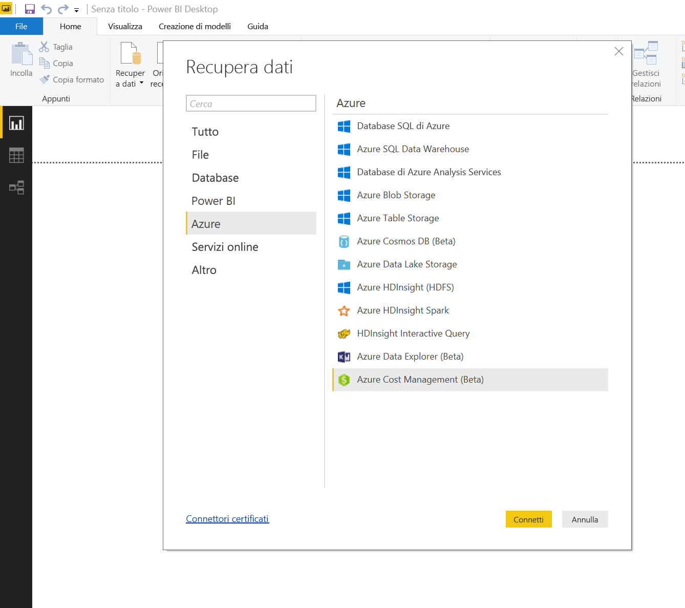

Nella finestra di dialogo visualizzata immettere l'*ID profilo di fatturazione*.

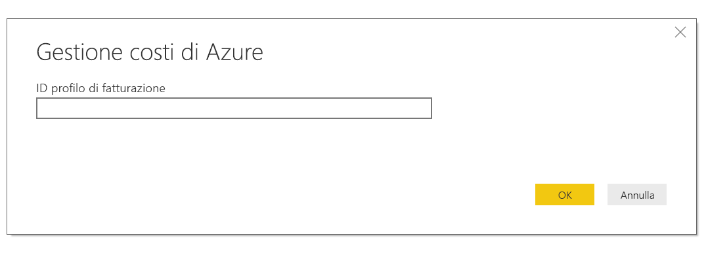

È possibile ottenere l'ID profilo di fatturazione dal [portale di Azure](https://portal.azure.com).  Passare a **Gestione dei costi e fatturazione**, selezionare l'account di fatturazione e quindi selezionare **Profili di fatturazione** nella barra laterale.  Selezionare il profilo di fatturazione e selezionare **Proprietà** nella barra laterale.  Copiare l'ID profilo di fatturazione.

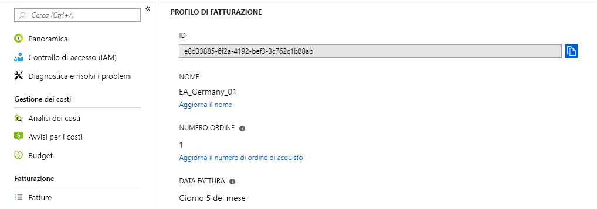

Verrà chiesto di accedere con l'indirizzo di posta elettronica e la password di Azure.  Quando si esegue l'autenticazione, verrà visualizzata una finestra **Strumento di navigazione** con le dodici tabelle disponibili:

* **Billing events**: contiene il log eventi delle nuove fatture, degli acquisti con carta di credito e altro.
* **Budgets**: fornisce i dettagli sui budget per visualizzare i costi effettivi o l'utilizzo rispetto ai target di budget esistenti. 
* **Charges**: contiene un riepilogo mensile sull'utilizzo di Azure, sugli addebiti per Marketplace e su altri addebiti fatturati separatamente.
* **Credit lots**: indica i dettagli sugli acquisti in lotto con credito Azure per il profilo di fatturazione specificato.
* **Credit summary**: contiene un riepilogo del credito per il profilo di fatturazione specificato.
* **Marketplace**: indica gli addebiti per Azure Marketplace basati sull'utilizzo.
* **Pricesheets**: indica le tariffe applicabili dal contatore per il profilo di fatturazione specificato.
* **RI charges**: indica gli addebiti associati alle istanze riservate negli ultimi 24 mesi.
* **RI recommendations (single)**: fornisce le raccomandazioni per l'acquisto di istanze riservate in base alle tendenze di utilizzo di una sottoscrizione singola negli ultimi 7, 30 o 60 giorni.
* **RI recommendations (shared)**: fornisce le raccomandazioni per l'acquisto di istanze riservate in base alle tendenze di utilizzo di tutte le sottoscrizioni negli ultimi 7, 30 o 60 giorni.
* **RI usage**: fornisce i dettagli del consumo per le istanze riservate nell'ultimo mese.
* **Usage details**: indica il dettaglio delle quantità utilizzate e gli addebiti stimati per l'ID del profilo di fatturazione specificato.

È possibile selezionare una casella di controllo accanto a qualsiasi tabella per visualizzare un'anteprima.  È possibile selezionare una o più tabelle selezionando la casella di controllo accanto al nome seguito da **Carica**.

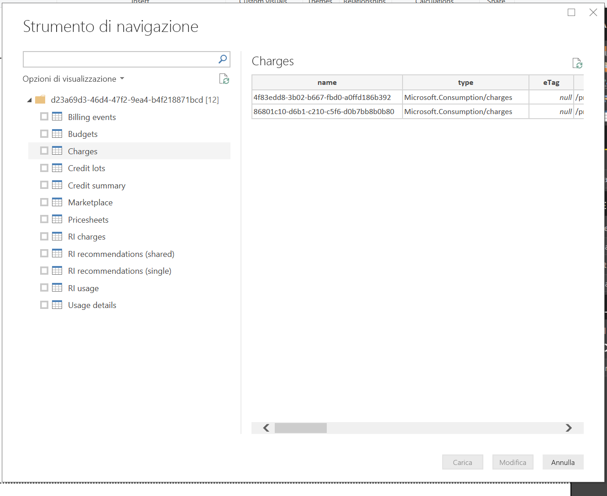

Quando si seleziona **Carica**, il report viene caricato in **Power BI Desktop**.


Dopo aver caricato i dati selezionati, è possono visualizzare le tabelle e campi selezionati nel riquadro **Campi**.

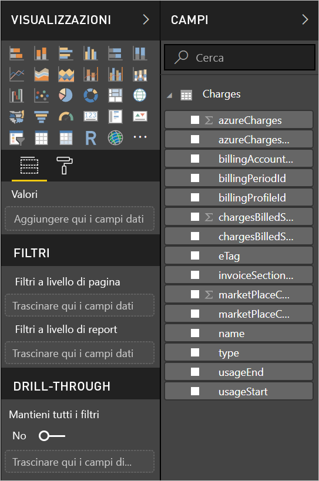

## <a name="writing-custom-queries"></a>Scrittura di query personalizzate

Se si desidera personalizzare il numero di mesi, modificare la versione dell'API o applicare una logica più avanzata ai dati restituiti, è possibile creare una query M personalizzata.

Nella barra multifunzione **Home** di **Power BI Desktop** selezionare l'elenco a discesa di **Recupera dati** e quindi selezionare **Query vuota**.  Questa operazione può anche essere eseguita nell'**Editor di query** facendo clic con il pulsante destro del mouse sul riquadro **Query** a sinistra e scegliendo **Nuova query > Query vuota** dal menu visualizzato.

Nella **Barra della formula** digitare quanto segue, sostituendo `billingProfileId` con l'ID effettivo e "charges" con un nome di tabella valido (elenco precedente).

```
let
    Source = AzureCostManagement.Tables(billingProfileId, [ numberOfMonths = 3 ]),
    charges = Source{[Key="charges"]}[Data]
in
    charges
```

Oltre a modificare il valore di `numberOfMonths` con un qualsiasi valore compreso tra 1 e 36, è anche possibile indicare:

* `apiVersion` per personalizzare la versione dell'API che la query chiamerà.
* `lookbackWindow`, per RI recommendations (single o shared), per modificare la finestra temporale sulla base della quale generare raccomandazioni. I valori validi sono: 7, 30 o 60 giorni


## <a name="next-steps"></a>Passaggi successivi
È possibile connettersi a molti tipi di dati usando Power BI Desktop. Per altre informazioni sulle origini dati, vedere le risorse seguenti:

* [Che cos'è Power BI Desktop?](desktop-what-is-desktop.md)
* [Origini dati in Power BI Desktop](desktop-data-sources.md)
* [Effettuare il data shaping e combinare i dati con Power BI Desktop](desktop-shape-and-combine-data.md)
* [Connettersi a cartelle di lavoro di Excel in Power BI Desktop](desktop-connect-excel.md)   
* [Immettere dati direttamente in Power BI Desktop](desktop-enter-data-directly-into-desktop.md)   

