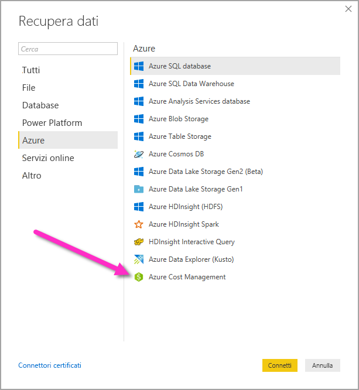
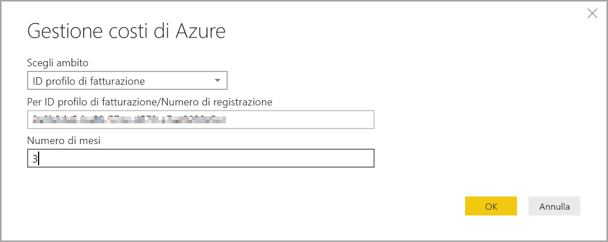
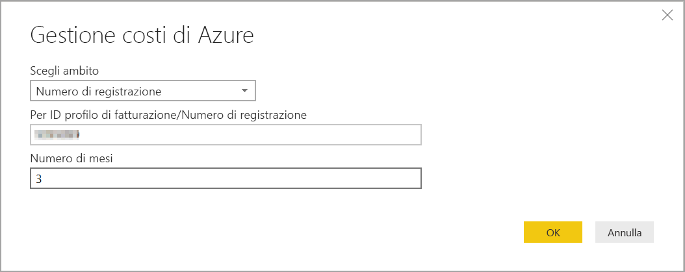
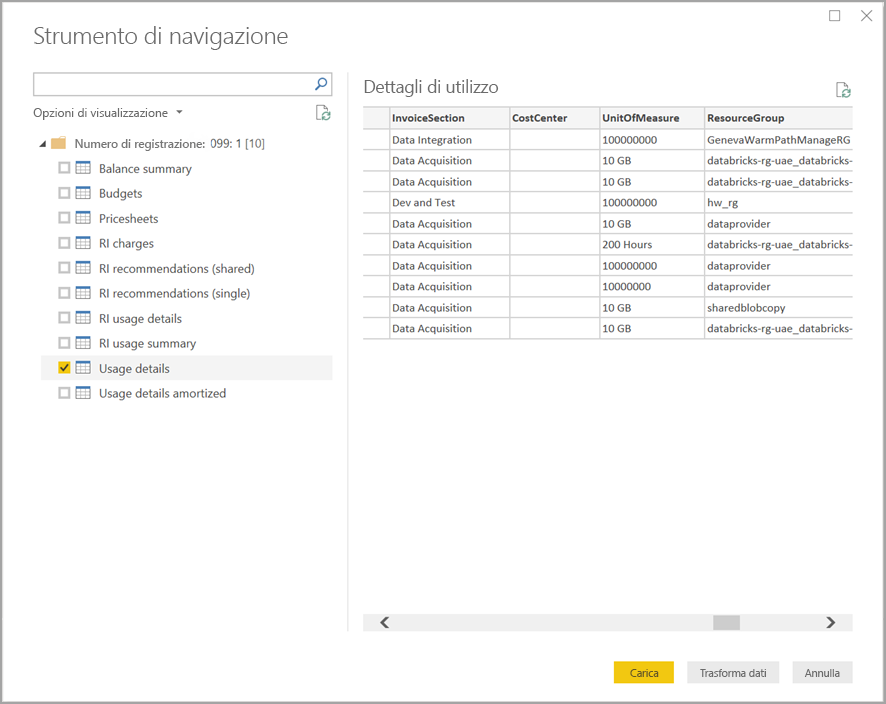

# Creare oggetti visivi e report con il connettore Gestione costi di Azure in Power BI Desktop

È possibile usare il connettore Gestione costi di Azure per Power BI Desktop per creare visualizzazioni e report potenti e personalizzati che consentono di comprendere meglio i costi di Azure. Il connettore Gestione costi di Azure supporta attualmente i clienti con un [Contratto del cliente Microsoft](https://azure.microsoft.com/pricing/purchase-options/microsoft-customer-agreement/) o un [Contratto Enterprise](https://azure.microsoft.com/pricing/enterprise-agreement/).  

Il connettore Gestione costi di Azure usa OAuth 2.0 per l'autenticazione con Azure e identifica gli utenti che useranno il connettore. I token generati in questo processo sono validi per un periodo specifico. Power BI conserva il token per l'accesso successivo. OAuth 2.0, è uno standard per il processo che viene eseguito in background per garantire la gestione sicura di tali autorizzazioni. Per connettersi, è necessario usare un account [amministratore Enterprise](https://docs.microsoft.com/azure/billing/billing-understand-ea-roles) per il Contratto Enterprise o un [proprietario dell'account di fatturazione](https://docs.microsoft.com/azure/billing/billing-understand-mca-roles) per il Contratti del cliente Microsoft. 

> [!NOTE]
> Questo connettore sostituisce i connettori [Informazioni dettagliate sul consumo di Azure e Gestione costi di Azure (Beta)](desktop-connect-azure-consumption-insights.md) disponibili in precedenza. Tutti i report creati con il connettore precedente devono essere ricreati usando questo connettore.

## Connettersi con Gestione costi di Azure

Per usare il connettore **Gestione costi di Azure** in Power BI Desktop, seguire questa procedura:

1.  Nella scheda **Home** della barra multifunzione selezionare **Recupera dati**.
2.  Selezionare **Azure** dall'elenco delle categorie di dati.
3.  Selezionare **Gestione costi di Azure**.

    

4. Nella finestra di dialogo visualizzata immettere l'**ID del profilo di fatturazione** per il **Contratto del cliente Microsoft** o il **numero di registrazione** per il **Contratto Enterprise**. 

## Connettersi a un account con Contratto del cliente Microsoft 

Per connettersi a un account con **Contratto del cliente Microsoft** è possibile ottenere l'**ID del profilo di fatturazione** dal portale di Azure:

1.  Nel [portale di Azure](https://portal.azure.com/) passare a **Gestione costi + Fatturazione**.
2.  Selezionare il proprio profilo di fatturazione. 
3.  In **Impostazioni** nel menu selezionare **Proprietà** nella barra laterale.
4.  In **Profilo di fatturazione** copiare l'**ID**. 
5.  In **Scegliere l'ambito**  selezionare **ID profilo di fatturazione** e incollare l'ID del profilo di fatturazione selezionato nel passaggio precedente. 
6.  Immettere il numero di mesi e selezionare **OK** .

    

7.  Quando richiesto, accedere con l'account utente e la password di Azure. 

## Connettersi a un account con Contratto Enterprise

Per connettersi a un account con Contratto Enterprise, è possibile ottenere l'ID di registrazione dal portale di Azure:

1.  Nel [portale di Azure](https://portal.azure.com/) passare a **Gestione costi + Fatturazione**.
2.  Selezionare l'account di fatturazione.
3.  Nel menu **Panoramica** copiare l'**ID account di fatturazione**.
4.  In **Scegliere l'ambito**  selezionare **Numero di registrazione** e incollare l'ID account di fatturazione selezionato nel passaggio precedente. 
5.  Immettere il numero di mesi e quindi selezionare **OK** .

    

6.  Quando richiesto, accedere con l'account utente e la password di Azure. 

## Dati resi disponibili dal connettore

Eseguita l'autenticazione, viene visualizzata una finestra di **navigazione** con le seguenti tabelle dei dati disponibili:

| **Tabella** | **Descrizione** |
| --- | --- |
| **Balance summary** | Riepilogo del saldo per i contratti Enterprise. |
| **Billing events** | Registro eventi delle nuove fatture, degli acquisti con carta di credito e così via. Solo per il Contratto del cliente Microsoft. |
| **Budget** | Dettagli del budget per visualizzare i costi o l'utilizzo effettivi rispetto a destinazioni di budget esistenti. |
| **Charges** | Riepilogo mensile dell'utilizzo di Azure, degli addebiti per Marketplace e di altri addebiti fatturati separatamente. Solo per il Contratto del cliente Microsoft. |
| **Credit lots** | Dettagli sugli acquisti in lotto con credito Azure per il profilo di fatturazione specificato. Solo per il Contratto del cliente Microsoft. |
| **Pricesheets** | Tariffe applicabili dal contatore per il profilo di fatturazione o la registrazione EA specificati. |
| **RI charges** | Addebiti associati alle istanze riservate negli ultimi 24 mesi. |
| **RI recommendations (shared)** | Raccomandazioni per l'acquisto di istanze riservate in base alle tendenze di utilizzo di tutte le sottoscrizioni per gli ultimi 7, 30 o 60 giorni. |
| **RI recommendations (single)** | Raccomandazioni per l'acquisto di istanze riservate in base alle tendenze di utilizzo di una sottoscrizione singola per gli ultimi 7, 30 o 60 giorni. |
| **RI usage details** | Dettagli relativi al consumo per le istanze riservate nell'ultimo mese. |
| **RI usage summary** | Percentuale di utilizzo giornaliero della prenotazione di Azure. |
| **Usage details** | Dettaglio delle quantità usate e degli addebiti stimati per l'ID del profilo di fatturazione specificato per la registrazione EA. |
| **Usage details amortized** | Dettaglio delle quantità usate e degli addebiti stimati ammortizzati per l'ID del profilo di fatturazione specificato per la registrazione EA. |

È possibile selezionare una tabella qualsiasi per visualizzare una finestra di anteprima. È possibile selezionare una o più tabelle selezionando le caselle accanto al nome e quindi selezionare **Carica**.

Quando si seleziona **Carica**, i dati vengono caricati in Power BI Desktop. 

Quando vengono caricati i dati selezionati, le tabelle e campi sono visualizzati nel riquadro **Campi**.

## Passaggi successivi

È possibile connettersi a molte origini dati diverse usando Power BI Desktop. Per altre informazioni, vedere gli articoli seguenti:

* [Che cos'è Power BI Desktop?](desktop-what-is-desktop.md)
* [Origini dati in Power BI Desktop](desktop-data-sources.md)
* [Effettuare il data shaping e combinare i dati con Power BI Desktop](desktop-shape-and-combine-data.md)
* [Connettersi a cartelle di lavoro di Excel in Power BI Desktop](desktop-connect-excel.md)   
* [Immettere dati direttamente in Power BI Desktop](desktop-enter-data-directly-into-desktop.md)   
