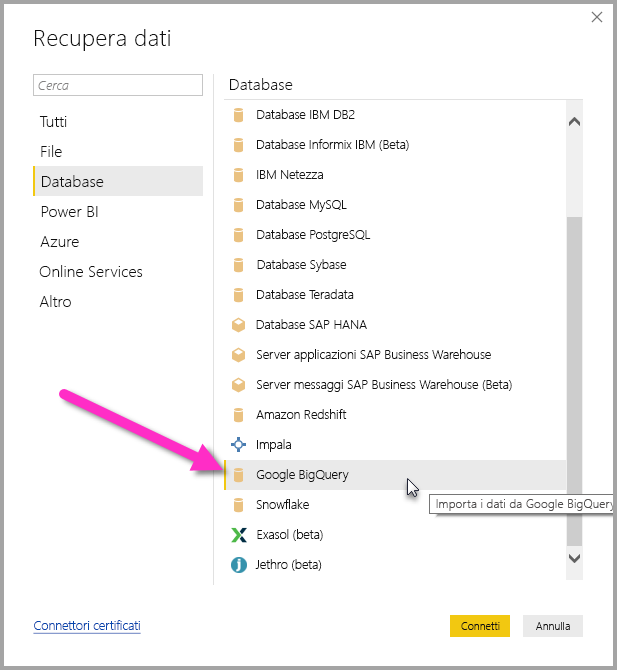
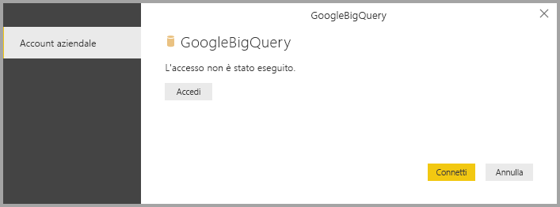
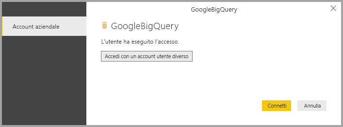
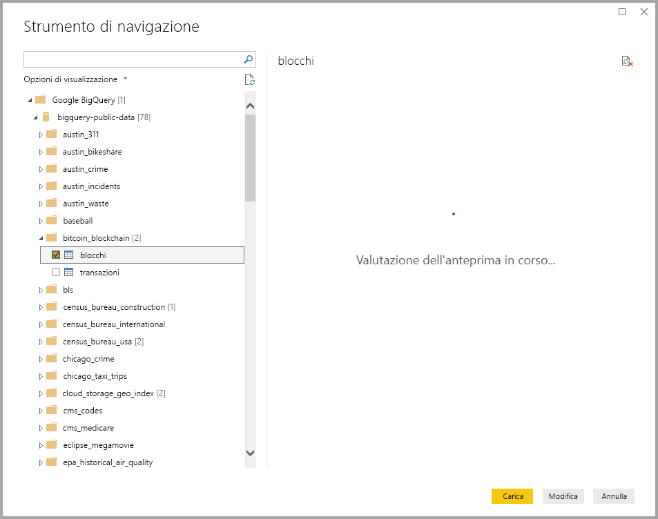

# <a name="connect-to-a-google-bigquery-database-in-power-bi-desktop"></a>Connettersi a un database Google BigQuery in Power BI Desktop
In Power BI Desktop è possibile connettersi a un database Google **BigQuery** e usare i dati sottostanti esattamente come qualsiasi altra origine dati in Power BI Desktop.

## <a name="connect-to-google-bigquery"></a>Connettersi a Google BigQuery
Per connettersi a un database Google **BigQuery** selezionare **Recupera dati** nella barra multifunzione **Home** in Power BI Desktop. Quando si seleziona **Database** nelle categorie a sinistra, compare **Google BigQuery**.



Nella finestra **Google BigQuery** visualizzata accedere al proprio account Google BigQuery e selezionare **Connetti**.



Dopo l'accesso, viene visualizzata la finestra seguente, che indica l'avvenuta autenticazione. 



Una volta stabilita la connessione, viene visualizzata una finestra **Strumento di navigazione** che mostra i dati disponibili sul server, in cui è possibile selezionare uno o più elementi da importare e usare in **Power BI Desktop**.



## <a name="considerations-and-limitations"></a>Considerazioni e limitazioni
Il connettore Google **BigQuery** presenta alcune limitazioni di cui tenere conto e dà adito ad alcune considerazioni:

* Il connettore Google BigQuery è disponibile in Power BI Desktop e nel servizio Power BI. Nel servizio Power BI, il connettore è accessibile tramite la connessione da cloud a cloud da Power BI a Google BigQuery.

È possibile usare Power BI con i **progetti di fatturazione** di Google BigQuery. Per impostazione predefinita, Power BI usa il primo progetto nell'elenco restituito per l'utente. Per personalizzare il comportamento del progetto di fatturazione quando viene usato con Power BI, procedere come segue:

 * Specificare l'opzione che segue nel valore M sottostante nel passaggio Source. L'opzione che può essere personalizzata tramite **Editor di Power Query** in Power BI Desktop:

    ```Source = GoogleBigQuery.Database([BillingProject="Include-Billing-Project-Id-Here"])```

## <a name="next-steps"></a>Passaggi successivi
È possibile connettersi a molti tipi di dati usando Power BI Desktop. Per altre informazioni sulle origini dati, vedere le risorse seguenti:

* [Che cos'è Power BI Desktop?](desktop-what-is-desktop.md)
* [Origini dati in Power BI Desktop](desktop-data-sources.md)
* [Effettuare il data shaping e combinare i dati con Power BI Desktop](desktop-shape-and-combine-data.md)
* [Connettersi a cartelle di lavoro di Excel in Power BI Desktop](desktop-connect-excel.md)   
* [Immettere dati direttamente in Power BI Desktop](desktop-enter-data-directly-into-desktop.md)   

