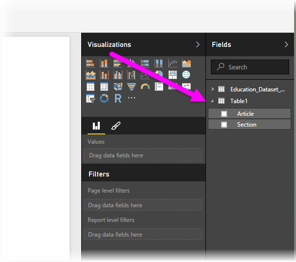

# Connettersi a file CSV in Power BI Desktop
La connessione a un file*CSV* (Comma-Separated Value) da Power BI Desktop è molto simile alla connessione a una cartella di lavoro di Excel. Entrambe le procedure sono molto semplici e questo articolo illustra in modo dettagliato la connessione a qualsiasi file CSV a cui si può accedere.

Per iniziare, in Power BI Desktop selezionare **Recupera dati > CSV** dalla barra multifunzione **Home**.

Selezionare il file CSV dalla finestra di dialogo **Apri** visualizzata.

Quando si seleziona **Apri**, Power BI Desktop accede al file e determina alcuni attributi del file, ad esempio l'origine del file, il tipo di delimitatore e il numero di righe da usare per rilevare i tipi di dati nel file.

Questi attributi dei file e queste opzioni vengono visualizzati nelle selezioni a discesa nella parte superiore della finestra di dialogo **Importazione CSV**, mostrata di seguito. È possibile modificare manualmente qualsiasi impostazione rilevata, scegliendo un'opzione diversa da uno dei selettori a discesa.

Al termine delle selezioni, è possibile selezionare **Carica** per importare il file in Power BI Desktop oppure è possibile selezionare **Modifica** per aprire l'**Editor di query** e modificare o trasformare ancora i dati prima di importarli.

Dopo il caricamento dei dati in Power BI Desktop, vengono visualizzate la tabella e le rispettive colonne, presentate come campi in Power BI Desktop, nel riquadro **Campi**, lungo il lato destro della visualizzazione Report in Power BI Desktop.

Non è necessario eseguire altre operazioni. I dati dal file CSV sono ora disponibili in Power BI Desktop.

È possibile usare i dati in Power BI Desktop per creare oggetti visivi e report o per interagire con qualsiasi dato a cui ci si vuole connettere e che si vuole importare, ad esempio cartelle di lavoro di Excel, database o altre origini dati.

### Passaggi successivi
È possibile connettersi a molti tipi di dati usando Power BI Desktop. Per altre informazioni sulle origini dati, vedere le risorse seguenti:

* [Introduzione a Power BI Desktop](desktop-getting-started.md)
* [Origini dati in Power BI Desktop](desktop-data-sources.md)
* [Effettuare il data shaping e combinare i dati con Power BI Desktop](desktop-shape-and-combine-data.md)
* [Connettersi a cartelle di lavoro di Excel in Power BI Desktop](desktop-connect-excel.md)   
* [Immettere dati direttamente in Power BI Desktop](desktop-enter-data-directly-into-desktop.md)   

