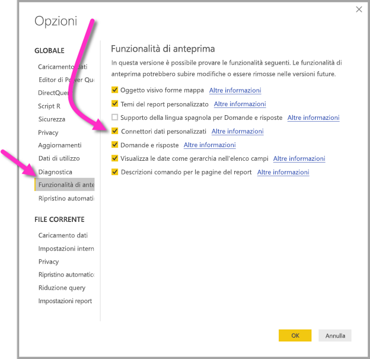

# Connettersi ai dati creati da flussi di dati Power BI in Power BI Desktop (anteprima)
In **Power BI Desktop** è possibile connettersi ai dati creati dai **flussi di dati Power BI** esattamente come qualsiasi altra origine dati in Power BI Desktop.

Il connettore di **flussi di dati Power BI (anteprima)** consente di connettersi a entità create da flussi di dati nel servizio Power BI. Poiché i flussi di dati sono in anteprima, è necessario seguire alcuni passaggi per rendere disponibile il connettore di flussi di dati nel sistema. 

## Scaricare e abilitare il connettore di flussi di dati Power BI (anteprima)

È necessario scaricare una copia del connettore di **flussi di dati Power BI** e quindi copiarlo in un percorso specifico nel computer. In un aggiornamento futuro mensile a Power BI Desktop, il connettore verrà incluso automaticamente nell'elenco dei connettori di dati, momento in cui questi passaggi non saranno più necessari.

È possibile scaricare il **connettore di flussi di dati Power BI** in questa posizione: [connettore di flussi di dati Power BI](https://visuals.azureedge.net/cds-analytics/PublicPreview/CDSA.mez)

Eseguire la procedura seguente per rendere il connettore di **flussi di dati Power BI** (anteprima) disponibile nel computer:

1. Scaricare una copia del file con estensione MEZ (file del connettore dati). I clienti dell'anteprima privata riceveranno informazioni sul download per il file con estensione MEZ direttamente da Microsoft.

2. Inserire il file del connettore dati scaricato nella cartella seguente nel computer in uso: **Documenti > Power BI Desktop > Cartella connettori personalizzati**

3. In Power BI Desktop selezionare **File > Opzioni e impostazioni > Opzioni** e selezionare **Funzionalità di anteprima** dal riquadro a sinistra.

    

4. Se non è selezionata, selezionare la casella **Connettori dati personalizzati**. 

5. Riavviare **Power BI Desktop** affinché il connettore venga visualizzato.

## Usare il connettore di flussi di dati Power BI (anteprima)
Dopo il riavvio di **Power BI Desktop**, il connettore verrà visualizzato come un'origine dati disponibile. Per connettersi a un pool di dati, selezionare **Recupera dati > Servizi online > Flussi di dati Power BI (beta)** come illustrato nell'immagine seguente:

## Considerazioni e limitazioni

Per usare questa versione di anteprima del **connettore di flussi di dati Power BI** è necessario che sia in esecuzione la versione più recente di **Power BI Desktop**. È sempre possibile [scaricare Power BI Desktop](desktop-get-the-desktop.md) e installarlo nel computer per assicurarsi di avere la versione più recente.  

Nota: quando il connettore di flussi di dati Power BI viene visualizzato in un imminente aggiornamento mensile a **Power BI Desktop**, *è necessario* eliminare questo file con estensione MEZ scaricato dalla cartella **Documenti > Power BI Desktop > Connettori personalizzati** per evitare conflitti. 

## Passaggi successivi
Vi sono molte operazioni interessanti che possono essere eseguite con le connessioni dati di Power BI, oltre ad articoli utili relativi a **Power BI Desktop**:

* [Origini dati in Power BI Desktop](desktop-data-sources.md)
* [Effettuare il data shaping e combinare i dati con Power BI Desktop](desktop-shape-and-combine-data.md)
* [Immettere dati direttamente in Power BI Desktop](desktop-enter-data-directly-into-desktop.md)   

