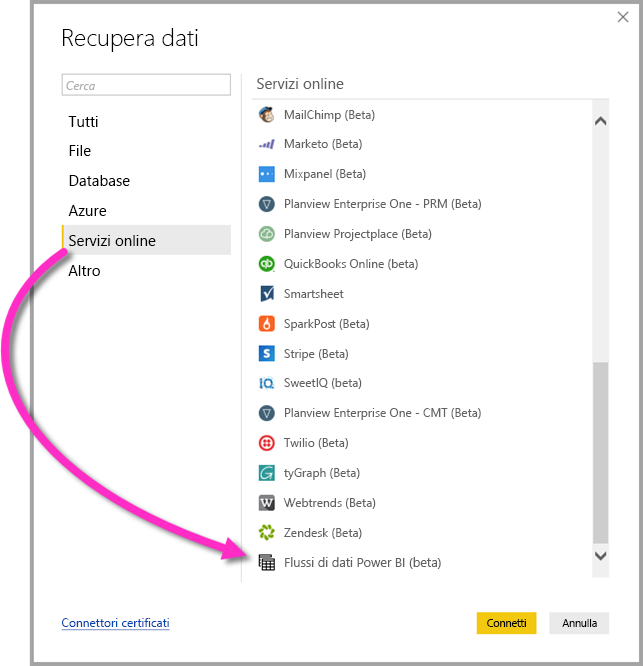

# Connettersi ai dati creati da flussi di dati Power BI in Power BI Desktop (beta)
In **Power BI Desktop** è possibile connettersi ai dati creati dai **flussi di dati Power BI** esattamente come qualsiasi altra origine dati in Power BI Desktop.

Il connettore di **flussi di dati Power BI (beta)** consente di connettersi a entità create da flussi di dati nel servizio Power BI. 

## Considerazioni e limitazioni

Per usare questa versione beta del **connettore di flussi di dati Power BI** è necessario che sia in esecuzione la versione più recente di **Power BI Desktop**. È sempre possibile [scaricare Power BI Desktop](desktop-get-the-desktop.md) e installarlo nel computer per assicurarsi di avere la versione più recente.  

> [!NOTE]
> Con la versione precedente del connettore di flussi di dati Power BI era necessario scaricare un file MEZ e inserirlo in una cartella. Poiché le versioni correnti di **Power BI Desktop** includono il connettore di flussi di dati Power BI, tale file non è più necessario e può causare conflitti con la versione inclusa del connettore. Se il file MEZ è stato inserito manualmente nella cartella, è *necessario* eliminare il file MEZ scaricato dalla cartella **Documenti > Power BI Desktop > Connettori personalizzati** per evitare conflitti. 

## Prestazioni del desktop
**Power BI Desktop** viene eseguito in locale nel computer in cui è installato. Le prestazioni in termini di inserimento dei flussi di dati dipendono da numerosi fattori, tra cui le dimensioni dei dati, la CPU e la RAM del computer, la larghezza di banda di rete, la distanza dal data center e altri.

È possibile migliorare le prestazioni di inserimento dati per i flussi di dati. Se ad esempio le dimensioni dei dati inseriti sono eccessive e **Power BI Desktop** non riesce a gestire il computer, è possibile usare entità collegate e calcolate nei flussi di dati per aggregare i dati (nei flussi di dati) e inserire solo i dati aggregati già preparati. In tal modo, l'elaborazione di grandi quantità di dati viene eseguita online nei flussi di dati, invece che in locale nell'istanza in esecuzione di **Power BI Desktop**. Questo approccio consente a Power BI Desktop di inserire quantità più piccole di dati e fa in modo che l'esperienza con flussi di dati sia sempre reattiva e veloce.

## Considerazioni e limitazioni

La maggior parte dei flussi di dati risiede nel tenant del servizio Power BI. Tuttavia, gli utenti di **Power BI Desktop** non possono accedere ai flussi di dati archiviati in un account di Azure Data Lake Storage Gen2 a meno che non siano proprietari del flusso di dati oppure non siano stati autorizzati in modo esplicito per la cartella CDM del flusso di dati. Considerare la situazione seguente:

1.  Anna crea una nuova area di lavoro per app e la configura per archiviare i flussi di dati nel data lake dell'organizzazione.
2.  Bruno, anch'esso membro dell'area di lavoro creata da Anna, vuole usare Power BI Desktop e il connettore per i flussi di dati per ottenere dati dal flusso creato da Anna.
3.  Bruno riceve un errore perché non è stato aggiunto come utente autorizzato alla cartella CDM del flusso di dati nel data lake.

    

Per risolvere il problema, a Bruno devono essere concesse le autorizzazioni di lettore per la cartella CDM e i relativi file. In [questo articolo](https://go.microsoft.com/fwlink/?linkid=2029121) sono disponibili altre informazioni su come concedere l'accesso alla cartella CDM.

## Passaggi successivi
Con i flussi di dati di Power BI è possibile effettuare diverse operazioni. Per altre informazioni, vedere le risorse seguenti:

* [Preparazione dei dati self-service con flussi di dati](service-dataflows-overview.md)
* [Creare e usare flussi di dati in Power BI](service-dataflows-create-use.md)
* [Uso delle entità calcolate in Power BI Premium (anteprima)](service-dataflows-computed-entities-premium.md)
* [Uso di flussi di dati con origini dati locali (anteprima)](service-dataflows-on-premises-gateways.md)
* [Risorse per sviluppatori per i flussi di dati Power BI (anteprima)](service-dataflows-developer-resources.md)

Per altre informazioni sull'integrazione con Azure Data Lake Storage Gen2, vedere gli articoli seguenti:

* [Integrazione di flussi di dati e Azure Data Lake (anteprima)](service-dataflows-azure-data-lake-integration.md)
* [Configurare le impostazioni del flusso di dati dell'area di lavoro (anteprima)](service-dataflows-configure-workspace-storage-settings.md)
* [Aggiungere una cartella CDM a Power BI come flusso di dati (anteprima)](service-dataflows-add-cdm-folder.md)
* [Connettere Azure Data Lake Storage Gen2 per l'archiviazione dei flussi di dati (anteprima)](service-dataflows-connect-azure-data-lake-storage-gen2.md)

Sono disponibili anche articoli su **Power BI Desktop** che possono risultare utili:

* [Origini dati in Power BI Desktop](desktop-data-sources.md)
* [Effettuare il data shaping e combinare i dati con Power BI Desktop](desktop-shape-and-combine-data.md)
* [Immettere dati direttamente in Power BI Desktop](desktop-enter-data-directly-into-desktop.md)   

