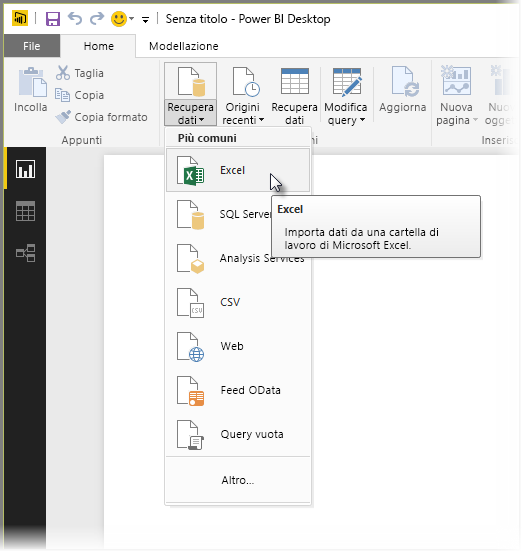
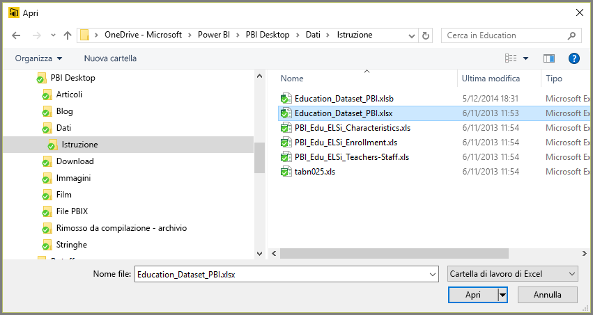
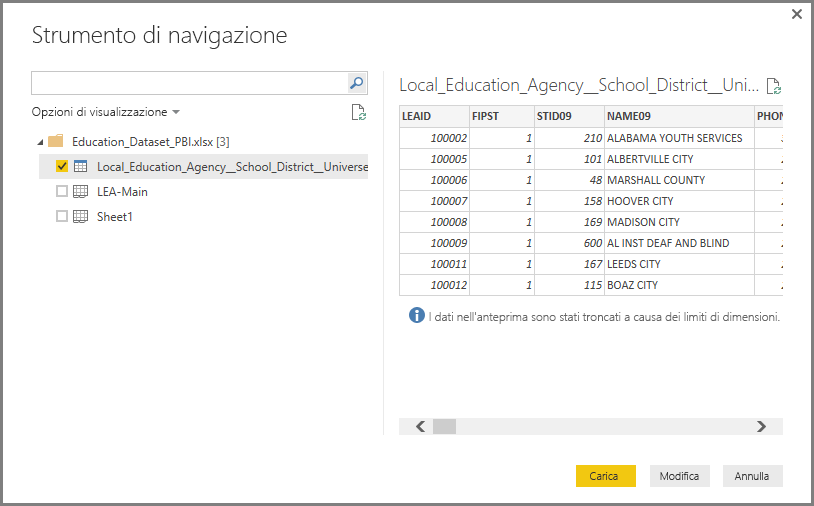
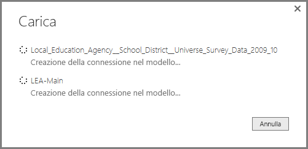
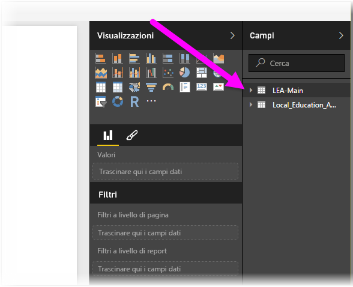

# Connettersi a Excel in Power BI Desktop
La connessione a una cartella di lavoro di Excel da Power BI Desktop è molto semplice e questo articolo illustra i passaggi corrispondenti in modo dettagliato.

In Power BI Desktop selezionare **Recupera dati > Excel** dalla barra multifunzione **Home**.

Selezionare la cartella di lavoro dalla finestra di dialogo **Apri** visualizzata.

Power BI Desktop presenta le tabelle o altri elementi di dati dalla cartella di lavoro nella finestra **Strumento di navigazione**. Quando si seleziona una tabella nel riquadro sinistro, viene visualizzata un'anteprima dei dati nel riquadro destro.

È possibile selezionare il pulsante Carica per importare i dati oppure, per modificare i dati usando l'**Editor di query** prima di importarli in Power BI Desktop, selezionare il pulsante **Modifica**.

Quando si caricano i dati, Power BI Desktop mostra la finestra **Carica** e visualizza le attività associate al caricamento dei dati.  

Al termine, Power BI Desktop mostra le tabelle e i campi importati dalla cartella di lavoro di Excel nel riquadro **Campi** nel lato destro del desktop.

Non sono necessarie altre operazioni.

È ora possibile usare i dati importati dalla cartella di lavoro di Excel in Power BI Desktop per creare oggetti visivi o report oppure per interagire con qualsiasi altro dato a cui ci si vuole connettere e da importare, ad esempio cartelle di lavoro di Excel, database o qualsiasi altra origine dati.

## Passaggi successivi
È possibile connettersi a molti tipi di dati usando Power BI Desktop. Per altre informazioni sulle origini dati, vedere le risorse seguenti:

* [Che cos'è Power BI Desktop?](desktop-what-is-desktop.md)
* [Origini dati in Power BI Desktop](desktop-data-sources.md)
* [Effettuare il data shaping e combinare i dati con Power BI Desktop](desktop-shape-and-combine-data.md)
* [Connettersi a file CSV in Power BI Desktop](desktop-connect-csv.md)   
* [Immettere dati direttamente in Power BI Desktop](desktop-enter-data-directly-into-desktop.md)   

