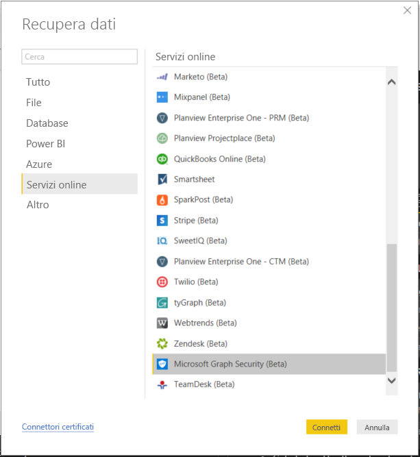
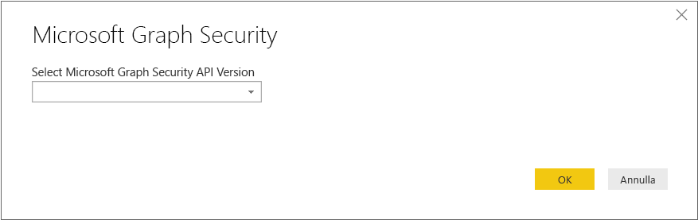
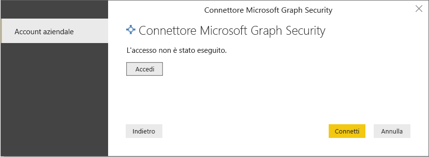
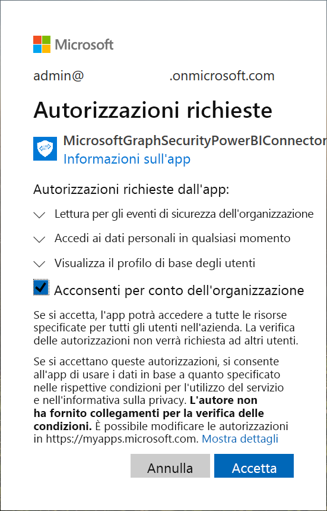
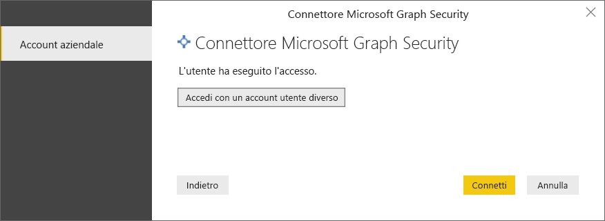
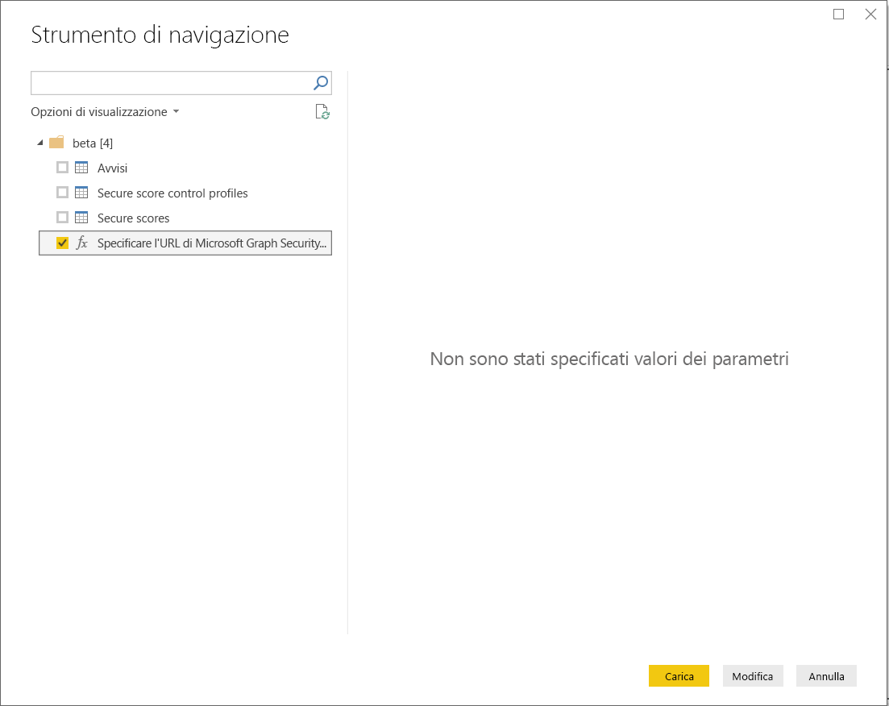
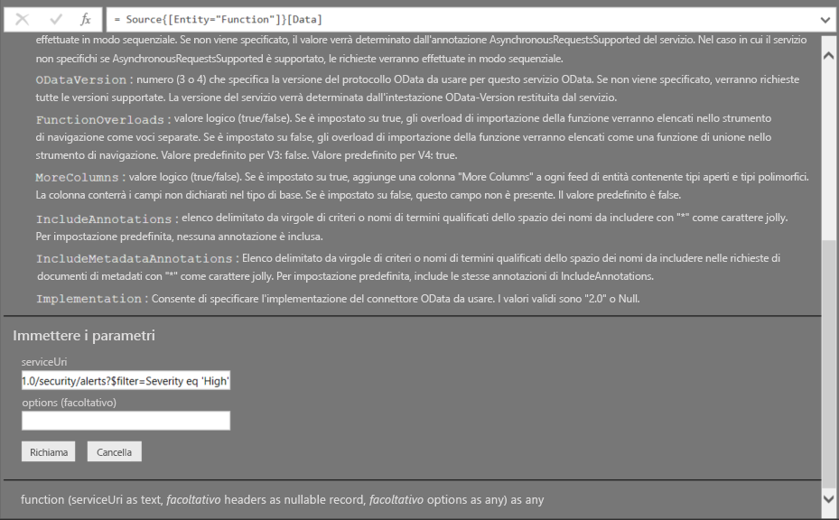
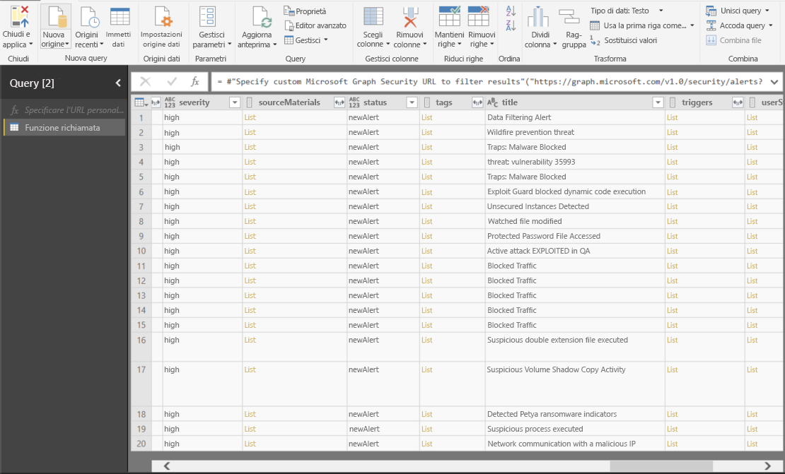

# Connettersi a Microsoft Graph Security in Power BI Desktop

È possibile usare Power BI Desktop per connettersi all'API Microsoft Graph Security usando il connettore di Power BI Microsoft Graph Security. In questo modo sarà possibile creare dashboard e report e ottenere informazioni dettagliate sugli [avvisi](https://docs.microsoft.com/graph/api/resources/alert?view=graph-rest-1.0) correlati alla sicurezza e sul [punteggio di sicurezza](https://docs.microsoft.com/graph/api/resources/securescores?view=graph-rest-beta). L'[API Microsoft Graph Security](https://aka.ms/graphsecuritydocs) connette [più soluzioni di sicurezza](https://aka.ms/graphsecurityalerts) Microsoft e di partner dell'ecosistema per consentire una correlazione più semplice degli avvisi, offrire l'accesso a informazioni contestuali avanzate e rendere più semplice l'automazione. Ciò consente alle organizzazioni di ottenere rapidamente informazioni dettagliate ed eseguire azioni nei prodotti di sicurezza, riducendo contemporaneamente i costi e la difficoltà di creazione e gestione di più integrazioni.

## Prerequisiti per la connessione con il connettore Microsoft Graph Security

* Per usare il connettore Microsoft Graph Security, è necessario aver *concesso esplicitamente* il consenso all'amministratore tenant di Azure Active Directory (AD), operazione che corrisponde a uno dei [requisiti di autenticazione di Microsoft Graph Security](https://aka.ms/graphsecurityauth). Per concedere il consenso è necessario specificare l'ID applicazione e il nome del connettore di Power BI Microsoft Graph Security, disponibili anche nel [portale di Azure](https://portal.azure.com):

   | Property | Valore |
   |----------|-------|
   | **Nome applicazione** | `MicrosoftGraphSecurityPowerBIConnector` |
   | **ID applicazione** | `cab163b7-247d-4cb9-be32-39b6056d4189` |
   |||

   Per concedere il consenso per il connettore, l'amministratore tenant di Azure AD può seguire una di queste procedure:

   * [Concedere all'amministratore tenant il consenso per le applicazioni Azure AD](https://docs.microsoft.com/azure/active-directory/develop/v2-permissions-and-consent).

   * Durante la prima esecuzione dell'app logica, è possibile che l'app richieda il consenso dell'amministratore tenant di Azure AD tramite l'[esperienza del consenso dell'applicazione](https://docs.microsoft.com/azure/active-directory/develop/application-consent-experience).
   
* L'account utente usato per l'accesso per la connessione al connettore di Power BI Microsoft Graph Security deve essere un membro del ruolo di amministratore con limitazioni con autorizzazioni di lettura per la sicurezza in Azure AD (Ruolo con autorizzazioni di lettura per la sicurezza o Amministratore della sicurezza). Seguire la procedura nella sezione [Assign Azure AD roles to users](https://docs.microsoft.com/graph/security-authorization#assign-azure-ad-roles-to-users) (Assegnare i ruoli di Azure AD agli utenti). 

## Uso del connettore Microsoft Graph Security

Per usare il connettore **Microsoft Graph Security**, seguire questa procedura:

1. Selezionare **Scarica i dati -> Altro…** dalla barra multifunzione **Home** in Power BI Desktop.
2. Selezionare **Servizi online** dalle categorie a sinistra.
3. Fare clic su **Microsoft Graph Security (Beta)**.

    
    
4. Nella finestra **Microsoft Graph Security** visualizzata selezionare la versione dell'API Microsoft Graph in cui eseguire la query. Le opzioni sono v1.0 e beta.

    
    
5. Quando viene richiesto, accedere all'account Azure Active Directory. L'account deve avere il **Ruolo con autorizzazioni di lettura per la sicurezza** come indicato nella sezione precedente sui prerequisiti.

    
    
6. Se si è l'amministratore tenant **e** non si è ancora concesso il consenso al connettore (applicazione) di Power BI Microsoft Graph Security come indicato nei prerequisiti, viene visualizzata la finestra di dialogo seguente. Assicurarsi di selezionare "**Acconsenti per conto dell'organizzazione**".

    
    
7. Dopo l'accesso, viene visualizzata la finestra seguente che indica che è stata eseguita l'autenticazione. Selezionare **Connetti**.

    
    
8. Dopo aver stabilito la connessione, viene visualizzata la finestra **Strumento di navigazione** seguente che visualizza le entità, ad esempio gli avvisi, disponibili nell'[API Microsoft Graph Security](https://aka.ms/graphsecuritydocs) per la versione selezionata nella procedura precedente. Selezionare una o più entità da importare e usare in **Power BI Desktop**. Fare clic su **Carica** per ottenere la visualizzazione dei risultati descritta nel passaggio 10.

   
    
9. Se si vuole eseguire una query avanzata nell'API Microsoft Graph Security, selezionare la funzione **Specify custom Microsoft Graph Security URL to filter results** (Specifica URL Microsoft Graph Security personalizzato per filtrare i risultati). In questo modo è possibile eseguire una query [OData.Feed](https://docs.microsoft.com/power-bi/desktop-connect-odata) nell'API Microsoft Graph Security con le autorizzazioni necessarie per accedere all'API.

   > [!NOTE]
   > Il parametro serviceUri di esempio usato di seguito è `https://graph.microsoft.com/v1.0/security/alerts?$filter=Severity eq 'High'`. Fare riferimento ai [parametri di query ODATA supportati da Graph](https://docs.microsoft.com/graph/query-parameters) per creare query per filtrare, ordinare o recuperare i risultati più recenti.

   
    
   Quando si seleziona **Richiama** la funzione OData.Feed effettua una chiamata all'API che apre l'editor di query in modo che sia possibile filtrare e ridefinire il set di dati da usare e quindi caricarlo in Power BI Desktop.

10. La figura seguente illustra la finestra dei risultati per l'entità o le entità di Microsoft Graph Security per cui è stata eseguita la query.

   
    

È ora possibile usare i dati importati dal connettore Microsoft Graph Security in Power BI Desktop per creare oggetti visivi o report oppure per interagire con altri dati a cui si vuole connettersi e che si vuole importare, ad esempio altre cartelle di lavoro di Excel, database o altre origini dati.

## Passaggi successivi
* Vedere gli esempi e i modelli di Power BI che usano questo connettore nel [repository di esempio di Power BI Microsoft Graph Security in GitHub](https://aka.ms/graphsecuritypowerbiconnectorsamples).

* Vedere alcuni scenari utente e altre informazioni nel [post di blog del connettore di Power BI Microsoft Graph Security](https://aka.ms/graphsecuritypowerbiconnectorblogpost).

* È possibile connettersi a molti tipi di dati usando Power BI Desktop. Per altre informazioni sulle origini dati, vedere le risorse seguenti:

    * [Che cos'è Power BI Desktop?](desktop-what-is-desktop.md)
    * [Origini dati in Power BI Desktop](desktop-data-sources.md)
    * [Effettuare il data shaping e combinare i dati con Power BI Desktop](desktop-shape-and-combine-data.md)
    * [Connettersi a cartelle di lavoro di Excel in Power BI Desktop](desktop-connect-excel.md)
    * [Immettere dati direttamente in Power BI Desktop](desktop-enter-data-directly-into-desktop.md)
