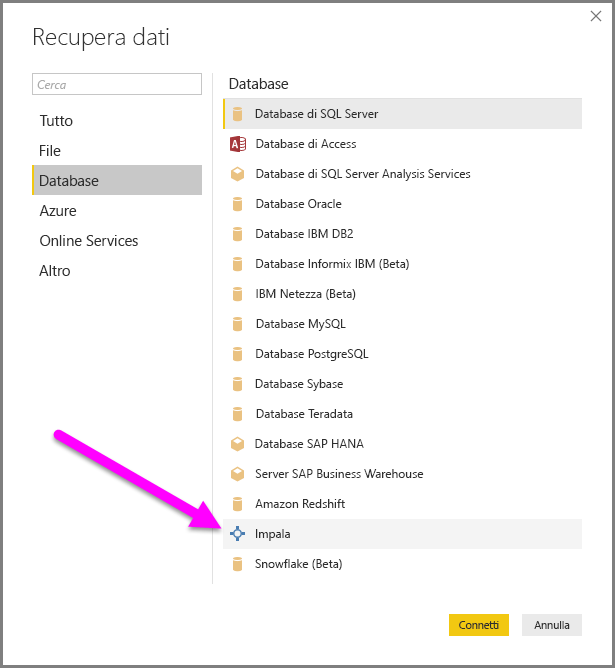
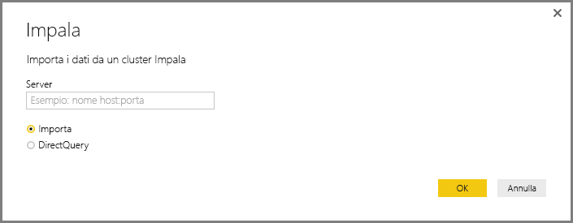
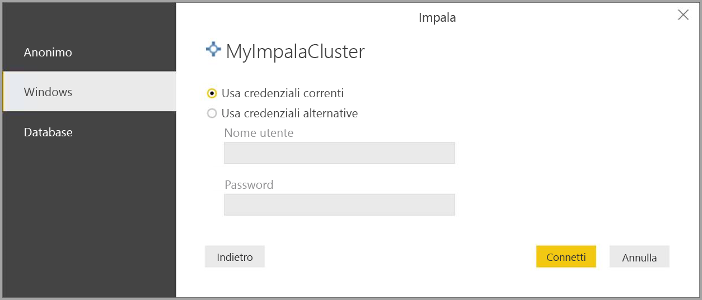
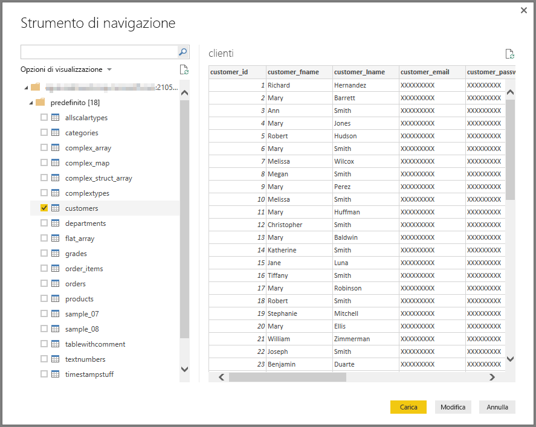

# Connettersi a un database Impala in Power BI Desktop
In Power BI Desktop è possibile connettersi a un database **Impala** e usare i dati sottostanti esattamente come qualsiasi altra origine dati in Power BI Desktop.

## Connettersi a un database Impala
Per connettersi a un database **Impala** selezionare **Recupera dati** nella barra multifunzione **Home** in Power BI Desktop. Quando si seleziona **Database** nelle categorie a sinistra viene visualizzato **Impala**.

Nella finestra **Impala** che viene visualizzata digitare o incollare il nome del server Impala, quindi selezionare **OK**. Si noti che è possibile scegliere di **importare** i dati direttamente in Power BI oppure usare **DirectQuery**. Per scoprire di più sull'[uso di DirectQuery](desktop-use-directquery.md).

Quando richiesto, immettere le credenziali o connettersi in modo anonimo. Il connettore Impala supporta l'autenticazione anonima, di base (nome utente + password) e di Windows.

> [!NOTE]
> Dopo avere inserito il nome utente e la password per un particolare server **Impala**, Power BI Desktop usa quelle stesse credenziali nei successivi tentativi di connessione. Le credenziali possono essere modificate selezionando **File > Opzioni e impostazioni > Impostazioni origine dati**.
> 
> 

Una volta stabilita la connessione, viene visualizzata una finestra **Strumento di navigazione** che mostra i dati disponibili sul server, in cui è possibile selezionare uno o più elementi da importare e usare in **Power BI Desktop**.

## Considerazioni e limitazioni
Esistono alcune limitazioni e considerazioni da tenere presenti con il connettore **Impala**:

* Il connettore Impala è supportato nel gateway dati locale, usando uno dei tre meccanismi di autenticazione supportati.

## Passaggi successivi
È possibile connettersi a molti tipi di dati usando Power BI Desktop. Per altre informazioni sulle origini dati, vedere le risorse seguenti:

* [Introduzione a Power BI Desktop](desktop-getting-started.md)
* [Origini dati in Power BI Desktop](desktop-data-sources.md)
* [Effettuare il data shaping e combinare i dati con Power BI Desktop](desktop-shape-and-combine-data.md)
* [Connettersi a cartelle di lavoro di Excel in Power BI Desktop](desktop-connect-excel.md)   
* [Immettere dati direttamente in Power BI Desktop](desktop-enter-data-directly-into-desktop.md)   

