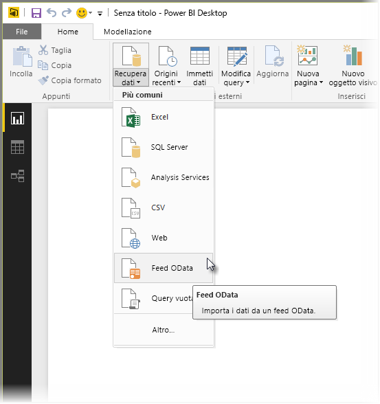
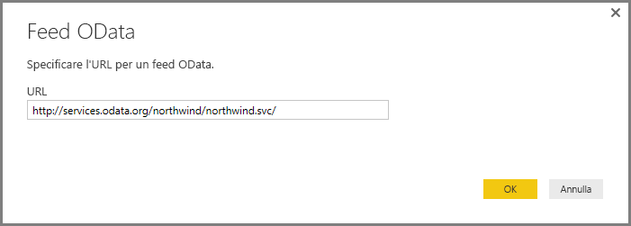
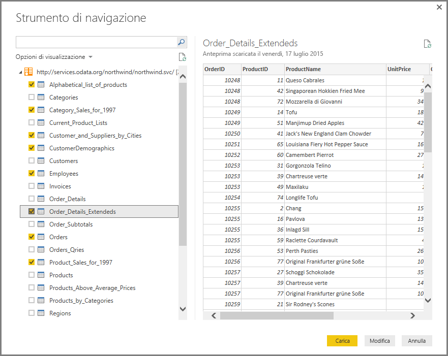
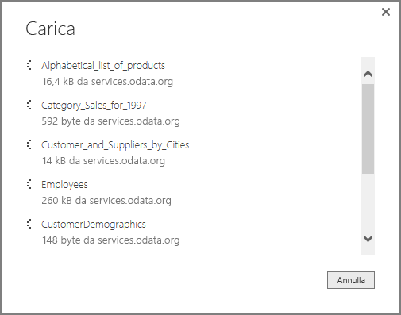
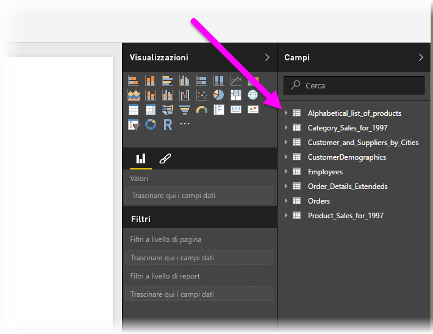

# Connettersi a feed OData in Power BI Desktop
In Power BI Desktop è possibile connettersi a un **feed OData** e usare i dati sottostanti esattamente come qualsiasi altra origine dati in Power BI Desktop.

Per connettersi a un feed OData, selezionare **Recupera dati > Feed OData** dalla barra multifunzione **Home** in Power BI Desktop.

Nella finestra **Feed OData** visualizzata digitare o incollare l'URL del feed OData nella casella, quindi selezionare **OK**.

Power BI Desktop si connette al feed OData e visualizza le tabelle disponibili e altri elementi di dati nella finestra **Strumento di navigazione**. Quando si seleziona un elemento, il riquadro di destra della finestra **Strumento di navigazione** mostra un'anteprima dei dati. È possibile selezionare il numero di tabelle desiderato da importare. La finestra **Strumento di navigazione** mostra un'anteprima della tabella attualmente selezionata.

È possibile scegliere il pulsante **Modifica**, che avvia l'**Editor di query**, in cui è possibile modificare e trasformare i dati dal feed OData prima di importarli in Power BI Desktop. In alternativa, è possibile selezionare il pulsante **Carica** e importare tutti i gli elementi di dati selezionati nel riquadro sinistro.

Quando si seleziona **Carica**, Power BI Desktop importa gli elementi selezionati e mostra una finestra **Carica** relativa allo stato dell'importazione.

Al termine, Power BI Desktop rende disponibili le tabelle selezionate e altri elementi di dati nel riquadro **Campi**, disponibile nel lato destro della visualizzazione *Report* in Power BI Desktop.

Non sono necessarie altre operazioni.

È ora possibile usare i dati importati dal feed OData in Power BI Desktop per creare oggetti visivi o report oppure per interagire con qualsiasi altro dato a cui ci si vuole connettere e da importare, ad esempio cartelle di lavoro di Excel, database o qualsiasi altra origine dati.

## Passaggi successivi
È possibile connettersi a molti tipi di dati usando Power BI Desktop. Per altre informazioni sulle origini dati, vedere le risorse seguenti:

* [Che cos'è Power BI Desktop?](desktop-what-is-desktop.md)
* [Origini dati in Power BI Desktop](desktop-data-sources.md)
* [Effettuare il data shaping e combinare i dati con Power BI Desktop](desktop-shape-and-combine-data.md)
* [Connettersi a cartelle di lavoro di Excel in Power BI Desktop](desktop-connect-excel.md)   
* [Immettere dati direttamente in Power BI Desktop](desktop-enter-data-directly-into-desktop.md)   

