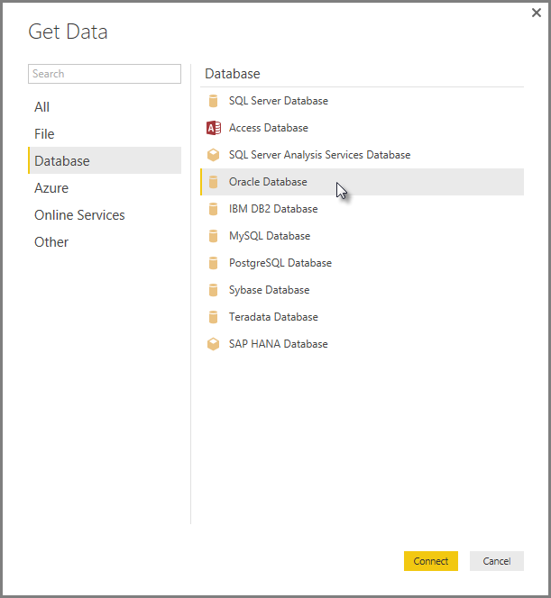
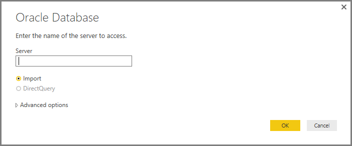
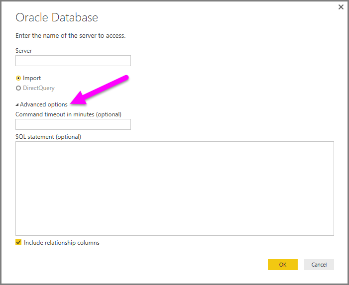

# Connettersi a un database Oracle
Per connettersi a un database Oracle con **Power BI Desktop**, è necessario che nel computer che esegue Power BI Desktop sia installato il software client Oracle appropriato. La versione del software client Oracle dipende dalla versione di Power BI Desktop installata, a **32 bit** o a **64 bit**.

**Versioni supportate**: Oracle 9 e versioni successive, software client Oracle 8.1.7 e versioni successive.

## Determinazione della versione di Power BI Desktop installata
Per determinare quale versione di Power BI Desktop è installata, selezionare **File > ? > Informazioni su** ed esaminare la riga **Versione:**. Nel caso della figura seguente è installata una versione a 64 bit di Power BI Desktop:

## Installazione del client Oracle
Per le versioni a **32 bit** di Power BI Desktop, usare il collegamento seguente per scaricare e installare il client Oracle a **32 bit**:

* [Oracle Data Access Components (ODAC) a 32 bit con strumenti di sviluppo Oracle per Visual Studio (12.1.0.2.4)](http://www.oracle.com/technetwork/topics/dotnet/utilsoft-086879.html)

Per le versioni a **64 bit** di Power BI Desktop, usare il collegamento seguente per scaricare e installare il client Oracle a **64 bit**:

* [ODAC 12c versione 4 (12.1.0.2.4) a 64 bit per Windows x64](http://www.oracle.com/technetwork/database/windows/downloads/index-090165.html)

## Connettersi a un database Oracle
Dopo aver installato il driver del client Oracle corrispondente, è possibile connettersi a un database Oracle. Per stabilire la connessione, seguire la procedura illustrata di seguito:

1. Nella finestra Recupera dati selezionare **Database > Database Oracle**
   
   
2. Nella finestra di dialogo **Database Oracle** visualizzata specificare il nome del server e selezionare **Connetti**. Se è necessario un SID, è possibile specificarlo nel formato: *NomeServer/SID*, dove SID è il nome univoco del database. Se il formato *NomeServer/SID* non funziona, provare a usare *NomeServer/NomeServizio*, dove NomeServizio è l'alias usato durante la connessione.
   
   
3. Per importare i dati usando una query nativa sul database, è possibile inserire la query nella casella **Istruzione SQL**, disponibile espandendo la sezione **Opzioni avanzate** della finestra di dialogo **Database Oracle**.
   
   
4. Dopo avere immesso le informazioni sul database Oracle nella finestra di dialogo Database Oracle (incluse eventuali informazioni facoltative, come un SID o una query nativa sul database), selezionare **OK** per stabilire la connessione.
5. Se il database Oracle richiede credenziali utente, immettere tali credenziali nella finestra di dialogo quando viene chiesto.

