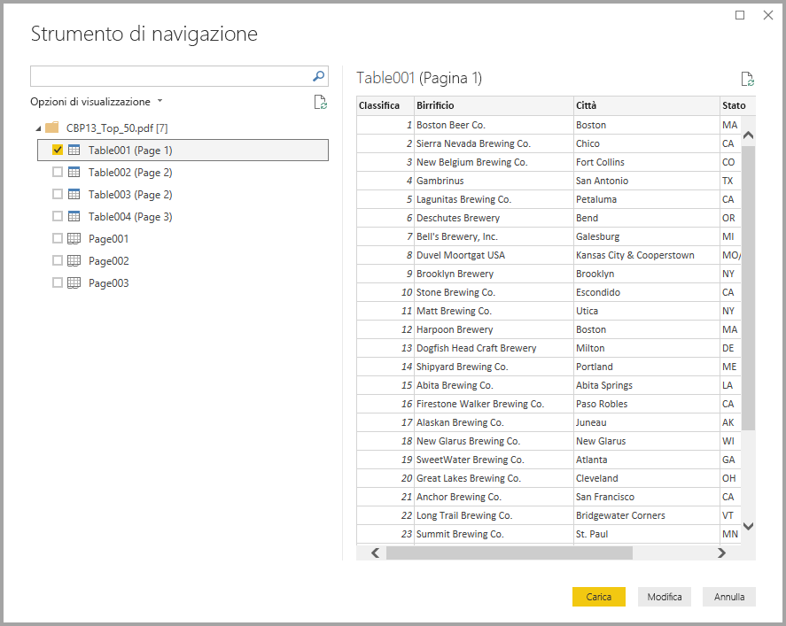
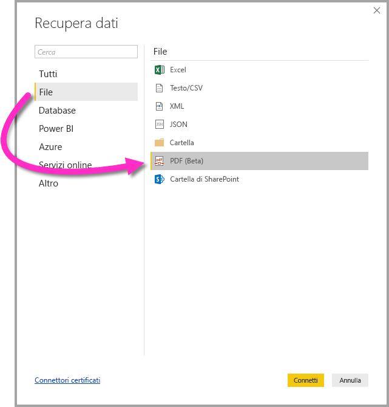

# Connettersi a un file PDF in Power BI Desktop (anteprima)
In Power BI Desktop è possibile connettersi a un **file PDF** e usare i dati inclusi nel file esattamente come qualsiasi altra origine dati in Power BI Desktop.

Le sezioni seguenti descrivono come connettersi a un **file PDF**, selezionare i dati e inserirli in **Power BI Desktop**.

## Abilitare il connettore PDF
Il connettore PDF è disponibile in anteprima per **Power BI Desktop** e deve essere abilitato. Per abilitare il connettore PDF, selezionare **File > Opzioni e impostazioni > Opzioni > Funzionalità di anteprima** e quindi selezionare la casella di controllo accanto a **Ottieni dati da file PDF**. 

Dopo aver effettuato la selezione è necessario riavviare **Power BI Desktop**.

Quando si usa per la prima volta il connettore **PDF (beta)**, viene visualizzato un avviso che informa che il connettore PDF è ancora in fase di sviluppo e potrebbe essere modificato in futuro. Selezionare **Continua** per usare il connettore.

È sempre consigliabile l'aggiornamento alla versione più recente di **Power BI Desktop**, che è possibile ottenere da un collegamento in [Scarica Power BI Desktop](desktop-get-the-desktop.md). 

## Connettersi a un file PDF
Per connettersi a un file **PDF** selezionare **Recupera dati** nella scheda **Home** della barra multifunzione in Power BI Desktop. Quando si seleziona **File** nelle categorie a sinistra viene visualizzato **PDF (beta)**.

Viene chiesto di specificare il percorso del file PDF da usare. Una volta specificato il percorso e caricato il file PDF, viene visualizzata una finestra **Strumento di navigazione** che visualizza i dati disponibili sul file, in cui è possibile selezionare uno o più elementi da importare e usare in **Power BI Desktop**.

Selezionando una casella di controllo accanto agli elementi individuati nel file PDF, tali elementi vengono visualizzati nel riquadro di destra. Quando si è pronti per l'importazione, selezionare il pulsante **Carica** per visualizzare i dati in **Power BI Desktop**.

A partire dalla versione di novembre 2018 di **Power BI Desktop**, è possibile specificare la **pagina iniziale** e la **pagina finale** come parametri facoltativi per la connessione PDF. È anche possibile specificare questi parametri nel linguaggio delle formule M, usando il formato seguente:

`Pdf.Tables(File.Contents("c:\sample.pdf"), [StartPage=10, EndPage=11])`

## Passaggi successivi
È possibile connettersi a molti tipi di dati usando Power BI Desktop. Per altre informazioni sulle origini dati, vedere le risorse seguenti:

* [Che cos'è Power BI Desktop?](desktop-what-is-desktop.md)
* [Origini dati in Power BI Desktop](desktop-data-sources.md)
* [Effettuare il data shaping e combinare i dati con Power BI Desktop](desktop-shape-and-combine-data.md)
* [Connettersi a cartelle di lavoro di Excel in Power BI Desktop](desktop-connect-excel.md)   
* [Immettere dati direttamente in Power BI Desktop](desktop-enter-data-directly-into-desktop.md)   

