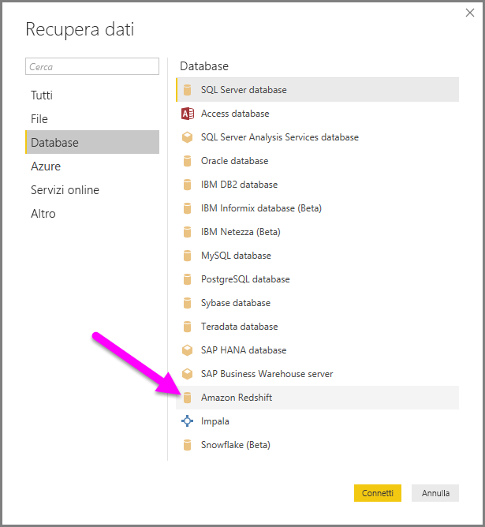
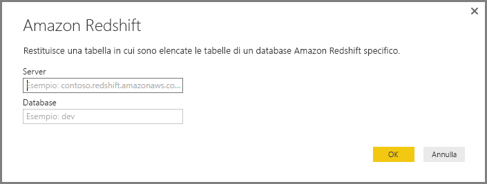
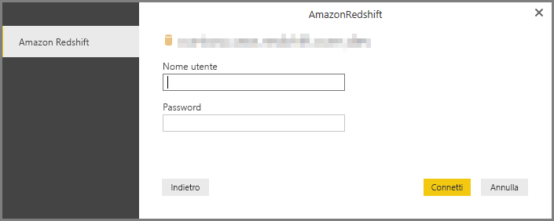
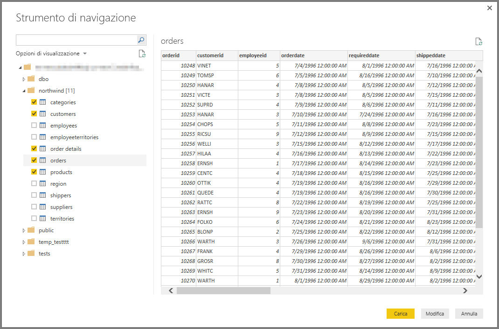

# Connettersi ad Amazon Redshift in Power BI Desktop
In **Power BI Desktop** è possibile connettersi a un database **Amazon Redshift** e usare i dati sottostanti esattamente come qualsiasi altra origine dati in Power BI Desktop.

## Connettersi a un database Amazon Redshift
Per connettersi a un database **Amazon Redshift** selezionare **Recupera dati** nella barra multifunzione **Home** in Power BI Desktop. Quando si seleziona **Database** nelle categorie a sinistra viene visualizzato **Amazon Redshift**.

Nella finestra **Amazon Redshift** che viene visualizzata digitare o incollare il nome del server e del database **Amazon Redshift**. Nel campo *Server* gli utenti possono specificare una porta nel seguente formato: *ServerURL:Port*

Quando richiesto, inserire il nome utente e la password. Per evitare errori, usare il nome del server che corrisponde esattamente al certificato SSL. 

Una volta stabilita la connessione, viene visualizzata una finestra **Strumento di navigazione** che mostra i dati disponibili sul server, in cui è possibile selezionare uno o più elementi da importare e usare in **Power BI Desktop**.

Dopo avere effettuato le selezioni nella finestra **Strumento di navigazione** è possibile scegliere **Carica** per caricare i dati o **Modifica** per modificarli.

* Se si sceglie **Carica** viene chiesto se usare la modalità *Importa* o la modalità *DirectQuery* per caricare i dati. Per altre informazioni, vedere l'[articolo che descrive DirectQuery](desktop-use-directquery.md).
* Se si sceglie **Modifica**, viene visualizzato l'**Editor di Query** in cui è possibile applicare trasformazioni e filtri di vario tipo ai dati, molti dei quali vengono applicati al database **Amazon Redshift** stesso sottostante (se supportato).

## Passaggi successivi
È possibile connettersi a molti tipi di dati usando Power BI Desktop. Per altre informazioni sulle origini dati, vedere le risorse seguenti:

* [Che cos'è Power BI Desktop?](desktop-what-is-desktop.md)
* [Origini dati in Power BI Desktop](desktop-data-sources.md)
* [Effettuare il data shaping e combinare i dati con Power BI Desktop](desktop-shape-and-combine-data.md)
* [Connettersi a cartelle di lavoro di Excel in Power BI Desktop](desktop-connect-excel.md)   
* [Immettere dati direttamente in Power BI Desktop](desktop-enter-data-directly-into-desktop.md)   

