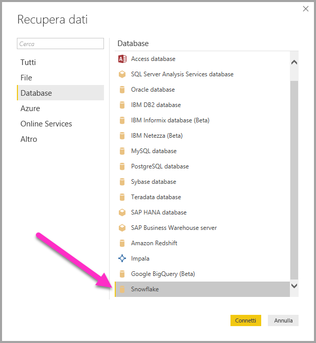
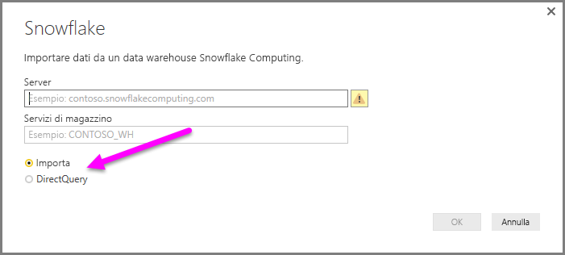
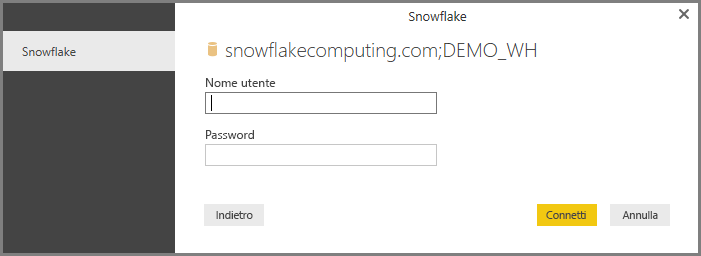
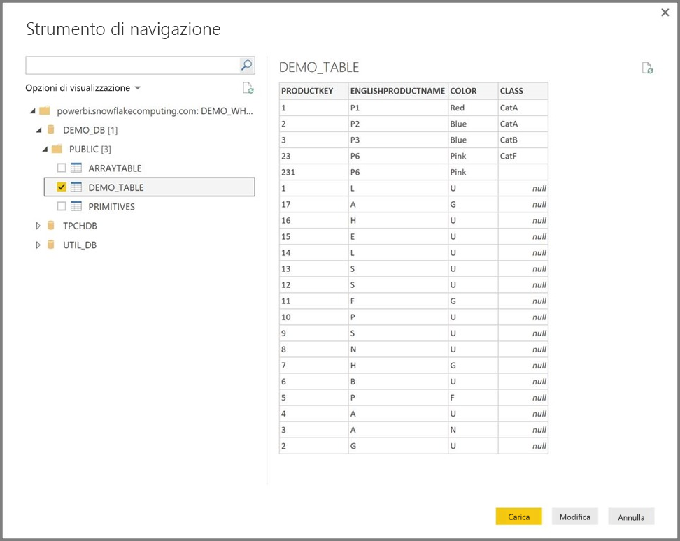

# Connettersi a Snowflake in Power BI Desktop
In Power BI Desktop è possibile connettersi a un data warehouse **Snowflake** Computing e usare i dati sottostanti esattamente come qualsiasi altra origine dati in Power BI Desktop. 

> [!NOTE]
> È anche *necessario* installare il **driver ODBC di Snowflake** nei computer che usano il connettore **Snowflake**, usando l'architettura corrispondente all'installazione di **Power BI Desktop**, a 32 o 64 bit. È sufficiente seguire il collegamento seguente e [scaricare il driver ODBC di Snowflake](http://go.microsoft.com/fwlink/?LinkID=823762).
> 
> 

## Connettersi a un data warehouse Snowflake Computing
Per connettersi a un data warehouse **Snowflake** Computing selezionare **Recupera dati** nella scheda **Home** della barra multifunzione in Power BI Desktop. Quando si seleziona **Database** nelle categorie a sinistra viene visualizzato **Snowflake**.

Nella finestra **Snowflake** che viene visualizzata digitare o incollare il nome del data warehouse Snowflake Computing, quindi selezionare **OK**. Si noti che è possibile scegliere di **importare** i dati direttamente in Power BI oppure usare **DirectQuery**. Per scoprire di più sull'[uso di DirectQuery](desktop-use-directquery.md).

Quando richiesto, inserire il nome utente e la password.

> [!NOTE]
> Dopo avere inserito il nome utente e la password per un particolare server **Snowflake**, Power BI Desktop usa quelle stesse credenziali nei successivi tentativi di connessione. Le credenziali possono essere modificate selezionando **File > Opzioni e impostazioni > Impostazioni origine dati**.
> 
> 

Una volta stabilita la connessione, viene visualizzata una finestra **Strumento di navigazione** che mostra i dati disponibili sul server, in cui è possibile selezionare uno o più elementi da importare e usare in **Power BI Desktop**.

È possibile **caricare** la tabella selezionata, che importa l'intera tabella in **Power BI Desktop**, oppure è possibile **modificare** la query, che consente di aprire **Editor di query** in modo da filtrare e perfezionare il set di dati da usare e quindi caricare il set di dati perfezionato in **Power BI Desktop**.

## Passaggi successivi
È possibile connettersi a molti tipi di dati usando Power BI Desktop. Per altre informazioni sulle origini dati, vedere le risorse seguenti:

* [Introduzione a Power BI Desktop](desktop-getting-started.md)
* [Origini dati in Power BI Desktop](desktop-data-sources.md)
* [Effettuare il data shaping e combinare i dati con Power BI Desktop](desktop-shape-and-combine-data.md)
* [Connettersi a cartelle di lavoro di Excel in Power BI Desktop](desktop-connect-excel.md)   
* [Immettere dati direttamente in Power BI Desktop](desktop-enter-data-directly-into-desktop.md)   

