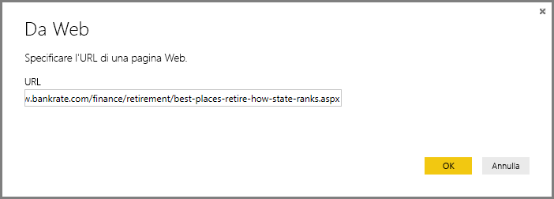
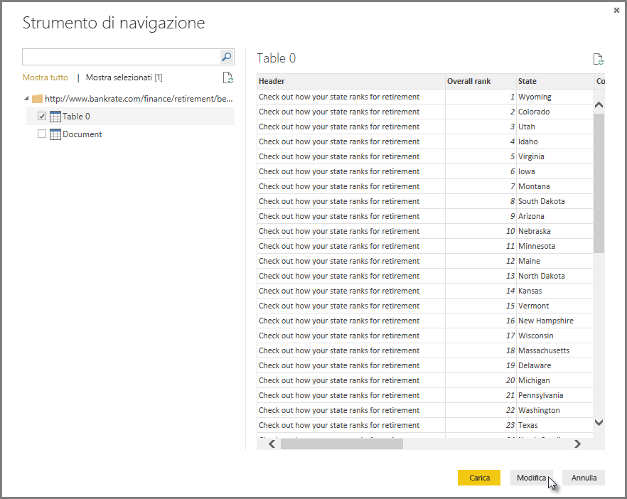
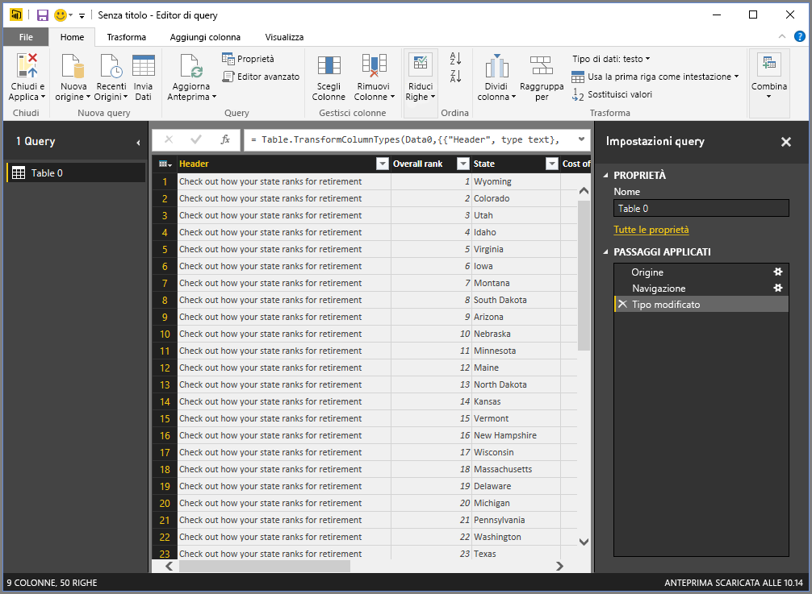
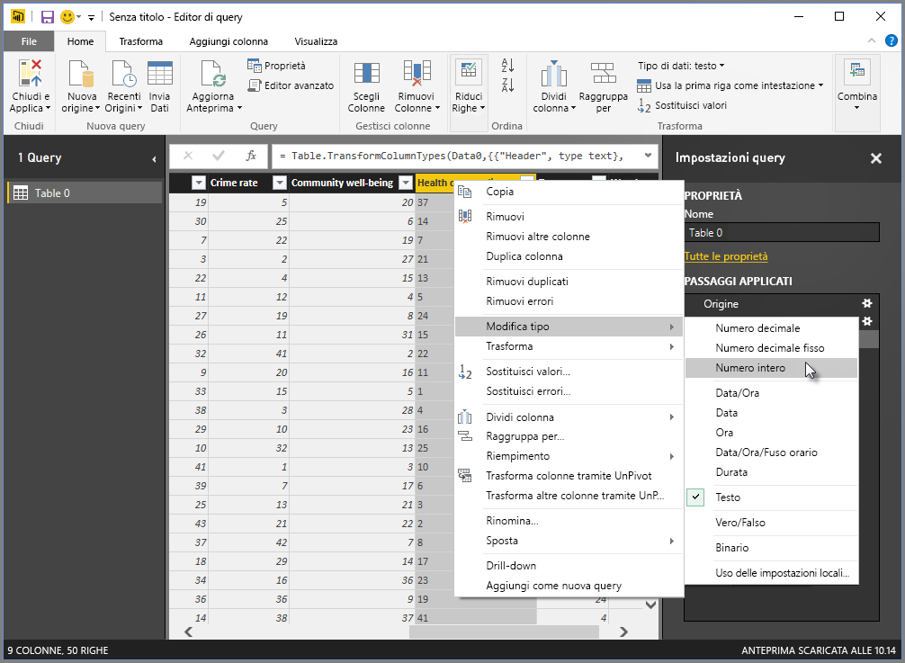
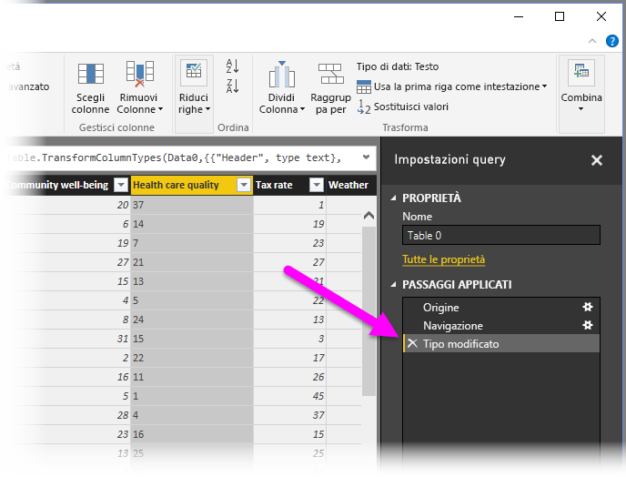
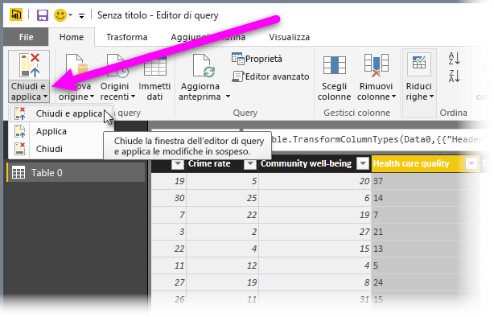
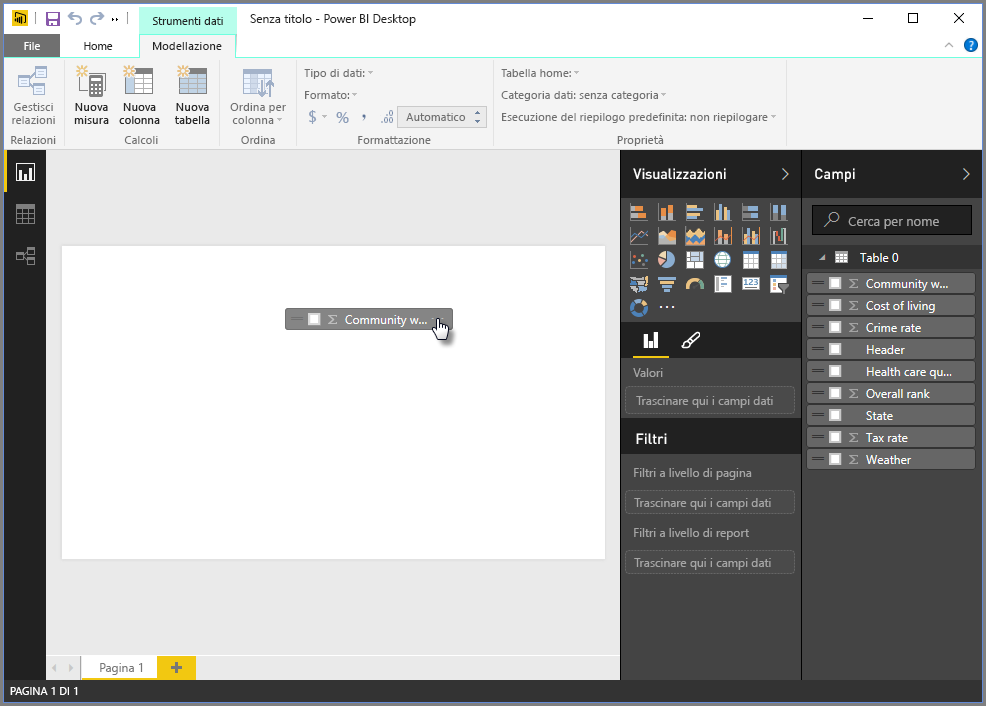
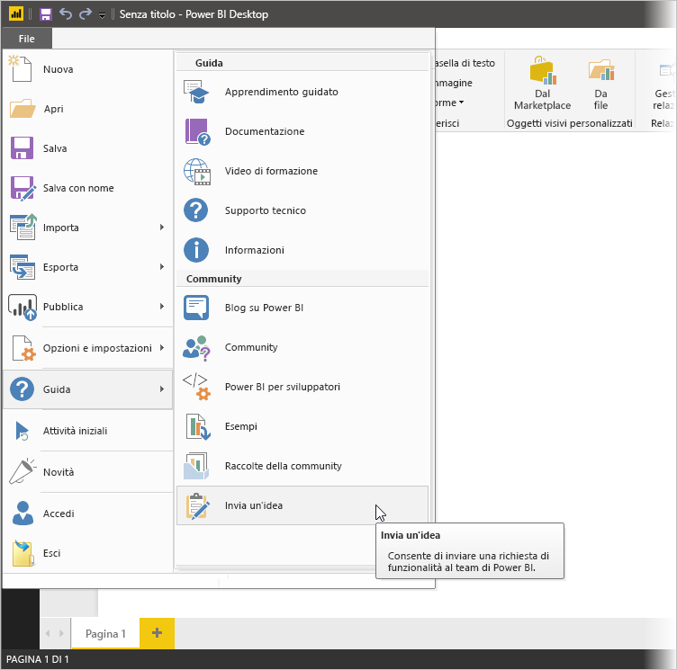

# Connettere le origini dati in Power BI Desktop

Power BI Desktop consente di connettersi facilmente al mondo dei dati in continua espansione. Se non si ha Power BI Desktop, è possibile [scaricarlo](https://go.microsoft.com/fwlink/?LinkID=521662) e installarlo.

In Power BI Desktop sono disponibili origini dati *di ogni tipo*. La figura seguente illustra come connettersi ai dati, selezionando la scheda **Recupera dati** > **Altro** > **Web**.

## Esempio di connessione ai dati

Per questo esempio, verrà effettuata la connessione a un'origine dati **Web**.

Si supponga di andare in pensione. Si vuole abitare in un luogo con clima mite, pressione fiscale ridotta e assistenza sanitaria di buona qualità. Oppure si supponga di essere un analista di dati e di avere bisogno di informazioni per aiutare i clienti, ad esempio per aiutare un cliente che produce impermeabili a concentrare le vendite nei luoghi in cui piove *molto*.

In ogni caso, si troverà una risorsa Web che offre dati interessanti su questi argomenti e altro ancora:

[https://www.bankrate.com/finance/retirement/best-places-retire-how-state-ranks.aspx](https://www.bankrate.com/finance/retirement/best-places-retire-how-state-ranks.aspx)

Selezionare **Recupera dati** > **Altro** > **Web**. In **Da Web** immettere l'indirizzo.

Quando si seleziona **OK**, la funzionalità *Query* di Power BI Desktop viene attivata. Power BI Desktop contatta la risorsa Web e la finestra **Strumento di navigazione** restituisce i risultati dei dati disponibili in tale pagina Web. In questo caso, sono stati trovati una tabella e un documento complessivo. Nella procedura verrà usata la tabella, quindi occorre selezionarla dall'elenco. La finestra **Strumento di navigazione** mostra un'anteprima.

A questo punto è possibile modificare la query prima di caricare la tabella, selezionando **Trasforma dati** nella parte inferiore della finestra, oppure caricare semplicemente la tabella.

Selezionare **Trasforma dati** per caricare la tabella e avviare l'editor di Power Query. Viene visualizzato il riquadro **Impostazioni query**. In caso contrario, selezionare **Visualizza** dalla barra multifunzione, quindi **Impostazioni query** per visualizzare il riquadro **Impostazioni query**. che ha un aspetto analogo al seguente.

Tutti i punteggi sono testo anziché numeri, ed è necessario che diventino numeri. Non c'è problema. È sufficiente fare clic con il pulsante destro del mouse sull'intestazione di colonna e quindi scegliere **Modifica tipo** > **Numero intero** per modificarli. Per scegliere più di una colonna, selezionare prima di tutto una colonna e quindi, tenendo premuto MAIUSC, selezionare altre colonne adiacenti, infine fare clic con il pulsante destro del mouse su un'intestazione di colonna per modificare tutte le colonne selezionate. Usare CTRL per scegliere le colonne che non sono adiacenti.

In **Impostazioni query** la sezione **PASSAGGI APPLICATI** rifletterà le eventuali modifiche apportate. Quando si apportano altre modifiche ai dati, l'editor di Power Query registrerà le modifiche nella sezione **PASSAGGI APPLICATI**, che è possibile modificare, rivedere, ridisporre o eliminare in base alle necessità.

È possibile apportare altre modifiche alla tabella dopo il caricamento, ma per il momento le modifiche sono sufficienti. Al termine, selezionare **Chiudi e applica** nella barra multifunzione **Home** e Power BI Desktop applicherà le modifiche e chiuderà l'editor di query.

Con il modello di dati caricato, nella visualizzazione **Report** di Power BI Desktop, è possibile iniziare a creare le visualizzazioni trascinando i campi nell'area di disegno.

Questo modello con una singola connessione dati è davvero semplice. La maggior parte dei report di Power BI Desktop avrà connessioni a origini dati diverse, definite in base alle esigenze, con relazioni che producono un modello di dati complesso.

## Passaggi successivi
Power BI Desktop offre infinite possibilità. Per altre informazioni sulle capacità disponibili, vedere le risorse seguenti:

* [Che cos'è Power BI Desktop?](desktop-what-is-desktop.md)
* [Editor di query in Power BI Desktop](desktop-query-overview.md)
* [Origini dati in Power BI Desktop](desktop-data-sources.md)
* [Data shaping e combinazione di dati in Power BI Desktop](desktop-shape-and-combine-data.md)
* [Eseguire attività di query comuni in Power BI Desktop](desktop-common-query-tasks.md)   

Per fornire commenti e suggerimenti, interessanti, Usare la voce di menu **Invia un'idea** in Power BI Desktop oppure visitare [Commenti e suggerimenti della community](https://community.powerbi.com/t5/Community-Feedback/bd-p/community-feedback). Saremo lieti di rispondere a qualsiasi domanda.

