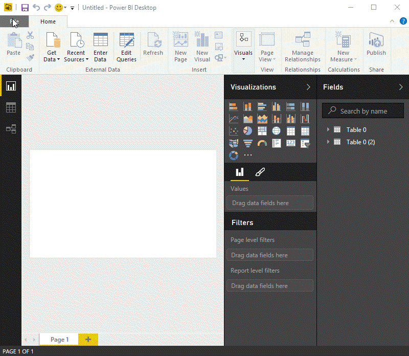

# Connettersi ai dati in Power BI Desktop
Con Power BI Desktop è possibile connettersi facilmente al mondo dei dati in continua espansione. Se non si ha Power BI Desktop, è possibile [scaricarlo](http://go.microsoft.com/fwlink/?LinkID=521662) e installarlo.

In Power BI Desktop sono disponibili origini dati *di ogni tipo* . La figura seguente mostra come connettersi ai dati, selezionando la scheda **File** della barra multifunzione e quindi facendo clic su **Recupera dati \> Altro**.

Per questo esempio, verrà effettuata la connessione a un'origine dati **Web** .

Si supponga di andare in pensione e di volere abitare in un luogo con clima mite, pressione fiscale ridotta e assistenza sanitaria di buona qualità Oppure si supponga di essere un analista di dati e di avere bisogno di informazioni per aiutare i clienti, ad esempio per aiutare un cliente che produce impermeabili a concentrare le vendite nei luoghi in cui piove *molto*.

In ogni caso, si troverà una risorsa Web che offre dati interessanti su questi argomenti e altro ancora:

[*http://www.bankrate.com/finance/retirement/best-places-retire-how-state-ranks.aspx*](http://www.bankrate.com/finance/retirement/best-places-retire-how-state-ranks.aspx)

Selezionare **Recupera dati \> Web** e digitare l'indirizzo.

Quando si seleziona **OK**, la funzionalità **Query** di Power BI Desktop viene attivata. Power BI Desktop contatta la risorsa Web e la finestra **Strumento di navigazione** restituisce i risultati dei dati disponibili in tale pagina Web. In questo caso, sono stati trovati una tabella (Table 0) e un documento complessivo. Nella procedura verrà usata la tabella, quindi occorre selezionarla dall'elenco. La finestra **Strumento di navigazione** mostra un'anteprima.

A questo punto è possibile modificare la query prima di caricare la tabella, selezionando **Modifica** nella parte inferiore della finestra, oppure è possibile caricare la tabella.

Se si seleziona **Modifica**, viene caricata la tabella e avviato l'Editor di query. Verrà visualizzato il riquadro **Impostazioni query**. In caso contrario, selezionare **Visualizza** sulla barra multifunzione e quindi **Mostra\> Impostazioni query** per visualizzare il riquadro **Impostazioni query**. che ha un aspetto analogo al seguente.

Tutti i punteggi sono testo anziché numeri, ed è necessario che diventino numeri. È sufficiente fare clic con il pulsante destro del mouse sull'intestazione di colonna e quindi scegliere **Modifica tipo \> Numero intero** per modificarli. Per scegliere più di una colonna, selezionare prima di tutto una colonna e quindi, tenendo premuto **MAIUSC**, selezionare altre colonne adiacenti, infine fare clic con il pulsante destro del mouse su un'intestazione di colonna per modificare tutte le colonne selezionate. Usare **CTRL** per scegliere le colonne che non sono adiacenti.

In **Impostazioni query**i **Passaggi applicati** rifletteranno le eventuali modifiche apportate. Quando si apportano altre modifiche ai dati, l'Editor di query registrerà le modifiche nella sezione **Passaggi applicati** , che è possibile modificare, rivedere, ridisporre o eliminare in base alle necessità.

È possibile apportare altre modifiche alla tabella dopo il relativo caricamento, ma per il momento le modifiche sono sufficienti. Al termine, selezionare **Chiudi e applica** sulla scheda **Home** della barra multifunzione e Power BI Desktop applicherà le modifiche e chiuderà l'Editor di query.

Con il modello di dati caricato, nella visualizzazione **Report** di Power BI Desktop, è possibile iniziare a creare le visualizzazioni trascinando i campi nell'area di disegno.

Naturalmente, questo è un modello semplice con un'unica connessione dati; la maggior parte dei report di Power BI Desktop avranno connessioni a origini dati diverse, formate in base alle esigenze, con relazioni che producono un modello di dati complesso. 

### Passaggi successivi
Power BI Desktop offre infinite possibilità. Per altre informazioni sulle capacità disponibili, vedere le risorse seguenti:

* [Introduzione a Power BI Desktop](desktop-getting-started.md)
* [Panoramica delle query con Power BI Desktop](desktop-query-overview.md)
* [Origini dati in Power BI Desktop](desktop-data-sources.md)
* [Effettuare il data shaping e combinare i dati con Power BI Desktop](desktop-shape-and-combine-data.md)
* [Attività di query comuni in Power BI Desktop](desktop-common-query-tasks.md)   

Per fornire commenti e suggerimenti, usare la voce di menu **Invia commenti e suggerimenti** in Power BI Desktop. Saremo lieti di rispondere a qualsiasi domanda.

