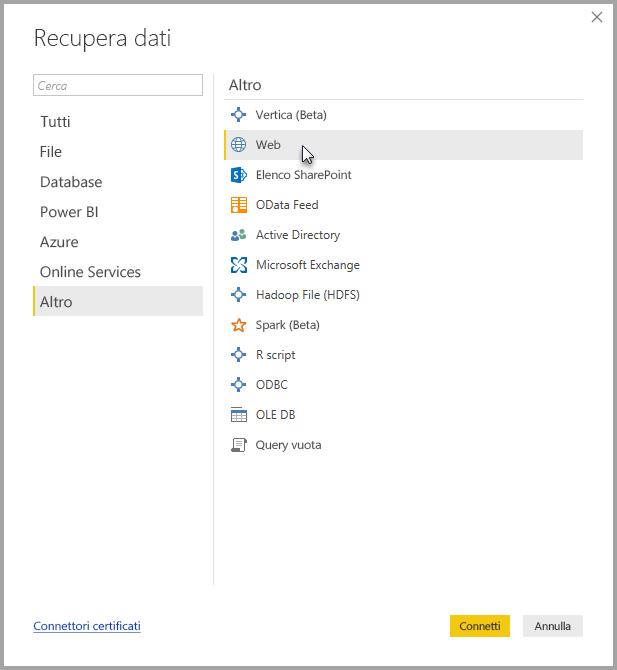
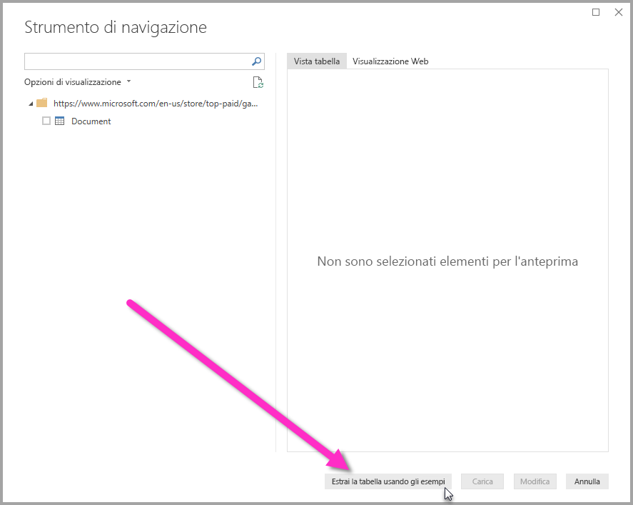
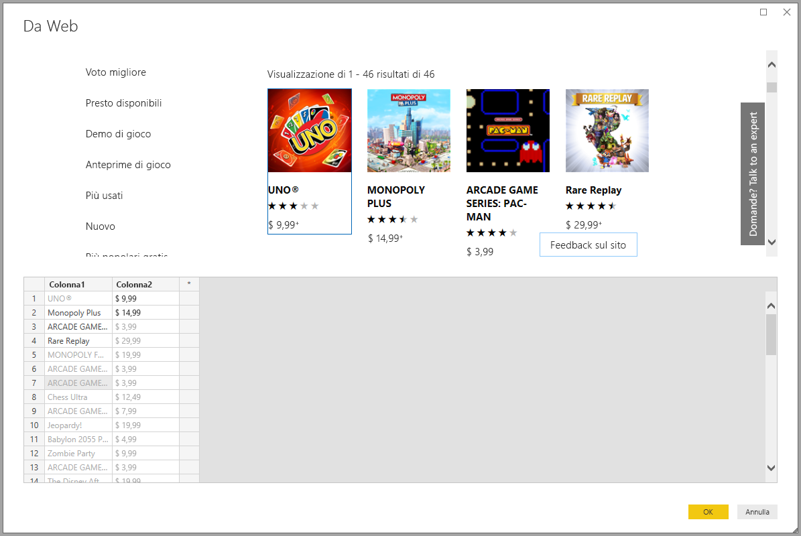
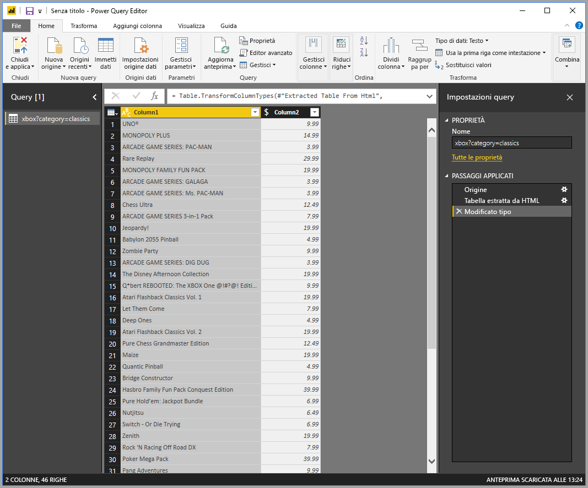

# Ottenere i dati della pagina Web offrendo esempi

L'acquisizione di dati da una pagina Web consente agli utenti di estrarre con facilità dati da pagine Web e importarli in *Power BI Desktop*. Spesso, tuttavia, i dati nelle pagine Web non sono in tabelle ordinate facili da estrarre. Il recupero di dati da tali pagine può risultare complesso, anche se i dati sono strutturati e coerenti.

Ma esiste una soluzione. Con la funzionalità per l'*acquisizione dei dati dal Web da un esempio*, è essenzialmente possibile indicare a Power BI Desktop i dati da estrarre, fornendo uno o più esempi nella finestra di dialogo del connettore. Power BI Desktop raccoglie altri dati nella pagina corrispondenti agli esempi. Con questa soluzione è possibile estrarre tutti i tipi di dati dalle pagine Web, inclusi quelli nelle tabelle *e* altri dati non presenti nelle tabelle.

I prezzi indicati nei grafici sono solo a scopo esemplificativo.

## Uso della funzionalità per l'acquisizione dei dati dal Web da un esempio

Selezionare **Recupera dati** nel menu della barra multifunzione **Home**. Nella finestra di dialogo visualizzata selezionare **Altro** dalle categorie nel riquadro sinistro e quindi selezionare **Web**. Selezionare **Connetti** per continuare.

In **Da Web** immettere l'URL della pagina Web da cui si vogliono estrarre i dati. In questo articolo verrà usata la pagina Web Microsoft Store e sarà illustrato il funzionamento di questo connettore.

Se si vuole seguire questa procedura, è possibile usare l'[URL di Microsoft Store](https://www.microsoft.com/store/top-paid/games/xbox?category=classics) usato in questo articolo:

    https://www.microsoft.com/store/top-paid/games/xbox?category=classics

Quando si sceglie **OK**, viene visualizzata la finestra di dialogo **Strumento di navigazione**, in cui sono presentate le eventuali tabelle rilevate automaticamente dalla pagina Web. Nel caso illustrato nell'immagine seguente non è stata trovata alcuna tabella. Selezionare **Aggiungi la tabella basata sugli esempi** per fornire esempi.

**Aggiungi la tabella basata sugli esempi** presenta una finestra interattiva in cui è possibile visualizzare in anteprima il contenuto della pagina Web. Immettere i valori di esempio dei dati da estrarre.

In questo esempio verranno estratti il *nome* e il *prezzo* per ognuno dei giochi presenti nella pagina. È possibile eseguire questa operazione specificando un paio di esempi dalla pagina per ogni colonna. Quando si immettono gli esempi, *Power Query* estrae i dati che corrispondono al modello di voci di esempio usando algoritmi di estrazione dei dati intelligenti.

> [!NOTE]
> i suggerimenti di valore includono solo valori minori o uguali a 128 caratteri di lunghezza.

Quando si è soddisfatti dei dati estratti dalla pagina Web, selezionare **OK** per passare all'editor di Power Query. È possibile applicare altre trasformazioni o modellare i dati, ad esempio combinandoli con altri dati o origini.

Da qui, è possibile creare oggetti visivi o usare i dati della pagina Web in modi differenti durante la creazione di report di Power BI Desktop.

## Passaggi successivi

È possibile connettersi a molti tipi di dati usando Power BI Desktop. Per altre informazioni sulle origini dati, vedere le risorse seguenti:

* [Aggiungere una colonna da un esempio in Power BI Desktop](desktop-add-column-from-example.md)
* [Connettersi a pagine Web da Power BI Desktop](desktop-connect-to-web.md)
* [Origini dati in Power BI Desktop](desktop-data-sources.md)
* [Data shaping e combinazione di dati in Power BI Desktop](desktop-shape-and-combine-data.md)
* [Connettersi a cartelle di lavoro di Excel in Power BI Desktop](desktop-connect-excel.md)
* [Connettersi a file CSV in Power BI Desktop](desktop-connect-csv.md)
* [Immettere dati direttamente in Power BI Desktop](desktop-enter-data-directly-into-desktop.md)
