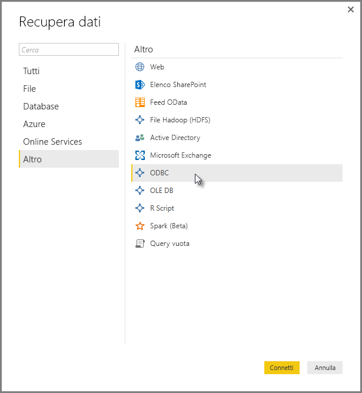
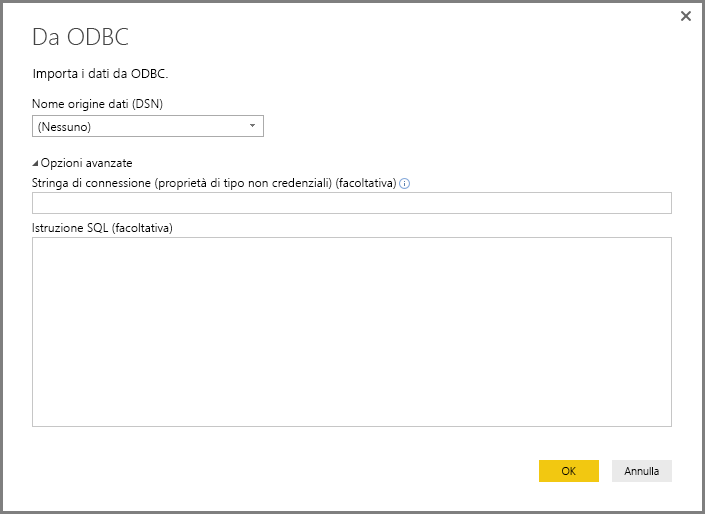
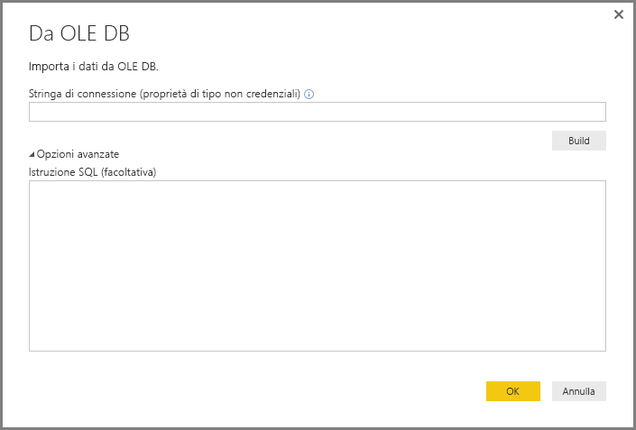
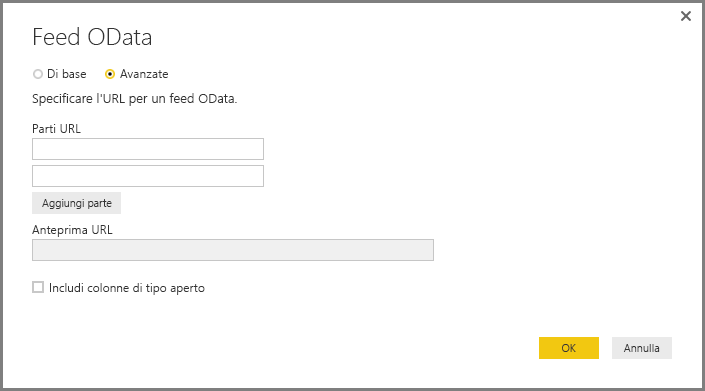
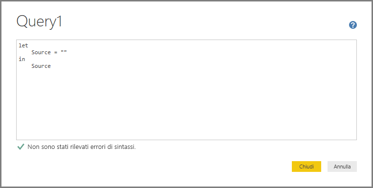
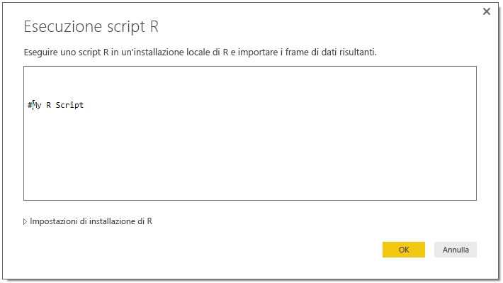

# Connettersi ai dati usando interfacce generiche in Power BI Desktop
È possibile connettersi a una vasta gamma di origini dati diverse in **Power BI Desktop** usando connettori dati incorporati che vanno dai **database di Access** alle risorse **Zendesk**, come illustrato nella finestra **Recupera dati**. Per espandere le opzioni di connessione è anche possibile connettersi a molti *altri* tipi di origini dati mediante le interfacce generiche (ad esempio **ODBC** o le **API REST**) incorporate in **Power BI Desktop**.

## Interfacce di dati di Power BI Desktop
**Power BI Desktop** include una raccolta in continua crescita di connettori di dati creati per connettersi a un'origine dati specifica. Ad esempio, durante la sequenza di connessione il connettore dati **Elenco SharePoint** fornisce campi specifici e informazioni di supporto progettati in maniera specifica per **Elenchi SharePoint**, che vale con altre origini dati disponibili nella finestra visualizzata quando si seleziona **Recupera dati > Altro...** (illustrata nella figura precedente).

**Power BI Desktop** consente anche di connettersi alle origini dati che non vengono individuate specificamente negli elenchi **Recupera dati** usando una delle interfacce dati generiche seguenti:

* **ODBC**
* **OLE DB**
* **OData**
* **API REST**
* **Script R**

Fornendo i parametri appropriati nelle finestre di connessione che queste interfacce generiche forniscono, il numero di origini dati a cui è possibile accedere e usare in **Power BI Desktop** aumenta in modo significativo.

Nelle sezioni seguenti, è possibile trovare gli elenchi delle origini dati accessibili usando le interfacce generiche.

Non è stato possibile trovare l'origine dati che si voleva usare con **Power BI Desktop**? Aggiungere l'idea all'[elenco di idee e richieste](https://ideas.powerbi.com/) di Power BI.

## Origini dati accessibili tramite ODBC
Il connettore **ODBC** in **Power BI Desktop** consente di importare i dati da qualsiasi driver ODBC di terze parti semplicemente specificando un **nome dell'origine dati (DSN)** o una *stringa di connessione*. In alternativa, è anche possibile specificare un'istruzione SQL da eseguire nel driver ODBC.

Nell'elenco seguente sono illustrati alcuni esempi di origini dati a cui **Power BI Desktop** può connettersi usando l'interfaccia **ODBC** generica.

| Connettore generico di Power BI Desktop | Origine dati esterna | Collegamento per altre informazioni |
| --- | --- | --- |
| ODBC |Cassandra |[Driver ODBC di Cassandra](http://www.simba.com/drivers/cassandra-odbc-jdbc/) |
| ODBC |DB Couchbase |[Couchbase e Power BI](https://powerbi.microsoft.com/en-us/blog/visualizing-data-from-couchbase-server-v4-using-power-bi/) |
| ODBC |DynamoDB |[Driver ODBC di DynamoDB](http://www.simba.com/drivers/dynamodb-odbc-jdbc/) |
| ODBC |Google BigQuery |[Driver ODBC di BigQuery](http://www.simba.com/drivers/bigquery-odbc-jdbc/) |
| ODBC |Hbase |[Driver ODBC di Hbase](http://www.simba.com/drivers/hbase-odbc-jdbc/) |
| ODBC |Hive |[Driver ODBC di Hive](http://www.simba.com/drivers/hive-odbc-jdbc/) |
| ODBC |IBM Netezza |[Informazioni su IBM Netezza](https://www.ibm.com/support/knowledgecenter/SSULQD_7.2.1/com.ibm.nz.datacon.doc/c_datacon_plg_overview.html) |
| ODBC |Presto |[Driver ODBC di Presto](http://www.simba.com/drivers/presto-odbc-jdbc/) |
| ODBC |Project Online |[Articolo su Project Online](desktop-project-online-connect-to-data.md) |
| ODBC |Progress OpenEdge |[Post del blog sui driver ODBC di Progress OpenEdge](https://na01.safelinks.protection.outlook.com/?url=https%3A%2F%2Fwww.progress.com%2Fblogs%2Fconnect-microsoft-power-bi-to-openedge-via-odbc-driver&data=02%7C01%7CMatt.Masson%40microsoft.com%7C5e63742e6c454308b58a08d4034b5923%7C72f988bf86f141af91ab2d7cd011db47%7C1%7C0%7C636137069555329811&sdata=gSu2Rq3vZ0uBVOgjaXxd8Y3uBf%2B8DidX6PG33jwAduY%3D&reserved=0) |

## Origini dati accessibili tramite OLE DB
Il connettore **OLE DB** in **Power BI Desktop** consente di importare i dati da qualsiasi driver OLE DB di terze parti semplicemente specificando una *stringa di connessione*. In alternativa, è anche possibile specificare un'istruzione SQL da eseguire nel driver OLE DB.

Nell'elenco seguente sono illustrati alcuni esempi di origini dati a cui **Power BI Desktop** può connettersi usando l'interfaccia **OLE DB** generica.

| Connettore generico di Power BI Desktop | Origine dati esterna | Collegamento per altre informazioni |
| --- | --- | --- |
| OLE DB |OLE DB SAS |[Provider SAS per OLE DB](https://support.sas.com/downloads/package.htm?pid=648) |
| OLE DB |OLE DB Sybase |[Provider Sybase per OLE DB](http://infocenter.sybase.com/help/index.jsp?topic=/com.sybase.infocenter.dc35888.1550/doc/html/jon1256941734395.html) |

## Origini dati accessibili tramite OData
Il connettore **OData** in **Power BI Desktop** consente di importare dati da qualsiasi URL **OData** semplicemente digitando o incollando l'URL di **OData**. È possibile aggiungere più parti di URL digitando o incollando i collegamenti nelle caselle di testo presenti nella finestra **Feed OData**.

Nell'elenco seguente sono illustrati alcuni esempi di origini dati a cui **Power BI Desktop** può connettersi usando l'interfaccia **OData** generica.

| Connettore generico di Power BI Desktop | Origine dati esterna | Collegamento per altre informazioni |
| --- | --- | --- |
| OData |Presto disponibile |Tornare a controllare regolarmente la presenza di origini dati OData |

## Origini dati accessibili tramite le API REST
È possibile connettersi alle origini dati usando le **API REST** e quindi usare i dati di qualsiasi tipo di origini dati che supportano **REST**.

Nell'elenco seguente sono illustrati alcuni esempi di origini dati a cui **Power BI Desktop** può connettersi usando l'interfaccia **API REST** generica.

| Connettore generico di Power BI Desktop | Origine dati esterna | Collegamento per altre informazioni |
| --- | --- | --- |
| API REST |DB Couchbase |[Informazioni sull'API REST di Couchbase](https://powerbi.microsoft.com/en-us/blog/visualizing-data-from-couchbase-server-v4-using-power-bi/) |

## Origini dati accessibili tramite Script R
È possibile usare **Script R** per accedere alle origini dati e usare tali dati in **Power BI Desktop**.

Nell'elenco seguente sono illustrati alcuni esempi di origini dati a cui **Power BI Desktop** può connettersi usando l'interfaccia **Script R** generica.

| Connettore generico di Power BI Desktop | Origine dati esterna | Collegamento per altre informazioni |
| --- | --- | --- |
| Script R |File SAS |[Istruzioni di Script R in CRAN](https://cran.r-project.org/doc/manuals/R-data.html) |
| Script R |File SPSS |[Istruzioni di Script R in CRAN](https://cran.r-project.org/doc/manuals/R-data.html) |
| Script R |File di statistiche R |[Istruzioni di Script R in CRAN](https://cran.r-project.org/doc/manuals/R-data.html) |

## Passaggi successivi
È possibile connettersi a molti tipi di origini dati usando **Power BI Desktop**. Per altre informazioni sulle origini dati, vedere le risorse seguenti:

* [Che cos'è Power BI Desktop?](desktop-what-is-desktop.md)
* [Origini dati in Power BI Desktop](desktop-data-sources.md)
* [Effettuare il data shaping e combinare i dati con Power BI Desktop](desktop-shape-and-combine-data.md)
* [Connettersi a cartelle di lavoro di Excel in Power BI Desktop](desktop-connect-excel.md)   
* [Immettere dati direttamente in Power BI Desktop](desktop-enter-data-directly-into-desktop.md)   

