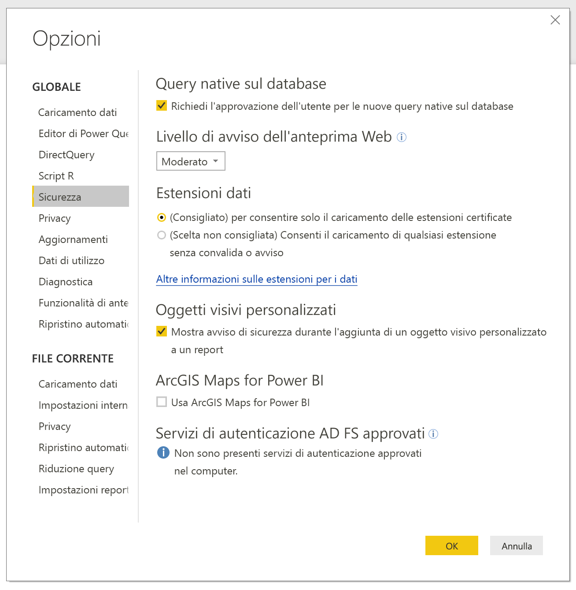
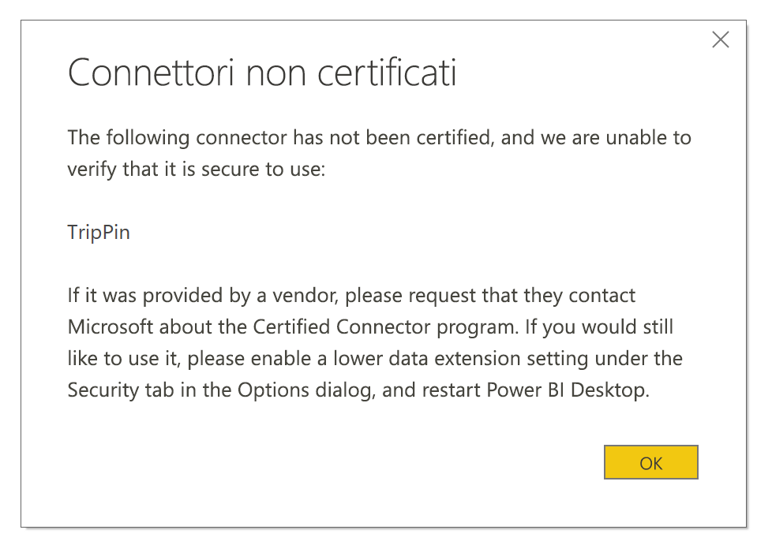

# Estendibilità dei connettori in Power BI

In Power BI i clienti e gli sviluppatori possono estendere le origini dati a cui è possibile connettersi in modi diversi, ad esempio usando i connettori esistenti e le origini dati generiche (ODBC, OData, Oledb, Web, CSV, XML, JSON). In aggiunta a queste origini dati, gli sviluppatori possono creare estensioni dati chiamate **connettori personalizzati** e certificare un connettore per renderle **connettori certificati**.

Attualmente, la possibilità di usare **connettori personalizzati** viene abilitata tramite un interruttore. Prima del passaggio di questa funzionalità dalla versione beta alla disponibilità a livello generale, è stato aggiunto un menu che consente di controllare in modo sicuro il livello del codice personalizzato di cui si vuole autorizzare l'esecuzione nel sistema: tutti i connettori personalizzati oppure solo i connettori certificati e distribuiti da Microsoft nella finestra di dialogo **Scarica i dati**.

## Connettori personalizzati

I **connettori personalizzati** possono includere un'ampia gamma di possibilità: dalle API di piccole dimensioni fondamentali per l'attività aziendale ai servizi specifici del settore di grandi dimensioni per i quali Microsoft non ha rilasciato un connettore. Molti connettori vengono distribuiti dai fornitori stessi. Se è necessario un connettore dati specifico, contattare il fornitore.

Per usare un **connettore personalizzato**, inserirlo nella cartella *\[Documenti]\\Power BI Desktop\\Connettori personalizzati* e modificare le impostazioni di sicurezza come descritto nella sezione seguente.

Non è necessario modificare le impostazioni di sicurezza per usare i **connettori certificati**.

## Sicurezza dell'estensione per i dati

Per modificare le impostazioni di sicurezza dell'estensione per i dati, in **Power BI Desktop** selezionare **File > Opzioni e impostazioni > Opzioni > Sicurezza**.

In **Estensioni dati** è possibile selezionare uno dei due livelli di sicurezza:

* (Consigliato) per consentire solo il caricamento delle estensioni certificate
* (Non consigliato) per consentire il caricamento di tutte le estensioni senza avviso

Se si prevede di usare **connettori personalizzati** o connettori sviluppati o distribuiti personalmente o da terze parti, è necessario selezionare **"(Non consigliato) per consentire il caricamento di tutte le estensioni senza avviso"**. Questa impostazione di sicurezza non è consigliabile a meno che i connettori personalizzati non siano completamente attendibili, poiché il codice presente nei connettori può gestire le credenziali (incluso l'invio su HTTP) e ignorare i livelli di privacy.

Se sono presenti connettori personalizzati nel sistema, nell'impostazione di sicurezza **"(Consigliato)"** viene visualizzato un errore che descrive i connettori che non possono essere caricati a causa delle impostazioni di sicurezza.

Per risolvere l'errore e usare i connettori, è necessario modificare le impostazioni di sicurezza impostandole su **"(Non consigliato)"** come descritto in precedenza e quindi riavviare **Power BI Desktop**.

## Connettori certificati

Sebbene un subset limitato di estensioni per i dati sia **Certificato** e questi connettori certificati siano disponibili nella finestra di dialogo **Scarica i dati**, la parte responsabile della manutenzione e del supporto rimane lo sviluppatore di terze parti che ha creato il connettore. Sebbene distribuisca questi connettori, Microsoft non è responsabile delle loro prestazioni o della loro continuità di funzionamento.

Per certificare un connettore personalizzato, è necessario che il fornitore contatti dataconnectors@microsoft.com.
