# Creare e gestire le relazioni in Power BI Desktop
Quando si importano più tabelle, è probabile che verranno eseguite analisi con i dati inclusi nelle tabelle. Le relazioni tra le tabelle sono necessarie per calcolare con precisione i risultati e visualizzare le informazioni corrette nei report. Power BI Desktop semplifica la creazione di queste relazioni. Nella maggior parte dei casi, in effetti, tutte le operazioni verranno eseguite automaticamente dalla funzionalità Rilevamento automatico. In alcuni casi, tuttavia, potrebbe essere necessario creare manualmente le relazioni oppure apportare alcune modifiche a una relazione. È quindi importante comprendere le relazioni in Power BI Desktop e capire come crearle e modificarle.

## Rilevamento automatico durante il caricamento
Se si eseguono query in due o più tabelle alla volta, Power BI Desktop tenta di trovare e creare automaticamente le relazioni quando i dati vengono caricati. Le proprietà Cardinalità, Direzione filtro incrociato e Attiva vengono impostate automaticamente. Power BI Desktop esamina i nomi di colonna nelle tabelle sottoposte a query per determinare se sono presenti potenziali relazioni. Se le relazioni sono presenti, verranno create automaticamente. Se Power BI Desktop non riesce a determinare con un livello elevato di confidenza una corrispondenza, la relazione non viene creata automaticamente. È comunque possibile usare la finestra di dialogo Gestisci relazioni per creare o modificare le relazioni.

## Creare una relazione usando il Rilevamento automatico
Nella scheda **Home** fare clic su **Gestisci relazioni** \> **Rilevamento automatico**.

## Creare manualmente una relazione
1. Nella scheda **Home** fare clic su **Gestisci relazioni** \>  **Nuovo**.
2. Nella finestra di dialogo **Crea relazione** selezionare una tabella dal primo elenco a discesa di tabelle, quindi selezionare la colonna da usare nella relazione.
3. Nel secondo elenco a discesa di tabelle selezionare l'altra tabella da inserire nella relazione, quindi selezionare la colonna da usare e infine fare clic su **OK**.

Per impostazione predefinita, Power BI Desktop configura automaticamente le proprietà Cardinalità (direzione), Direzione filtro incrociato e Attiva per la nuova relazione. È tuttavia possibile modificare le proprietà, se necessario. Per altre informazioni, vedere la sezione Informazioni sulle opzioni aggiuntive più avanti in questo articolo.

Se nessuna delle tabelle selezionate per la relazione ha valori univoci, verrà visualizzato un errore a indicare che *una delle colonne deve contenere valori univoci*. Almeno una tabella in una relazione *deve* avere un elenco distinto e unico di valori chiave. Questo è un requisito comune per tutte le tecnologie di database relazionali. 

Se viene visualizzato questo errore, è possibile risolvere il problema in due modi:

* Usare "Remove Duplicate Rows" (Rimuovi righe duplicate) per creare una colonna con valori univoci. Lo svantaggio di questo approccio è la perdita di informazioni con l'eliminazione delle righe duplicate: in molti casi una chiave (riga) è duplicata per un motivo valido.
* Aggiungere al modello una tabella intermedia con l'elenco di valori di chiave univoci, che verrà quindi collegato a entrambe le colonne originali nella relazione.

Per informazioni più dettagliate, vedere il [post di blog](https://blogs.technet.microsoft.com/cansql/2016/12/19/relationships-in-power-bi-fixing-one-of-the-columns-must-have-unique-values-error-message/).

## Modificare una relazione
1. Nella scheda **Home** fare clic su **Gestisci relazioni**.
2. Nella finestra di dialogo **Gestisci relazioni** selezionare la relazione e quindi fare clic su **Modifica**.

## Configurare opzioni aggiuntive
Quando si crea o si modifica una relazione, è possibile configurare opzioni aggiuntive. Per impostazione predefinita, le opzioni aggiuntive vengono configurate automaticamente in base a una maggiore probabilità, che può variare per ogni relazione a seconda dei dati contenuti nelle colonne.

## Cardinalità
**Molti-a-uno (\*:1)** : il tipo predefinito più comune. Significa che la colonna in una tabella può avere più istanze di un valore e l'altra tabella correlata, spesso nota come tabella di ricerca, include solo un'istanza di un valore.

**Uno-a-uno (1:1)** : la colonna in una tabella include solo un'istanza di un valore specifico e l'altra tabella correlata include solo un'istanza di un valore specifico.

**Relazioni molti-a-molti**: Con i modelli compositi è possibile stabilire relazioni molti-a-molti tra le tabelle, rimuovendo così i requisiti per i valori univoci nelle tabelle. Annulla anche le soluzioni alternative precedenti, ad esempio l'introduzione di nuove tabelle solo per stabilire relazioni. Per informazioni più dettagliate, vedere [Relazioni con cardinalità molti-a-molti](https://docs.microsoft.com/power-bi/desktop-many-to-many-relationships). 

Per informazioni dettagliate su quando modificare la cardinalità, vedere la sezione Informazioni sulle opzioni aggiuntive più avanti in questo articolo.

## Direzione filtro incrociato
**Entrambi**: ai fini dei filtri entrambe le tabelle vengono considerate come se fossero una singola tabella. **Entrambi**: funziona bene con una singola tabella che include un numero di tabelle di ricerca che la racchiudono. Un esempio è una tabella di valori effettivi delle vendite con una tabella di ricerca per reparto. Spesso si tratta di una configurazione di schema a stella (una tabella centrale con diverse tabelle di ricerca). Tuttavia, se si hanno due o più tabelle con tabelle di ricerca (con alcune in comune), è preferibile usare l'impostazione Entrambi. Per continuare l'esempio precedente, in questo caso, è anche presente una tabella delle vendite in budget che registra il budget mirato per ogni reparto. La tabella del reparto, infine, è connessa sia alla tabella vendite sia alla tabella budget. Evitare l'impostazione Entrambi per questo tipo di configurazione.

**Singola**: la direzione predefinita più comune; indica che le opzioni del filtro nelle tabelle connesse vengono applicate alla tabella in cui vengono aggregati i valori. Se si importa una tabella di Power Pivot in Excel 2013 o in un modello di dati precedente, tutte le relazioni avranno un'unica direzione. 

Per informazioni dettagliate su quando modificare la direzione del filtro incrociato, vedere la sezione Informazioni sulle opzioni aggiuntive più avanti in questo articolo.

## Imposta come relazione attiva
Se selezionata, questa opzione significa che la relazione viene usata come relazione attiva e predefinita. Nei casi in cui sono presenti più relazioni tra due tabelle, la relazione attiva permette a Power BI Desktop di creare automaticamente visualizzazioni che includono entrambe le tabelle.

Per informazioni dettagliate su quando rendere attiva una relazione specifica, vedere la sezione Informazioni sulle opzioni aggiuntive più avanti in questo articolo.

## Informazioni sulle relazioni
Dopo avere connesso due tabelle con una relazione, sarà possibile usare i dati di entrambe le tabelle come se si trattasse di una singola tabella, senza doversi preoccupare dei dettagli delle relazioni o senza dovere ridurre le due tabelle a una tabella singola prima di importarle. In molte situazioni, Power BI Desktop può creare automaticamente le relazioni, in modo che non sia neanche necessaria la creazione manuale. Tuttavia, se Power BI Desktop non riesce a determinare con un livello elevato di certezza che deve esistere una relazione tra due tabelle, la relazione non viene creata automaticamente. In questo caso, è necessario creare manualmente la relazione. 

La breve esercitazione seguente illustra il funzionamento delle relazioni in Power BI Desktop.

>[!TIP]
>È possibile completare personalmente questa lezione. Copiare la tabella ProjectHours seguente in un foglio di lavoro di Excel, selezionare tutte le celle e quindi fare clic su **INSERISCI** \> **Tabella**. Nella finestra di dialogo **Crea tabella** è sufficiente fare clic su **OK**. In **Nome tabella**digitare **ProjectHours**. Eseguire la stessa procedura per la tabella CompanyProject. Sarà quindi possibile importare i dati usando **Recupera dati** in Power BI Desktop. Selezionare la cartella di lavoro e le tabelle come origine dati.

La prima tabella, ProjectHours, è un record di ticket di lavoro che registrano il numero di ore per cui una persona ha lavorato su un progetto specifico. 

**ProjectHours**

| **Ticket** | **SubmittedBy** | **Hours** | **Project** | **DateSubmit** |
| ---:|:--- | ---:|:--- | ---:|
| 1001 |Brewer, Alan |22 |Blu |1/1/2013 |
| 1002 |Brewer, Alan |26 |Rosso |2/1/2013 |
| 1003 |Ito, Shu |34 |Giallo |12/4/2012 |
| 1004 |Brewer, Alan |13 |Arancione |1/2/2012 |
| 1005 |Bowen, Eli |29 |Purple |10/1/2013 |
| 1006 |Bento, Nuno |35 |Verde |2/1/2013 |
| 1007 |Hamilton, David |10 |Giallo |10/1/2013 |
| 1008 |Han, Mu |28 |Orange |1/2/2012 |
| 1009 |Ito, Shu |22 |Viola |2/1/2013 |
| 1010 |Bowen, Eli |28 |Verde |10/1/2013 |
| 1011 |Bowen, Eli |9 |Blu |10/15/2013 |

La seconda tabella, CompanyProject, è un elenco di progetti a cui è stata assegnata una priorità di tipo A, B o C. 

**CompanyProject**

| **ProjName** | **Priority** |
| --- | --- |
| Blu |A |
| Red |B |
| Verde |C |
| Yellow |C |
| Viola |B |
| Arancione |C |

Si noti che ogni tabella contiene una colonna del progetto. Ogni colonna ha un nome leggermente diverso, ma i valori sono simili. Si tratta di un aspetto importante, che verrà esaminato a breve.

Dopo avere importato le due tabelle in un modello, è possibile creare un report. Si vuole ottenere prima di tutto il numero di ore inviate in base alla priorità del progetto, sarà necessario selezionare **Priority** e **Hours** da Campi.

 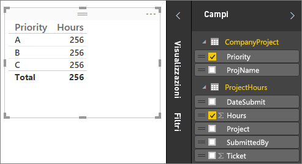

Se si esamina la tabella nell'area di disegno Report, il numero di ore visualizzato è **256,00** per ogni progetto, che corrisponde anche al totale. Evidentemente questo valore non è corretto. Questo problema dipende dal fatto che non è possibile calcolare una somma totale dei valori di una tabella (Hours nella tabella Project), suddivisi in base ai valori di un'altra tabella (Priority nella tabella CompanyProject) senza una relazione tra le due tabelle.

È quindi necessario creare una relazione tra le due tabelle.

Come si ricorderà, in entrambe le tabelle sono disponibili colonne con un nome progetto, con valori simili. Queste due colonne verranno usate per creare una relazione tra le tabelle.

Perché queste colonne? perché se si esamina la colonna Project nella tabella ProjectHours, si noteranno valori quali Blue, Red, Yellow, Orange e così via. Sono in effetti presenti alcune righe con lo stesso valore. I valori relativi ai colori per Project sono molti.

Se si esamina la colonna ProjName nella tabella CompanyProject, si noterà che è presente solo un valore per ogni colore per il progetto. Ogni valore di colore in questa tabella è univoco e questo è importante, perché è possibile creare una relazione tra queste due tabelle. In questo caso, si tratta di una relazione di tipo Molti-a-uno. In una relazione molti-a-uno è necessario che almeno una colonna in una delle tabelle contenga valori univoci. Sono disponibili opzioni aggiuntive per alcune relazioni, che verranno esaminate più avanti, ma per il momento verrà creata una relazione tra le colonne Project delle due tabelle.

### Per creare la nuova relazione
1. Fare clic su **Gestisci relazioni**.
2. In **Gestisci relazioni** fare clic su **Nuovo** per aprile la finestra di dialogo **Crea relazione**, in cui è possibile selezionare tabelle, colonne ed eventuali impostazioni aggiuntive per la relazione.
3. Nella prima tabella selezionare **ProjectHours**, quindi selezionare la colonna **Project** . Questo è il lato molti della relazione.
4. Nella seconda tabella selezionare **CompanyProject**, quindi selezionare la colonna **ProjName** . Questo è il lato uno della relazione. 
5. Fare clic su **OK** nella finestra di dialogo **Crea relazione** e nella finestra di dialogo **Gestisci relazioni** .

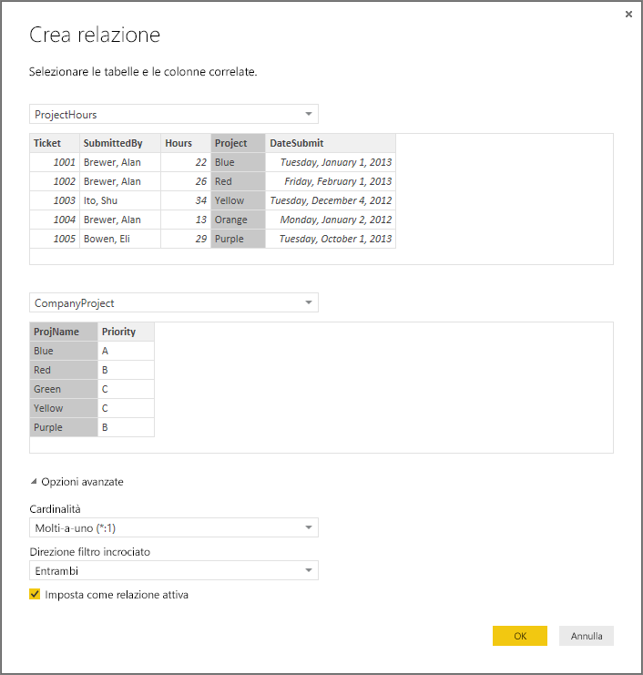

Per offrire informazioni più esaustive, la relazione è stata creata eseguendo la procedura più complicata. Sarebbe sufficiente fare clic sul pulsante Rilevamento automatico nella finestra di dialogo Gestisci relazioni. In effetti, il Rilevamento automatico potrebbe averlo già fatto automaticamente quando sono stati caricati i dati se entrambe le colonne avessero avuto lo stesso nome. È comunque utile conoscere la procedura manuale.

È ora possibile esaminare di nuovo la tabella nell'area di disegno Report.

 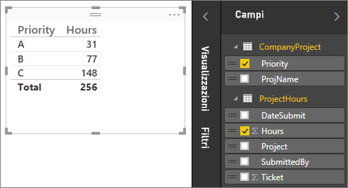

Ha un aspetto decisamente migliore.

Quando si sommano le ore in base a Priority, Power BI Desktop cerca ogni istanza dei valori di colore univoci nella tabella di ricerca CompanyProject, quindi cerca ogni istanza di tali valori nella tabella CompanyProject e calcola una somma totale per ogni valore univoco.

È stato semplice e con il Rilevamento automatico potrebbe essere persino meno complicato.

## Informazioni sulle opzioni aggiuntive
Quando viene creata una relazione, con il Rilevamento automatico o manualmente, Power BI Desktop configura automaticamente opzioni aggiuntive in base ai dati disponibili nelle tabelle. È possibile configurare queste proprietà aggiuntive per la relazione, disponibili nella parte inferiore della finestra di dialogo Crea/Modifica relazione.

 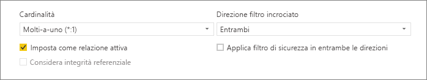

Come indicato, queste opzioni vengono in genere impostate automaticamente e non sarà necessario modificarle. In alcuni casi, tuttavia, potrebbe essere necessario configurare manualmente queste opzioni.

## Aggiornamenti automatici delle relazioni

È possibile gestire il modo in cui Power BI gestisce e automaticamente adatta le relazioni nei report e nei modelli. Per specificare il modo in cui Power BI gestisce le opzioni delle relazioni, selezionare **File > Opzioni e impostazioni > Opzioni** da Power BI Desktop, quindi selezionare **Caricamento dati** nel riquadro sinistro. Verranno quindi visualizzate le opzioni per **Relazioni**.

 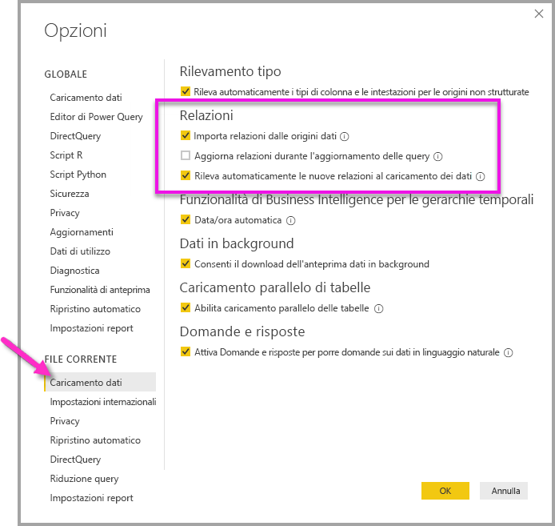

È possibile selezionare e abilitare tre opzioni. 

La prima opzione è *Importa relazioni dalle origini dati* ed è selezionata per impostazione predefinita. Quando questa opzione è selezionata, Power BI controlla la presenza di relazioni definite nell'origine dati, ad esempio relazioni di chiave esterna/chiave primaria nel data warehouse. Se tali relazioni sono presenti, viene eseguito il mirroring nel modello di dati Power BI quando si caricano inizialmente i dati. Questa opzione consente di iniziare rapidamente a usare il modello, anziché dover trovare o definire tali relazioni manualmente.

La seconda opzione è *Aggiorna o elimina le relazioni durante l'aggiornamento dei dati* ed è disabilitata per impostazione predefinita. Se questa opzione è selezionata (viene abilitata selezionando la casella accanto all'opzione), Power BI controlla la presenza di modifiche apportate alle relazioni dell'origine dati quando il set di dati viene aggiornato. Se tali relazioni sono state modificate o vengono rimosse, Power BI esegue il mirroring di tali modifiche nel modello di dati, aggiornandole o modificandole affinché siano corrispondenti.

> [!WARNING]
> Se si usa la sicurezza a livello di riga che si basa sulle relazioni definite, non è consigliabile selezionare la seconda opzione *Aggiorna o elimina le relazioni durante l'aggiornamento dei dati*. Se viene rimossa una relazione su cui si basano le impostazioni di sicurezza a livello di riga, il modello potrebbe diventare meno sicuro. 

La terza opzione è *Rileva automaticamente le nuove relazioni al caricamento dei dati*. Viene descritta nella sezione [Rilevamento automatico durante il caricamento](#autodetect-during-load) riportata in precedenza in questo articolo. 

## Gli aggiornamenti futuri ai dati richiedono una cardinalità diversa
In genere, Power BI Desktop riesce a determinare automaticamente la cardinalità migliore per la relazione. Se è necessario eseguire l'override delle impostazioni automatiche, perché si prevede che i dati cambieranno in futuro, è possibile selezionarli nel controllo Cardinalità. L'esempio seguente illustra una situazione in cui è necessario selezionare una cardinalità diversa.

La tabella CompanyProjectPriority seguente è un elenco di tutti i progetti aziendali e delle rispettive priorità. La tabella ProjectBudget è l'insieme di progetti per cui è stato approvato il budget.

**ProjectBudget**

| **Approved Projects** | **BudgetAllocation** | **AllocationDate** |
|:--- | ---:| ---:|
| Blu |40,000 |12/1/2012 |
| Rosso |100,000 |12/1/2012 |
| Green |50.000 |12/1/2012 |

**CompanyProjectPriority**

| **Project** | **Priority** |
| --- | --- |
| Blu |A |
| Red |B |
| Verde |C |
| Yellow |C |
| Viola |B |
| Arancione |C |

Se si crea una relazione tra la colonna Project nella tabella CompanyProjectPriority e la colonna ApprovedProjects nella tabella ProjectBudget, come indicato di seguito:

 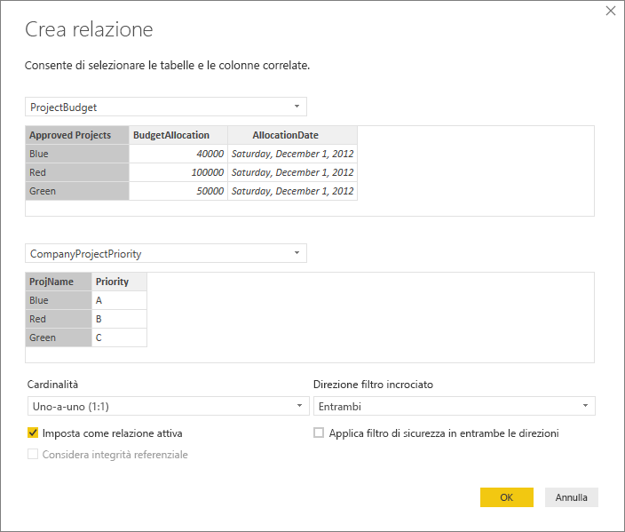

La cardinalità è impostata automaticamente su Uno-a-uno (1:1) e il filtro incrociato su Entrambi (come illustrato). Ciò dipende dal fatto che per Power BI Desktop la combinazione migliore delle due tabelle ha un aspetto analogo al seguente:

| **Project** | **Priority** | **BudgetAllocation** | **AllocationDate** |
|:--- | --- | ---:| ---:|
| Blue |A |40,000 |12/1/2012 |
| Rosso |B |100.000 |12/1/2012 |
| Verde |C |50,000 |12/1/2012 |
| Giallo |C |  |  |
| Viola |B |  |  |
| Arancione |C |  |  |

Esiste una relazione uno-a-uno tra le due tabelle, perché la colonna Project della tabella combinata non include valori ripetuti. La colonna Project è univoca, perché ogni valore è presente solo una volta, quindi le righe delle due tabelle possono essere combinate direttamente senza duplicazioni.

Si supponga tuttavia che siano previste modifiche ai dati al successivo aggiornamento. Una versione aggiornata della tabella ProjectBudget include ora righe aggiuntive per Blue e Red:

**ProjectBudget**

| **Approved Projects** | **BudgetAllocation** | **AllocationDate** |
| --- | ---:| ---:|
| Blu |40,000 |12/1/2012 |
| Rosso |100,000 |12/1/2012 |
| Green |50.000 |12/1/2012 |
| Blu |80,000 |6/1/2013 |
| Rosso |90,000 |6/1/2013 |

 Ciò significa che la combinazione migliore delle due tabelle ha ora un aspetto analogo al seguente: 

| **Project** | **Priority** | **BudgetAllocation** | **AllocationDate** |
| --- | --- | ---:| ---:|
| Blue |A |40,000 |12/1/2012 |
| Rosso |B |100.000 |12/1/2012 |
| Verde |C |50,000 |12/1/2012 |
| Giallo |C |  |  |
| Viola |B |  |  |
| Arancione |C |  |  |
| Blu |A |80000 |6/1/2013 |
| Rosso |B |90000 |6/1/2013 |

In questa nuova tabella combinata, la colonna Project include valori ripetuti. Le due tabelle originali non avranno una relazione uno-a-uno dopo l'aggiornamento della tabella. In questo caso, dal momento che si sa che dopo gli aggiornamenti futuri nella colonna Project saranno presenti duplicati, sarà necessario impostare il valore di Cardinalità su Molti-a-uno (\*:1), con Molti sul lato ProjectBudget e Uno sul lato CompanyProjectPriority.

## Modifica della direzione del filtro incrociato per un set complesso di tabelle e relazioni
Per la maggior parte delle relazioni, la direzione filtro incrociato è impostata su 'Entrambi'. In alcune circostanze non comuni, tuttavia, potrebbe essere necessario impostare un valore diverso da quello predefinito, ad esempio se si importa un modello da una versione precedente di Power Pivot, in cui ogni relazione è impostata su una direzione singola. 

L'impostazione Entrambi permette a Power BI Desktop di considerare tutti gli aspetti delle tabelle connesse come se fossero una tabella singola. In alcune situazioni, tuttavia Power BI Desktop non può impostare la direzione filtro incrociato di una relazione su "Entrambi", mantenendo al tempo stesso un set non ambiguo di valori predefiniti disponibile per finalità di reporting. Se una direzione filtro incrociato della relazione non è impostata su Entrambi, ciò dipende in genere dal fatto che creerebbe ambiguità. Se l'impostazione predefinita per il filtro incrociato non è adatta alle proprie esigenze, provare a impostarla in modo che sia verso una tabella specifica o che sia di tipo Entrambi.

Il filtro incrociato a direzione singola è adatto a molte situazioni. Se è stato importato un modello da Power Pivot a Excel 2013 o versioni precedenti, tutte le relazioni verranno impostate sulla direzione singola. Per direzione singola si intende che le opzioni del filtro nelle tabelle connesse vengono applicate alla tabella in cui viene eseguita l'aggregazione. In alcuni casi la comprensione del filtro incrociato può risultare complessa, quindi può essere utile esaminare un esempio.

 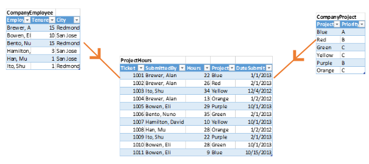

Con il filtro incrociato a direzione singola, se si crea un report che riepiloga le ore del progetto, è quindi possibile scegliere di riepilogare o filtrare in base a CompanyProject, Priority o CompanyEmployee, City. Se tuttavia si vuole contare il numero di dipendenti per ogni progetto (una domanda meno comune), il filtro non funzionerà. Verrà visualizzata una colonna di valori tutti uguali. Nell'esempio seguente la direzione del filtro incrociato di entrambe le relazioni è impostata su direzione singola, ovvero verso la tabella ProjectHours:

 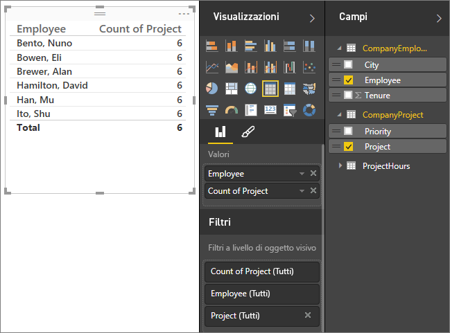

La specifica del filtro procederà da CompanyProject a CompanyEmployee, come illustrato nella figura seguente, ma senza raggiungere CompanyEmployee. Se tuttavia si imposta la direzione del filtro incrociato su Entrambi, il filtro funzionerà correttamente. L'impostazione Entrambi permette alla specifica del filtro di raggiungere Employee.

 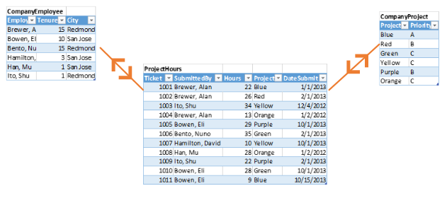

Se la direzione del filtro incrociato è impostata su Entrambi, il report avrà l'aspetto corretto:

 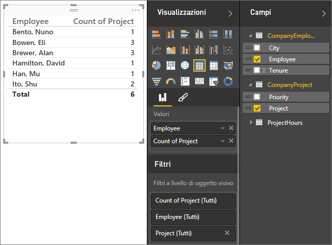

L'applicazione del filtro a entrambe le direzioni è ottimale per un criterio di relazioni di tabella analogo a quello riportato in precedenza. Questo schema viene in genere definito a stella e ha un aspetto analogo al seguente:

 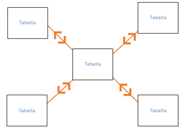

L'applicazione della direzione per il filtro incrociato non funziona in modo ottimale con un criterio più generale spesso presente nei database, come illustrato nel diagramma seguente:

 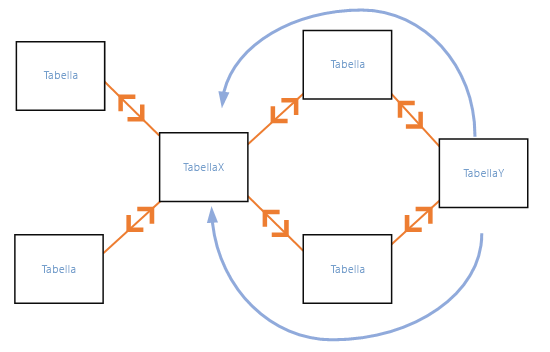

Se il criterio di tabelle disponibile è analogo al seguente, ovvero include cicli, il filtro incrociato può creare un set ambiguo di relazioni. Ad esempio, se si somma un campo da TableX e quindi si sceglie di filtrare in base a un campo in TableY, non sarà possibile determinare chiaramente la direzione del filtro, ovvero attraverso la tabella in alto o la tabella in basso. Un esempio comune di questo tipo di modello è con TableX come tabella delle vendite con i dati effettivi e TableY come tabella contenente i dati di budget. Quindi, le tabelle nel centro sono tabelle di ricerca usate da entrambe le tabelle, ad esempio Divisione o Regione. 

Analogamente alle relazioni attive/inattive, Power BI Desktop non consentirà l'impostazione di una relazione come Entrambi se ciò comporterà la creazione di ambiguità nei report. È possibile risolvere questo problema in molti modi. Di seguito sono illustrati i due modi più comuni:

* Eliminare o contrassegnare le relazioni come inattive per ridurre l'ambiguità. Potrebbe essere quindi possibile impostare su Entrambi un filtro incrociato per le relazioni.
* Importare una tabella due volte (la seconda volta con un nome diverso), per eliminare i cicli. Il criterio della relazione sarà quindi simile a uno schema a stella. Lo schema a stella permette di impostare tutte le relazioni su Entrambi.

## Relazione attiva non valida
Quando Power BI Desktop crea automaticamente le relazioni, in alcuni casi rileva più di una relazione tra due tabelle. In questo caso, solo una delle relazioni viene impostata come attiva. La relazione attiva viene usata come relazione predefinita, in modo che Power BI Desktop possa creare automaticamente una visualizzazione quando si scelgono campi da due diverse tabelle. È tuttavia possibile che in alcuni casi la relazione selezionata automaticamente non sia valida. È possibile usare la finestra di dialogo Gestisci relazioni per impostare una relazione come attiva o inattiva oppure è possibile impostare la relazione attiva nella finestra di dialogo Modifica relazione. 

Per assicurare che sia disponibile una relazione predefinita, Power BI Desktop consente solo una singola relazione attiva tra due tabelle in un determinato momento. È quindi necessario impostare prima di tutto la relazione corrente come inattiva e in seguito impostare la relazione che deve essere attiva.

Esaminiamo un esempio. La prima tabella è ProjectTickets e la seconda tabella è EmployeeRole.

**ProjectTickets**

| **Ticket** | **OpenedBy** | **SubmittedBy** | **Hours** | **Project** | **DateSubmit** |
| ---:|:--- |:--- | ---:|:--- | ---:|
| 1001 |Perham, Tom |Brewer, Alan |22 |Blu |1/1/2013 |
| 1002 |Roman, Daniel |Brewer, Alan |26 |Rosso |2/1/2013 |
| 1003 |Roth, Daniel |Ito, Shu |34 |Giallo |12/4/2012 |
| 1004 |Perham, Tom |Brewer, Alan |13 |Arancione |1/2/2012 |
| 1005 |Roman, Daniel |Bowen, Eli |29 |Purple |10/1/2013 |
| 1006 |Roth, Daniel |Bento, Nuno |35 |Verde |2/1/2013 |
| 1007 |Roth, Daniel |Hamilton, David |10 |Giallo |10/1/2013 |
| 1008 |Perham, Tom |Han, Mu |28 |Orange |1/2/2012 |
| 1009 |Roman, Daniel |Ito, Shu |22 |Viola |2/1/2013 |
| 1010 |Roth, Daniel |Bowen, Eli |28 |Verde |10/1/2013 |
| 1011 |Perham, Tom |Bowen, Eli |9 |Blu |10/15/2013 |

**EmployeeRole**

| **Employee** | **Role** |
| --- | --- |
| Bento, Nuno |Project Manager |
| Bowen, Eli |Project Lead |
| Brewer, Alan |Project Manager |
| Hamilton, David |Project Lead |
| Han, Mu |Project Lead |
| Ito, Shu |Project Lead |
| Perham, Tom |Project Sponsor |
| Roman, Daniel |Project Sponsor |
| Roth, Daniel |Project Sponsor |

Sono effettivamente presenti due relazioni, una tra SubmittedBy nella tabella ProjectTickets ed Employee nella tabella EmployeeRole e l'altra tra OpenedBy nella tabella ProjectTickets ed Employee nella tabella EmployeeRole.

 

Se si aggiungono entrambe le relazioni al modello (prima di tutto OpenedBy), nella finestra di dialogo Gestisci relazioni si potrà notare che OpenedBy è attiva:

 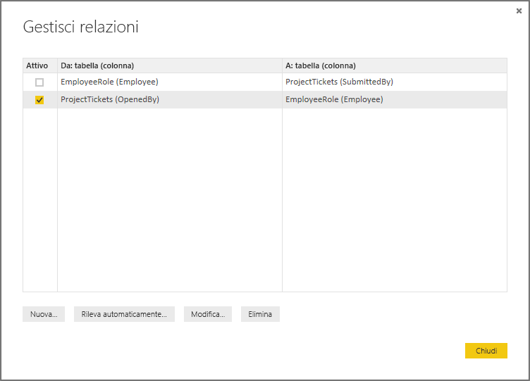

Se ora si crea un report che usa i campi Role ed Employee da EmployeeRole e il campo Hours da ProjectTickets in una visualizzazione tabella nell'area di disegno Report, verranno visualizzati solo gli sponsor del progetto, perché sono gli unici ad avere aperto un ticket di progetto.

 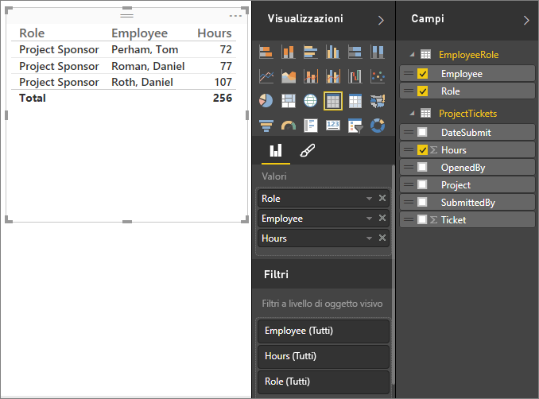

È possibile modificare la relazione attiva e impostarla su SubmittedBy invece di OpenedBy. In Gestisci relazioni deselezionare la relazione tra ProjectTickets(OpenedBy) ed EmployeeRole(Employee) e quindi selezionare la relazione tra Project Tickets(SubmittedBy) ed EmployeeRole(Employee).

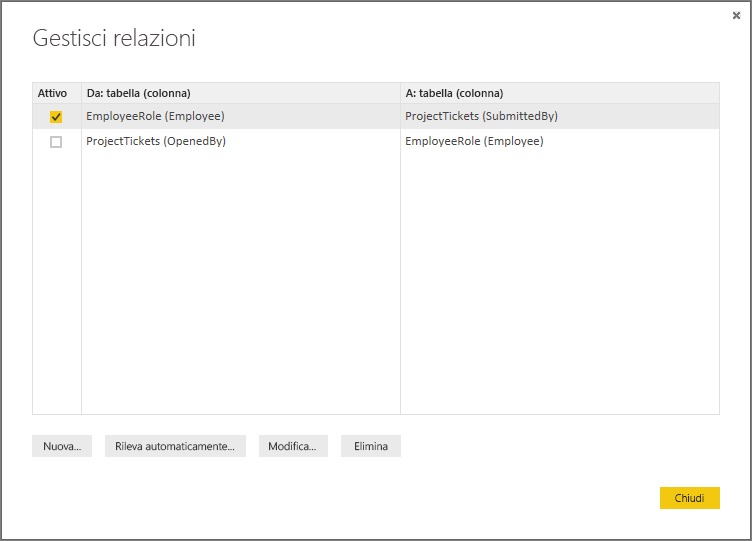

## Visualizzare tutte le relazioni in Visualizzazione relazioni
Talvolta il modello ha più tabelle e relazioni complesse tra di esse. Visualizzazione relazioni in Power BI Desktop mostra tutte le relazioni nel modello, la loro direzione e la cardinalità in un diagramma personalizzabile e facile da comprendere. Per altre informazioni, vedere [Visualizzazione delle relazioni in Power BI Desktop](desktop-relationship-view.md).

