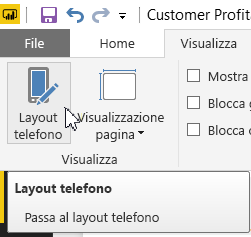
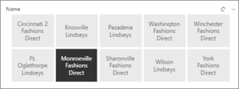
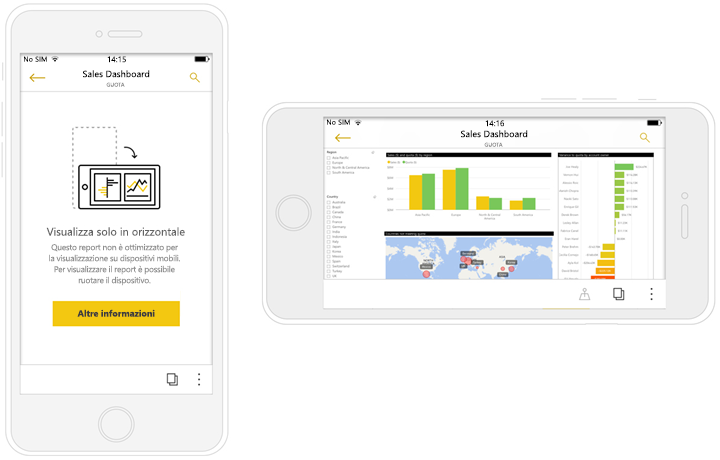

# Ottimizzare i report di Power BI per l'app per dispositivi mobili
È possibile migliorare l'esperienza di visualizzazione dei report nelle app per dispositivi mobili creando un layout verticale. In Power BI Desktop e nel servizio Power BI è possibile riorganizzare e ridimensionare gli oggetti visivi del report per un'esperienza ottimale in modalità verticale.  

Per informazioni sulla visualizzazione dei report in un dispositivo mobile, vedere la guida introduttiva [Esplorare dashboard e report nelle app Power BI per dispositivi mobili](consumer/mobile/mobile-apps-quickstart-view-dashboard-report.md).

È possibile creare [oggetti visivi reattivi](#optimize-a-visual-for-any-size) e [filtri dei dati reattivi](#enhance-slicers-to-work-well-in-phone-reports) che si ridimensionano ovunque siano visualizzati. Se si aggiungono filtri al report, tali filtri vengono visualizzati automaticamente nel report ottimizzato.

## Layout di una versione verticale di una pagina del report

Dopo aver creato un report, è possibile ottimizzarlo per telefoni e tablet.

1. Nella scheda **Visualizzazione** della visualizzazione **Report** in Power BI selezionare **Layout Telefono**.  
   
    
   
    Nel servizio Power BI selezionare **Modifica report** > **Layout dispositivo mobile**.

    Viene visualizzata un'area di disegno vuota a forma di telefono. Tutti gli oggetti visivi nella pagina del report originale sono elencati nel riquadro **Visualizzazioni** a destra.

1. Per aggiungere un oggetto visivo al layout telefono, trascinarlo dal riquadro **Visualizzazioni** all'area di disegno del telefono.
   
    I report per il telefono usano un layout di griglia. Gli oggetti visivi trascinati sull'area di disegno verranno bloccati sulla griglia.
   
    
   
    È possibile aggiungere alcuni o tutti gli oggetti visivi della pagina del report master alla pagina del report per il telefono. È possibile aggiungere ogni oggetto visivo solo una volta e non è necessario includere tutti gli oggetti visivi.

1. È possibile ridimensionare gli oggetti visivi nella griglia come si farebbe per i riquadri nei dashboard e nei dashboard mobili.
   
   La griglia del report per il telefono viene ridimensionata per telefoni di dimensioni differenti, quindi il report avrà un aspetto efficace sia nei telefoni con schermo piccolo che su quelli con schermo grande.
   
   

## Ottimizzare un oggetto visivo per qualsiasi dimensione
È possibile impostare gli oggetti visivi nel dashboard o report in modo che siano *reattivi*. Gli oggetti visivi cambiano in modo dinamico per visualizzare la quantità massima di dati e informazioni dettagliate, indipendentemente dalle dimensioni dello schermo. 

Se cambiano le dimensioni di un oggetto visivo, Power BI dà la priorità alla visualizzazione dati. Ad esempio, è possibile rimuovere il riempimento e spostare la legenda nella parte superiore dell'oggetto visivo automaticamente, in modo che l'oggetto visivo rimanga informativo anche con dimensioni ridotte.

È possibile scegliere se attivare la reattività per ogni oggetto visivo. Altre informazioni sull'[ottimizzazione degli oggetti visivi](visuals/desktop-create-responsive-visuals.md).

## Considerazioni sulla creazione dei layout del report per il telefono
* Per i report con più pagine, è possibile ottimizzare solo alcune o tutte le pagine. 
* Se è stato definito un colore di sfondo per una pagina del report, il report per il telefono avrà lo stesso colore di sfondo.
* È possibile modificare le impostazioni di formattazione solo per il telefono. La formattazione è coerente tra layout master e per dispositivi mobili. Ad esempio, le dimensioni dei caratteri saranno le stesse.
* Per modificare un oggetto visivo, ad esempio modificarne la formattazione, il set di dati, i filtri o qualsiasi altro attributo, tornare alla modalità di creazione dei report regolare.
* Per impostazione predefinita, Power BI fornisce titoli e nomi di pagina per i report per il telefono nell'app per dispositivi mobili. Se sono stati creati oggetti visivi di testo per i titoli e i nomi di pagina nel report, è consigliabile non aggiungerli ai report per il telefono.     

## Rimuovere un oggetto visivo dal layout telefono
* Per rimuovere un oggetto visivo, selezionare la **X** in alto a destra dell'oggetto visivo nell'area di disegno del telefono o selezionare l'oggetto visivo e premere **Elimina**.
  
   La rimozione dell'oggetto visivo da questa posizione consente di rimuoverlo solo dall'area di disegno del layout telefono. L'oggetto visivo e il report originale non subiscono alcuna modifica.
  
   

## Migliorare i filtri dei dati per un funzionamento corretto nei report per il telefono
I filtri dei dati possono essere applicati nell'area di disegno dei dati del report. Quando si progettano i filtri dei dati nella normale modalità di creazione dei report, è possibile modificare alcune impostazioni di filtro dei dati per renderle più facilmente utilizzabili nei report per il telefono:

* Decidere se i lettori del report possono selezionare uno o più elementi.
* Inserire una casella intorno al filtro dei dati per rendere più semplice analizzare il report.
* Rendere il filtro dei dati verticale, orizzontale o *reattivo*. 

Se si imposta il filtro dei dati come reattivo, variando le dimensioni e la forma visualizza più o meno opzioni. Può essere alto, basso, largo o stretto. Se lo si imposta molto piccolo, diventa un'icona di filtro nella pagina del report. 

Altre informazioni sulla [creazione di filtri dei dati reattivi](power-bi-slicer-filter-responsive.md).

## Pubblicare un report per il telefono
Per pubblicare la versione di un report per il telefono, [pubblicare il report principale da Power BI Desktop per il servizio Power BI](desktop-upload-desktop-files.md) in modo da pubblicare contemporaneamente la versione per il telefono.
  
Altre informazioni su [condivisione e autorizzazioni in Power BI](service-how-to-collaborate-distribute-dashboards-reports.md).

## Visualizzare report ottimizzati e non ottimizzati su un telefono o un tablet
Nelle app per dispositivi mobili, Power BI rileva automaticamente i report per il telefono ottimizzati e non ottimizzati. Se esiste un report con ottimizzazione per il telefono, l'app per telefoni di Power BI apre automaticamente il report in modalità report per il telefono.

Se non esiste un report con ottimizzazione per il telefono, il report viene aperto in visualizzazione orizzontale non ottimizzata.  

All'interno di un report per il telefono, la modifica dell'orientamento del telefono da verticale a orizzontale apre il report nella visualizzazione non ottimizzata con il layout originale del report, indipendentemente dal fatto che il report sia ottimizzato o no.

Se si ottimizzano solo alcune pagine, in modalità verticale i lettori visualizzano un messaggio che indica che il report è disponibile in modalità orizzontale.

I lettori del report possono ruotare lateralmente il telefono o il tablet per visualizzare la pagina in modalità orizzontale. Altre informazioni su come [interagire con i report di Power BI ottimizzati per il layout verticale](consumer/mobile/mobile-apps-view-phone-report.md).

## Passaggi successivi
* [Creare una visualizzazione telefono di un dashboard in Power BI](service-create-dashboard-mobile-phone-view.md).
* [Visualizzare i report di Power BI ottimizzati per il proprio telefono](consumer/mobile/mobile-apps-view-phone-report.md).
* [Creare oggetti visivi reattivi ottimizzati per qualsiasi dimensione](visuals/desktop-create-responsive-visuals.md).
* Altre domande? [Provare a rivolgersi alla community di Power BI](https://community.powerbi.com/).

