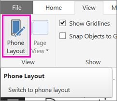

# Creare report ottimizzati per le app per telefoni di Power BI
Quando si [crea un report in Power BI Desktop](desktop-report-view.md), è possibile migliorare l'esperienza d'uso nelle app per dispositivi mobili sui telefoni cellulari creando una versione del report specifica per il telefono. Per adattare il report al telefono e creare un'esperienza ottimale, è sufficiente ridisporre e ridimensionare gli oggetti visivi, magari non includendoli tutti. È anche possibile creare [*oggetti visivi* reattivi](#optimize-a-visual-for-any-size) e [filtri dei dati reattivi](#enhance-slicers-to-to-work-well-in-phone-reports) che si ridimensionano in modo ottimale per la visualizzazione da un telefono. Inoltre, se si aggiungono filtri a un report, tali filtri vengono visualizzati automaticamente nel report per il telefono. I lettori del report possano visualizzarli e filtrare il report con essi.

## Disporre una pagina del report per il telefono in Power BI Desktop
Dopo aver [creato un report in Power BI Desktop](desktop-report-view.md), è possibile ottimizzare per i telefoni.

1. In Power BI Desktop, selezionare **Visualizzazione Report** nella barra di spostamento a sinistra.
   
    
2. Nella scheda **Visualizza** selezionare **Layout Telefono**.  
   
    
   
    Verrà visualizzata un'area di disegno del telefono vuota. Tutti gli oggetti visivi nella pagina del report originale sono elencati nel riquadro Visualizzazioni a destra.
3. Per aggiungere un oggetto visivo al layout telefono, trascinarlo dal riquadro Visualizzazioni all'area di disegno del telefono.
   
    I report per il telefono usano un layout di griglia. Gli oggetti visivi trascinati sull'area di disegno verranno bloccati sulla griglia.
   
    
   
    È possibile aggiungere alcuni o tutti gli oggetti visivi della pagina del report master alla pagina del report per il telefono. È possibile aggiungere ogni oggetto visivo solo una volta.
4. È possibile ridimensionare gli oggetti visivi nella griglia come si farebbe per i riquadri nei dashboard e nei dashboard mobili.
   
   > [!NOTE]
   > La griglia del report per il telefono viene scalata su telefoni di dimensioni differenti, quindi il report avrà un aspetto coerente sui telefoni con schermo sia grande che piccolo.
   > 
   > 
   
   

## Ottimizzare un oggetto visivo per qualsiasi dimensione
È possibile configurare gli oggetti visivi nel dashboard o nel report in modo che siano *reattivi*, ovvero in modo che vengano modificati dinamicamente per visualizzare la quantità massima di dati e informazioni dettagliate, indipendentemente dalle dimensioni dello schermo. 

Quando le dimensioni di un oggetto visivo subiscono modifiche, Power BI classifica in ordine di priorità la visualizzazione dei dati, ad esempio rimuovendo la spaziatura interna e spostando automaticamente la legenda sopra l'oggetto visivo, in modo che l'oggetto visivo rimanga informativo anche con dimensioni ridotte.

È possibile scegliere se attivare la reattività per ogni oggetto visivo. Altre informazioni sull'[ottimizzazione degli oggetti visivi](desktop-create-responsive-visuals.md).

## Considerazioni sulla creazione dei layout del report per il telefono
* Per i report con più pagine, è possibile ottimizzare solo alcune o tutte le pagine. 
* Se è stato definito un colore di sfondo per una pagina del report, il report per il telefono avrà lo stesso colore di sfondo.
* È possibile modificare le impostazioni di formattazione solo per il telefono. La formattazione è coerente tra layout master e per dispositivi mobili. Ad esempio, le dimensioni dei caratteri saranno le stesse.
* Per modificare un oggetto visivo, ad esempio modificarne la formattazione, il set di dati, i filtri o qualsiasi altro attributo, tornare alla modalità di creazione dei report regolare.
* Per impostazione predefinita, Power BI fornisce titoli e nomi di pagina per i report per il telefono nell'app per dispositivi mobili. Se sono stati creati oggetti visivi di testo per i titoli e i nomi di pagina nel report, è consigliabile non aggiungerli ai report per il telefono.     

## Rimuovere un oggetto visivo dal layout telefono
* Per rimuovere un oggetto visivo, fare clic sulla X in alto a destra dell'oggetto visivo nell'area di lavoro del telefono o selezionarlo e premere **Elimina**.
  
   La rimozione dell'oggetto visivo in questa posizione consente di rimuoverlo solo dall'area di disegno del layout telefono. L'oggetto visivo e il report originale non subiscono alcuna modifica.
  
   

## Migliorare i filtri dei dati per il miglior funzionamento nei report per il telefono
I filtri dei dati possono essere applicati nell'area di disegno dei dati del report. Quando si progettano i filtri dei dati nella normale modalità di creazione dei report, è possibile modificare alcune impostazioni di filtro dei dati per renderle più facilmente utilizzabili nei report per il telefono:

* Decidere se i lettori del report possono selezionare uno o più elementi.
* Inserire una casella intorno al filtro dei dati per rendere più semplice analizzare il report.
* Rendere il filtro dei dati verticale, orizzontale o *reattivo*. 

Se si imposta il filtro dei dati come reattivo, variando le dimensioni e la forma visualizza più o meno opzioni. Può essere alto, basso, largo o stretto. Se lo si imposta molto piccolo, diventa un'icona di filtro nella pagina del report. 

Altre informazioni sulla [creazione di filtri dei dati reattivi](power-bi-slicer-filter-responsive.md).

## Pubblicare un report per il telefono
* Per pubblicare la versione di un report per il telefono, [pubblicare il report principale da Power BI Desktop per il servizio Power BI](desktop-upload-desktop-files.md) in modo da pubblicare contemporaneamente la versione per il telefono.
  
    Altre informazioni su [condivisione e autorizzazioni in Power BI](service-how-to-collaborate-distribute-dashboards-reports.md).

## Visualizzare report ottimizzati e non ottimizzati su un telefono
Nelle app per dispositivi mobili, Power BI rileva automaticamente i report per il telefono ottimizzati e non ottimizzati. Se esiste un report con ottimizzazione per il telefono, l'app per telefoni di Power BI apre automaticamente il report in modalità report per il telefono.

Se non esiste un report con ottimizzazione per il telefono, il report viene aperto in visualizzazione orizzontale non ottimizzata.  

All'interno di un report per il telefono, la modifica dell'orientamento del telefono da verticale a orizzontale aprirà il report nella visualizzazione non ottimizzata con il layout originale del report, indipendentemente dal fatto che il report sia ottimizzato o no.

Se si ottimizzano solo alcune pagine, i lettori vedranno un messaggio in modalità verticale, che indica che il report è disponibile in modalità orizzontale.

I lettori del report possono ruotare lateralmente il telefono per visualizzare la pagina in modalità orizzontale. Altre informazioni su come [interagire con i report di Power BI ottimizzati per il proprio telefono](mobile-apps-view-phone-report.md).

## Passaggi successivi
* [Creare una visualizzazione telefono di un dashboard in Power BI](service-create-dashboard-mobile-phone-view.md)
* [Visualizzare i report di Power BI ottimizzati per il proprio telefono](mobile-apps-view-phone-report.md)
* [Creare oggetti visivi reattivi ottimizzati per qualsiasi dimensione](desktop-create-responsive-visuals.md)
* Altre domande? [Provare a rivolgersi alla community di Power BI](http://community.powerbi.com/)

