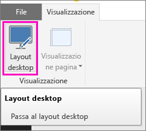
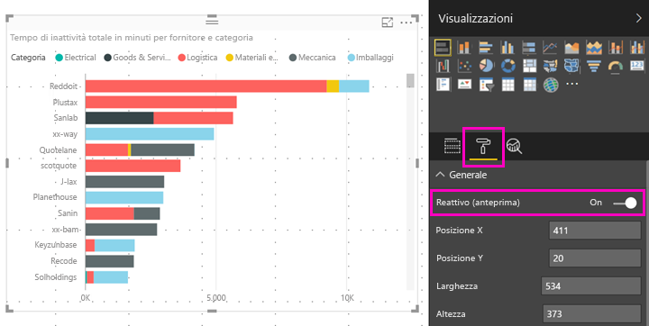

# Ottimizzare un oggetto visivo di Power BI per qualsiasi dimensione
Per impostazione predefinita, quando si crea un nuovo report, gli oggetti visivi sono *reattivi*, ovvero cambiano dinamicamente in modo da visualizzare la quantità massima di dati e informazioni dettagliate, indipendentemente dalle dimensioni dello schermo. Anche per i report meno recenti è possibile impostare gli oggetti visivi in modo che vengano ridimensionati in modo dinamico.

Quando le dimensioni di un oggetto visivo subiscono modifiche, Power BI classifica in ordine di priorità la visualizzazione dei dati, ad esempio rimuovendo la spaziatura interna e spostando automaticamente la legenda sopra l'oggetto visivo, in modo che l'oggetto visivo rimanga informativo anche con dimensioni ridotte. La reattività è particolarmente utile negli oggetti visivi nelle app per dispositivi mobili di Power BI nei telefoni.

Qualsiasi oggetto visivo con assi X e Y e filtri dei dati può essere ridimensionato in modo reattivo.

## Attivare la reattività in Power BI Desktop
1. In Power BI Desktop, in un report meno recente, verificare che nella scheda **Visualizza** sia attiva l'opzione **Layout desktop**.
   
    
2. Selezionare un oggetto visivo e nel riquadro **Visualizzazioni** selezionare la sezione **Formato**.
3. Espandere **Generale** > impostare **Reattivo** su **On**.
   
    
   
     Quando si [crea un report ottimizzato per il telefono](desktop-create-phone-report.md) e si aggiunge l'oggetto visivo, tale oggetto verrà ora ridimensionato correttamente.

## Attivare la reattività nel servizio Power BI
È possibile attivare la reattività per un oggetto visivo in un report meno recente nel servizio Power BI. È necessario potere modificare il report.

1. In un report nel servizio Power BI ([https://powerbi.com](https://powerbi.com)) selezionare **Modifica report**.
2. Selezionare un oggetto visivo e nel riquadro **Visualizzazioni** selezionare la sezione **Formato**.
3. Espandere **Generale** > impostare **Reattivo** su **On**.
   
    
   
     Quando si [crea una visualizzazione telefono del report](desktop-create-phone-report.md) e si aggiunge questo oggetto visivo, l'oggetto verrà ora ridimensionato correttamente.

## Passaggi successivi
* [Creare report ottimizzati per le app per telefoni di Power BI](desktop-create-phone-report.md)
* [Visualizzare i report di Power BI ottimizzati per il proprio telefono](mobile-apps-view-phone-report.md)
* Altre domande? [Provare a rivolgersi alla community di Power BI](http://community.powerbi.com/)

