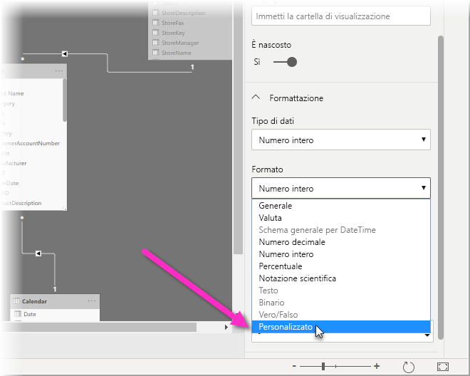
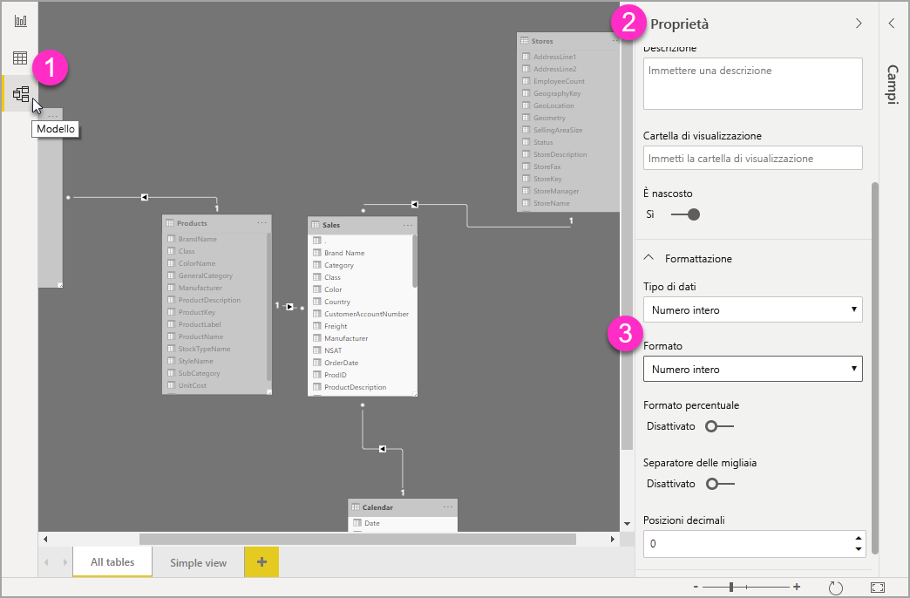

# Usare stringhe di formato personalizzate in Power BI Desktop

Con stringhe di formato personalizzate in **Power BI Desktop**, è possibile personalizzare il modo in cui vengono visualizzati i campi negli oggetti visivi e assicurarsi che i report vengano visualizzati come desiderato.

## Come usare stringhe di formato personalizzate

Per creare stringhe di formato personalizzate, selezionare il campo nella **Visualizzazione di modellazione** e quindi selezionare **Formato** dal riquadro **Proprietà**.

Dopo aver selezionato **Personalizzato** dall'elenco a discesa **Formato**, è possibile effettuare una selezione da un elenco di stringhe di formato usate di frequente. 

## Sintassi del formato personalizzato supportato

Le stringhe di formato personalizzate seguono la sintassi di stile VBA, comune a Excel e altri prodotti Microsoft, ma non supportano tutta la sintassi usata in altri prodotti. 

Le tabelle seguenti definiscono la sintassi supportata in Power BI.

La tabella seguente mostra i **simboli di data** supportati:

| **Simbolo** | **Range** |
| --- | --- |
| _d_ | 1-31 (giorno del mese senza zero iniziali) |
| _dd_ | 01-31 (giorno del mese con uno zero iniziale) |
| _m_ | 1-12 (mese dell'anno, senza zero iniziali, a partire da gennaio = 1) |
| _mm_ | 01-12 (mese dell'anno, con uno zero iniziale, a partire da gennaio = 01) |
| _mmm_ | Visualizza i nomi dei mesi abbreviati (i nomi dei mesi Hijri non hanno abbreviazioni) |
| _mmmm_ | Visualizza i nomi completi dei mesi |
| _yy_ | 00-99 (ultime due cifre dell'anno) |
| _yyyy_ | 100-9999 (anno a tre o quattro cifre) |

La tabella seguente mostra i **simboli di ora** supportati:

| **Simbolo** | **Range** |
| --- | --- |
| _h_ | 0-23 (1-12 seguito da &quot;AM&quot; o &quot;PM&quot;) (ora del giorno senza zero iniziali) |
| _hh_ | 00-23 (01-12 seguito da &quot;AM&quot; o &quot;PM&quot;) (ora del giorno con uno zero iniziale) |
| _n_ | 0-59 (minuti dell'ora senza zero iniziali) |
| _nn_ | 00-59 (minuti dell'ora con uno zero iniziale) |
| _m_ | 0-59 (minuti dell'ora senza zero iniziali). Solo se preceduto da _h_ o _hh_ |
| _mm_ | 00-59 (minuti dell'ora con uno zero iniziale). Solo se preceduto da _h_ o _hh_ |
| _s_ | 0-59 (secondi del minuto senza zero iniziali) |
| _ss_ | 00-59 (secondi del minuto con uno zero iniziale) |

È disponibile un [esempio](https://docs.microsoft.com/office/vba/language/reference/user-interface-help/format-function-visual-basic-for-applications#example) di come formattare le stringhe di valore personalizzate.

Un'espressione di formato definita dall'utente per i numeri può includere da una a tre sezioni separate da punti e virgola. Se si includono punti e virgola senza alcun elemento tra di essi, la sezione mancante non verrà visualizzata (sarà &quot;&quot;). Se il punto e virgola non è specificato, verrà usato il formato positivo.

Di seguito sono riportati alcuni esempi di formati diversi per diverse stringhe di valore:

|   | **Stringhe di formato** |   |   |   |
| --- | --- | --- | --- | --- |
| **Valori** | **0.00;-0.0;&quot;Zero&quot;** | **0.00;;** | **0.00;-0.0;** | **0.00;** |
| **-1.234** | -1.2 | &quot;&quot; | -1.2 | &quot;&quot; |
| **0** | &quot;Zero&quot; | &quot;&quot; | &quot;&quot; | 0,00 |
| **1.234** | 1.23 | 1.23 | 1.23 | 1.23 |

La tabella seguente identifica i **formati di data e ora con nome** predefiniti:

| **Nome formato** | **Descrizione** |
| --- | --- |
| **Data generale** | Visualizzare una data e/o ora, ad esempio 4/3/93 05:34 PM. Se non è presente alcuna parte frazionaria, visualizzare solo una data, ad esempio 4/3/93. Se non è presente alcuna parte intera, visualizzare solo l'ora, ad esempio 05:34 PM. La visualizzazione della data è determinata dalle impostazioni di sistema. |
| **Data estesa** | Visualizzare una data in base al formato di data estesa del sistema. |
| **Data breve** | Visualizzare una data in base al formato di data breve del sistema. |
| **Ora estesa** | Visualizza l'ora usando il formato di ora estesa del sistema; include le ore, i minuti, i secondi. |
| **Ora breve** | Visualizzare un'ora usando il formato a 24 ore, ad esempio 17:45. |

Formatti numerici con nome

La tabella seguente identifica i **formati numerici con nome** predefiniti:

| **Nome formato** | **Descrizione** |
| --- | --- |
| **Numero generale** | Numero visualizzato senza separatore delle migliaia. |
| **Valuta** | Numero visualizzato con separatore delle migliaia, se appropriato. Visualizzare due cifre a destra del separatore decimale. L'output è basato sulle impostazioni locali del sistema. |
| **Fisso** | Visualizzare almeno una cifra a sinistra e due cifre a destra del separatore decimale. |
| **Standard** | Numero visualizzato con separatore decimale, almeno una cifra a sinistra e due cifre a destra del separatore decimale. |
| **Percentuale** | Numero visualizzato moltiplicato per 100 con un segno di percentuale ( **%** ) aggiunto a destra; vengono sempre visualizzate due cifre a destra del separatore decimale. |
| **Notazione scientifica** | Usare la notazione scientifica standard. |

La tabella seguente identifica i caratteri che è possibile usare per creare **formati di data/ora definiti dall'utente**.

| **Carattere** | **Descrizione** |
| --- | --- |
| ( **:** ) | Separatore dell'ora. In alcune impostazioni locali potrebbero essere usati altri caratteri per rappresentare il separatore dell'ora. Il separatore dell'ora separa le ore, i minuti e i secondi quando vengono formattati i valori di ora. Il carattere effettivo usato come separatore dell'ora nell'output formattato è determinato dalle impostazioni di sistema. |
| ( **/** ) | Separatore della data. In alcune impostazioni locali potrebbero essere usati altri caratteri per rappresentare il separatore della data. Il separatore di data separa il giorno, il mese e l'anno in cui vengono formattati i valori di data. Il carattere effettivo usato come separatore della data nell'output formattato è determinato dalle impostazioni di sistema. |
| d | Visualizzare il giorno sotto forma di numero senza zero iniziale (1-31). |
| dd | Visualizzare il giorno sotto forma di numero con uno zero iniziale (01-31). |
| ddd | Visualizzare il nome abbreviato del giorno (Dom-Sab). Localizzato. |
| dddd | Visualizzare il nome completo del giorno (Domenica-Sabato). Localizzato. |
| m | Visualizzare il mese sotto forma di numero senza zero iniziale (1-12). Se m segue immediatamente h o hh, viene visualizzato il minuto anziché il mese. |
| mm | Visualizzare il mese come numero con uno zero iniziale (01-12). Se m segue immediatamente h o hh, viene visualizzato il minuto anziché il mese. |
| mmm | Visualizzare il nome del mese abbreviato (Gen–Dic). Localizzato. |
| mmmm | Visualizzare il nome completo del mese (Gennaio-Dicembre). Localizzato. |
| yy | Visualizzare l'anno come numero a 2 cifre (00-99). |
| yyyy | Visualizzare l'anno come numero a 4 cifre (100-9999). |
| h | Visualizzare l'ora sotto forma di numero senza zero iniziale (0-23). |
| hh | Visualizzare l'ora sotto forma di numero con uno zero iniziale (00-23). |
| n | Visualizzare i minuti sotto forma di numero senza zero iniziale (0-59). |
| nn | Visualizzare i minuti sotto forma di numero con uno zero iniziale (00-59). |
| s | Visualizzare i secondi sotto forma di numero senza zero iniziale (0-59). |
| ss | Visualizzare i secondi sotto forma di numero senza zero iniziale (00-59). |
| AM/PM | Usare il formato a 12 ore e visualizzare AM in lettere maiuscole per le ore antecedenti a mezzogiorno; visualizzare PM in lettere maiuscole per le ore tra mezzogiorno e 11:59 P.M. |

La tabella seguente identifica i caratteri che è possibile usare per creare **formati di numero definiti dall'utente**.

| **Carattere** | **Descrizione** |
| --- | --- |
| nessuno | Visualizzare il numero senza formattazione. |
| ( **0** ) | Segnaposto della cifra. Visualizzare una cifra o uno zero. Se nell'espressione è presente una cifra nella posizione del valore 0 nella stringa di formato, visualizzarla; in caso contrario, visualizzare uno zero. Se il numero include meno cifre del numero di zeri presenti (in entrambi i lati del decimale) nell'espressione di formato, visualizzare zeri iniziali o finali. Se il numero ha più cifre a destra del separatore decimale del numero di zeri a destra del separatore decimale nell'espressione di formato, arrotondare il numero al numero di cifre decimali corrispondente al numero di zeri. Se il numero ha più cifre a sinistra del separatore decimale del numero di zeri a sinistra del separatore decimale nell'espressione di formato, visualizzare le cifre aggiuntive senza alcuna modifica. |
| ( **#** ) | Segnaposto della cifra. Visualizzare una cifra o nessun elemento. Se nell'espressione è presente una cifra nella posizione di # nella stringa di formato, visualizzarla; in caso contrario, non visualizzare alcun elemento. Questo simbolo viene usato allo stesso modo del segnaposto 0 cifre, ad eccezione del fatto che gli zeri iniziali e finali non vengono visualizzati se il numero ha un numero di cifre uguale o inferiore al numero di caratteri # in entrambi i lati del separatore decimale nell'espressione di formato. |
| ( **.** ) | Segnaposto decimale. In alcune impostazioni locali viene usata la virgola come separatore decimale. Il segnaposto decimale determina il numero di cifre visualizzate a sinistra e a destra del separatore decimale. Se l'espressione di formato contiene solo cancelletti a sinistra di questo simbolo, i numeri inferiori a 1 iniziano con un separatore decimale. Per visualizzare uno zero iniziale con i numeri frazionari, usare 0 come primo segnaposto di cifra a sinistra del separatore decimale. Il carattere effettivo usato come segnaposto decimale nell'output formattato dipende dal formato numerico riconosciuto dal sistema. |
| ( **%)** | Segnaposto percentuale. L'espressione viene moltiplicata per 100. Il carattere di percentuale ( **%** ) viene inserito nella posizione in cui viene visualizzato nella stringa di formato. |
| ( **,** ) | Separatore delle migliaia. In alcune impostazioni locali viene usato il punto come separatore delle migliaia. Il separatore delle migliaia separa le migliaia dalle centinaia all'interno di un numero con quattro o più posizioni a sinistra del separatore decimale. L'utilizzo standard del separatore delle migliaia viene specificato se il formato contiene un separatore delle migliaia racchiuso tra segnaposto di cifra ( **0** oppure **#** ). Due separatori delle migliaia adiacenti o un separatore delle migliaia immediatamente a sinistra del separatore decimale (indipendentemente dal fatto che sia specificato un decimale) indica il &quot;ridimensionamento del numero tramite divisione per 1000 con eventuale arrotondamento&quot;. Ad esempio, è possibile usare la stringa di formato &quot;##0,,&quot; per rappresentare 100 milioni come 100. I numeri inferiori a 1 milione vengono visualizzati come 0. Due separatori delle migliaia adiacenti in una posizione diversa dalla posizione immediatamente a sinistra del separatore decimale vengono considerati semplicemente la specifica dell'utilizzo di un separatore delle migliaia. Il carattere effettivo usato come segnaposto delle migliaia nell'output formattato dipende dal formato numerico riconosciuto dal sistema. |
| ( **:** ) | Separatore dell'ora. In alcune impostazioni locali potrebbero essere usati altri caratteri per rappresentare il separatore dell'ora. Il separatore dell'ora separa le ore, i minuti e i secondi quando vengono formattati i valori di ora. Il carattere effettivo usato come separatore dell'ora nell'output formattato è determinato dalle impostazioni di sistema. |
| ( **/** ) | Separatore della data. In alcune impostazioni locali potrebbero essere usati altri caratteri per rappresentare il separatore della data. Il separatore di data separa il giorno, il mese e l'anno in cui vengono formattati i valori di data. Il carattere effettivo usato come separatore della data nell'output formattato è determinato dalle impostazioni di sistema. |
| ( **E- E+ e- e+** ) | Formato scientifico. Se l'espressione di formato contiene almeno un segnaposto di cifra ( **0** oppure **#** ) a destra di E-, E+, e- o e+, il numero viene visualizzato in formato scientifico e viene inserito E o e tra il numero e il relativo esponente. Il numero di segnaposti di cifra a destra determina il numero di cifre nell'esponente. Usare E- o e- per inserire un segno meno accanto agli esponenti negativi. Usare E+ o e+ per inserire un segno meno accanto agli esponenti negativi e un segno più accanto agli esponenti positivi. |
| **- + $**  ( ) | Visualizzare un carattere letterale. Per visualizzare un carattere diverso da uno di quelli elencati, anteporvi una barra rovesciata (\)) o racchiuderlo tra virgolette doppie (&quot; &quot;). |
| ( * *\** ) | Visualizzare il carattere successivo nella stringa di formato. Per visualizzare un carattere che ha un significato speciale come carattere letterale, farlo precedere da una barra rovesciata (\). La barra rovesciata non viene visualizzata. L'uso di una barra rovesciata equivale a racchiudere il carattere successivo tra virgolette doppie. Per visualizzare una barra rovesciata, usare due barre rovesciate (\\). I caratteri di formattazione di data e ora (a, c, d, h, m, n, p, q, s, t, w, / e :), i caratteri di formattazione numerica (#, 0, %, E, e, virgola e punto) e il caratteri di formattazione di stringa (@, &amp;, \&lt;, \&gt; e !) sono esempi di caratteri che non possono essere visualizzati come caratteri letterali. |
| (&quot;ABC&quot;) | Visualizzare la stringa racchiusa tra virgolette doppie (&quot; &quot;). |

## Passaggi successivi
Potrebbero essere interessanti anche gli articoli seguenti:

* [Stringhe di formato VBA](https://docs.microsoft.com/office/vba/language/reference/user-interface-help/format-function-visual-basic-for-applications#example)
* [Misure in Power BI Desktop](desktop-measures.md)
* [Tipi di dati in Power BI Desktop](desktop-data-types.md)
* [Formattazione condizionale nelle tabelle](desktop-conditional-table-formatting.md)

