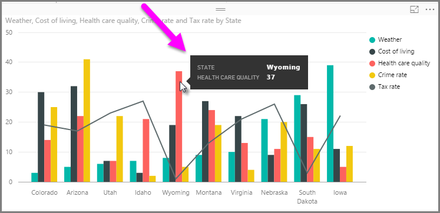
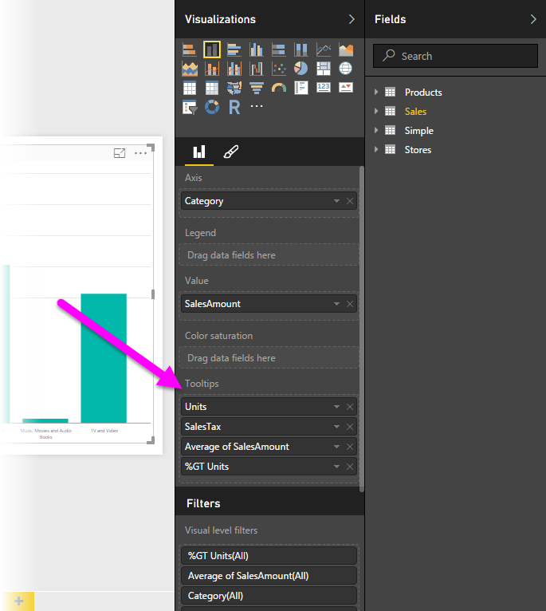
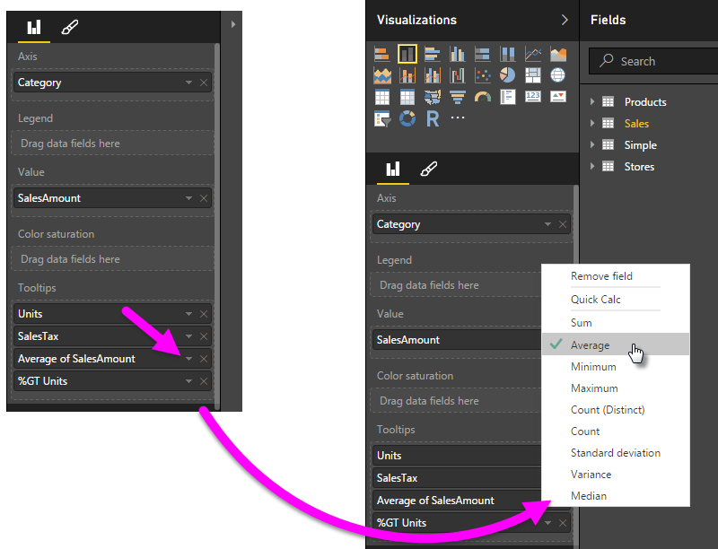

# Personalizzazione delle descrizioni comando in Power BI Desktop
Le descrizioni comando sono un modo elegante di offrire altre informazioni contestuali e dettagli ai punti dati su un oggetto visivo. L'immagine seguente mostra una descrizione comando applicata a un grafico in Power BI Desktop.

Quando viene creata una visualizzazione, la descrizione comando predefinita visualizza il valore e la categoria del punto dati. La possibilità di personalizzare le informazioni di descrizione comando è estremamente utile e consente di offrire più contesto e informazioni aggiuntive agli utenti che visualizzano l'oggetto visivo. Le descrizioni comando personalizzate consentono di specificare più punti dati che vengono visualizzati come parte della descrizione comando.

## Come personalizzare le descrizioni comando
Per creare una descrizione comando personalizzata, nel contenitore **Campi** del riquadro **Visualizzazioni** basta trascinare un campo nel bucket **Descrizioni comando** come illustrato nell'immagine seguente. Nell'immagine seguente, sono stati posizionati quattro campi nel bucket **Descrizioni comando**.

Dopo aver aggiunto le descrizioni comando nel contenitore di campi, passando il puntatore su un punto dati nella visualizzazione è possibile visualizzare i valori per i campi nella descrizione comando.

## Personalizzazione delle descrizioni comando tramite aggregazioni o Calcolo rapido
È possibile personalizzare ulteriormente una descrizione comando tramite una funzione di aggregazione o un *Calcolo rapido* facendo clic sulla freccia accanto al campo nel bucket **Descrizioni comando** e scegliendo tra le opzioni disponibili.

Esistono diversi modi per personalizzare le **Descrizioni comando** tramite uno dei campi disponibili nel set di dati, quindi per trasmettere informazioni rapide e approfondimenti agli utenti che visualizzano dashboard o report.

