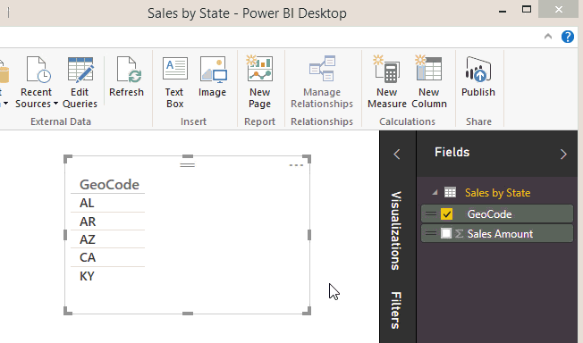

# Specificare le categorie di dati in Power BI Desktop
In **Power BI Desktop** è possibile specificare la categoria di dati per una colonna in modo tale che Power BI Desktop sappia come trattare i relativi valori in una visualizzazione.

Quando Power BI Desktop importa i dati, non importa solo i dati di per sé ma importa anche le informazioni quali, ad esempio, i nomi delle tabelle e delle colonne, l'indicazione se si tratta di una chiave primaria e così via.  Con tali informazioni Power BI Desktop fa alcune supposizioni su come offrire una valida esperienza predefinita per la creazione di una visualizzazione. 

Ecco un esempio: quando Power BI Desktop rileva valori numerici in una colonna, suppone che la si voglia aggregare in qualche modo, quindi la posiziona nell'area Valori. Oppure, nel caso di una colonna con valori di data e ora suppone che la si voglia usare come asse della gerarchia temporale in un grafico a linee.

Esistono però alcuni casi che sono un po' più impegnativi come la geografia. Considerare la tabella seguente da un foglio di lavoro di Excel:

Power BI Desktop deve trattare i codici della colonna GeoCode come abbreviazione di un paese o come stato degli Stati Uniti?  Non è chiaro perché tali codici possono significare entrambe le cose.  Ad esempio, AL può significare Alabama o Albania, AR può significare Arkansas o Argentina oppure CA può significare California o Canada. Ciò fa la differenza quando si va a creare un grafico in base al campo GeoCode su una mappa.  Power BI Desktop deve mostrare un'immagine del mondo con i paesi evidenziati o un'immagine degli Stati Uniti con gli stati evidenziati?  È possibile specificare una categoria di dati per tale tipo di dati. La categorizzazione dei dati ottimizza ulteriormente le informazioni usate da Power BI Desktop per fornire le visualizzazioni migliori.  

**Per specificare una categoria di dati**

1. Nell'elenco **Campi** in Visualizzazione Report o Vista dati selezionare il campo da archiviare con una categorizzazione diversa.
2. Nella scheda **Creazione di modelli** della barra multifunzione fare clic sull'elenco a discesa **Categoria di dati**.  Viene visualizzato l'elenco delle possibili categorie di dati che è possibile scegliere per la colonna.  Alcune selezioni potrebbero essere disabilitate se non vengono usate con il tipo di dati corrente della colonna.  Se ad esempio una colonna è un tipo di dati binario, Power BI Desktop non consentirà di scegliere le categorie di dati geografici. 

Non sono necessarie altre operazioni.  Qualsiasi comportamento riconducibile normalmente a un elemento visivo funzionerà ora automaticamente.  

Potrebbe anche essere interessante ottenere informazioni sul [filtro geografico per le app Power BI per dispositivi mobili](desktop-mobile-geofiltering.md).

