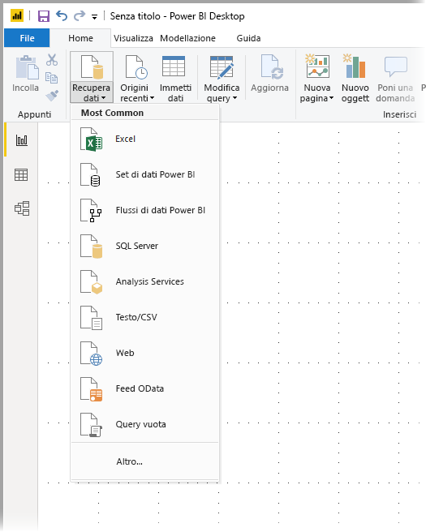
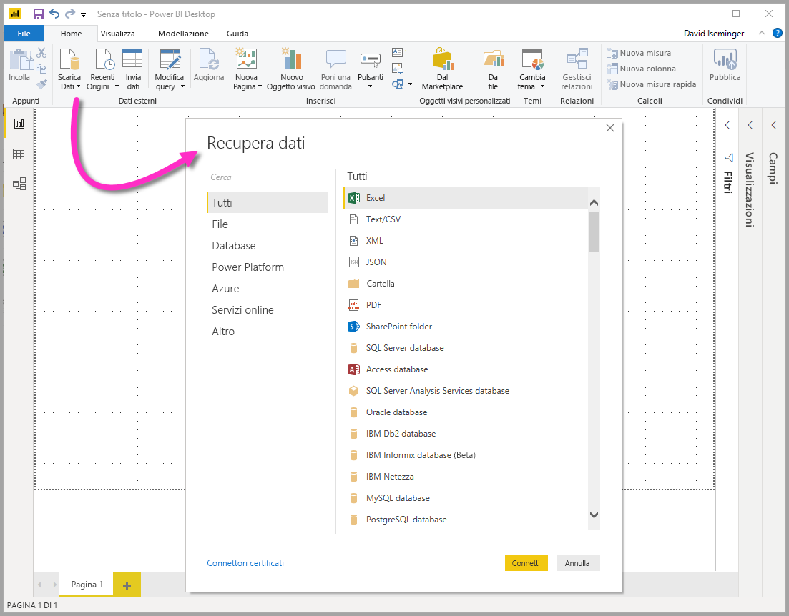
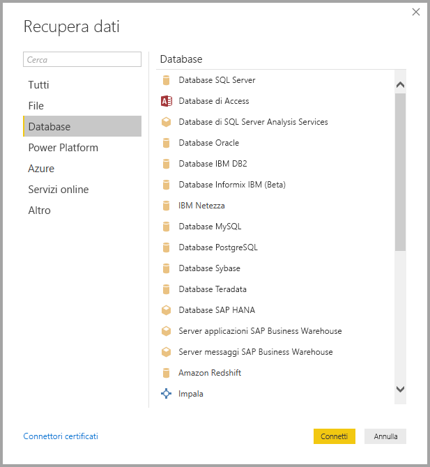
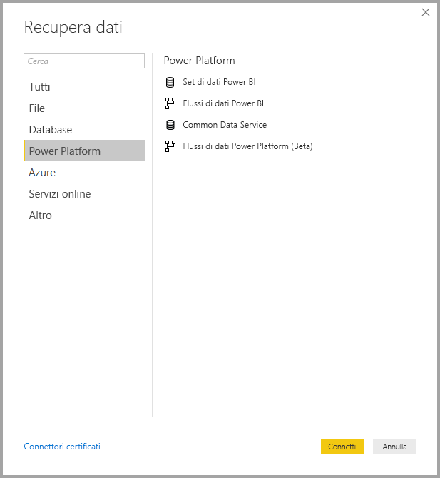
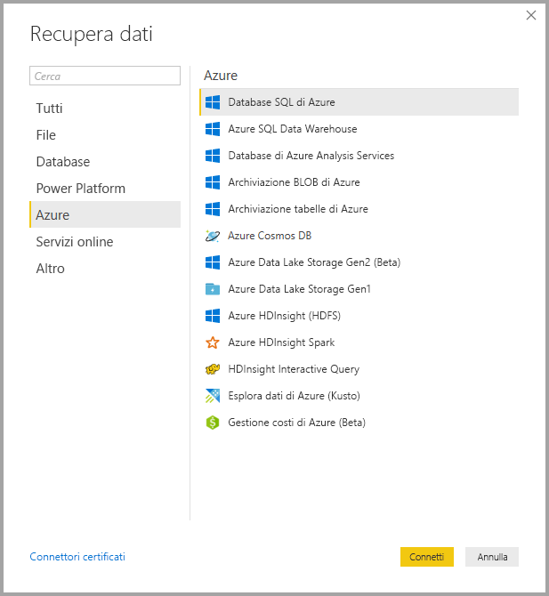
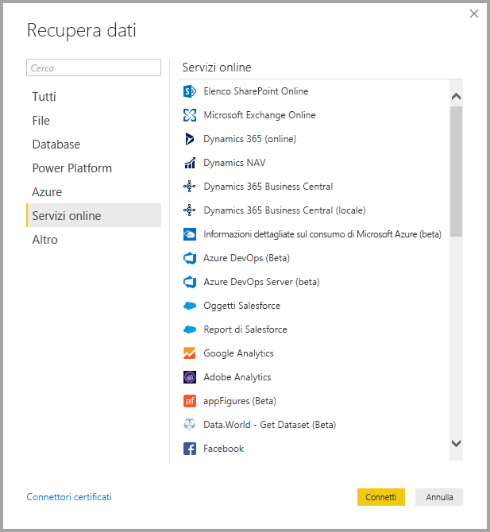
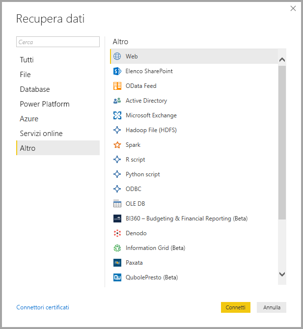
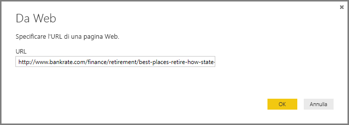
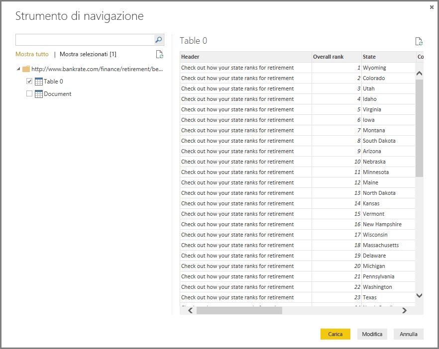

# Origini dati in Power BI Desktop
Power BI Desktop permette di connettersi a dati da molte origini diverse. Un elenco completo delle origini dati disponibili è riportato alla fine di questa pagina.

Per connettersi ai dati, selezionare **Recupera dati** dalla barra multifunzione **Home** . Se si seleziona la freccia Giù o il testo **Recupera dati** sul pulsante viene visualizzato il menu dei tipi di dati **Più comuni**, riportato nella figura seguente:

Se si sceglie **Altro** dal menu **Più comuni**, viene visualizzata la finestra **Recupera dati**. È anche possibile visualizzare la finestra **Recupera dati** (e ignorare il menu **Più comuni** ) selezionando direttamente il **pulsante dell'icona** **Recupera dati** .

> [!NOTE]
> Il team di Power BI espande in continuazione le origini dati disponibili in **Power BI Desktop** e nel **servizio Power BI**. Di conseguenza, si noteranno spesso le prime versioni delle origini dati WIP contrassegnate come *Beta* o *Anteprima*. Qualsiasi origine dati contrassegnata come *Beta* o *Anteprima* offre supporto e funzionalità limitati e non deve essere usata in ambienti di produzione. 

> Inoltre, qualsiasi origine dati contrassegnata come *Beta* o *Preview* per **Power BI Desktop** potrebbe non essere disponibile per l'uso nel **servizio Power BI** o in altri servizi Microsoft finché l'origine dati non diventa disponibile a livello generale (GA).

## Origini dati
I tipi di dati sono organizzati nelle categorie seguenti:

* Tutti
* File
* Database
* Power BI
* Azure
* Online Services
* Altro

La categoria **Tutti** include tutti i tipi di connessione dati di tutte le categorie.

La categoria **File** fornisce le connessioni dati seguenti:

* Excel
* Testo/CSV
* XML
* JSON
* Cartella
* PDF
* Cartella di SharePoint

La figura seguente mostra la finestra **Recupera dati** per **File**.

La categoria **Database** fornisce le connessioni dati seguenti:

* Database SQL Server
* Database di Access
* SQL Server Analysis Services
* Database Oracle
* Database IBM DB2
* Database Informix IBM (Beta)
* IBM Netezza
* Database MySQL
* Database PostgreSQL
* Database di Sybase
* Database Teradata
* Database SAP HANA
* Server applicazioni SAP Business Warehouse
* Server messaggi SAP Business Warehouse
* Amazon Redshift
* Impala
* Google BigQuery
* Vertica
* Snowflake
* Essbase
* Cubi AtScale (Beta)
* Connettore BI
* Dremio
* Exasol
* Indexima (Beta)
* InterSystems IRIS (Beta)
* Jethro (beta)
* Kyligence Enterprise (Beta)
* MarkLogic (Beta)

> [!NOTE]
> Alcuni connettori di database devono essere abilitati selezionando **File > Opzioni e impostazioni > Opzioni** e quindi **Funzionalità in anteprima**. Se alcuni dei connettori citati sopra non sono visibili e si vuole usarli, controllare le impostazioni **Funzionalità in anteprima**. Si noti anche che qualsiasi origine dati contrassegnata come *Beta* o *Anteprima* offre supporto e funzionalità limitati e non deve essere usata in ambienti di produzione.

La figura seguente mostra la finestra **Recupera dati** per **Database**.

La categoria **Power Platform** fornisce le connessioni dati seguenti:

* Set di dati Power BI
* Flussi di dati Power BI
* Common Data Service
* Flussi di dati Power Platform (Beta)

L'immagine seguente mostra la finestra **Recupera dati** per **Power Platform**.

La categoria **Azure** fornisce le connessioni dati seguenti:

* Database SQL di Azure
* Azure SQL Data Warehouse
* Database di Azure Analysis Services
* Archiviazione BLOB di Azure
* Archiviazione tabelle di Azure
* Azure Cosmos DB
* Azure Data Lake Storage Gen2 (Beta)
* Azure Data Lake Storage Gen1
* Azure HDInsight (HDFS)
* Azure HDInsight Spark
* HDInsight Interactive Query
* Esplora dati di Azure (Kusto)
* Gestione costi di Azure (Beta)

La figura seguente mostra la finestra **Recupera dati** per **Azure**.

La categoria **Online Services** fornisce le connessioni dati seguenti:

* Elenchi SharePoint Online
* Microsoft Exchange Online
* Dynamics 365 (online)
* Dynamics NAV
* Dynamics 365 Business Central
* Dynamics 365 Business Central (locale)
* Informazioni dettagliate sul consumo di Microsoft Azure (beta)
* Azure DevOps (beta)
* Azure DevOps Server (beta)
* Oggetti Salesforce
* Report di Salesforce
* Google Analytics
* Adobe Analytics
* appFigures (Beta)
* Data.World - Ottieni set di dati (Beta)
* Facebook
* GitHub (beta)
* MailChimp (Beta)
* Marketo (Beta)
* Mixpanel (Beta)
* Planview Enterprise One - PRM (Beta)
* Planview Projectplace (Beta)
* QuickBooks Online (beta)
* Smartsheet
* SparkPost (Beta)
* Stripe (Beta)
* SweetIQ (beta)
* Planview Enterprise One - CMT (Beta)
* Twilio (Beta)
* tyGraph (Beta)
* Webtrends (Beta)
* Zendesk (Beta)
* Dynamics 365 Customer Insights (Beta)
* Origine dati Emigo (Beta)
* Entersoft Business Suite (Beta)
* Industrial App Store
* Data warehouse di Intune (Beta)
* Microsoft Graph Security (Beta)
* Quick Base
* TeamDesk (beta)

La figura seguente mostra la finestra **Recupera dati** per **Online Services**.

La categoria **Altro** fornisce le connessioni dati seguenti:

* Web
* Elenco SharePoint
* Feed OData
* Active Directory
* Microsoft Exchange
* File Hadoop (HDFS)
* Spark
* Script R
* Script Python
* ODBC
* OLE DB
* BI360 - Budgeting & Financial Reporting (Beta)
* Denado
* Information Grid (Beta)
* Paxata 
* QubolePresto (Beta)
* Roamler (Beta)
* SurveyMonkey (Beta)
* Tenforce (Smart)List (Beta)
* Workforce Dimensions (Beta)
* Query vuota

La figura seguente mostra la finestra **Recupera dati** per **Altro**.

> [!NOTE]
> Al momento non è possibile connettersi a origini dati personalizzate protette con Azure Active Directory.

## Connessione a un'origine dati
Per connettersi a un'origine dati, selezionare l'origine dati dalla finestra **Recupera dati** e selezionare **Connetti**. Nella figura seguente **Web** viene selezionato dalla categoria di connessione dati **Altro** .

Viene visualizzata una finestra di connessione specifica per il tipo di connessione dati. Se sono necessarie credenziali, sarà necessario fornirle. L'immagine seguente illustrata un URL immesso per connettersi a un'origine dati Web.

Quando viene immesso l'URL o le informazioni di connessione alla risorsa, selezionare **OK**. Power BI Desktop stabilisce la connessione all'origine dati e presenta le origini dati disponibili nello **Strumento di navigazione**.

È possibile caricare i dati selezionando il pulsante **Carica** nella parte inferiore del riquadro **Strumento di navigazione** oppure modificare la query prima di caricare i dati selezionando il pulsante **Modifica** .

Non sono necessarie altre operazioni per connettersi alle origini dati in Power BI Desktop. Provare a connettersi ai dati dall'elenco di origini dati in continua espansione ed esaminare spesso l'elenco, che viene continuamente ampliato.

## Passaggi successivi
Power BI Desktop offre infinite possibilità. Per altre informazioni sulle capacità disponibili, vedere le risorse seguenti:

* [Che cos'è Power BI Desktop?](desktop-what-is-desktop.md)
* [Panoramica delle query con Power BI Desktop](desktop-query-overview.md)
* [Tipi di dati in Power BI Desktop](desktop-data-types.md)
* [Effettuare il data shaping e combinare i dati con Power BI Desktop](desktop-shape-and-combine-data.md)
* [Attività di query comuni in Power BI Desktop](desktop-common-query-tasks.md)    
