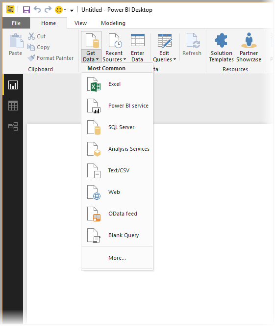
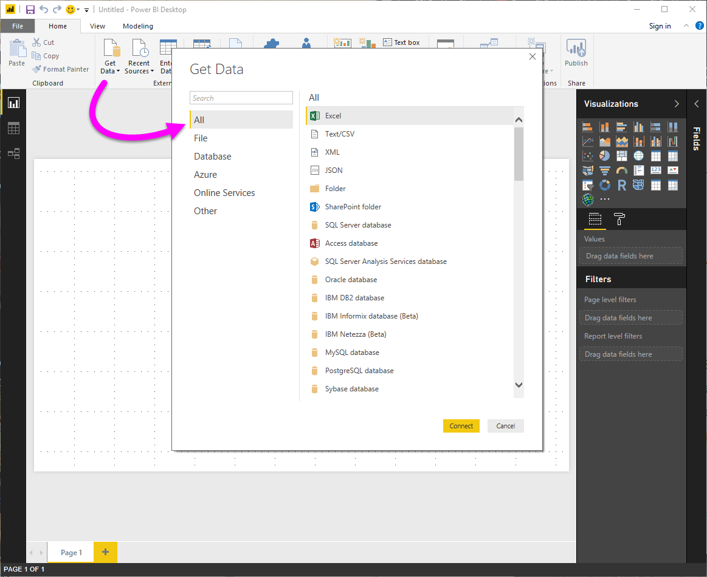
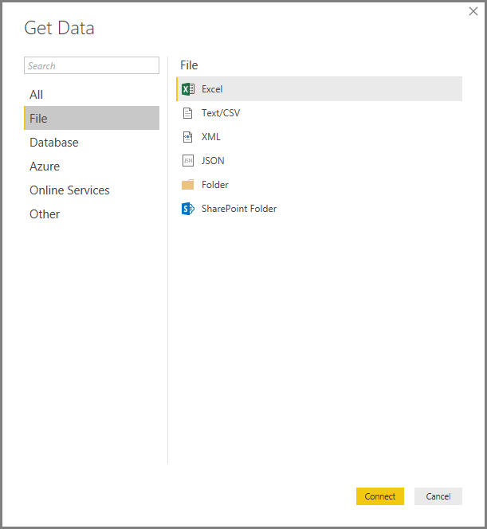
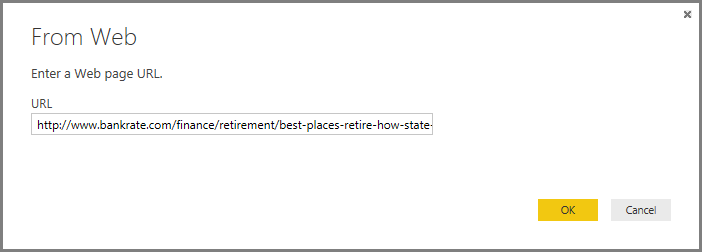
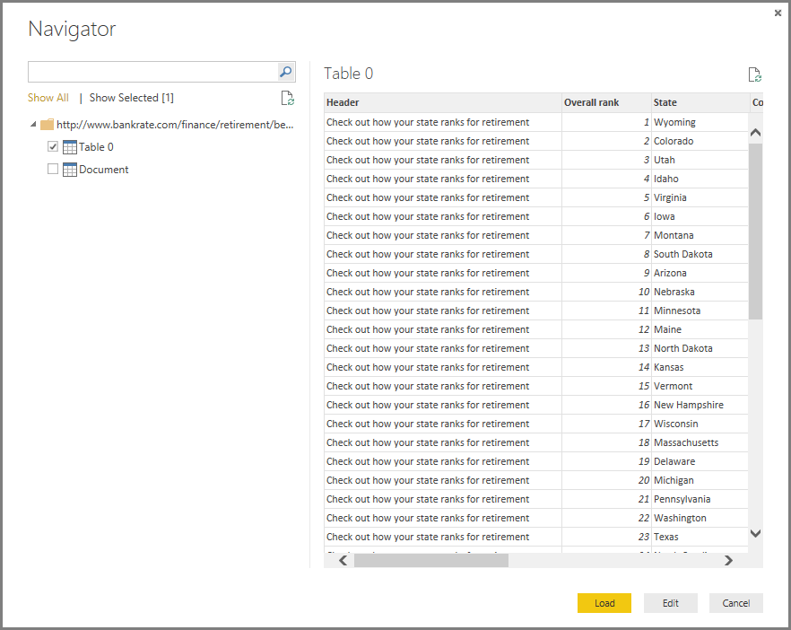

# Origini dati in Power BI Desktop
Power BI Desktop permette di connettersi a dati da molte origini diverse. Un elenco completo delle origini dati disponibili è riportato alla fine di questa pagina.

Per connettersi ai dati, selezionare **Recupera dati** dalla barra multifunzione **Home** . Se si seleziona la freccia Giù o il testo **Recupera dati** sul pulsante, verrà visualizzato il menu di tipi di dati **Più comuni** , riportato nella figura seguente.

Se si sceglie **Altro** dal menu **Più comuni**, viene visualizzata la finestra **Recupera dati**. È anche possibile visualizzare la finestra **Recupera dati** (e ignorare il menu **Più comuni** ) selezionando direttamente il **pulsante dell'icona** **Recupera dati** .

> [!NOTE]
> Il team di Power BI espande in continuazione le origini dati disponibili in **Power BI Desktop** e nel **servizio Power BI**. Di conseguenza, si noteranno spesso le prime versioni delle origini dati WIP contrassegnate come *Beta* o *Anteprima*. Qualsiasi origine dati contrassegnata come *Beta* o *Anteprima* offre supporto e funzionalità limitati e non deve essere usata in ambienti di produzione.
> 
> 

## Origini dati
I tipi di dati sono organizzati nelle categorie seguenti:

* Tutti
* File
* Database
* Azure
* Online Services
* Altro

La categoria **Tutti** include tutti i tipi di connessione dati di tutte le categorie.

La categoria **File** fornisce le connessioni dati seguenti:

* Excel
* Testo/CSV
* XML
* JSON
* Cartella
* Cartella di SharePoint

La figura seguente mostra la finestra **Recupera dati** per **File**.

> [!NOTE]
> Nelle versioni precedenti di Power BI Desktop, **CSV** e **Testo** erano tipi di connessione dati separati. Questi connettori di dati sono stati combinati in **Testo/CSV**.
> 
> 

La categoria **Database** fornisce le connessioni dati seguenti:

* Database SQL Server
* Database di Access
* SQL Server Analysis Services
* Database Oracle
* Database IBM DB2
* Database Informix IBM (Beta)
* IBM Netezza (Beta)
* Database MySQL
* Database PostgreSQL
* Database di Sybase
* Database Teradata
* Database SAP HANA
* Server SAP Business Warehouse
* Amazon Redshift
* Impala
* Google BigQuery (Beta)
* Snowflake

> [!NOTE]
> Alcuni connettori di database devono essere abilitati selezionando **File > Opzioni e impostazioni > Opzioni** e quindi **Funzionalità in anteprima**. Se alcuni dei connettori citati sopra non sono visibili e si vuole usarli, controllare le impostazioni **Funzionalità in anteprima**. Si noti anche che qualsiasi origine dati contrassegnata come *Beta* o *Anteprima* offre supporto e funzionalità limitati e non deve essere usata in ambienti di produzione.
> 
> 

La figura seguente mostra la finestra **Recupera dati** per **Database**.

La categoria **Azure** fornisce le connessioni dati seguenti:

* Database SQL di Azure
* Azure SQL Data Warehouse
* Database di Azure Analysis Services (Beta)
* Archivio BLOB Azure
* Archivio tabelle Azure
* Azure Cosmos DB (Beta)
* Azure Data Lake Store
* Azure HDInsight (HDFS)
* Spark in Azure HDInsight (Beta)

La figura seguente mostra la finestra **Recupera dati** per **Azure**.

La categoria **Online Services** fornisce le connessioni dati seguenti:

* Servizio Power BI
* Elenchi SharePoint Online
* Microsoft Exchange Online
* Dynamics 365 (online)
* Dynamics 365 per Financials (Beta)
* Common Data Service (Beta)
* Microsoft Azure Consumption Insights (Beta)
* Visual Studio Team Services (Beta)
* Oggetti Salesforce
* Report di Salesforce
* Google Analytics
* appFigures (beta)
* comScore Digital Analytix (Beta)
* Dynamics 365 per Customer Insights (Beta)
* Facebook
* GitHub (beta)
* Kusto (Beta)
* MailChimp (Beta)
* Mixpanel (Beta)
* Planview Enterprise (Beta)
* Projectplace (Beta)
* QuickBooks Online (beta)
* Smartsheet
* SparkPost (Beta)
* SQL Sentry (Beta)
* Stripe (Beta)
* SweetIQ (beta)
* Troux (Beta)
* Twilio (beta)
* tyGraph (Beta)
* Webtrends (Beta)
* Zendesk (Beta)

La figura seguente mostra la finestra **Recupera dati** per **Online Services**.

La categoria **Altro** fornisce le connessioni dati seguenti:

* Vertica (Beta)
* Web
* Elenco SharePoint
* Feed OData
* Active Directory
* Microsoft Exchange
* File Hadoop (HDFS)
* Spark (Beta)
* Script R
* ODBC
* OLE DB
* Query vuota

La figura seguente mostra la finestra **Recupera dati** per **Altro**.

> [!NOTE]
> Al momento non è possibile connettersi a origini dati personalizzate protette con Azure Active Directory.
> 
> 

## Connessione a un'origine dati
Per connettersi a un'origine dati, selezionare l'origine dati dalla finestra **Recupera dati** e selezionare **Connetti**. Nella figura seguente **Web** viene selezionato dalla categoria di connessione dati **Altro** .

Viene visualizzata una finestra di connessione specifica per il tipo di connessione dati. Se sono necessarie credenziali, sarà necessario fornirle. L'immagine seguente illustrata un URL immesso per connettersi a un'origine dati Web.

Quando viene immesso l'URL o le informazioni di connessione alla risorsa, selezionare **OK**. Power BI Desktop stabilisce la connessione all'origine dati e presenta le origini dati disponibili nello **Strumento di navigazione**.

È possibile caricare i dati selezionando il pulsante **Carica** nella parte inferiore del riquadro **Strumento di navigazione** oppure modificare la query prima di caricare i dati selezionando il pulsante **Modifica** .

Non sono necessarie altre operazioni per connettersi alle origini dati in Power BI Desktop. Provare a connettersi ai dati dall'elenco di origini dati in continua espansione ed esaminare spesso l'elenco, che viene continuamente ampliato.

## Passaggi successivi
Power BI Desktop offre infinite possibilità. Per altre informazioni sulle capacità disponibili, vedere le risorse seguenti:

* [Introduzione a Power BI Desktop](desktop-getting-started.md)
* [Panoramica delle query con Power BI Desktop](desktop-query-overview.md)
* [Tipi di dati in Power BI Desktop](desktop-data-types.md)
* [Effettuare il data shaping e combinare i dati con Power BI Desktop](desktop-shape-and-combine-data.md)
* [Attività di query comuni in Power BI Desktop](desktop-common-query-tasks.md)    

