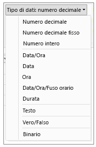

# Tipi di dati in Power BI Desktop
Questo articolo descrive i tipi di dati supportati in Power BI Desktop e Data Analysis Expressions (DAX). 

Quando si caricano i dati in Power BI Desktop, verrà eseguito un tentativo di conversione del tipo di dati della colonna di origine in un tipo che supporta meglio e in modo più efficiente l'archiviazione, i calcoli e la visualizzazione dei dati. Se ad esempio una colonna di valori importata da Excel non contiene valori frazionari, Power BI Desktop convertirà l'intera colonna di dati nel tipo di dati Numero intero, che è più appropriato per l'archiviazione di numeri interi.

Questo aspetto è importante perché alcune funzioni DAX hanno speciali requisiti per i tipi di dati. Sebbene in molti casi DAX converte implicitamente i dati in automatico, ci sono altri casi in cui tale conversione non viene eseguita.  Ad esempio, se una funzione DAX richiede il tipo di dati Data e il tipo di dati della colonna è Testo, la funzione DAX non funzionerà correttamente.  Per questo motivo è importante ma anche utile usare il tipo di dati corretto per una colonna. Le conversioni implicite vengono descritte più avanti in questo articolo.

## Determinare e specificare il tipo di dati di una colonna
In Power BI Desktop è possibile determinare e specificare il tipo di dati di una colonna nell'Editor di query oppure nella Vista dati o Visualizzazione report.

**Tipi di dati nell'Editor di query**

**Tipi di dati nella Vista dati o Visualizzazione report**

L'elenco a discesa Tipo di dati nell'Editor di query contiene due tipi di dati che attualmente non sono presenti nella Vista dati o nella Visualizzazione report: **Data/Ora/Fuso orario** e **Durata**. Quando una colonna con questi tipi di dati viene caricata nel modello e visualizzata in Dati o Report, la colonna con il tipo di dati Data/Ora/Fuso orario viene convertita nel tipo Data/Ora mentre la colonna con il tipo di dati Durata viene convertita nel tipo Numero decimale.

### Tipi numerici
Power BI Desktop supporta tre tipi numerici:

**Numero decimale** : rappresenta un numero a virgola mobile a 64 bit (8 byte). È il tipo numerico più comune e corrisponde ai numeri come generalmente si immaginano.  Anche se concepito per gestire numeri con valori frazionari, questo tipo gestisce anche numeri interi.  Il tipo Numero decimale può gestire valori negativi da -1,79E +308 a -2,23E -308, 0 e valori positivi da 2,23E -308 a 1,79E + 308. Ad esempio, 34, 34,01 e 34,000367063 sono numeri decimali validi. Il valore più grande che può essere rappresentato nel tipo Numero decimale può contenere un massimo di 15 cifre.  Il separatore decimale può essere inserito in qualsiasi punto del numero. Il tipo Numero decimale corrisponde al modo in cui Excel archivia i relativi numeri.

**Numero decimale fisso** : contiene una posizione fissa per il separatore decimale. Il separatore decimale ha sempre quattro cifre a destra e consente 19 cifre significative.  Il valore più grande che può rappresentare è 922.337.203.685.477,5807 (positivo o negativo).  Il tipo Numero decimale fisso è utile nei casi in cui l'arrotondamento potrebbe introdurre errori.  Quando si lavora con molti numeri che hanno piccoli valori frazionari, talvolta questi possono accumularsi forzando un numero a non essere propriamente corretto.  Poiché i valori dopo le quattro cifre a destra del separatore decimale vengono troncati, il tipo Numero decimale fisso può consentire di evitare questi tipi di errori.   Se si ha familiarità con SQL Server, questo tipo di dati corrisponde al tipo Decimale di SQL Server (19,4) o al tipo di dati Valuta in Power Pivot. 

**Numero intero** : rappresenta un valore intero a 64 bit (8 byte). Poiché si tratta di un numero intero, non ci sono cifre a destra della posizione decimale. Consente 19 cifre e ammette numeri interi positivi o negativi compresi tra -9.223.372.036.854.775.808 (-2^63) e 9.223.372.036.854.775.807 (2^63-1).  Può rappresentare il numero più grande possibile dei vari tipi di dati numerici.  Analogamente al tipo Numero decimale fisso, il tipo Numero intero può essere utile nei casi in cui sia necessario controllare l'arrotondamento. 

> [!NOTE]
>  Il modello di dati di Power BI Desktop supporta valori interi a 64 bit, ma il numero più grande che gli oggetti visivi possono esprimere in modo sicuro è 9.007.199.254.740.991 (2^53-1) a causa delle limitazioni di JavaScript. Se nel modello di dati si lavora con numeri più grandi di questo, è possibile ridurne le dimensioni tramite calcoli prima di aggiungerli a un oggetto visivo 
> 
>

### Tipi Data/Ora
Power BI Desktop supporta cinque tipi di dati Data/ora in Visualizzazione query e tre nel modello e in Visualizzazione report.   I tipi Data/Ora/Fuso orario e Durata vengono convertiti durante il caricamento nel modello.

**Data/Ora**: rappresenta un valore di data e di ora.  Nel sistema il valore Data/Ora viene archiviato come tipo Numero decimale,  per cui in effetti è possibile eseguire una conversione tra i due tipi.   La parte relativa all'ora di una data viene archiviata come frazione in multipli interi di 1/300 secondi (3,33 ms).  Sono supportate le date comprese tra gli anni 1900 e 9999.

**Data** : rappresenta solo una data (senza la parte dell'ora).  Una data quando viene convertita nel modello corrisponde al valore Data/Ora con il valore frazionario uguale a zero.

**Ora** : rappresenta solo l'ora (senza la parte della data).  Un valore Ora quando viene convertito nel modello corrisponde al valore Data/Ora senza cifre a sinistra della posizione decimale.

**Data/Ora/Fuso orario** : rappresenta la data/ora in formato UTC.  Attualmente viene convertito in Data/Ora quando viene caricato nel modello.

**Durata** : rappresenta la quantità di tempo. Viene convertito nel tipo Numero decimale quando viene caricato nel modello.  Analogamente al tipo Numero decimale, può essere aggiunto o sottratto da un campo Data/Ora con risultati corretti.  Può inoltre essere facilmente usato nelle visualizzazioni che mostrano un ordine di grandezza.

### Tipo testo
**Testo** : stringa di dati di tipo carattere Unicode. Può trattatasi di stringhe, numeri o date rappresentati in un formato di testo. La lunghezza massima della stringa è 268.435.456 caratteri Unicode (256 Mega caratteri) o 536.870.912 byte.

### Tipo True/False
**True/False** : valore booleano True o False.

### Tipo spazi vuoti/valori Null
**Vuoto** : è un tipo di dati in DAX che rappresenta e sostituisce i valori Null di SQL. È possibile creare uno spazio vuoto usando la funzione [BLANK](http://msdn.microsoft.com/library/ee634820.aspx), nonché verificare la presenza di spazi vuoti usando la funzione logica [ISBLANK](https://msdn.microsoft.com/library/ee634204.aspx).

### Tipo di dati tabella
DAX usa il tipo di dati tabella in molte funzioni, ad esempio aggregazioni e calcoli della funzionalità di Business Intelligence per le gerarchie temporali. Alcune funzioni richiedono un riferimento a una tabella, mentre altre restituiscono una tabella che può quindi essere usata come input per altre funzioni. In alcune funzioni che richiedono una tabella come input è possibile specificare un'espressione che restituisce una tabella. Per alcune funzioni è necessario un riferimento a una tabella di base. Per informazioni sui requisiti di funzioni specifiche, vedere [Riferimento alle funzioni DAX](https://msdn.microsoft.com/library/ee634396.aspx).

## Conversione implicita ed esplicita dei tipi di dati nelle formule DAX
Ogni funzione DAX prevede requisiti specifici relativi ai tipi di dati usati come input e output. Alcune funzioni, ad esempio, richiedono numeri interi per determinati argomenti e date per altri. Altre funzioni richiedono testo o tabelle.

Se i dati nella colonna specificata come argomento non sono compatibili con il tipo di dati richiesto dalla funzione, DAX in molti casi restituirà un errore. Quando possibile, tuttavia, DAX proverà a eseguire una conversione implicita dei dati nel tipo di dati richiesto. ad esempio:

* Se si digita una data come stringa, DAX analizzerà la stringa e proverà a eseguirne il cast in uno dei formati di data e ora di Windows.
* È possibile aggiungere TRUE + 1 e ottenere il risultato 2, in quanto TRUE viene convertito in modo implicito nel numero 1 e viene eseguita l'operazione 1+1.
* Se si aggiungono valori in due colonne e un valore è rappresentato come testo ("12"), mentre l'altro come numero (12), DAX converte la stringa in modo implicito in un numero e quindi esegue la somma per ottenere un risultato numerico. L'espressione seguente restituisce 44: = "22" + 22.
* Se si prova a concatenare due numeri, Excel li visualizzerà come stringhe e quindi li concatenerà. L'espressione seguente restituisce "1234": = 12 & 34.

### Tabella delle conversioni implicite dei dati
Il tipo di conversione eseguito è determinato dall'operatore, che esegue il cast dei valori necessari prima di eseguire l'operazione richiesta. Queste tabelle elencano gli operatori e indicano la conversione eseguita per ogni tipo di dati nella colonna quando viene abbinato con il tipo di dati nella riga con cui avviene l'intersezione.

> [!NOTE]
>  I tipi di dati di testo non sono inclusi in queste tabelle. Quando un numero viene rappresentato in un formato di testo, in alcuni casi PowerPivot proverà a determinare il tipo numerico e a rappresentarlo come numero.
> 
> 

**Addizione (+)**

| Operatore (+) | INTEGER | CURRENCY | REAL | Data/Ora |
| --- | --- | --- | --- | --- |
| INTEGER |INTEGER |CURRENCY |REAL |Data/Ora |
| CURRENCY |CURRENCY |CURRENCY |REAL |Data/Ora |
| REAL |REAL |REAL |REAL |Data/Ora |
| Data/Ora |Data/Ora |Data/Ora |Data/Ora |Data/Ora |

Se, ad esempio, in un'operazione di addizione viene usato un numero reale in combinazione con dati di valuta, entrambi i valori vengono convertiti nel tipo REAL e il risultato viene restituito come tipo REAL.

**Sottrazione (-)**

Nella tabella seguente l'intestazione di riga rappresenta il minuendo (lato sinistro) mentre l'intestazione di colonna il sottraendo (lato destro).

| Operatore (-) | INTEGER | CURRENCY | REAL | Data/Ora |
| --- | --- | --- | --- | --- |
| INTEGER |INTEGER |CURRENCY |REAL |REAL |
| CURRENCY |CURRENCY |CURRENCY |REAL |REAL |
| REAL |REAL |REAL |REAL |REAL |
| Data/Ora |Data/Ora |Data/Ora |Data/Ora |Data/Ora |

Se, ad esempio, in un'operazione di sottrazione viene usata una data con qualsiasi altro tipo di dati, entrambi i valori vengono convertiti in date e anche il valore restituito è una data.

> [!NOTE]
>    I modelli di dati supportano anche l'operatore unario, - (segno negativo), ma questo operatore non modifica il tipo di dati dell'operando.
> 
> 

**Moltiplicazione (*)**

| Operatore(*) | INTEGER | CURRENCY | REAL | Data/Ora |
| --- | --- | --- | --- | --- |
| INTEGER |INTEGER |CURRENCY |REAL |INTEGER |
| CURRENCY |CURRENCY |REAL |CURRENCY |CURRENCY |
| REAL |REAL |CURRENCY |REAL |REAL |

Se, ad esempio, un numero intero viene combinato con un numero reale in un'operazione di moltiplicazione, entrambi i numeri vengono convertiti in numeri reali e anche il valore restituito è di tipo REAL.

**Divisione (/)**

Nella tabella seguente l'intestazione di riga rappresenta il numeratore mentre l'intestazione di colonna il denominatore.

| Operatore (/) (Riga/Colonna) | INTEGER | CURRENCY | REAL | Data/Ora |
| --- | --- | --- | --- | --- |
| INTEGER |REAL |CURRENCY |REAL |REAL |
| CURRENCY |CURRENCY |REAL |CURRENCY |REAL |
| REAL |REAL |REAL |REAL |REAL |
| Data/Ora |REAL |REAL |REAL |REAL |

Se, ad esempio, un numero intero viene combinato con un valore di valuta in un'operazione di divisione, entrambi i valori vengono convertiti in numeri reali e anche il risultato è un numero reale.

### Operatori di confronto
Nelle espressioni di confronto i valori booleani sono considerati superiori ai valori stringa e i valori stringa superiori ai valori numerici o di data/ora; i numeri e i valori di data/ora vengono considerati dello stesso rango. Non viene eseguita alcuna conversione implicita per i valori booleani o stringa; BLANK o un valore spazio vuoto viene convertito in 0/""/false a seconda del tipo di dati dell'altro valore confrontato.

Le espressioni DAX seguenti illustrano questo comportamento:

=IF(FALSE()\>"true","Expression is true", "Expression is false"), restituisce "Expression is true"

=IF("12"\>12,"Expression is true", "Expression is false"), restituisce "Expression is true"

=IF("12"=12,"Expression is true", "Expression is false"), restituisce "Expression is false"

Le conversioni vengono eseguite in modo implicito per i tipi numerici o di data/ora come descritto nella tabella seguente:

| Operatore di confronto | INTEGER | CURRENCY | REAL | Data/Ora |
| --- | --- | --- | --- | --- |
| INTEGER |INTEGER |CURRENCY |REAL |REAL |
| CURRENCY |CURRENCY |CURRENCY |REAL |REAL |
| REAL |REAL |REAL |REAL |REAL |
| Data/Ora |REAL |REAL |REAL |Data/Ora |

### Gestione di spazi vuoti, stringhe vuote e valori zero
In DAX un valore Null, un valore spazio vuoto, una cella vuota o un valore mancante sono tutti rappresentati dallo stesso nuovo tipo di valore, cioè BLANK. È anche possibile generare spazi vuoti usando la funzione BLANK, nonché verificare la presenza di spazi vuoti usando la funzione ISBLANK.

La modalità di gestione degli spazi vuoti nelle operazioni, ad esempio addizione o concatenazione, dipende dalla singola funzione. La tabella seguente riepiloga le differenze tra le formule DAX e di Microsoft Excel per quanto riguarda la gestione degli spazi vuoti.

| Espressione | DAX | Excel |
| --- | --- | --- |
| BLANK + BLANK |BLANK |0 (zero) |
| BLANK + 5 |5 |5 |
| BLANK * 5 |BLANK |0 (zero) |
| 5/BLANK |Infinito |Errore |
| 0/BLANK |NaN |Errore |
| BLANK/BLANK |BLANK |Errore |
| FALSE OR BLANK |FALSE |FALSE |
| FALSE AND BLANK |FALSE |FALSE |
| TRUE OR BLANK |TRUE |TRUE |
| TRUE AND BLANK |FALSE |TRUE |
| BLANK OR BLANK |BLANK |Errore |
| BLANK AND BLANK |BLANK |Errore |

