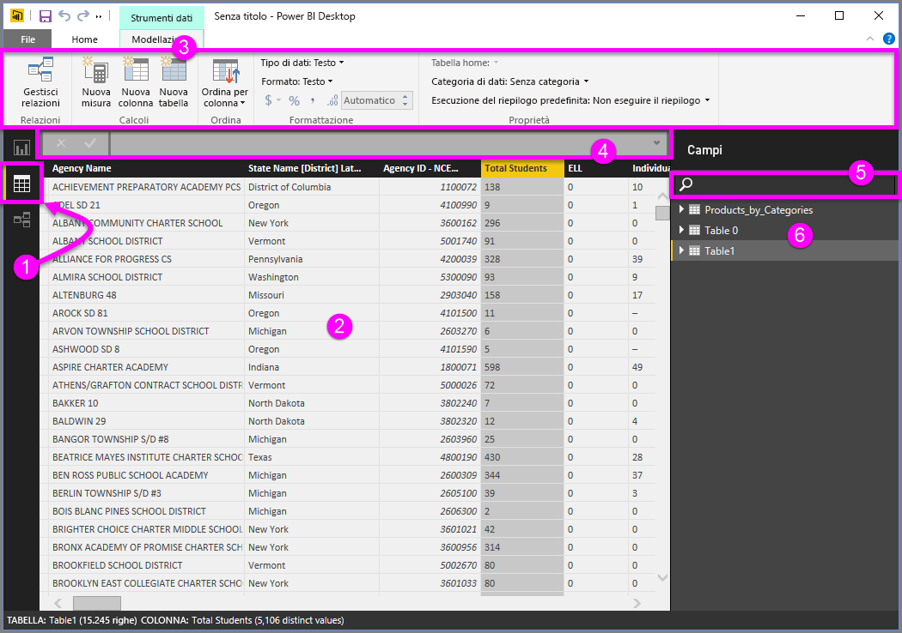
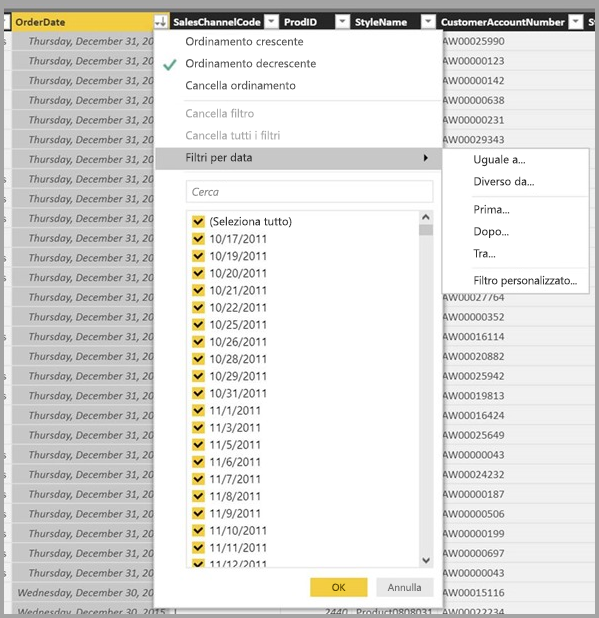

# Visualizzazione dati in Power BI Desktop
La **Vista dati** consente di esaminare, esplorare e interpretare i dati nel modello di **Power BI Desktop**. È diversa dalla visualizzazione di tabelle, colonne e dati nell'**Editor di query**. Con la Vista dati i dati vengono visualizzati *dopo* essere stati caricati nel modello.

Durante la modellazione dei dati talvolta si vuole vedere il contenuto effettivo di una tabella o una colonna senza creare un elemento visivo nell'area di disegno del report, spesso proprio al livello di riga. Questo risulta particolarmente utile per la creazione di misure e colonne calcolate o quando è necessario identificare un tipo di dati o una categoria di dati.

Di seguito si esaminano in dettaglio alcuni elementi della **Vista dati**.

1. **Icona Vista dati**: selezionare questa icona per accedere alla vista dati.

2. **Griglia dei dati**: visualizza la tabella selezionata e tutte le colonne e le righe in essa contenute. Le colonne nascoste nella **Visualizzazione report** sono visualizzate in grigio. È possibile fare clic con il pulsante destro del mouse su una colonna per visualizzare le opzioni.

3. **Barra multifunzione Creazione di modelli**: consente di gestire relazioni, creare calcoli e modificare il tipo di dati, il formato e la categoria di dati per una colonna.

4. **Barra della formula**: immettere le formule DAX per le misure e le colonne calcolate.

5. **Cerca**: consente di cercare una tabella o una colonna nel modello.

6. **Elenco dei campi**: selezionare una tabella o una colonna da visualizzare nella griglia dei dati.

## Applicazione di filtri nella vista dati

Nella **Vista dati** è anche possibile filtrare e ordinare i dati. Ogni colonna visualizza un'icona che identifica la direzione di ordinamento (se applicata).

È possibile filtrare singoli valori o usare un filtro avanzato in base ai dati presenti nella colonna. 

> [!NOTE]
> Quando un modello di Power BI viene creato in impostazioni cultura diverse dall'interfaccia utente corrente (ad esempio, il modello è stato creato in Inglese (Stati Uniti) e viene visualizzato in Spagnolo), La casella di ricerca viene visualizzata nell'interfaccia utente Vista dati solo per i campi di testo.
