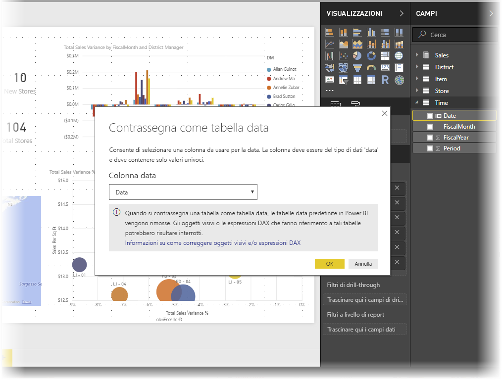
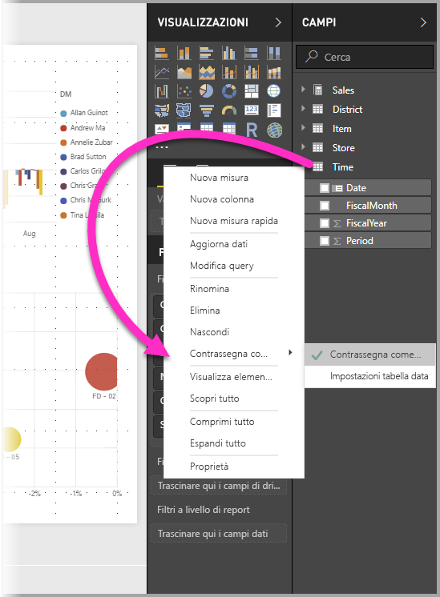
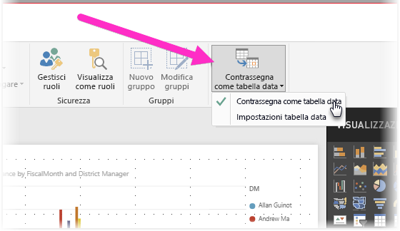
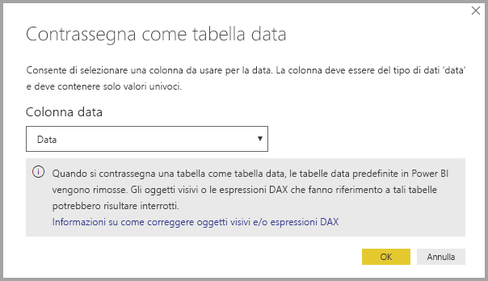
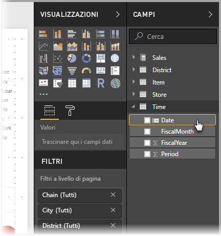
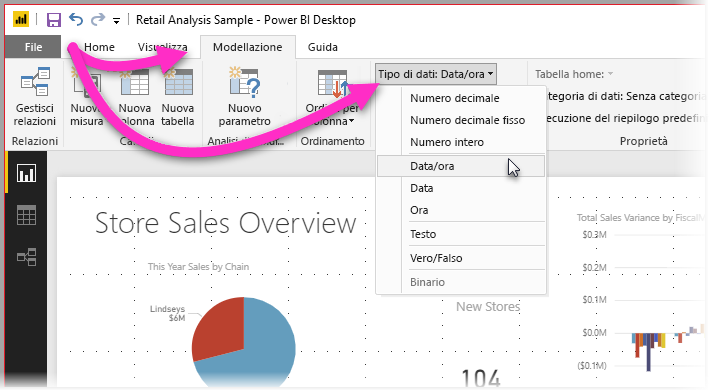

# Impostare e usare tabelle data in Power BI Desktop

**Power BI Desktop** supporta l'identificazione automatica delle tabelle come **tabelle data** in background e quindi crea automaticamente gerarchie di data e altri metadati per il modello. È quindi possibile usare tali gerarchie predefinite durante la creazione di funzionalità dei report come oggetti visivi, tabelle, misure rapide, filtri dei dati e così via. Power BI Desktop esegue queste operazioni tramite la creazione automatica di tabelle nascoste, poi utilizzabili per i report e le espressioni DAX.

Molti analisti di dati preferiscono creare autonomamente le tabelle data. In **Power BI Desktop** è possibile specificare la tabella che si vuole usare come **tabella data** nel modello e successivamente creare gli oggetti visivi, le tabelle, le misure rapide e altri elementi correlati alle date, usando i dati di data della tabella. Quando si specifica una tabella data personale, controllare le gerarchie di data create nel modello e usarle nelle **misure rapide** e per le altre operazioni che usano la tabella data del modello. 

## Impostazione di una tabella data personale

Per impostare una **tabella data**, selezionare la tabella che si vuole usare come tabella data nel riquadro **Campi**, quindi fare clic con il pulsante destro del mouse sulla tabella e scegliere **Contrassegna come tabella data > Contrassegna come tabella data** dal menu visualizzato, come illustrato nella figura seguente.

È anche possibile selezionare la tabella e quindi selezionare **Contrassegna come tabella data** dalla barra multifunzione **Creazione di modelli**, come illustrato di seguito.

Quando si specifica una **tabella data** personale, Power BI Desktop esegue le convalide seguenti della colonna e dei relativi dati, per assicurarsi che i dati:

* contengano valori univoci
* non contengano valori Null
* contengano valori di date contigue (dall'inizio alla fine)
* abbiano lo stesso timestamp per ogni valore, nel caso di dati di tipo **Data/ora**

Per la creazione di una tabella data personale esistono due possibili scenari, che rappresentano entrambi un approccio ragionevole:

* Il primo scenario è quando si usano una tabella e una gerarchia di date canoniche o di base. Si tratta di una tabella con dati che soddisfano i criteri di convalida descritti in precedenza per una tabella data. 

* Il secondo scenario è quando si usa una tabella da Analysis Services, ad esempio, con un campo *dim date* che si vuole usare come tabella data. 

Dopo aver specificato una tabella data, è possibile selezionare la colonna della tabella che rappresenta la colonna data. Per specificare la colonna da usare, selezionare la tabella nel riquadro **Campi**, quindi fare clic con il pulsante destro del mouse sulla tabella e scegliere **Contrassegna come tabella data > Impostazioni tabella data**. Verrà visualizzata la finestra seguente, in cui è possibile selezionare la colonna da usare come tabella data nella casella di riepilogo a discesa.

È importante notare che quando si specifica una tabella data personale, **Power BI Desktop** non crea automaticamente le gerarchie che creerebbe invece nel modello con il processo automatico. Se in un secondo momento si deseleziona la tabella data e non è disponibile una tabella data impostata manualmente, Power BI Desktop ricrea automaticamente le tabelle data predefinite per le colonne di date nella tabella.

È anche importante tenere presente che quando si contrassegna una tabella come tabella data, la tabella data predefinita (creata automaticamente) creata da Power BI Desktop viene rimossa e tutti gli oggetti visivi o le espressioni DAX creati in precedenza in base a tali tabelle predefinite non funzioneranno più in modo corretto. 

## Contrassegnare la tabella data con il tipo di dati appropriato

Quando si specifica una **tabella data** personale, è necessario assicurarsi di impostare correttamente il tipo di dati. È necessario impostare il **tipo di dati** su **Data/ora** o **Data**. A tale scopo, seguire questa procedura:

1. Selezionare la **tabella data** nel riquadro **Campi** espandendolo se necessario, quindi selezionare la colonna da usare come data.
   
     

2. Nella scheda **Modellazione** selezionare **Tipo di dati** e quindi fare clic sulla freccia a discesa per visualizzare i tipi di dati disponibili.

    

3. Specificare il tipo di dati per la colonna. 

## Passaggi successivi

Potrebbero essere interessanti anche gli articoli seguenti.

* [Tipi di dati in Power BI Desktop](desktop-data-types.md)

 