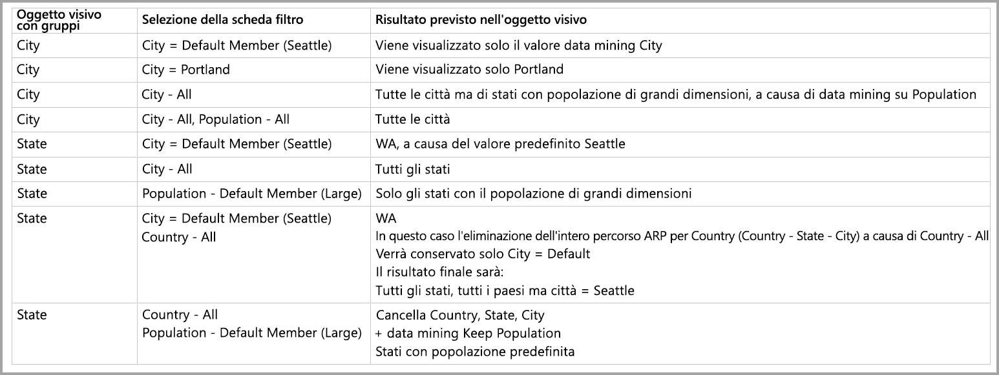

# Membro predefinito nei modelli multidimensionali in Power BI Desktop

È possibile connettersi a modelli multidimensionali in Power BI e creare report in cui visualizzare tutti i tipi di dati all'interno del modello. Quando si usano modelli multidimensionali, Power BI applica alcune regole alla modalità di elaborazione dei dati, basate sulla colonna definita come *membro predefinito*. 

Quando si usano modelli multidimensionali, Power BI gestisce i dati dal modello in base alla posizione in cui viene usata la colonna che contiene **DefaultMember**. L'attributo *DefaultMember* è impostato nel linguaggio CSDL (Conceptual Schema Definition Language) per una colonna specifica in un modello multidimensionale. Per altre informazioni sul membro predefinito, vedere l'[articolo sulle proprietà dell'attributo](https://docs.microsoft.com/sql/analysis-services/multidimensional-models/attribute-properties-define-a-default-member?view=sql-server-2017). Quando viene eseguita una query DAX, è possibile che il membro predefinito specificato nel modello venga applicato automaticamente.

Questo articolo descrive il comportamento di Power BI in varie circostanze, quando si usano modelli multidimensionali, in base alla posizione in cui si trova il *membro predefinito*. 

## Uso delle schede filtro

Quando si crea una scheda filtro su un campo con un membro predefinito, il valore del campo membro predefinito viene selezionato automaticamente nella scheda filtro. Il risultato è che tutti gli oggetti visivi interessati da una scheda filtro mantengono i modelli predefiniti nel database. I valori nelle schede filtro rifletteranno tale membro predefinito.

Se il membro predefinito viene rimosso, la deselezione del valore ne comporta la cancellazione per tutti gli oggetti visivi a cui si applica la scheda filtro e i valori visualizzati non riflettono il membro predefinito.

Si supponga ad esempio di avere una colonna *Valuta* con membro predefinito *EURO*:

* In questo caso di esempio, in presenza di una scheda che visualizza il *Totale vendite*, al valore sarà applicato il membro predefinito e verranno visualizzate le vendite corrispondenti a "EURO".
* Se si trascina *Valuta* nel riquadro della scheda filtro, il valore predefinito selezionato sarà *EURO*. Il valore di *Totale vendite* rimane invariato, perché è applicato il membro predefinito.
* Tuttavia, se si deseleziona il valore *EURO* nella scheda filtro, il membro predefinito per *Valuta* viene cancellato e *Totale vendite* mostra tutte le valute.
* Di conseguenza, quando si seleziona un altro valore nella scheda filtro (ad esempio *USD*), insieme al membro predefinito, il *Totale vendite* rispecchia il filtro *VALUTA IN {EURO, USD}* .

## Comportamento di raggruppamento

In Power BI, ogni volta che si raggruppa un oggetto visivo in base a una colonna con un *membro predefinito*, Power BI cancella il *membro predefinito* per tale colonna e il relativo percorso di relazione tra attributi. Ciò assicura che l'oggetto visivo mostri tutti i valori, anziché solo i valori predefiniti.

## Percorsi di relazione tra attributi

I percorsi di relazione tra attributi rendono disponibili funzionalità efficaci per i *membri predefiniti*, ma introducono anche un certo livello di complessità. In presenza di percorsi di relazione tra attributi, Power BI segue tali percorsi per cancellare ulteriori membri predefiniti per altre colonne, per offrire una gestione coerente e precisa dei dati per gli oggetti visivi.

Si vedrà ora un esempio per chiarire questo comportamento. Si consideri la configurazione seguente di percorsi di relazione tra attributi:

Si supponga che siano impostati i *membri predefiniti* seguenti per queste colonne:

* Città > Seattle
* Stato > WA
* Paese > USA
* Popolazione > Grande

Di seguito viene descritto il comportamento quando ogni colonna viene usata in Power BI. Quando gli oggetti visivi implementano il raggruppamento in base alle colonne seguenti, ecco i risultati:

* **Città** - Power BI visualizza tutte le città cancellando tutti i **membri predefiniti** per *Città*, *Stato*, *Paese*, ma mantiene il **membro predefinito** per *Popolazione*. Power BI ha cancellato l'intero percorso di relazione tra attributi per *Città*.
    > [!NOTE]
    > *Popolazione* non è il percorso di relazione tra attributi di *Città* ed è correlato esclusivamente a *Stato*, pertanto Power BI non lo cancella.
* **Stato** - Power BI visualizza tutti i valori di *Stato* cancellando tutti i **membri predefiniti** per *Città*, *Stato*, *Paese* e *Popolazione*.
* **Paese** - Power BI visualizza tutti i paesi cancellando tutti i **membri predefiniti** per *Città*, *Stato*, *Paese*, ma mantiene il **membro predefinito** per *Popolazione*.
* **Città e Stato** - Power BI cancella tutti i **membri predefiniti** per tutte le colonne.

Per i gruppi visualizzati nell'oggetto visivo viene cancellato l'intero percorso di relazione tra attributi. 

Se un gruppo non viene visualizzato nell'oggetto visivo, ma fa parte del percorso di relazione tra attributi di un'altra colonna raggruppata, si applica quanto segue:

* Non tutti i rami del percorso di relazione tra attributi vengono cancellati automaticamente.
* Tale gruppo è ancora filtrato in base a tale **membro predefinito** non cancellato.

### Filtri dei dati e schede filtro

Quando si usano filtri dei dati o schede filtro, si verifica quanto segue:

* Quando un filtro dei dati o una scheda filtro viene caricato con i dati, Power BI esegue il raggruppamento in base alla colonna nell'oggetto visivo, quindi il comportamento di visualizzazione è identico a quello descritto nella sezione precedente.

Dato che i filtri dei dati e le schede filtro vengono spesso usati per interagire con altri oggetti visivi, viene applicata la logica di cancellazione dei **membri predefiniti** per gli oggetti visivi interessati, come illustrato nella tabella seguente. 

In questa tabella vengono usati gli stessi dati di esempio usati in precedenza in questo articolo:

Per il comportamento di Power BI in tali circostanze si applicano le regole seguenti.

Power BI cancella un **membro predefinito** per una determinata colonna se:

* Power BI esegue il raggruppamento in base a tale colonna
* Power BI esegue il raggruppamento in base a una colonna correlata a tale colonna (in un punto qualsiasi nel percorso di relazione tra attributi, verso l'alto o verso il basso)
* Power BI applica un filtro in base a una colonna che si trova nel percorso di relazione tra attributi (verso l'alto o verso il basso)
* La colonna include una scheda filtro con stato *TUTTI*
* La colonna include una scheda filtro con qualsiasi valore selezionato (Power BI riceve un filtro per la colonna)

Power BI non cancella un **membro predefinito** per una determinata colonna se:

* La colonna include una scheda filtro con lo stato predefinito e Power BI esegue i raggruppamenti in base a una colonna nel relativo percorso di relazione tra attributi.
* La colonna è sopra un'altra colonna nel percorso di relazione tra attributi e Power BI include una scheda filtro per l'altra colonna nello stato predefinito.

## Passaggi successivi

Questo articolo ha illustrato il comportamento di Power BI quando si usano membri predefiniti nei modelli multidimensionali. Potrebbero essere interessanti anche gli articoli seguenti: 

* [Visualizzare elementi senza dati in Power BI](desktop-show-items-no-data.md)
* [Origini dati in Power BI Desktop](desktop-data-sources.md)
