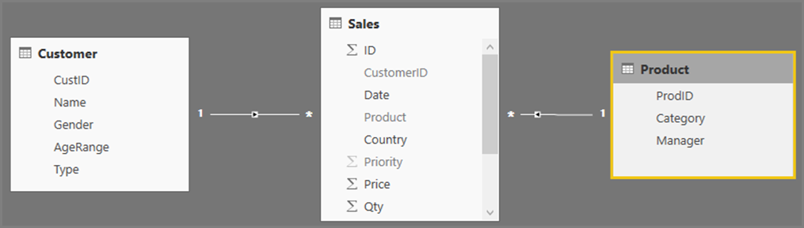
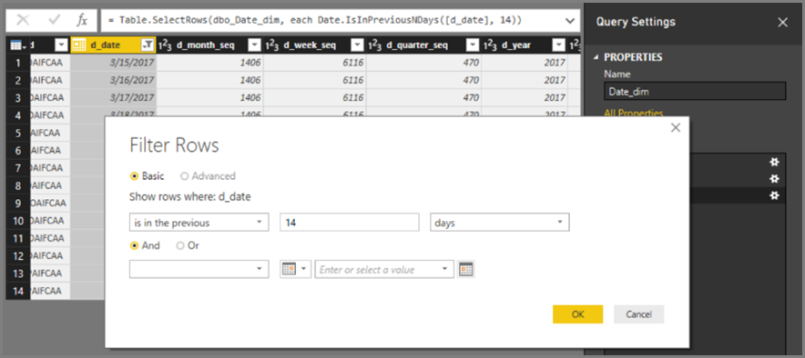
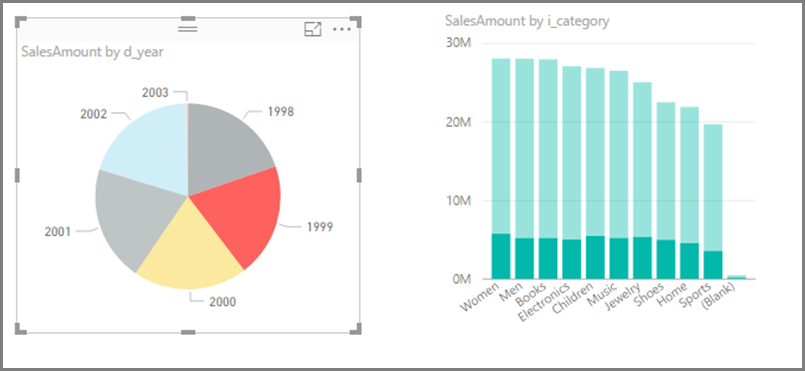
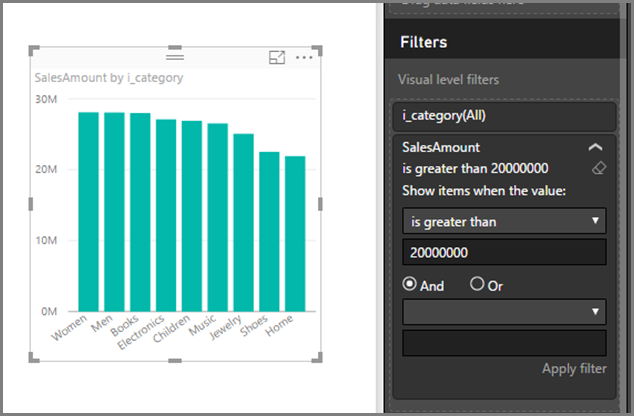
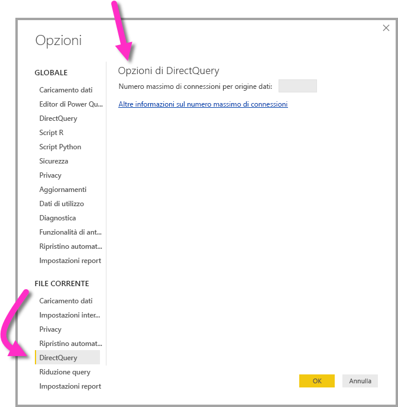
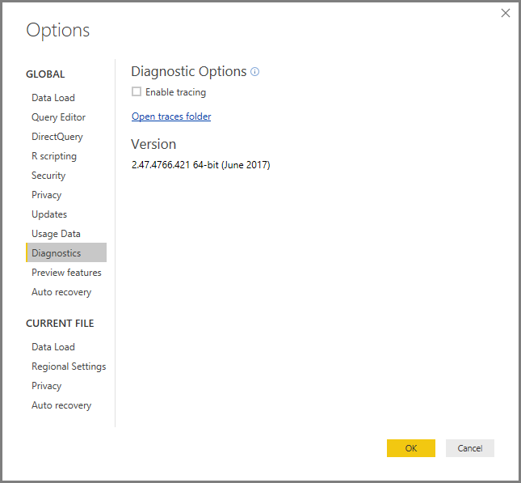
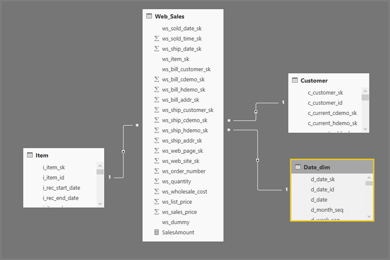
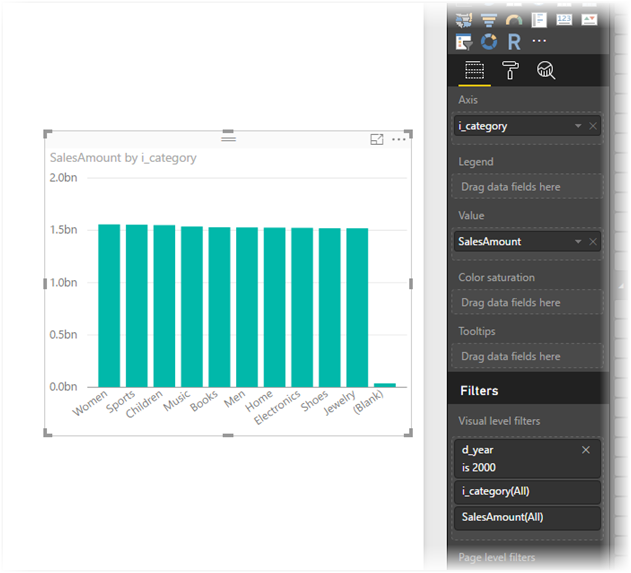

# Uso di DirectQuery in Power BI
Quando si usa **Power BI Desktop** o il **servizio Power BI** è possibile connettersi a tutti i tipi di origini dati ed effettuare tali connessioni dati in modi diversi. È possibile *importare* dati in Power BI, operazione che rappresenta il modo più comune per ottenere i dati, oppure connettersi direttamente ai dati nel relativo repository di origine tramite **DirectQuery**. Questo articolo descrive **DirectQuery** e le relative funzionalità:

* Diverse opzioni di connettività di DirectQuery
* Indicazioni per i casi in cui è opportuno preferire DirectQuery all'importazione
* Svantaggi dell'uso di DirectQuery
* Procedure consigliate per l'uso di DirectQuery

In breve, le procedure consigliate per l'uso dell'importazione rispetto a DirectQuery sono le seguenti:

* È opportuno **importare** i dati in Power BI laddove possibile. L'importazione consente di sfruttare il motore di query ad alte prestazioni di Power BI e offre un'esperienza altamente interattiva e completa per i dati.
* Se gli obiettivi non possono essere soddisfatti con l'importazione dei dati, prendere in considerazione l'uso di **DirectQuery**. Se ad esempio i dati cambiano di frequente e i report devono riflettere i dati più recenti, DirectQuery può essere l'opzione ottimale. L'uso di DirectQuery è tuttavia generalmente possibile solo quando l'origine dati sottostante è in grado di generare query interattive (meno di 5 secondi) per la tipica query di aggregazione e di gestire il carico di query generato. È anche necessario considerare attentamente le limitazioni che accompagnano l'uso di DirectQuery.

Il set di funzionalità offerte da Power BI per entrambe le modalità di connettività, importazione e DirectQuery, evolveranno nel tempo. Sarà disponibile maggiore flessibilità nell'uso dei dati importati, in modo che l'importazione possa essere usata in un numero più elevato di casi ed eliminando alcuni degli svantaggi di DirectQuery. A prescindere dai miglioramenti, le prestazioni dell'origine dati sottostante saranno sempre una considerazione importante nell'uso di DirectQuery. Se l'origine dati sottostante è lenta, l'uso di DirectQuery per tale origine continuerà a essere impossibile.

Questo argomento descrive DirectQuery con Power BI e non con SQL Server Analysis Services. DirectQuery è anche una funzionalità di **SQL Server Analysis Services** e molti dettagli descritti di seguito si applicano all'uso di questa soluzione, benché vi siano anche differenze importanti. Per informazioni sull'uso di DirectQuery con SQL Server Analysis Services, vedere il [white paper che illustra in dettaglio DirectQuery in SQL Server Analysis Services 2016](http://download.microsoft.com/download/F/6/F/F6FBC1FC-F956-49A1-80CD-2941C3B6E417/DirectQuery%20in%20Analysis%20Services%20-%20Whitepaper.pdf).  

Questo articolo illustra il flusso di lavoro consigliato per DirectQuery, in cui il report viene creato in **Power BI Desktop**, ma descrive anche la connessione diretta nel **servizio Power BI**.

## Modalità di connettività di Power BI
Power BI si connette a un numero elevato di origini dati diverse, tra cui:

* Servizi online (Salesforce, Dynamics 365 e altri)
* Database (SQL Server, Access, Amazon Redshift e altri)
* File semplici (Excel, JSON e altri)
* Altre origini dati (Spark, siti Web, Microsoft Exchange e altri)

Per queste origini è in genere possibile importare i dati in Power BI. Per alcune è anche possibile connettersi con DirectQuery. Il set di origini che supporta DirectQuery è descritto nell'articolo [Data Sources supported by DirectQuery](desktop-directquery-data-sources.md) (Origini dati supportate da DirectQuery). Altre origini supporteranno DirectQuery in futuro, principalmente quelle che si prevede possano fornire performance soddisfacenti per le query interattive.

**SQL Server Analysis Services** è un caso particolare. Quando ci si connette a SQL Server Analysis Services, è possibile scegliere di importare i dati o usare una *connessione dinamica*.  La connessione dinamica è simile a DirectQuery, perché nessun dato viene importato e viene sempre eseguita una query sull'origine dati sottostante per aggiornare un oggetto visivo. La *connessione dinamica* è tuttavia diversa sotto molti altri aspetti e viene quindi usato un termine diverso, ovvero *dinamica* al posto di *DirectQuery*.

Queste tre opzioni per la connessione ai dati, ovvero **importazione**, **DirectQuery**, e **connessione dinamica**, sono illustrate in dettaglio nelle sezioni seguenti.

### Connessioni di importazione
Quando si usa **Recupera dati** in **Power BI Desktop** per connettersi a un'origine dati come SQL Server e si sceglie **Importa**, il comportamento della connessione è il seguente:

* Durante l'esperienza di **recupero dati** iniziale, ogni tabella del set selezionato definisce una query che restituisce un set di dati. Queste query possono essere modificate prima di caricare i dati, ad esempio per applicare filtri, aggregare i dati o unire tabelle diverse.
* Durante il caricamento, tutti i dati definiti da tali query verranno importati nella cache di Power BI.
* Durante la compilazione di un oggetto visivo in **Power BI Desktop** verrà eseguita una query sui dati importati. L'archivio di Power BI assicura che la query sarà veloce e che quindi tutte le modifiche apportate all'oggetto visivo verranno propagate immediatamente.
* Eventuali modifiche ai dati sottostanti non verranno propagate agli oggetti visivi. È necessario *aggiornare* per importati nuovamente i dati.
* Al momento della pubblicazione del report (file con estensione pbix) nel **servizio Power BI**, viene creato e caricato un set di dati nel servizio Power BI.  I dati importati sono inclusi con tale set di dati. È quindi possibile configurare l'aggiornamento pianificato dei dati, ad esempio, per importare nuovamente i dati ogni giorno. A seconda del percorso dell'origine dati potrebbe essere necessario configurare un gateway dati locale.
* Quando si apre un report esistente nel **servizio Power BI** oppure si crea un nuovo report, viene di nuovo eseguita una query sui dati importati, garantendo l'interattività.
* È possibile aggiungere oggetti visivi o intere pagine del report come riquadri del dashboard. I riquadri verranno aggiornati automaticamente ogni volta che viene aggiornato il set di dati sottostante.  

### Connessioni DirectQuery
Quando si usa **Recupera dati** in **Power BI Desktop** per connettersi a un'origine dati e si sceglie **DirectQuery**, il comportamento della connessione è il seguente:

* Durante l'esperienza di **recupero dati** iniziale viene selezionata l'origine. Per le origini relazionali, ciò significa che viene selezionato un set di tabelle, ognuna delle quali definisce una query che restituisce un set di dati in modo logico. Per le origini multidimensionali, ad esempio SAP BW, viene selezionata solo l'origine.
* Durante il caricamento non vengono tuttavia importati effettivamente dati nell'archivio di Power BI. Durante la compilazione di un oggetto visivo in **Power BI Desktop** verranno invece inviate query all'origine dati sottostante per recuperare i dati necessari. Il tempo impiegato successivamente per aggiornare l'oggetto visivo dipenderanno dalle prestazioni dell'origine dati sottostante.
* Eventuali modifiche ai dati sottostanti non verranno propagate immediatamente agli oggetti visivi esistenti. È comunque necessario eseguire l'aggiornamento per inviare nuovamente le query necessarie per ogni oggetto visivo e aggiornare l'oggetto stesso.
* Al momento della pubblicazione del report nel **servizio Power BI**, viene anche in questo caso creato un set di dati nel servizio Power BI, come per l'importazione. Il set di dati *non include tuttavia dati*.
* Quando si apre un report esistente nel **servizio Power BI** oppure si crea un nuovo report, viene di nuovo eseguita una query sull'origine dati sottostante per recuperare i dati necessari. A seconda del percorso dell'origine dati potrebbe essere necessario configurare un gateway dati locale, come nel caso della modalità di importazione se i dati vengono aggiornati.
* È possibile aggiungere oggetti visivi o intere pagine del report come riquadri del dashboard. Per garantire che l'apertura di un dashboard sia rapida, i riquadri vengono aggiornati automaticamente secondo una pianificazione, ad esempio ogni ora. È possibile gestire la frequenza di aggiornamento in modo da riflettere la frequenza di modifica dei dati e in che misura sia importante visualizzare i dati più recenti. Quando si apre un dashboard, i riquadri riflettono quindi i dati al momento dell'ultimo aggiornamento e non necessariamente le modifiche più recenti apportate all'origine sottostante. È sempre possibile aggiornare un dashboard aperto per assicurarsi che sia aggiornato.    

### Connessioni dinamiche
Quando ci si connette a **SQL Server Analysis Services** (SSAS), è disponibile un'opzione per importare dati dal modello di dati selezionato o connettersi dinamicamente al modello stesso. Se si seleziona **Importa**, si definisce una query su tale origine SSAS esterna e i dati vengono importati come di consueto. Se si sceglie la **connessione dinamica** non verrà definita alcuna query e nell'elenco dei campi verrà visualizzato l'intero modello esterno. Se si seleziona **DirectQuery**, durante la compilazione di oggetti visivi vengono inviate query all'origine SSAS esterna. A differenza di DirectQuery, non viene creato un nuovo *modello*, ovvero non è possibile definire nuove colonne calcolate, gerarchie, relazioni e così via. Ci si connette invece direttamente al modello SSAS esterno.

La situazione descritta nel paragrafo precedente si applica anche alla connessione alle origini seguenti, ad eccezione del fatto che non è possibile importare i dati:

* Set di dati di Power BI, ad esempio quando ci si connette a un set di dati di Power BI creato in precedenza e pubblicato nel servizio, per creare un nuovo report correlato
* Common Data Service

Il comportamento dei report su SSAS al momento della pubblicazione nel **servizio Power BI** è simile a quello dei report di DirectQuery sotto gli aspetti seguenti:

* Quando si apre un report esistente nel **servizio Power BI** oppure si crea un nuovo report, viene eseguita una query sull'origine dati SSAS sottostante. L'operazione può richiedere un gateway dati locale.
* I riquadri del dashboard vengono aggiornati automaticamente in base a una pianificazione, ad esempio ogni ora o secondo qualsiasi frequenza definita.

Esistono tuttavia differenze importanti. Per le connessioni dinamiche, ad esempio, l'identità dell'utente che apre il report verrà sempre passata all'origine SSAS sottostante.

Terminati questi confronti, ci si concentrerà ora esclusivamente su **DirectQuery** per il resto di questo articolo.

## Situazioni in cui è utile DirectQuery
La tabella seguente descrive gli scenari in cui la connessione con DirectQuery può essere particolarmente proficua, inclusi i casi in cui è considerato utile lasciare i dati nell'origine. La descrizione indica anche se lo scenario specificato è disponibile in Power BI.

| Limitazione | Descrizione |
| --- | --- |
| I dati cambiano di frequente e sono necessari report quasi 'in tempo reale' |I modelli con dati importati possono essere aggiornati al massimo una volta l'ora. Se quindi i dati cambiano continuamente, è necessario che i report visualizzino i dati più recenti, quindi l'importazione con l'aggiornamento pianificato potrebbe non soddisfare questi requisiti. Si noti che è anche possibile trasmettere dati direttamente in Power BI, anche se esistono limiti ai volumi di dati supportati in questo caso.     Se si usa DirectQuery, al contrario, aprendo o aggiornando un report o un dashboard verranno sempre visualizzati i dati più recenti dell'origine. I riquadri del dashboard possono essere aggiornati più frequentemente, anche ogni 15 minuti. |
| Dati di dimensioni molto grandi |Se i dati hanno dimensioni molto grandi, non è certamente fattibile importarli tutti. DirectQuery, al contrario, non richiede il trasferimento di molti dati perché le query vengono eseguite localmente.     I dati di grandi dimensioni possono tuttavia anche implicare che le query su tale origine sottostante siano troppo lente, come descritto in *Implicazioni dell'uso di DirectQuery* più avanti in questo articolo. Naturalmente, non è sempre necessario importare i dati dettagliati completi. I dati possono essere invece preaggregati durante l'importazione e l'**editor di query** semplifica proprio questa operazione. In casi estremi è possibile importare esattamente i dati di aggregazione necessari per ogni oggetto visivo. Anche se DirectQuery è l'approccio più semplice per i dati di grandi dimensioni, è quindi consigliabile tenere sempre presente che l'importazione di dati aggregati può rappresentare una soluzione se l'origine sottostante è troppo lenta. |
| Le regole di sicurezza vengono definite nell'origine sottostante |Quando i dati vengono importati, Power BI si connette all'origine dati usando le credenziali dell'utente corrente (da Power BI Desktop) oppure le credenziali definite nell'ambito della configurazione dell'aggiornamento pianificato (dal servizio Power BI). Nella pubblicazione e condivisione di questo report è quindi necessario prestare attenzione a condividere il report solo con gli utenti autorizzati a visualizzare gli stessi dati oppure definire sicurezza di livello di riga nell'ambito del set di dati.     Dato che DirectQuery esegue sempre query sull'origine sottostante, ciò consente idealmente l'applicazione di qualunque criterio di sicurezza nell'origine stessa. Attualmente Power BI si connette tuttavia all'origine sottostante usando sempre le stesse credenziali usate per l'importazione.     Fino a quando Power BI non consentirà all'identità del consumer del report di raggiungere l'origine sottostante, DirectQuery non offrirà vantaggi in termini di sicurezza dell'origine dati. |
| Limitazioni di sovranità dei dati |Alcune organizzazioni hanno criteri di sovranità dei dati, ovvero i dati non possono uscire dall'organizzazione. Una soluzione basata sull'importazione potrebbe chiaramente presentare problemi. Con DirectQuery, al contrario, i dati rimangono nell'origine sottostante.     Si noti tuttavia che anche con DirectQuery alcune cache di dati a livello di oggetto visivo vengono conservate nel servizio Power BI, a causa dell'aggiornamento pianificato dei riquadri. |
| L'origine dati sottostante è un'origine OLAP contenente misure |Se l'origine dati sottostante contiene *misure*, ad esempio SAP HANA o SAP Business Warehouse, l'importazione dei dati presenta altri problemi. Ciò significa che i dati importati si trovano a un determinato livello di aggregazione come definito dalla query, ad esempio, la misurazione di TotalSales per classe, anno e città. Quindi, se viene creato un oggetto visivo che richiede dati a un livello di aggregazione superiore, ad esempio TotalSales per anno, il valore di aggregazione verrà ulteriormente aggregato. L'operazione funziona per le misure additive, ad esempio Sum e Min, ma rappresenta un problema per le misure non additive, ad esempio Average e DistinctCount.     Per ottenere facilmente i dati aggregati corretti (in base a quanto richiesto dall'oggetto visivo specifico) direttamente dall'origine, sarà necessario inviare query per ogni oggetto visivo, come in DirectQuery.     Quando ci si connette a SAP Business Warehouse (BW), la scelta di DirectQuery consente questo trattamento delle misure. Il supporto per SAP BW viene illustrato nei dettagli in [DirectQuery and SAP BW](desktop-directquery-sap-bw.md) (DirectQuery e SAP BW).     Al momento, DirectQuery in SAP HANA tratta tuttavia le misure come un'origine relazionale e offre quindi un comportamento simile all'importazione. Questi aspetti vengono illustrati nei dettagli in [DirectQuery and SAP HANA](desktop-directquery-sap-hana.md) (DirectQuery e SAP HANA). |

Date quindi le attuali funzionalità di DirectQuery in Power BI, gli scenari in cui offre vantaggi sono i seguenti:

* I dati cambiano di frequente e sono necessari report quasi 'in tempo reale'
* Gestione di dati di dimensioni molto grandi, senza la necessità di preaggregare
* Limitazioni di sovranità dei dati
* L'origine è multidimensionale e contiene misure, ad esempio SAP BW

I dettagli nell'elenco precedente si riferiscono all'uso del solo Power BI. È sempre possibile usare invece un modello esterno di SQL Server Analysis Services (o Azure Analysis Services) per importare i dati e quindi usare Power BI per connettersi a tale modello. Anche se questo approccio richiede competenze aggiuntive, offre maggiore flessibilità. È ad esempio possibile importare volumi di dati molto più elevati, senza limitazioni in termini di frequenza di aggiornamento dei dati.

## Implicazioni dell'uso di DirectQuery
L'uso di **DirectQuery** ha implicazioni potenzialmente negative, come descritto in questa sezione. Alcune di queste limitazioni differiscono leggermente a seconda dell'origine usata. Queste differenze vengono evidenziate laddove applicabile e le origini sostanzialmente diverse vengono trattate in argomenti separati.  

### Prestazioni e carico sull'origine sottostante
Quando si usa **DirectQuery**, l'esperienza complessiva dipende molto dalle prestazioni dell'origine dati sottostante. Se l'aggiornamento di ogni oggetto visivo (ad esempio dopo il cambiamento di un valore di filtro dei dati) richiede pochi secondi (< 5 s), l'esperienza sarà ragionevole, ma potrà comunque apparire lenta rispetto alla risposta immediata che si ottiene abitualmente quando si importano i dati in Power BI. Se data la lentezza dell'origine i singoli oggetti visivi richiedono invece più tempo (decine di secondi), l'esperienza diventa estremamente insoddisfacente, eventualmente provocando anche il timeout delle query.

Oltre alle prestazioni dell'origine sottostante è necessario considerare attentamente il carico che verrà applicato all'origine, dato che anch'esso influisce spesso sulle prestazioni. Come illustrato anche di seguito, ogni utente che apre un report condiviso e ogni riquadro del dashboard che viene aggiornato periodicamente invia almeno una query per oggetto visivo all'origine sottostante. L'origine deve quindi poter gestire questo carico di query mantenendo prestazioni accettabili.

### Limitazione a una singola origine
Quando si importano dati, è possibile combinare dati da più origini in un singolo modello, ad esempio per unire facilmente alcuni dati di un database SQL Server aziendale con alcuni dati locali gestiti in un file Excel. Questa operazione non è possibile quando si usa DirectQuery. Quando si seleziona DirectQuery per un'origine, è possibile usare solo i dati di quella singola origine, ad esempio un singolo database SQL Server.

### Trasformazione dei dati limitata
Analogamente, sono presenti limitazioni nelle trasformazioni dei dati che possono essere applicate all'interno dell'**editor di query**. Con i dati importati è possibile applicare facilmente un set di trasformazioni sofisticato per pulire e modificare la forma dei dati prima di usarli per creare oggetti visivi, ad esempio per l'analisi di documenti JSON o la trasformazione tramite Pivot da un modulo orientato alle colonne a un modulo orientato alle righe. Queste trasformazioni sono più limitate in DirectQuery. Quando ci si connette a un'origine OLAP come SAP Business Warehouse, non è possibile definire alcuna trasformazione e l'intero "modello" esterno proviene dall'origine. Per le origini relazionali, ad esempio SQL Server, è comunque possibile definire un set di trasformazioni per ogni query, ma tali trasformazioni sono limitate per motivi che riguardano le prestazioni. Qualsiasi trasformazione di questo tipo dovrà essere applicata a ogni query per l'origine sottostante, anziché una sola volta al momento dell'aggiornamento dati, quindi saranno possibili solo le trasformazioni che possono essere ragionevolmente convertite in una singola query nativa. Se si usa una trasformazione troppo complessa, si riceverà un errore che indica che la trasformazione deve essere eliminata oppure che è necessario impostare la modalità di importazione per il modello.

La query ottenuta dalla finestra di dialogo **Recupera dati** o dall'**editor di query** verrà usata in una sub-SELECT delle query generate e inviata per recuperare i dati necessari per un oggetto visivo. In questo modo, la query definita nell'editor di query deve essere valida in questo contesto. In particolare, ciò significa che non è possibile usare una query con espressioni di tabella comuni o che richiami stored procedure.

### Limitazioni di modellazione
In questo contesto il termine *modellazione* indica l'azione di modifica e arricchimento dei dati non elaborati, nell'ambito della creazione di un report che usa tali dati. Alcuni esempi:

* Definizione di relazioni tra tabelle
* Aggiunta di nuovi calcoli (colonne calcolate e misure)
* Ridenominazione e disattivazione della visualizzazione di colonne e misure
* Definizione di gerarchie
* Definizione della formattazione, dell'esecuzione del riepilogo predefinita e dell'ordinamento di una colonna
* Raggruppamento o clustering dei valori

Quando si usa **DirectQuery** è comunque possibile apportare molti di questi miglioramenti e vale comunque il principio di arricchire i dati non elaborati per migliorare l'uso in un momento successivo. Alcune funzionalità di modellazione non sono tuttavia disponibili o sono limitate quando si usa DirectQuery. Le limitazioni vengono in genere applicate per evitare problemi di prestazioni. Le limitazioni comuni a tutte le origini DirectQuery sono elencate nell'elenco puntato seguente. Possono essere applicabili limitazioni aggiuntive alle singole origini, come descritto in *Dettagli specifici dell'origine dati* verso la fine di questo articolo.

* **Nessuna gerarchia di data predefinita:** quando si importano dati, per impostazione predefinita ogni colonna date/datetime ha anche una gerarchia di data predefinita. Se ad esempio si importa una tabella di ordini di vendita che include una colonna OrderDate, quando si usa OrderDate in un oggetto visivo sarà possibile scegliere il livello appropriato (anno, mese, giorno) da usare. Questa gerarchia di data predefinita non è disponibile quando si usa la modalità DirectQuery. Si noti tuttavia che se nell'origine sottostante è disponibile la tabella Date (come avviene spesso in molti data warehouse), è possibile usare le funzionalità DAX di Business Intelligence per le gerarchie temporali come di consueto.
* **Limitazioni nelle colonne calcolate:** le colonne calcolate possono essere solo intrariga, ovvero possono fare riferimento solo ai valori delle altre colonne della stessa tabella, senza usare funzioni di aggregazione. Le funzioni scalari DAX, ad esempio LEFT(), consentite saranno limitate a quelle che possono essere semplicemente inserite nell'origine sottostante, quindi varieranno a seconda delle funzionalità dell'origine. Le funzioni non supportate non verranno elencate nel completamento automatico quando si crea la funzione DAX per una colonna calcolata e produrranno un errore se usate.
* **Nessun supporto per le funzioni DAX padre-figlio:** nel modello DirectQuery non è possibile usare la famiglia di funzioni DAX PATH() che in genere gestiscono strutture padre-figlio, ad esempio piani dei conti o gerarchie dei dipendenti.
* **Limitazioni (per impostazione predefinita) per le misure:** per impostazione predefinita, le funzioni ed espressioni DAX che possono essere usate nelle misure sono limitate. Il completamento automatico limiterà anche in questo caso le funzioni elencate e si verificherà un errore se viene usata una funzione o un'espressione non valida. L'obiettivo è semplicemente garantire che, per impostazione predefinita, le misure siano limitate a misure semplici che hanno scarse probabilità di compromettere le prestazioni. Gli utenti avanzati possono scegliere di ignorare questa limitazione selezionando **File > Opzioni e impostazioni > Opzioni**, quindi **DirectQuery** e infine l'opzione *Consenti misure senza limitazioni in modalità DirectQuery*. Quando questa opzione è selezionata, è possibile usare un'espressione DAX valida per una misura. Gli utenti, tuttavia, devono tenere presente che alcune espressioni, che hanno prestazioni molto elevate quando i dati vengono importati, possono restituire query lente nell'origine back-end quando sono in modalità DirectQuery.
  
  * Ad esempio, per impostazione predefinita:
    
    * È possibile creare una misura che sommi semplicemente l'importo delle vendite:
      
          SalesAmount = SUMX(Web_Sales, [ws_sales_price]* [ws_quantity])
    * *Non* è possibile creare una misura che calcoli quindi la media di SalesAmount su tutti gli elementi:
      
          AverageItemSalesAmount = AVERAGEX('Item', [SalesAmount])
    
    Il motivo è che tale misura può comportare una riduzione delle prestazioni in presenza di un numero elevato di elementi.
* **Le tabelle calcolate non sono supportate:** la possibilità di definire una tabella calcolata usando un'espressione DAX non è supportata nella modalità DirectQuery.
* **Il filtro delle relazioni è limitato a una sola direzione:** quando si usa DirectQuery, non è possibile impostare la direzione del filtro incrociato per una relazione su "Entrambi". Con le tre tabelle sottostanti, ad esempio, non sarebbe possibile compilare un oggetto visivo che visualizzi ogni Customer[Gender] e il numero di Product[Category] acquistato da ognuno. L'uso di questo filtro bidirezionale viene descritto [in questo white paper dettagliato](http://download.microsoft.com/download/2/7/8/2782DF95-3E0D-40CD-BFC8-749A2882E109/Bidirectional%20cross-filtering%20in%20Analysis%20Services%202016%20and%20Power%20BI.docx) che contiene esempi relativi a SQL Server Analysis Services, ma i punti fondamentali sono ugualmente applicabili a Power BI.
  
  
  
  Anche in questo caso, il limite viene imposto a causa delle implicazioni sulle prestazioni. Un'applicazione particolarmente importante si ha quando si definisce la sicurezza a livello di riga nell'ambito del report, perché è comune adottare una relazione molti-a-molti tra gli utenti e le entità cui sono autorizzati ad accedere e l'uso del filtro bidirezionale è necessario a tale scopo. I filtri bidirezionali devono essere tuttavia usati con cautela per i modelli DirectQuery, con particolare attenzione a qualsiasi impatto negativo sulle prestazioni.  
* **Nessun clustering:** con DirectQuery non è possibile usare la funzionalità di clustering per trovare automaticamente i gruppi.

### Limitazioni della creazione di report
Quasi tutte le funzionalità di creazione di report sono supportate per i modelli DirectQuery. È quindi possibile usare lo stesso set di visualizzazioni finché l'origine sottostante offre un livello di prestazioni adeguato. Esistono tuttavia importanti limitazioni in alcune delle funzionalità disponibili nel **servizio Power BI** dopo la pubblicazione di un report, come descritto nell'elenco riportato di seguito:

* **Informazioni rapide non è supportato:** Informazioni rapide di Power BI esegue ricerche in diversi subset del set di dati applicando una serie di algoritmi complessi per individuare informazioni potenzialmente interessanti. Data la necessità di query con prestazioni molto elevate, questa funzionalità non è disponibile nei set di dati con DirectQuery.
* **Domande e risposte non è supportato:** Domande e risposte di Power BI consente di esplorare i dati tramite funzionalità intuitive basate sul linguaggio naturale e di ricevere le risposte sotto forma di grafici. Non è tuttavia attualmente supportato nei set di dati con DirectQuery.
* **L'uso di Esplora in Excel determinerà probabilmente un calo di prestazioni:** è possibile esplorare i dati usando la funzionalità "Esplora in Excel" in un set di dati. Ciò consente di creare tabelle e grafici pivot in Excel. Anche se questa funzionalità è supportata nei set di dati con DirectQuery, le prestazioni sono in genere più lente rispetto alla creazione di oggetti visivi in Power BI ed è necessario tener conto di questo aspetto nella decisione di usare DirectQuery se l'uso di Excel è importante per i propri scenari.

### Sicurezza
Come illustrato in precedenza in questo articolo, un report di **DirectQuery** userà sempre le stesse credenziali fisse per la connessione all'origine dati sottostante, dopo la pubblicazione nel **servizio Power BI**. Si noti che ciò si riferisce in modo specifico a DirectQuery, non alle connessioni dinamiche a SQL Server Analysis Services che sono diverse sotto questo aspetto. Subito dopo la pubblicazione di un report di DirectQuery è quindi necessario configurare le credenziali dell'utente che verranno usate. Finché non viene eseguita questa operazione, l'apertura del report nel servizio Power BI provocherà un errore.

Dopo aver specificato le credenziali dell'utente, queste verranno usate *indipendentemente dall'utente che apre il report*. Sotto questo aspetto non esistono differenze con i dati importati: ogni utente vedrà gli stessi dati, a meno che non sia stata definita la sicurezza a livello di riga nell'ambito del report. È quindi necessario prestare la stessa attenzione alla condivisione del report, se sono presenti regole di sicurezza definite nell'origine sottostante.

### Comportamento nel servizio Power BI
Questa sezione descrive il comportamento di un report di **DirectQuery** nel **servizio Power BI**, per consentire principalmente di comprendere l'entità del carico applicato all'origine dati back-end dato il numero di utenti con i quali verranno condivisi il report e il dashboard, la complessità del report e a seconda che sia stata definita la sicurezza a livello di riga nel report.

#### Report: apertura, interazione, modifica
Quando si apre un report, tutti gli oggetti visivi presenti nella pagina visualizzata verranno aggiornati. Ciascun oggetto visivo richiede in genere almeno una query sull'origine dati sottostante. Alcuni oggetti visivi potrebbero richiedere più di una query, ad esempio se visualizzano valori aggregati di due tabelle dei fatti diverse, contengono una misura più complessa oppure contengono totali di una misura non additiva come Count Distinct. Con il passaggio a una nuova pagina, gli oggetti visivi verranno aggiornati, creando così un nuovo set di query sull'origine sottostante.

Ogni interazione dell'utente con il report può comportare l'aggiornamento degli oggetti visivi. La selezione di un valore diverso in un filtro dei dati richiede ad esempio l'invio di un nuovo set di query per aggiornare tutti gli oggetti visivi interessati. Lo stesso vale quando si fa clic su un oggetto visivo per l'evidenziazione incrociata di altri oggetti visivi oppure quando si modifica il filtro.  

In modo analogo, la modifica di un nuovo report richiederà naturalmente l'invio di query per ogni passaggio necessario per produrre l'oggetto visivo finale desiderato.

I risultati vengono memorizzati nella cache, in modo che l'aggiornamento di un oggetto visivo sia istantaneo se di recente sono stati ottenuti gli stessi identici risultati. Le cache non sono condivise tra gli utenti se è stata definita la sicurezza a livello di riga nell'ambito del report.

#### Aggiornamento del dashboard
È possibile aggiungere singoli oggetti visivi o intere pagine come riquadri del dashboard. I riquadri basati sui set di dati di **DirectQuery** verranno quindi aggiornati automaticamente secondo una pianificazione, determinando l'invio di query all'origine dati back-end. Questa operazione viene eseguita ogni ora per impostazione predefinita, ma è possibile definire l'esecuzione settimanale o ogni 15 minuti nelle impostazioni del set di dati.

Se non è stata definita sicurezza a livello di riga nel modello, ogni riquadro verrà aggiornato una sola volta e i risultati verranno condivisi tra tutti gli utenti. Se è definita la sicurezza a livello di riga può verificarsi un effetto moltiplicatore rilevante: ogni riquadro richiede l'invio di query separate per ogni utente all'origine sottostante.  

Un dashboard con dieci riquadri condivisi con 100 utenti e creato su un set di dati con **DirectQuery**, dotato di sicurezza a livello di riga e configurato per l'aggiornamento ogni 15 minuti, comporterà l'invio di almeno 1000 query ogni 15 minuti all'origine back-end.

È quindi necessario valutare attentamente l'uso della sicurezza a livello di riga e la configurazione della frequenza di aggiornamento.

#### Timeout
Nel **servizio Power BI** viene applicato un timeout di quattro minuti alle singole query. Quelle che richiedono più tempo avranno esito negativo. Come sottolineato in precedenza, è consigliabile usare DirectQuery per le origini che forniscono prestazioni per query quasi interattive, quindi questo limite ha lo scopo di evitare problemi dovuti a tempi di esecuzione eccessivamente lunghi.

### Altre implicazioni
Alcune altre implicazioni generali dell'uso di **DirectQuery** sono le seguenti:

* **Se i dati cambiano, è necessario aggiornare per assicurarsi che vengano visualizzati i dati più recenti:** Dato l'uso di cache, non c'è garanzia che l'oggetto visivo visualizzi sempre i dati più recenti. Un oggetto visivo può ad esempio visualizzare le transazioni dell'ultimo giorno. A causa della modifica di un filtro dei dati, potrebbe essere successivamente aggiornato per visualizzare le transazioni degli ultimi due giorni, includendo alcune transazioni molto recenti, appena pervenute. Reimpostando il filtro dei dati sul valore originale, l'oggetto visualizzerà di nuovo il valore ottenuto in precedenza e memorizzato nella cache, senza includere le transazioni appena pervenute.
  
  Selezionando Aggiorna, le cache verranno cancellate e tutti gli oggetti visivi presenti nella pagina verranno aggiornati per visualizzare i dati più recenti.
* **Se i dati cambiano, non c'è garanzia di coerenza tra gli oggetti visivi:** oggetti visivi diversi, indipendentemente dal fatto che si trovino nella stessa pagina o in pagine diverse, potrebbero essere aggiornati in momenti diversi. Se i dati nell'origine sottostante cambiano, non è certo che ogni oggetto visivo visualizzi i dati dello stesso identico momento. Dato che in alcuni casi sono necessarie più query per un singolo oggetto visivo, ad esempio per ottenere i dettagli e i totali, la coerenza non è in realtà garantita neanche all'interno di un singolo oggetto visivo. Per garantire la coerenza sarebbe necessario aggiornare tutti gli oggetti visivi quando ne viene aggiornato uno qualsiasi, oltre all'uso di costose funzioni quali l'isolamento snapshot nell'origine dati sottostante.
  
  Questo problema può essere in gran parte risolto selezionando Aggiorna per aggiornare tutti gli oggetti visivi presenti nella pagina. Si noti che anche la modalità di importazione comporta un problema di coerenza simile se si importano dati da più tabelle.
* **L'aggiornamento in Power BI Desktop è necessario in modo da riflettere le modifiche dei metadati:** dopo la pubblicazione di un report, con l'aggiornamento vengono semplicemente aggiornati gli oggetti visivi nel report. Se lo schema dell'origine sottostante è stato modificato, tali modifiche non vengono applicate automaticamente per modificare i campi disponibili nel relativo elenco. Se sono state rimosse tabelle o colonne dall'origine sottostante, la query potrebbe quindi restituire un errore durante l'aggiornamento. Per aggiornare i campi nel modello e riflettere le modifiche è necessario aprire il report in Power BI Desktop e scegliere Aggiorna.
* **Limite di un milione di righe restituite in una query:** è previsto un limite predefinito di un milione per il numero di righe che possono essere restituite in una singola query sull'origine sottostante. Questo limite non ha generalmente implicazioni pratiche e gli oggetti visivi in sé non visualizzano così tanti punti. Il limite può essere tuttavia violato nei casi in cui Power BI non ottimizzi completamente le query inviate e alcuni risultati intermedi richiesti superino il limite. Il superamento del limite può anche verificarsi durante la creazione di un oggetto visivo, prima di ottenere uno stato finale più ragionevole. L'inclusione di Customer e TotalSalesQuantity violerebbe ad esempio questo limite se fossero presenti più di 1 milione di clienti, finché non viene applicato un filtro.
  
  Verrebbe restituito l'errore "Il set di risultati di una query sull'origine dati esterna ha superato le dimensioni massime consentite di '1000000' righe".
* **Non è possibile passare dalla modalità di importazione alla modalità DirectQuery:**  Anche se è in genere possibile passare dalla modalità DirectQuery alla modalità di importazione per un modello, ciò significa che tutti i dati necessari dovranno essere importati. Non è neanche possibile tornare alla modalità precedente, principalmente a causa del set di funzionalità non supportate nella modalità DirectQuery. Non è possibile passare dalla modalità DirectQuery alla modalità di importazione per i modelli DirectQuery su origini multidimensionali come SAP BW, a causa del trattamento completamente diverso delle misure esterne.

## DirectQuery nel servizio Power BI
Tutte le origini sono supportate da **Power BI Desktop**. Alcune origini sono anche disponibili direttamente all'interno del **servizio Power BI**. Un utente aziendale può ad esempio usare Power BI per connettersi ai dati di Salesforce e ottenere immediatamente un dashboard senza usare **Power BI Desktop**.

Nel servizio sono direttamente disponibili solo due delle origini supportate da DirectQuery:

* Spark
* Azure SQL Data Warehouse

È tuttavia consigliabile iniziare a usare **DirectQuery** con queste due origini dall'interno di **Power BI Desktop**, perché quando viene inizialmente stabilita la connessione nel **servizio Power BI** vengono applicate molte limitazioni chiave. Anche se il punto di partenza è semplice (l'avvio nel servizio Power BI), sono in altre parole presenti limitazioni al miglioramento del report ottenuto. Non è ad esempio possibile creare calcoli o usare molte funzioni di analisi o anche aggiornare i metadati per riflettere le modifiche apportate allo schema sottostante.   

## Indicazioni per un uso ottimale di DirectQuery
Se si intende usare **DirectQuery**, questa sezione offre alcune indicazioni di alto livello su come ottenere risultati ottimali. Le indicazioni fornite in questa sezione derivano dalle implicazioni dell'uso di DirectQuery descritte in questo articolo.

### Prestazioni dell'origine dati back-end
È necessario verificare che gli oggetti visivi semplici siano in grado di aggiornarsi in un tempo ragionevole, che non deve superare i 5 secondi per offrire un'esperienza interattiva soddisfacente. Se gli oggetti visivi impiegano più di 30 secondi, è molto probabile che dopo la pubblicazione del report si verifichino altri problemi che renderanno la soluzione impraticabile.

Se le query sono lente, il punto di partenza è esaminare le query inviate all'origine sottostante e il motivo delle loro prestazioni. Questo articolo non tratta l'ampia gamma di procedure consigliate per l'ottimizzazione dei database nel set completo delle possibili origini sottostanti, ma è applicabile alle procedure standard per i database valide per la maggior parte delle situazioni:

* Le relazioni basate su colonne di tipo Integer hanno in genere prestazioni migliori rispetto ai join su colonne di altri tipi di dati
* È necessario creare gli indici appropriati e ciò implica generalmente l'uso di indici dell'archivio colonne nelle origini che li supportano, ad esempio SQL Server.
* Devono essere aggiornate tutte le statistiche necessarie nell'origine

### Indicazioni per la progettazione del modello
Quando si definisce il modello è consigliabile eseguire queste operazioni:

* **Evitare query complesse nell'editor di query.** La query definita nell'editor di query viene convertita in una singola query SQL che verrà quindi inclusa nell'istruzione sub-SELECT di ogni query inviata a tale tabella. Se la query è complessa potrebbero verificarsi problemi di prestazioni per ogni query inviata. La query SQL effettiva per un set di passaggi può essere ottenuta selezionando l'ultimo passaggio nell'editor di query e scegliendo *Visualizza query nativa* dal menu di scelta rapida.
* **Mantenere le misure semplici.** Almeno inizialmente è consigliabile limitare le misure ad aggregazioni semplici. Se le misure offrono prestazioni soddisfacenti, è possibile definire misure più complesse, ma prestando attenzione alle prestazioni di ognuna.
* **Evitare relazioni sulle colonne calcolate.** Ciò riguarda i database in cui è necessario eseguire join multicolonna. Power BI non consente attualmente relazioni basate su più colonne come chiavi di riferimento/chiavi primarie. La soluzione comune consiste nel concatenare le colonne usando una colonna calcolata e basare il join sulle colonne concatenate. Questa soluzione è ragionevole per i dati importati, ma nel caso di **DirectQuery** comporta un join su un'espressione che in genere impedisce l'uso di indici e provoca la riduzione delle prestazioni. L'unica soluzione alternativa è materializzare effettivamente più colonne in una singola colonna nel database sottostante.
* **Evitare relazioni sulle colonne uniqueidentifier.** Power BI non supporta dati di tipo uniqueidentifier in modo nativo. La definizione di una relazione tra colonne di tipo uniqueidentifier comporterà quindi una query con un join che prevede un cast. Anche questo provoca generalmente una riduzione delle prestazioni. Fino a quando questo caso d'uso non viene espressamente ottimizzato, l'unica soluzione consiste nel materializzare colonne di un tipo alternativo nel database sottostante.
* **Nascondere la colonna *to* nelle relazioni.** La colonna *to* nelle relazioni (in genere la chiave primaria nella tabella *to*) deve essere nascosta in modo da non essere visualizzata nell'elenco dei campi e non essere quindi usata negli oggetti visivi. Le colonne su cui si basano le relazioni sono spesso in realtà *colonne di sistema* (ad esempio chiavi sostitutive in un data warehouse) ed è comunque consigliabile nascondere tali colonne. Se la colonna ha significato, introdurre una colonna calcolata visibile e avente un'espressione semplice equivalente alla chiave primaria, ad esempio:
  
      ProductKey_PK   (Destination of a relationship, hidden)
      ProductKey (= [ProductKey_PK],   visible)
      ProductName
      ...
  
  L'obiettivo di questa operazione è semplicemente evitare un problema di prestazioni che può altrimenti verificarsi se un oggetto visivo include la colonna chiave primaria.
* **Esaminare tutti gli usi delle colonne calcolate e le modifiche ai tipi di dati.** L'uso di queste funzionalità non è necessariamente dannoso; implica che le query inviate all'origine sottostante contengano espressioni anziché semplici riferimenti a colonne e ciò può anche in questo caso impedire l'uso degli indici.  
* **Evitare l'uso di filtri incrociati bidirezionali (anteprima) per le relazioni.**
* **Provare l'impostazione *Considera integrità referenziale*.** L'impostazione *Considera integrità referenziale* nelle relazioni consente alle query di usare istruzioni INNER JOIN invece di OUTER JOIN. Le prestazioni delle query generalmente migliorano, anche se ciò dipende dalle specifiche dell'origine dati.
* **Non usare filtri data relativi nell'editor di query.** È possibile definire filtri data relativi nell'editor di query, ad esempio per filtrare le righe in cui la data è negli ultimi 14 giorni.
  
  
  
  Si otterrà tuttavia un filtro basato sulla data fissa, come al momento in cui è stata creata la query. Ciò può essere visto esaminando la query nativa.
  
  
  
  Non si tratta quasi certamente del risultato desiderato. Per assicurarsi che il filtro venga applicato in base alla data in cui viene eseguito il report, applicare invece il filtro nel report come filtro report. Questa operazione viene attualmente eseguita creando una colonna calcolata per il calcolo del numero di giorni trascorsi, tramite la funzione DAX DATE(), e quindi usando tale colonna calcolata in un filtro.

### Indicazioni per la progettazione del report
Quando si crea un report tramite una connessione DirectQuery, osservare le indicazioni seguenti:

* **Provare a usare le opzioni di Riduzione query:** Power BI include opzioni nel report per inviare un minor numero di query e per disabilitare alcune interazioni che comporterebbero un'esperienza di scarsa qualità se le query risultanti richiedessero tempi di esecuzione lunghi. Per accedere a queste opzioni in **Power BI Desktop**, passare a **File > Opzioni e impostazioni > Opzioni** e selezionare **Riduzione query**. 

   

    La selezione delle opzioni in **Riduzione query** consente di disabilitare l'evidenziazione incrociata nell'intero report. È anche possibile visualizzare un pulsante *Applica* per le selezioni dei filtri dei dati e/o dei filtri, in modo da poter effettuare più selezioni prima di applicarle, evitando così l'invio di query fino a quando non si seleziona il pulsante **Applica**  per il filtro dei dati. Le selezioni possono quindi essere usate per filtrare i dati.

    Queste opzioni verranno applicate al report mentre si interagisce con esso in **Power BI Desktop**, nonché quando gli utenti usano il report nel **servizio Power BI**.

* **Applicare prima i filtri:** applicare sempre eventuali filtri all'inizio della creazione di un oggetto visivo. Invece di introdurre TotalSalesAmount e ProductName, quindi filtrare in base a un anno specifico, applicare il filtro sull'anno all'inizio. Ogni passaggio della creazione di un oggetto visivo invia una query e anche se è possibile apportare un'altra modifica prima del completamento della prima query, questa operazione applica un carico superfluo all'origine sottostante. Applicando subito i filtri, le query intermedie diventano generalmente meno impegnative. Con la mancata applicazione dei filtri all'inizio è anche possibile che venga raggiunto il limite di 1 milione di righe descritto in precedenza.
* **Limitare il numero di oggetti visivi in una pagina:** quando si apre una pagina o si modifica il filtro dei dati o un filtro a livello di pagina, tutti gli oggetti visivi presenti in una pagina vengono aggiornati. È anche previsto un limite al numero di query inviate in parallelo. Con l'aumentare del numero di oggetti visivi, alcuni di essi verranno quindi aggiornati in modo seriale, con il conseguente incremento del tempo necessario per aggiornare l'intera pagina. Per questo motivo è consigliabile limitare il numero di oggetti visivi presenti in una singola pagina e optare per più pagine semplici.
* **Considerare la disattivazione dell'interazione tra oggetti visivi:** Per impostazione predefinita, le visualizzazioni in una pagina di report possono essere usate per applicare un filtro incrociato e un'evidenziazione incrociata nelle altre visualizzazioni nella pagina. Selezionando ad esempio "1999" nel grafico a torta, all'istogramma verrà applicata l'evidenziazione incrociata per visualizzare le vendite per categoria per l'anno "1999".                                                                  
  
  
  
  In DirectQuery il filtro incrociato e l'evidenziazione incrociata richiedono l'invio di query all'origine sottostante, quindi è necessario disattivare l'interazione se il tempo necessario per rispondere alle selezioni degli utenti diventa irragionevolmente lungo. Tuttavia, questa interazione può essere disattivata, sia per l'intero report (come descritto in precedenza per *Opzioni di Riduzione query*) o caso per caso come descritto [in questo articolo](consumer/end-user-interactions.md).

Oltre all'elenco di suggerimenti precedente, si noti che ognuna delle funzionalità di creazione di report seguenti può provare problemi di prestazioni:

* **Filtri di misure:** gli oggetti visivi che contengono misure o aggregazioni di colonne possono contenere filtri in tali misure. L'oggetto visivo seguente visualizza ad esempio il valore di SalesAmount per categoria, ma includendo solo le categorie con oltre 20 milioni di vendite.
  
  
  
  Ciò comporta l'invio di due query all'origine sottostante:
  
  * La prima query recupererà le categorie che soddisfano la condizione (Vendite > 20 milioni)
  * La seconda query recupererà i dati necessari per l'oggetto visivo, incluse le categorie che soddisfano la condizione presente nella clausola WHERE.  
  
  Questa operazione funziona correttamente in presenza di centinaia o migliaia di categorie, come in questo esempio. Le prestazioni possono ridursi se il numero di categorie è molto maggiore e in effetti la query avrà esito negativo se più di un milione di categorie soddisfano la condizione, a causa del limite di un milione di righe descritto in precedenza.
* **Filtri PrimiN:** è possibile definire filtri avanzati per filtrare solo i primi o gli ultimi N valori classificati in base ad alcune misure, ad esempio per includere solo le prime 10 categorie nell'oggetto visivo precedente. Anche in questo caso, ciò comporta l'invio di due query all'origine sottostante. La prima query restituirà tuttavia tutte le categorie dell'origine sottostante; le prime N verranno determinate in base ai risultati restituiti. A seconda della cardinalità della colonna interessata, ciò può provocare problemi di prestazioni oppure l'esito negativo delle query a causa del limite di 1 milione di righe.
* **Mediana:** per le aggregazioni (Sum, Count Distinct e così via) viene in genere eseguito il push nell'origine sottostante. Questo non vale tuttavia per la mediana perché questa aggregazione non è in genere supportata dall'origine sottostante. In questi casi, i dati di dettaglio vengono recuperati dall'origine sottostante e la mediana viene calcolata dai risultati restituiti. Questa operazione è ragionevole quando la mediana deve essere calcolata su un numero relativamente ridotto di risultati, mentre si verificheranno problemi di prestazioni, o errori di query a causa del limite di 1 milione di righe, se la cardinalità è di grandi dimensioni.  La mediana della popolazione nazionale può essere ad esempio un'operazione ragionevole, mentre la mediana del prezzo di vendita potrebbe non esserlo.
* **Filtri per testo avanzati ("contiene" e così via):** quando si filtra una colonna di testo, il filtro avanzato consente parametri come 'contiene', 'inizia con' e così via. Questi filtri possono certamente comportare prestazioni ridotte per alcune origini dati. In particolare, il filtro 'contiene' predefinito non deve essere usato se si intende ottenere in realtà una corrispondenza esatta ('è' o 'non è'). Anche se i risultati possono essere gli stessi, a seconda dei dati effettivi le prestazioni potrebbero differire notevolmente a causa dell'uso degli indici.
* **Filtri dei dati di selezione multipla:** per impostazione predefinita, i filtri dei dati consentono una sola selezione. Consentire la selezione multipla nei filtri può causare alcuni problemi di prestazioni, perché quando l'utente seleziona un set di elementi nel filtro dei dati, ad esempio i dieci prodotti cui è interessato, ogni nuova selezione comporterà l'invio di query all'origine back-end. Anche se l'utente può selezionare l'elemento successivo prima che la query venga completata, l'operazione comporta in ogni caso un carico aggiuntivo nell'origine sottostante.

* **Considerare la disattivazione dei totali negli oggetti visivi:** per impostazione predefinita, le tabelle e le matrici visualizzano totali e subtotali. In molti casi, è necessario inviare query separate all'origine sottostante per ottenere i valori per tali totali. Ciò è vero ogni volta che si usa l'aggregazione *DistinctCount* o in tutti i casi quando si usa DirectQuery su SAP BW o SAP HANA. È consigliabile disattivare questi totali, tramite il riquadro **Formato**, se non sono necessari. 

### Opzione relativa al numero massimo di connessioni per DirectQuery

È possibile impostare il numero massimo di connessioni che DirectQuery può aprire per ogni origine dati sottostante e controllare così il numero di query inviate simultaneamente a ogni origine dati. 

Il numero massimo predefinito di connessioni simultanee che DirectQuery può aprire è 10. È possibile cambiare questo valore per il file corrente in **Power BI Desktop**. A tale scopo, passare a **File > Opzioni e impostazioni > Opzioni** e quindi nella sezione **File corrente** nel riquadro sinistro selezionare **DirectQuery**. 

L'impostazione è abilitata solo se nel report corrente è presente almeno un'origine DirectQuery. Il valore si applica a tutte le origini DirectQuery e a tutte le nuove origini DirectQuery aggiunte allo stesso report.

Se si aumenta il valore relativo al **numero massimo di connessioni**, è possibile inviare un numero maggiore di query, fino al numero massimo specificato, all'origine dati sottostante. Questo è utile se in un'unica pagina sono presenti numerosi oggetti visivi o se molti utenti accedono a un report contemporaneamente. Quando viene raggiunto il numero massimo di connessioni, le query in eccesso vengono accodate fino a quando non diventa disponibile una connessione. L'aumento di questo limite comporta un carico maggiore dell'origine sottostante. L'impostazione quindi non garantisce il miglioramento delle prestazioni complessive.

Dopo la pubblicazione di un report, il numero massimo di query simultanee inviate all'origine dati sottostante dipende anche da limiti fissi, che variano a seconda dell'ambiente di destinazione in cui il report viene pubblicato. Ambienti diversi (ad esempio Power BI, Power BI Premium o Server di report di Power BI) possono imporre ognuno limiti diversi.

### Diagnosi dei problemi di prestazioni
Questa sezione descrive come diagnosticare i problemi di prestazioni o come ottenere informazioni più dettagliate per consentire l'ottimizzazione dei report.

È consigliabile avviare la diagnosi dei problemi di prestazioni in **Power BI Desktop** piuttosto che nel **servizio Power BI**. Accade spesso che i problemi di prestazioni siano semplicemente correlati al livello delle prestazioni dell'origine sottostante e che possano essere identificati e diagnosticati con maggiore facilità nell'ambiente molto più isolato di **Power BI Desktop**, eliminando inizialmente alcuni componenti come il gateway di Power BI. Solo se non vengono trovati problemi di prestazioni con Power BI Desktop l'analisi dovrà concentrarsi sulle specifiche del report nel servizio Power BI.

È allo stesso modo consigliabile provare in prima battuta a isolare eventuali problemi per un singolo oggetto visivo, piuttosto che per molti oggetti visivi di una pagina.

Supponendo di aver eseguito i passaggi descritti nei paragrafi precedenti di questa sezione, si avrà ora un singolo oggetto visivo in una pagina in **Power BI Desktop** che è ancora lento. Per determinare le query inviate all'origine sottostante da Power BI Desktop, è possibile visualizzare tracce e informazioni di diagnostica che possono essere emesse da tale origine. Tali tracce possono anche contenere informazioni utili sui dettagli di esecuzione della query e su come migliorarla.

Anche in assenza di tali tracce nell'origine, è possibile visualizzare le query inviate da Power BI e i relativi tempi di esecuzione come descritto di seguito.

#### Determinazione delle query inviate da Power BI Desktop
Per impostazione predefinita, **Power BI Desktop** registra gli eventi di una sessione specifica in un file di traccia denominato FlightRecorderCurrent.trc.

Per alcune origini **DirectQuery**, questo log include tutte le query inviate all'origine dati sottostante. Le altre origini DirectQuery saranno incluse in futuro. Le origini che inviano query al log sono i seguenti:

* SQL Server
* Database SQL di Azure
* Azure SQL Data Warehouse
* Oracle
* Teradata
* SAP HANA

Il file di traccia si trova nella cartella **AppData** dell'utente corrente:

    \<User>\AppData\Local\Microsoft\Power BI Desktop\AnalysisServicesWorkspaces

È possibile passare facilmente a questa cartella come segue: in **Power BI Desktop** selezionare **File > Opzioni e impostazioni > Opzioni** e quindi **Diagnostica**. Verrà visualizzata la finestra di dialogo seguente:

Quando si seleziona il collegamento *Apri cartella tracce* in **Opzioni di diagnostica** si aprirà la cartella seguente:

    \<User>\AppData\Local\Microsoft\Power BI Desktop\Traces

Passando alla cartella padre di tale cartella verrà visualizzata la cartella contenente *AnalysisServicesWorkspaces*, che conterrà una sottocartella dell'area di lavoro per ogni istanza aperta di **Power BI Desktop**. Queste sottocartelle sono denominate con un suffisso intero, ad esempio *AnalysisServicesWorkspace2058279583*.

All'interno della cartella è presente una sottocartella *\\Data* contenente il file di traccia FlightRecorderCurrent.trc per la sessione corrente di Power BI. La cartella dell'area di lavoro corrispondente viene eliminata al termine della sessione di Power BI Desktop associata.

I file di traccia possono essere letti usando lo strumento **SQL Server Profiler**, disponibile come download gratuito come parte di **SQL Server Management Studio**. Lo strumento può essere scaricato [qui](https://msdn.microsoft.com/library/mt238290.aspx).

Dopo aver scaricato e installato **SQL Server Management Studio**, eseguire **SQL Server Profiler**.

Per aprire il file di traccia eseguire questa procedura:

1. In **SQL Server Profiler** selezionare **File > Apri > File di traccia**
2. Immettere il percorso del file di traccia per la sessione di Power BI attualmente aperta, ad esempio:
   
         C:\Users\<user>\AppData\Local\Microsoft\Power BI Desktop\AnalysisServicesWorkspaces\AnalysisServicesWorkspace2058279583\Data
3. Aprire FlightRecorderCurrent.trc

Vengono visualizzati tutti gli eventi dalla sessione corrente. L'esempio con annotazioni illustrato di seguito evidenzia i gruppi di eventi. Ogni gruppo presenta gli elementi seguenti:

* Un evento *Query Begin* e *Query End*, che rappresenta l'inizio e la fine di una query DAX generata dall'interfaccia utente, ad esempio da un oggetto visivo o dalla compilazione di un elenco di valori nell'interfaccia utente del filtro
* Una o più coppie di eventi *DirectQuery Begin* e *DirectQuery End*, che rappresentano una query inviata all'origine dati sottostante, nell'ambito della valutazione della query DAX.

Si noti che è possibile eseguire più query DAX in parallelo, quindi gli eventi di diversi gruppi possono essere con interleave. Il valore di ActivityID può essere usato per determinare gli eventi appartenenti allo stesso gruppo.

Di seguito sono riportate altre colonne di interesse:

* **TextData:** dettagli testuali dell'evento. Per gli eventi "Query Begin/End" sarà la query DAX. Per gli eventi "DirectQuery Begin/End" sarà la query SQL inviata all'origine sottostante. Nell'area in basso viene anche visualizzato l'elemento TextData per l'evento selezionato.
* **EndTime:** data/ora in cui l'evento è terminato.
* **Duration:** tempo in millisecondi impiegato per eseguire la query DAX o SQL.
* **Error:** indica se si è verificato un errore. In quel caso l'evento verrà anche visualizzato in rosso.

Nell'immagine precedente alcune colonne meno interessanti sono state ristrette per consentire una visualizzazione più agevole delle colonne di interesse.

L'approccio consigliato per l'acquisizione di una traccia utile per la diagnosi di un potenziale problema di prestazioni è il seguente:

* Aprire una singola sessione di **Power BI Desktop** per evitare la confusione di più cartelle di aree di lavoro
* Eseguire il set di azioni di interesse in **Power BI Desktop**. Includere alcune azioni aggiuntive per assicurare che gli eventi di interesse vengano scaricati nel file di traccia.
* Aprire **SQL Server Profiler** ed esaminare la traccia, come descritto in precedenza. Tenere presente che il file di traccia verrà eliminato al momento della chiusura di **Power BI Desktop**. Altre azioni in Power BI Desktop non verranno visualizzate immediatamente: è necessario chiudere e riaprire il file di traccia per visualizzare i nuovi eventi.
* Mantenere le singole sessioni relativamente ridotte (10 secondi di azioni, non centinaia) per semplificare l'interpretazione del file di traccia e anche per tenere conto del limite applicato alle dimensioni del file stesso, dal quale, nel caso di sessioni di lunga durata, possono essere eliminati gli eventi meno recenti.

#### Informazioni sul formato delle query inviate da Power BI Desktop
Il formato generale delle query create e inviate da **Power BI Desktop** usa sub-SELECT per ognuna delle tabelle a cui si fa riferimento, dove la sub-SELECT è definita dalla query specificata nell'**editor di query**. Si supponga ad esempio che siano presenti le tabelle TPC-DS seguenti in SQL Server:

Si consideri la query seguente:

La query avrà come risultato l'oggetto visivo seguente:

L'aggiornamento dell'oggetto visivo avrà come risultato la query SQL illustrata nel paragrafo successivo. Come si può vedere sono disponibili tre sub-SELECT per Web Sales, Item e Date_dim e ognuna restituisce tutte le colonne nella rispettiva tabella, anche se l'oggetto visivo fa effettivamente riferimento solo a quattro colonne. Queste query nelle sub-SELECT (ombreggiate) sono esattamente il risultato delle query definite nell'**editor di query**. Questo uso delle sub-SELECT non sembra influire sulle prestazioni per le origini dati supportate finora per DirectQuery. Origini dati come SQL Server ottimizzano semplicemente i riferimenti alle altre colonne.

Un motivo per cui Power BI usa questo modello è perché la query SQL usata può essere fornita direttamente dall'analista, quindi viene usata "così com'è", senza tentativi di riscriverla.

## Passaggi successivi
Questo articolo descrive aspetti di **DirectQuery** comuni a tutte le origini dati. Alcuni dettagli sono specifici delle singole origini. Vedere gli articoli seguenti relativi a origini specifiche:

* [DirectQuery and SAP HANA](desktop-directquery-sap-hana.md) (DirectQuery e SAP HANA)
* [DirectQuery e SAP BW](desktop-directquery-sap-bw.md)

Per altre informazioni su **DirectQuery**, vedere le risorse seguenti:

* [Data sources supported by DirectQuery](desktop-directquery-data-sources.md) (Origini dati supportate da DirectQuery)

