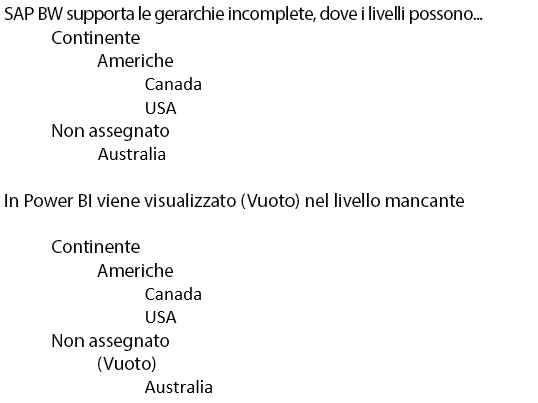

# DirectQuery e SAP Business Warehouse (BW)
È possibile connettersi alle origini dati di **SAP Business Warehouse (BW)** usando direttamente **DirectQuery**. Data la natura OLAP/multidimensionale di SAP BW, esistono numerose differenze importanti tra DirectQuery in SAP BW e le origini relazionali, ad esempio SQL Server. Queste differenze sono riepilogate come segue:

* In **DirectQuery** nelle origini relazionali è disponibile un set di query (così come definito nella finestra di dialogo **Recupera dati** o **Editor di query**) che definisce in modo logico i dati disponibili nell'elenco dei campi. Ciò *non* succede quando ci si connette a un'origine OLAP, ad esempio SAP BW. Al contrario, quando ci si connette al server SAP usando **Recupera dati**, vengono selezionati solo query Infocube o BEx. Quindi tutte le cifre chiave e le dimensioni della query Infocube/BEx selezionata saranno disponibili nell'elenco dei campi.   
* Analogamente, non è presente alcun **Editor di query** quando ci si connette al sistema SAP BW. Le impostazioni dell'origine dati (ad esempio, il nome del server) possono essere modificate selezionando **Modifica query > Impostazioni origine dati**. Le impostazioni di qualsiasi variabile possono essere modificate selezionando **Modifica query > Modifica variabili**.
* Data la natura univoca delle origini OLAP, si applicano restrizioni aggiuntive (per la modellazione e le visualizzazioni) oltre alle normali restrizioni imposte per DirectQuery. Tali restrizioni vengono descritte più avanti in questo articolo.

È poi *estremamente importante* tenere presente che esistono molte funzionalità di SAP BW che non sono supportate in Power BI e che a causa della natura dell'interfaccia pubblica di SAP BW, ci sono casi importanti in cui i risultati visualizzati attraverso Power BI non corrisponderanno a quelli visualizzati quando si usa uno strumento SAP. Tali limitazioni vengono descritte più avanti in questo articolo. Queste limitazioni e le differenze di comportamento devono essere controllate con attenzione, per garantire che i risultati visualizzati con Power BI, così come restituiti dall'interfaccia pubblica di SAP, vengano interpretati correttamente.  

## Restrizioni di modellazione aggiuntive
Le principali restrizioni di modellazione aggiuntive durante la connessione a SAP BW con DirectQuery in Power BI sono le seguenti:

* **Nessun supporto per le colonne calcolate**: la possibilità di creare colonne calcolate è disabilitata. Ciò significa anche che il raggruppamento e il clustering, che creano le colonne calcolate, non sono disponibili.
* **Limitazioni aggiuntive per le misure**: ci sono altre limitazioni imposte alle espressioni DAX che è possibile usare nelle misure, per riflettere il livello di supporto offerto da SAP BW.
* **Nessun supporto per la definizione di relazioni**: le relazioni sono intrinseche nell'origine esterna SAP e non è possibile definire relazioni aggiuntive nel modello.
* **Nessuna visualizzazione di dati**: la **Vista dati** in genere mostra i dati a livello di dettaglio nelle tabelle. Data la natura delle origini OLAP come SAP BW, questa vista non è disponibile in SAP BW.
* **I dettagli delle colonne e misure sono fissati**: l'elenco di colonne e misure visualizzate nell'elenco dei campi è fissato dall'origine sottostante e non può essere modificato. Ad esempio, non è possibile eliminare una colonna, né modificare il tipo di dati (tuttavia, può essere rinominato).
* **Limitazioni aggiuntive in DAX**: ci sono altre limitazioni in DAX, che è possibile usare nelle definizioni di misure, in modo da riflettere le limitazioni nell'origine. Non è ad esempio possibile usare una funzione di aggregazione su una tabella.

## Restrizioni di visualizzazione aggiuntive
Le principali restrizioni aggiuntive nelle visualizzazioni durante la connessione a SAP BW con DirectQuery in Power BI sono le seguenti:

* **Nessuna aggregazione di colonne**: non è possibile modificare l'aggregazione per una colonna in un oggetto visivo, che è sempre *Non riepilogare*
* **Il filtro delle misure è disabilitato**: non è possibile filtrare le misure per riflettere il supporto offerto da SAP BW.
* **Selezione multipla e includere/escludere**: la possibilità di selezionare più punti dati di un oggetto visivo è disabilitata se i punti rappresentano valori da più colonne. Ad esempio, dato un grafico a barre che mostra le vendite in base al paese, con Categoria nella legenda, non sarebbe possibile selezionare il punto per (USA, Bici) e (Francia, Abiti). Analogamente, non sarebbe possibile selezionare il punto per (USA, Bici) ed escluderlo dall'oggetto visivo. Entrambi sono limitazioni imposte per riflettere il supporto offerto da SAP BW.

## Supporto per le funzionalità di SAP BW
La tabella seguente elenca tutte le funzionalità di SAP BW che non sono completamente supportate o che si comporteranno in modo diverso quando si usa Power BI.   

| Funzionalità | Descrizione |
| --- | --- |
| Calcoli locali |I calcoli locali definiti in una query BEX modificheranno i numeri visualizzati con strumenti come BEx Analyzer. Tuttavia, non sono riflessi dai numeri restituiti da SAP, attraverso l'interfaccia pubblica di MDX.     **Di conseguenza, i numeri visualizzati in un oggetto visivo di Power BI non necessariamente corrisponderanno a quelli per un oggetto visivo corrispondente in uno strumento SAP.**     Ad esempio, quando ci si connette a un cubo di query da una query BEx che imposta l'aggregazione come Cumulated (cioè la somma parziale), Power BI riceverebbe i numeri di base, ignorando l'impostazione.  Un analista potrebbe certamente quindi applicare un calcolo di somma parziale localmente in Power BI, ma dovrebbe prestare attenzione a come i numeri vengono interpretati se questa operazione non fosse eseguita. |
| Aggregazioni |In alcuni casi (in particolare quando si gestiscono più valute), i numeri aggregati restituiti dall'interfaccia pubblica di SAP non corrispondono quelli indicati dagli strumenti SAP.     **Di conseguenza, i numeri visualizzati in un oggetto visivo di Power BI non necessariamente corrisponderanno a quelli per un oggetto visivo corrispondente in uno strumento SAP.**     Ad esempio, i totali in diverse valute sarebbero visualizzati come "*" in BEx Analyzer, ma il totale verrebbe restituito dall'interfaccia pubblica di SAP, senza alcuna informazione sull'irrilevanza di tale numero aggregato. In questo modo il numero (che aggrega, ad esempio, $, EUR e AUD) verrebbe visualizzato da Power BI. |
| Formattazione della valuta |Qualsiasi formattazione di valuta (ad esempio, $2,300 o 4000 AUD) non viene riflessa in Power BI. |
| Unità di misura |Le unità di misura (ad esempio, 230 KG) non vengono riflesse in Power BI. |
| Chiave rispetto a testo (breve, medio, lungo) |Per una caratteristica di SAP BW come CostCenter, l'elenco di campi mostra una sola colonna Centro di costo.  L'uso di tale colonna visualizzerà il testo predefinito.  Mostrando i campi nascosti, sarà anche possibile vedere la colonna del nome univoco (che restituisce il nome univoco assegnato da SP BW e costituisce la base di univocità).     La chiave e altri campi di testo non sono disponibili. |
| Più gerarchie di una caratteristica |In **SAP**, una caratteristica può avere più gerarchie. In strumenti come BEx Analyzer, quando una caratteristica viene inclusa in una query, l'utente può quindi selezionare la gerarchia da usare.     In **Power BI**, è possibile visualizzare le varie gerarchie nell'elenco dei campi come gerarchie diverse sulla stessa dimensione.  Tuttavia, la selezione di più livelli di due gerarchie diverse sulla stessa dimensione comporterà la restituzione di dati vuoti da SAP. |
| Trattamento delle gerarchie incomplete | |
| Fattore di proporzione/invertire il segno |In SAP una cifra chiave può avere un fattore di proporzione (ad esempio, 1000) definito come opzione di formattazione, vale a dire che tutte le visualizzazioni verranno ridimensionate in base a tale fattore.     Analogamente, può avere un set di proprietà che inverte il segno. L'uso di questo tipo di cifra chiave in Power BI (in un oggetto visivo o come parte di un calcolo) comporterà l'uso del numero non ridimensionato (e del segno non invertito). Il fattore di proporzione sottostante non è disponibile. Negli oggetti visivi di Power BI, è possibile controllare le unità di scala visualizzate sull'asse (K, M, B) come parte della formattazione dell'oggetto visivo. |
| Gerarchie in cui i livelli appaiono/scompaiono in modo dinamico |Quando ci si connette inizialmente a SAP BW, verranno recuperate le informazioni sui livelli di una gerarchia, popolando l'elenco dei campi con un set di campi, che verrà quindi memorizzato nella cache e, se il set di livelli viene modificato, il set di campi non viene modificato fino a quando non viene richiamato l'aggiornamento.     Questo è possibile solo in **Power BI Desktop**. Non è possibile richiamare gli aggiornamenti per riflettere le modifiche apportate ai livelli nel servizio Power BI dopo la pubblicazione. |
| Filtro predefinito |Una query BEX può includere filtri predefiniti, che verranno applicati automaticamente da SAP BEx Analyzer. Questi non sono esposti e quindi l'utilizzo equivalente in Power BI non applicherà gli stessi filtri per impostazione predefinita. |
| Cifre chiave nascoste |Una query BEX può controllare la visibilità delle cifre chiave e quelle che sono nascoste non verranno visualizzate in SAP BEx Analyzer. Ciò non si riflette attraverso l'API pubblica e quindi tali cifre chiave nascoste appariranno comunque nell'elenco dei campi. Tuttavia, potranno quindi essere nascoste all'interno di Power BI. |
| Formattazione numerica |Qualsiasi formattazione numerica (numero di posizioni decimali, separatore decimale e così via) non verrà automaticamente riflessa in Power BI. Tuttavia, è possibile controllare tale formattazione in seguito all'interno di Power BI. |
| Controllo delle versioni della gerarchia |SAP BW consente di gestire versioni differenti di una gerarchia; ad esempio, la gerarchia del centro di costo nel 2007 rispetto al 2008. Solo la versione più recente sarà disponibile in Power BI, perché le informazioni sulle versioni non sono esposte dall'API pubblica. |
| Gerarchie dipendenti dal tempo |Quando si usa Power BI, le gerarchie dipendenti dal tempo vengono valutate in corrispondenza della data corrente. |
| Conversione di valuta |SAP BW supporta la conversione di valuta, in base alle tariffe contenute nel cubo. Tali funzionalità non sono esposte dall'API pubblica e non sono pertanto disponibili in Power BI. |
| Ordinamento |È possibile definire l'ordinamento (per testo o chiave) di una caratteristica in SAP. Questo ordinamento non si riflette in Power BI. Ad esempio, i mesi potrebbero apparire come "Aprile", "Ago" così via.     Non è possibile modificare l'ordinamento in Power BI. |
| Nomi tecnici |In **Recupera dati**, i nomi (descrizioni) di caratteristica/misura e i nomi tecnici sono entrambi visibili. L'elenco dei campi conterrà solo i nomi di caratteristica/misura (descrizioni). |
| Attributi |Non è possibile accedere agli attributi di una caratteristica all'interno di Power BI. |
| Impostazione della lingua utente finale |Le impostazioni locali usate per connettersi al sistema SAP BW sono impostate come parte dei dettagli della connessione e non riflettono le impostazioni locali dell'utente del report finale. |
| Variabili di testo |SAP BW consente di includere segnaposto per le variabili nei nomi di campo (ad esempio, "Valori effettivi $ANNO$") che verranno quindi sostituiti dal valore selezionato. Ad esempio, il campo viene visualizzato come "Valori effettivi 2016" negli strumenti BEX, se è stato selezionato l'anno 2016 per la variabile.     Il nome della colonna in Power BI non verrà modificato a seconda del valore della variabile e quindi verrà visualizzato come "Valori effettivi $ANNO$".  Tuttavia, il nome della colonna potrà quindi essere modificato in Power BI. |

## Limitazioni e considerazioni
La tabella seguente elencate le limitazioni della versione beta del connettore di SAP BW.

| Limitazione | Descrizione |
| --- | --- |
| Nessun aggiornamento |Il pulsante Aggiorna è disabilitato e non è possibile aggiornare gli oggetti visivi/i metadati. |

## Passaggi successivi
Per altre informazioni su DirectQuery, vedere le risorse seguenti:

* [DirectQuery in Power BI](desktop-directquery-about.md)
* [Data sources supported by DirectQuery](desktop-directquery-data-sources.md) (Origini dati supportate da DirectQuery)
* [DirectQuery and SAP HANA](desktop-directquery-sap-hana.md) (DirectQuery e SAP HANA)

