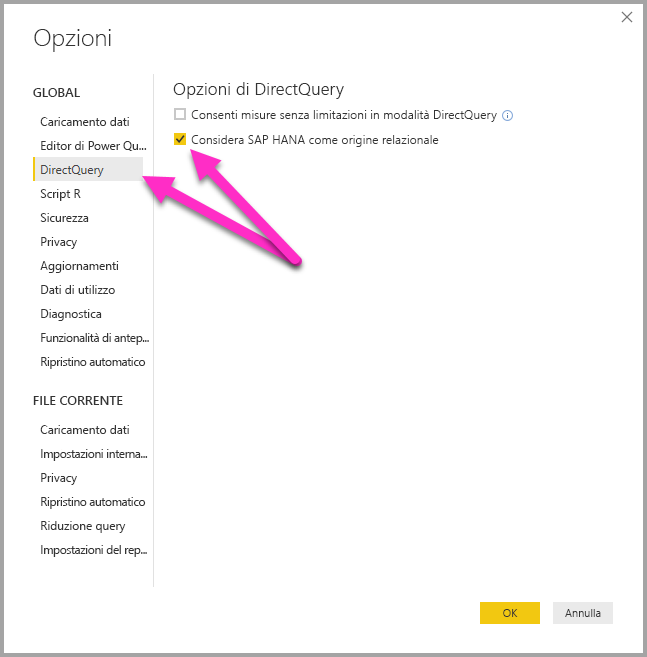
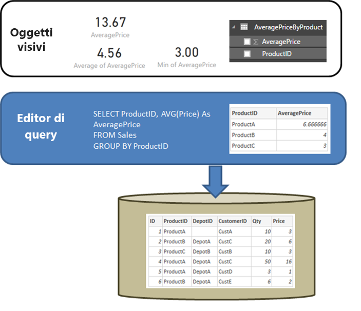
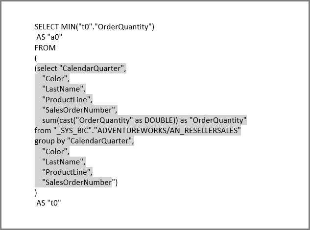

# Connettersi a origini dati di SAP HANA usando DirectQuery in Power BI
È possibile connettersi alle origini dati di **SAP HANA** usando direttamente **DirectQuery**. Sono disponibili due opzioni per la connessione a SAP HANA:

* **Considerare SAP HANA come origine multidimensionale (impostazione predefinita):** in questo caso, il comportamento sarà simile a quando Power BI si connette ad altre origini multidimensionali come SAP Business Warehouse o Analysis Services. Quando ci si connette a SAP HANA con questa impostazione viene selezionata una singola vista analitica o di calcolo e tutti gli attributi, le misure e le gerarchie di tale vista sono disponibili nell'elenco dei campi. Quando vengono creati oggetti visivi, i dati aggregati vengono sempre recuperati da SAP HANA. Questo è l'approccio consigliato ed è l'impostazione predefinita per i nuovi report DirectQuery su SAP HANA.

* **Considerare SAP HANA come un'origine relazionale:** in questo caso, Power BI considera SAP HANA come un'origine relazionale. Ciò offre una maggiore flessibilità, ma è necessario prestare attenzione per assicurarsi che le misure vengano aggregate come previsto e per evitare problemi di prestazioni.

L'approccio per la connessione dipende da un'opzione strumento globale, impostata selezionando **File > Opzioni e impostazioni**, quindi **Opzioni > DirectQuery** e infine selezionando l'opzione **Considera SAP HANA come origine relazionale**, come illustrato nella figura seguente. 

L'opzione per considerare HANA come origine relazionale controlla l'approccio usato per qualsiasi *nuovo* report che usa DirectQuery su SAP HANA. Non ha alcun effetto sulle eventuali connessioni SAP HANA esistenti nel report corrente, né sulle connessioni in altri report aperti. Pertanto, se l'opzione è deselezionata, quando viene aggiunta una nuova connessione a SAP HANA mediante **Recupera dati**, tale connessione verrà stabilita considerando SAP HANA come origine multidimensionale. Se viene tuttavia aperto un report diverso anch'esso connesso a SAP HANA, il comportamento di tale report sarà ancora corrispondente all'opzione impostata *al momento della creazione*.Questo significa che i report che si connettono a SAP HANA creati prima di febbraio 2018 continueranno a considerare SAP HANA come origine relazionale. 

I due approcci corrispondono a comportamenti diversi e non è possibile cambiare approccio per i report esistenti. 

Di seguito verranno esaminati entrambi gli approcci in maggiore dettaglio.

## Considerare SAP HANA come origine multidimensionale (impostazione predefinita)

Tutte le nuove connessioni a SAP HANA usano questo metodo di connessione per impostazione predefinita, considerando SAP HANA come origine multidimensionale. Per considerare una connessione a SAP HANA come origine relazionale, è necessario selezionare **File > Opzioni e impostazioni > Opzioni** e quindi selezionare la casella in **DirectQuery > Considerare SAP HANA come origine relazionale**. Fino a quando questa funzionalità sarà disponibile in **anteprima**, i report creati con l'approccio multidimensionale *non possono* essere pubblicati nel servizio Power BI e tale operazione genererà errori quando il report viene aperto all'interno del servizio Power BI.  

Quando ci si connette a SAP HANA come origine multidimensionale, vengono applicate le considerazioni seguenti:

* Nello **strumento di navigazione Recupera dati** è possibile selezionare una singola visualizzazione SAP HANA. Non è possibile selezionare singole misure o singoli attributi. Non è disponibile alcuna query definita al momento della connessione e ciò è diverso rispetto all'importazione di dati o a quando si usa DirectQuery considerando SAP HANA come origine relazionale. Questo significa anche che non è possibile usare direttamente una query SQL SAP HANA quando si seleziona questo metodo di connessione.

* Tutti gli attributi, le misure e le gerarchie della visualizzazione selezionata verranno indicati nell'elenco dei campi. 

* Quando una misura viene usata in un oggetto visivo, SAP HANA riceve una query per recuperare il valore della misura al livello di aggregazione necessario per l'oggetto visivo. Quando si gestiscono misure non additive (contatori, rapporti e così via), tutte le aggregazioni vengono eseguite da SAP HANA e non vengono eseguite altre aggregazioni da Power BI. 

* Per assicurarsi che i valori di aggregazione corretti possano essere sempre ottenuti da SAP HANA, è necessario imporre determinate restrizioni. Non è ad esempio possibile aggiungere colonne calcolate o combinare i dati da più viste SAP HANA all'interno dello stesso report. 

Il fatto di considerare SAP HANA come origine multidimensionale non offre la maggiore flessibilità offerta dall'approccio *relazionale* alternativo, ma è più semplice e garantisce valori di aggregazione corretti quando si gestiscono misure SAP HANA più complesse, oltre a offrire in genere prestazioni migliori. 

L'**elenco dei campi** include tutti gli attributi, le misure e le gerarchie della visualizzazione SAP HANA. Si notino i comportamenti seguenti che si applicano quando si usa questo metodo di connessione:

* Qualsiasi attributo incluso in almeno una gerarchia verrà nascosto per impostazione predefinita. Se necessario, è comunque possibile visualizzarli scegliendo **Visualizza elementi nascosti** dal menu di scelta rapida nell'elenco dei campi. È possibile renderli visibili dallo stesso menu di scelta rapida, all'occorrenza.

* In SAP HANA è possibile definire un attributo che usa un altro attributo come etichetta. Ad esempio l'attributo **Product** (con valori 1, 2, 3 e così via) può usare l'attributo **ProductName** (con i valori Bike, Shirt, Gloves e così via) come etichetta. In questo caso, nell'elenco dei campi verrà visualizzato un singolo campo **Product** i cui valori saranno le etichette Bike, Shirt, Gloves e così via, ordinati in base ai valori chiave 1, 2 e 3 che ne determinano anche l'univocità. Viene creata anche una colonna nascosta **Product.Key**, che consente l'accesso ai valori di chiave sottostanti se necessario. 

Le eventuali variabili definite nella visualizzazione SAP HANA sottostante verranno visualizzate al momento della connessione ed è possibile immettere i valori necessari. Tali valori possono essere modificati successivamente selezionando **Modifica query** dalla barra multifunzione, quindi **Gestisci parametri** nel menu a discesa visualizzato. 

Le operazioni di modellazione consentite sono più restrittive rispetto al caso generale in cui si usa DirectQuery, dato che è necessario garantire che sia sempre possibile ottenere i dati aggregati corretti da SAP HANA. È comunque ancora possibile eseguire numerose aggiunte e modifiche, tra cui definire misure, rinominare e nascondere i campi e definire formati di visualizzazione. Tutte queste modifiche verranno mantenute in caso di aggiornamento e verranno applicate le eventuali modifiche non in conflitto apportate alla visualizzazione SAP HANA. 

### Restrizioni di modellazione aggiuntive

Le principali restrizioni di modellazione aggiuntive per la connessione a SAP HANA con DirectQuery (considerata come origine multidimensionale) sono le seguenti: 

* **Nessun supporto per le colonne calcolate**: la possibilità di creare colonne calcolate è disabilitata. Ciò significa anche che il raggruppamento e il clustering, che creano le colonne calcolate, non sono disponibili.
* **Limitazioni aggiuntive per le misure**: ci sono altre limitazioni imposte alle espressioni DAX che è possibile usare nelle misure, per riflettere il livello di supporto offerto da SAP HANA.
* **Nessun supporto per la definizione di relazioni:** è possibile eseguire query su una singola visualizzazione all'interno di un report e pertanto la definizione di relazioni non è supportata.
* **Nessuna visualizzazione di dati**: la **Vista dati** in genere mostra i dati a livello di dettaglio nelle tabelle. Data la natura delle origini OLAP come SAP HANA, questa vista non è disponibile in SAP HANA.
* **I dettagli delle colonne e misure sono fissati**: l'elenco di colonne e misure visualizzate nell'elenco dei campi è fissato dall'origine sottostante e non può essere modificato. Ad esempio, non è possibile eliminare una colonna, né modificarne il tipo di dati (tuttavia, può essere rinominata).
* **Limitazioni aggiuntive in DAX**: ci sono altre limitazioni in DAX, che è possibile usare nelle definizioni di misure, in modo da riflettere le limitazioni nell'origine. Non è ad esempio possibile usare una funzione di aggregazione su una tabella.

### Restrizioni di visualizzazione aggiuntive

Esistono alcune restrizioni per gli oggetti visivi durante la connessione a SAP HANA con DirectQuery (considerata come origine multidimensionale): 
* **Nessuna aggregazione di colonne**: non è possibile modificare l'aggregazione per una colonna in un oggetto visivo ed è sempre *Non riepilogare*.

## Considerare SAP HANA come origine relazionale 

Se si sceglie di connettersi a SAP HANA come origine relazionale, si ha a disposizione una maggiore flessibilità. Ad esempio è possibile creare colonne calcolate, includere dati da più viste SAP HANA e creare relazioni tra le tabelle risultanti. Tuttavia, quando si usa SAP HANA in questo modo, è importante comprendere alcuni aspetti del modo in cui vengono considerate le connessioni, per assicurarsi che: 

* I risultati siano quelli previsti, quando la vista di SAP HANA contiene misure non additive, ad esempio conteggi distinti, o medie, anziché semplici somme.
* Le query risultanti siano efficienti

È utile iniziare chiarendo il comportamento di un'origine relazionale, ad esempio SQL Server, quando la query definita in **Recupera dati** o **Editor query** esegue un'aggregazione. Nell'esempio seguente una query definita in **Editor query** restituisce il prezzo medio di *ProductID*.  

Se i dati vengono importati in Power BI, invece di DirectQuery, il risultato sarebbe il seguente:

* I dati vengono importati a livello di aggregazione definita dalla query creata in **Editor query**. Ad esempio, prezzo medio per prodotto. Di conseguenza viene creata una tabella con due colonne *ProductID* e *AveragePrice* che può essere usato negli oggetti visivi.
* In un oggetto visivo sui dati importati viene eseguita un'aggregazione successiva, ad esempio *Somma*, *Media*, *Min* e altre. Ad esempio, se si include *AveragePrice* in un oggetto visivo verrà usata l'aggregazione *Somma* per impostazione predefinita che restituirà la somma di *AveragePrice* per ogni *ProductID*; in questo caso di esempio sarebbe 13,67. Lo stesso vale per qualsiasi funzione di aggregazione alternativa,ad esempio *Min*, *Media*e così via, usata nell'oggetto visivo. Ad esempio la *Media* di *AveragePrice* restituisce la media di 6,66, 4 e 3, che equivale a 4,56, ma non la media di *Price* nei sei record della tabella sottostante, ovvero 5,17.
  
Se si usa **DirectQuery** (sulla stessa origine relazionale) invece di Import, si applica la stessa semantica e i risultati saranno esattamente gli stessi:  

* Data la stessa query, in modo logico vengono presentati esattamente gli stessi dati a livello di report, anche se i dati non vengono effettivamente importati.

* In un oggetto visivo sulla tabella logica della query viene eseguita di nuovo un'aggregazione successiva, ad esempio *Somma*, *Media*, *Min* e altre. E di nuovo, un oggetto visivo contenente la *Media* di *AveragePrice* restituisce ugualmente 4,56.
  
Si consideri ora SAP HANA quando la connessione viene considerata come origine relazionale. Power BI può usare sia le *Viste analitiche* che le *Viste di calcolo* in SAP HANA; entrambe possono contenere misure. Ancora oggi l'approccio a SAP HANA segue gli stessi principi descritti in precedenza in questa sezione: la query definita in **Recupera dati** o **Editor query** determinerà i dati disponibili e quindi qualsiasi aggregazione successiva in un oggetto visivo su quei dati; lo stesso vale per Import e DirectQuery.  
Tuttavia, la caratteristica principale di SAP HANA è che la query definita nella finestra di dialogo iniziale **Recupera dati** o **Editor query** è sempre una query di aggregazione e in genere include le misure in cui l'aggregazione effettiva che verrà usata è definita dalla vista SAP HANA.

L'equivalente dell'esempio di SQL Server illustrato in precedenza è una vista di SAP HANA contenente *ID*, *ProductID*, *DepotID* e le misure che includono *AveragePrice*, definito nella vista come *Prezzo medio*.  
    
Se nell'esperienza **Recupera dati** sono state eseguite selezioni per le misure **ProductID** e **AveragePrice**, questo consente di definire una query sulla vista e richiedere i dati di aggregazione. Nell'esempio precedente, per motivi di semplicità viene usato pseudo-SQL che non corrisponde alla sintassi esatta di SAP HANA SQL. Pertanto qualsiasi altra aggregazione definita in un oggetto visivo contribuisce a continuare l'aggregazione dei risultati di tale query. Di nuovo, come descritto in precedenza per SQL Server, questo vale sia per il caso di Import che di DirectQuery. Nel caso di DirectQuery la query di **Recupera dati** o **Editor query** verrà usata in una selezione secondaria all'interno di una singola query inviata a SAP HANA e pertanto in questo caso i dati non verranno letti tutti prima di un'aggregazione aggiuntiva.  

Quando si usa DirectQuery su SAP HANA, è importante tenere presente quanto segue per tutti questi comportamenti:  

* È necessario prestare attenzione alle altre aggregazioni eseguite negli oggetti visivi ogni volta che la misura in SAP HANA non è correttiva, ad esempio non è un semplice elemento *Sum*, *Min* o *Max*.

* In **Recupera dati** o **Editor query** devono essere incluse solo le colonne obbligatorie per recuperare i dati necessari. Questo riflette il fatto che il risultato sarà una query ragionevole che può essere inviata ad SAP HANA. Ad esempio, se sono state selezionate decine di colonne, pensando che potrebbero essere necessarie negli oggetti visivi successivi, anche per DirectQuery un semplice oggetto visivo implica che la query di aggregazione usata nella selezione secondaria conterrà decine di colonne, le cui prestazioni saranno generalmente scarse.
  
Esaminiamo un esempio. Nell'esempio seguente la selezione di cinque colonne (**CalendarQuarter**, **Color**, **LastName**, **ProductLine**, **SalesOrderNumber**) nella finestra di dialogo **Recupera dati** oltre alla misura *OrderQuantity* implica che in un secondo momento la creazione di un semplice oggetto visivo contenente Min OrderQuantity restituirà la seguente query SQL per SAP HANA. La parte in grigio è la selezione secondaria, contenente la query da **Recupera dati** / **Editor query**. Se questa selezione secondaria offre un risultato di cardinalità molto elevato, le prestazioni risultanti di SAP HANA saranno probabilmente ridotte.  

   
A causa di questo comportamento è consigliabile che gli elementi selezionati in **Recupera dati** o **Editor query** siano limitati agli elementi necessari, pur generando una query ragionevole per SAP HANA.  

## Procedure consigliate 

Per entrambi gli approcci di connessione a SAP HANA, le raccomandazioni per l'uso di DirectQuery si applicano anche a SAP HANA, in particolare quelle destinate a garantire prestazioni ottimali. Queste raccomandazioni sono descritte in dettaglio nell'articolo [Uso di DirectQuery in Power BI](desktop-directquery-about.md).
   
## Limitazioni

L'elenco seguente descrive tutte le funzionalità di SAP HANA che non sono completamente supportate o hanno un comportamento diverso quando si usa Power BI. 

* **Gerarchie padre-figlio**: le gerarchie padre-figlio non saranno visibili in Power BI,
perché Power BI accede a SAP HANA tramite l'interfaccia SQL e le gerarchie padre-figlio non sono completamente accessibili tramite SQL.
* **Altri metadati di gerarchia**: la struttura di base delle gerarchie viene visualizzata in Power BI, tuttavia alcuni metadati di gerarchia (ad esempio, il controllo del comportamento delle gerarchie incomplete) non avranno alcun effetto.
Anche in questo caso, la causa sono le limitazioni imposte dall'interfaccia SQL.
* **Connessione tramite SSL**: è possibile connettersi usando Import e l'approccio multidimensionale con SSL, ma non è possibile connettersi alle istanze di SAP HANA configurate per usare SSL per il connettore relazionale.
* **Supporto per le visualizzazioni degli attributi**: Power BI è in grado di connettersi alle visualizzazioni di analisi e calcoli, ma non consente la connessione diretta alle visualizzazioni degli attributi.
* **Supporto per gli oggetti del catalogo**: Power BI non può connettersi a oggetti del catalogo.
* **Modifiche alle variabili dopo la pubblicazione**: dopo la pubblicazione del report non è possibile modificare i valori di nessuna variabile SAP HANA direttamente nel servizio Power BI. 
 
## Problemi noti 
L'elenco seguente descrive tutti i problemi noti per la connessione a SAP HANA (DirectQuery) tramite Power BI. 

* **Problema SAP HANA quando si eseguono query per contatori e altre misure**: SAP HANA restituisce dati non corretti in caso di connessione a una vista analitica e se nello stesso oggetto visivo vengono incluse una misura contatore e altre misure di rapporto. Questo problema è descritto nella nota SAP 2128928 (Risultati imprevisti per l'esecuzione di query su una colonna calcolata e un contatore). La misura di rapporto non sarà corretta in questo caso. 

* **Più colonne di Power BI da una singola colonna SAP HANA**: per alcune viste di calcolo in cui una colonna SAP HANA viene usata in più gerarchie, SAP HANA espone questa condizione come due attributi separati. Ciò comporta la creazione di due colonne in Power BI.  Queste colonne sono tuttavia nascoste per impostazione predefinita e tutte le query riguardanti le gerarchie, o le colonne direttamente, si comportano in modo corretto. 
 
## Passaggi successivi

Per altre informazioni su DirectQuery, vedere le risorse seguenti:

* [DirectQuery in Power BI](desktop-directquery-about.md)
* [Data sources supported by DirectQuery](desktop-directquery-data-sources.md) (Origini dati supportate da DirectQuery)
* [DirectQuery e SAP BW](desktop-directquery-sap-bw.md)
* [Gateway dati locale](service-gateway-onprem.md)

