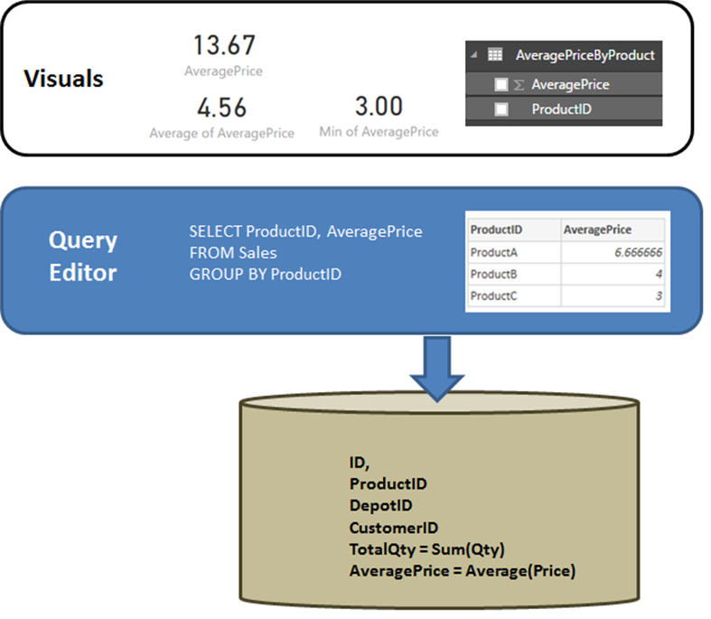

# DirectQuery e SAP HANA
È possibile connettersi alle origini dati di **SAP HANA** usando direttamente **DirectQuery**.

Quando si usa **SAP HANA** è importante comprendere alcuni aspetti della modalità di gestione delle connessioni, per assicurarsi che:

* I risultati siano quelli previsti, quando la vista di SAP HANA contiene misure non additive, ad esempio conteggi distinti, o medie, anziché semplici somme
* Le query risultanti siano efficienti

È utile iniziare chiarendo il comportamento di un'origine relazionale, ad esempio **SQL Server**, quando la query definita in **Recupera dati** o **Editor query** esegue un'aggregazione. Nell'esempio seguente, una query definita in **Editor query** restituisce il prezzo medio di **ProductID**.

Se i dati vengono importati in Power BI, invece di DirectQuery, il risultato sarebbe il seguente:

* I dati vengono importati a livello di aggregazione definita dalla query creata in **Editor query**. Ad esempio, prezzo medio per prodotto. Di conseguenza viene creata una tabella con due colonne *ProductID* e *AveragePrice* che può essere usato negli oggetti visivi.
* In un oggetto visivo sui dati importati viene eseguita un'aggregazione successiva, ad esempio *Somma*, *Media*, *Min* e altre.  Ad esempio, se si include *AveragePrice* in un oggetto visivo verrà usata l'aggregazione *somma* per impostazione predefinita che restituirà la somma di *AveragePrice* per ogni *ProductID*; in questo caso sarebbe 13,67. Lo stesso vale per qualsiasi funzione di aggregazione alternativa,ad esempio *Min*, *Media*e così via, usata nell'oggetto visivo. Ad esempio, la *Media* di *AveragePrice* restituisce la media di 6,66, 4 e 3, che equivale a 4,56, ma *non* la media di *Prezzo* nei record 6 della tabella sottostante, ovvero 5,17.

Se si usa **DirectQuery** invece di Import, si applica la stessa semantica e i risultati saranno esattamente gli stessi:

* Data la stessa query, in modo logico vengono presentati esattamente gli stessi dati a livello di report, anche se i dati non vengono effettivamente importati.
* In un oggetto visivo sulla tabella logica della query viene eseguita di nuovo un'aggregazione successiva, ad esempio *Somma*, *Media*, *Min* e altre. E di nuovo, un oggetto visivo contenente la *Media* di *AveragePrice* restituisce ugualmente 4,56.

Si prenda in considerazione **SAP HANA**. Power BI può usare sia le *Viste analitiche* che le *Viste di calcolo* in SAP HANA; entrambe possono contenere misure. Ancora oggi l'approccio a SAP HANA segue gli stessi principi descritti in precedenza: la query definita in **Recupera dati** o **Editor query** determinerà i dati disponibili e quindi qualsiasi aggregazione successiva in un oggetto visivo su quei dati; lo stesso vale per Import e DirectQuery.

Tuttavia, la caratteristica principale di HANA è che la query definita nella finestra di dialogo iniziale **Recupera dati** o **Editor query** è sempre una query di aggregazione e in genere includerà le misure in cui l'aggregazione effettiva che verrà usata è definita dalla vista HANA.

L'equivalente dell'esempio di SQL Server illustrato in precedenza consiste in una vista di HANA contenente **ID**, **ProductID**, **DepotID** e le misure che includono **AveragePrice**, definito nella vista come **Prezzo medio**.

Se nell'esperienza **Recupera dati** sono state effettuate selezioni per le misure **ProductID** e **AveragePrice**, questo consente di definire una query sulla vista e richiedere i dati di aggregazione. Nell'esempio precedente, per motivi di semplicità viene usato pseudo-SQL che non corrisponde alla sintassi esatta di HANA SQL. Pertanto qualsiasi altra aggregazione definita in un oggetto visivo contribuisce a continuare l'aggregazione dei risultati di tale query. Di nuovo, come descritto in precedenza per **SQL Server**, questo vale sia per il caso di Import che di DirectQuery. Si noti che nel caso di DirectQuery la query di **Recupera dati** o **Editor query** verrà usata in una selezione all'interno di una singola query inviata ad HANA e pertanto in questo caso i dati non verranno letti tutti, prima di un'aggregazione aggiuntiva.

Ciò dà luogo a importanti considerazioni illustrate di seguito in relazione all'uso di DirectQuery anziché di HANA:

* È necessario prestare attenzione alle altre aggregazioni eseguite negli oggetti visivi, ogni volta che la misura in HANA non è correttiva,ad esempio non è una semplice *Somma*, *Min* o *Max*.
* In **Recupera dati** o **Editor query** solo le colonne obbligatorie devono essere incluse per recuperare i dati necessari. Questo riflette il fatto che il risultato sarà una query ragionevole che può essere inviata ad HANA. Ad esempio, se sono state selezionate decine di colonne, pensando che potrebbero essere necessarie negli oggetti visivi successivi, anche per DirectQuery un semplice oggetto visivo implica che la query di aggregazione usata nella selezione conterrà tali colonne, che in genere avranno prestazioni basse.

Esaminiamo un esempio. Nell'esempio seguente, la selezione di cinque colonne, CalendarQuarter, colori, LastName, ProductLine, SalesOrderNumber, nella finestra di dialogo **Recupera dati**, oltre alla misura OrderQuantity, implica che in un secondo momento la creazione di un semplice oggetto visivo che contiene Min OrderQuantity comporterà la seguente query SQL per HANA. La parte in grigio è la selezione, contenente la query da **Recupera dati** / **Editor query**. Se questa selezione offre un risultato di cardinalità molto elevato, è probabile che le prestazioni risultanti di HANA saranno ridotte.

Per questo motivo, è consigliabile che gli elementi selezionati in **Recupera dati** o **Editor query** dovrebbe siano limitati agli elementi necessari, sebbene generino comunque una query ragionevole per HANA.

### Passaggi successivi
Per altre informazioni su DirectQuery, vedere le risorse seguenti:

* [DirectQuery in Power BI](desktop-directquery-about.md)
* [Data sources supported by DirectQuery](desktop-directquery-data-sources.md) (Origini dati supportate da DirectQuery)
* [DirectQuery e SAP BW](desktop-directquery-sap-bw.md)
* [Gateway dati locale](service-gateway-onprem.md)

