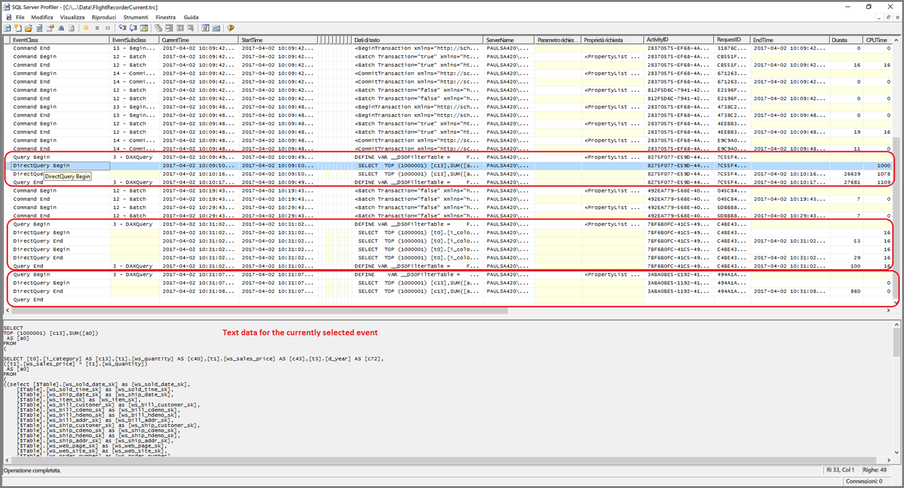
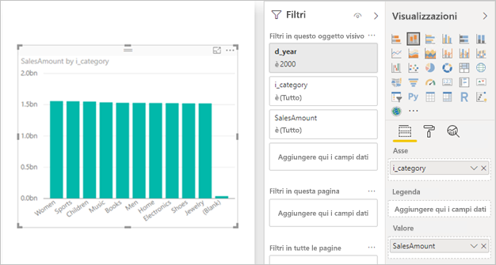

# <a name="directquery-model-troubleshooting-in-power-bi-desktop"></a>Risoluzione dei problemi del modello DirectQuery in Power BI Desktop

Questo articolo è destinato agli autori di modelli di dati che sviluppano modelli DirectQuery di Power BI usando Power BI Desktop o il servizio Power BI. Descrive come diagnosticare i problemi di prestazioni e come ottenere informazioni più dettagliate per consentire l'ottimizzazione dei report.

## <a name="performance-analyzer"></a>Analizzatore prestazioni

È consigliabile avviare la diagnosi dei problemi di prestazioni in Power BI Desktop piuttosto che in Power BI (il servizio o Server di report di Power BI). Accade spesso che i problemi di prestazioni siano semplicemente correlati al livello delle prestazioni dell'origine dati sottostante e che possano essere identificati e diagnosticati con maggiore facilità nell'ambiente molto più isolato di Power BI Desktop, eliminando inizialmente alcuni componenti come il gateway di Power BI. Solo se non vengono trovati problemi di prestazioni con Power BI Desktop, l'analisi dovrà concentrarsi sulle specifiche del report in Power BI. L'[analizzatore prestazioni](desktop-performance-analyzer.md) è uno strumento utile per identificare i problemi durante il processo.

È allo stesso modo consigliabile provare in prima battuta a isolare eventuali problemi per un singolo oggetto visivo, piuttosto che per molti oggetti visivi di una pagina.

Supponendo di aver eseguito i passaggi descritti nei paragrafi precedenti di questo argomento, si avrà ora un singolo oggetto visivo in una pagina in Power BI Desktop che è ancora lento. Per determinare quali query vengono inviate all'origine sottostante da Power BI Desktop, è possibile usare l'analizzatore prestazioni. È anche possibile visualizzare tracce e informazioni di diagnostica che possono essere emesse dall'origine dati sottostante. Tali tracce possono anche contenere informazioni utili sui dettagli di esecuzione della query e su come migliorarla.

Anche in assenza di tali tracce nell'origine, è possibile visualizzare le query inviate da Power BI e i relativi tempi di esecuzione come descritto di seguito.

## <a name="review-trace-files"></a>Esaminare i file di traccia

Per impostazione predefinita, Power BI Desktop registra gli eventi di una sessione specifica in un file di traccia denominato **FlightRecorderCurrent.trc**.

Per alcune origini DirectQuery, questo log include tutte le query inviate all'origine dati sottostante. Le altre origini DirectQuery potrebbero essere supportate in futuro. Le origini che scrivono query nel log sono le seguenti:

- SQL Server
- Database SQL di Azure
- Azure SQL Data Warehouse
- Oracle
- Teradata
- SAP HANA

Il file di traccia si trova nella cartella **AppData** dell'utente corrente: _\\\<Utente>\AppData\Local\Microsoft\Power BI Desktop\AnalysisServicesWorkspaces_

È possibile passare facilmente a questa cartella come segue: in Power BI Desktop selezionare _File > Opzioni e impostazioni > Opzioni_ e quindi la pagina **Diagnostica**. Verrà visualizzata la finestra di dialogo seguente:


Quando si seleziona il collegamento **Apre la cartella delle tracce o dei dump di arresto anomalo del sistema** in Raccolta dump di arresto anomalo del sistema, si aprirà la cartella seguente: _\\\<Utente>\AppData\Local\Microsoft\Power BI Desktop\Traces_

Passando alla cartella padre di tale cartella, verrà visualizzata la cartella contenente _AnalysisServicesWorkspaces_, che conterrà una sottocartella dell'area di lavoro per ogni istanza aperta di Power BI Desktop. Queste sottocartelle sono denominate con un suffisso intero, ad esempio _AnalysisServicesWorkspace2058279583_.

All'interno della cartella è presente una sottocartella _\Data_ contenente il file di traccia FlightRecorderCurrent.trc per la sessione corrente di Power BI. La cartella dell'area di lavoro corrispondente viene eliminata al termine della sessione di Power BI Desktop associata.

I file di traccia possono essere aperti usando lo strumento SQL Server Profiler, disponibile come download gratuito come parte di SQL Server Management Studio. Lo strumento può essere scaricato [qui](/sql/ssms/download-sql-server-management-studio-ssms?view=sql-server-2017).

Dopo aver scaricato e installato SQL Server Management Studio, eseguire SQL Server Profiler.



Per aprire il file di traccia eseguire questa procedura:

1. In SQL Server Profiler selezionare _File > Apri > File di traccia_
2. Immettere il percorso del file di traccia per la sessione di Power BI attualmente aperta, ad esempio: _\\\<Utente>\AppData\Local\Microsoft\Power BI Desktop\AnalysisServicesWorkspaces\AnalysisServicesWorkspace2058279583\Data_
3. Aprire _FlightRecorderCurrent.trc_

Vengono visualizzati tutti gli eventi dalla sessione corrente. L'esempio con annotazioni illustrato di seguito evidenzia i gruppi di eventi. Ogni gruppo presenta gli elementi seguenti:

- Un evento _Query Begin_ e _Query End_, che rappresenta l'inizio e la fine di una query DAX generata dall'interfaccia utente, ad esempio da un oggetto visivo o dalla compilazione di un elenco di valori nell'interfaccia utente del filtro
- Una o più coppie di eventi _DirectQuery Begin_ e _DirectQuery End_, che rappresentano una query inviata all'origine dati sottostante, nell'ambito della valutazione della query DAX

Si noti che è possibile eseguire più query DAX in parallelo, quindi gli eventi di diversi gruppi possono essere con interleave. Il valore di ActivityID può essere usato per determinare gli eventi appartenenti allo stesso gruppo.


Di seguito sono riportate altre colonne di interesse:

- **TextData:** dettagli testuali dell'evento. Per gli eventi _Query Begin/End_ sarà la query DAX. Per gli eventi _DirectQuery Begin/End_ sarà la query SQL inviata all'origine sottostante. Nell'area in basso viene anche visualizzato il valore _TextData_ per l'evento selezionato.
- **EndTime:** data/ora in cui l'evento è terminato.
- **Duration:** tempo in millisecondi impiegato per eseguire la query DAX o SQL.
- **Error:** indica se si è verificato un errore. In quel caso l'evento verrà anche visualizzato in rosso.

Nell'immagine precedente alcune colonne meno interessanti sono state ristrette per consentire una visualizzazione più agevole delle colonne di interesse.

L'approccio consigliato per l'acquisizione di una traccia utile per la diagnosi di un potenziale problema di prestazioni è il seguente:

- Aprire una singola sessione di Power BI Desktop per evitare la confusione di più cartelle di aree di lavoro
- Eseguire il set di azioni di interesse in Power BI Desktop. Includere alcune azioni aggiuntive per assicurare che gli eventi di interesse vengano scaricati nel file di traccia.
- Aprire SQL Server Profiler ed esaminare la traccia, come descritto in precedenza. Tenere presente che il file di traccia verrà eliminato al momento della chiusura di Power BI Desktop. Altre azioni in Power BI Desktop non verranno visualizzate immediatamente: è necessario chiudere e riaprire il file di traccia per vedere i nuovi eventi.
- Mantenere le singole sessioni relativamente ridotte (10 secondi di azioni, non centinaia) per semplificare l'interpretazione del file di traccia e anche per tenere conto del limite applicato alle dimensioni del file stesso, dal quale, nel caso di sessioni di lunga durata, possono essere eliminati gli eventi meno recenti.

## <a name="understand-the-form-of-query-sent-by-power-bi-desktop"></a>Informazioni sul formato delle query inviate da Power BI Desktop

Il formato generale delle query generate e inviate da Power BI Desktop usa sottoquery per ognuna delle tabelle del modello a cui si fa riferimento, dove la sottoquery è definita dalla query di Power Query. Si supponga ad esempio che siano presenti le tabelle TPC-DS seguenti in un database relazionale di SQL Server:


Si consideri l'oggetto visivo e la relativa configurazione, in cui la misura **SalesAmount** è definita con l'espressione seguente:

```dax

SalesAmount = SUMX(Web_Sales, [ws_sales_price] * [ws_quantity])

```



L'aggiornamento dell'oggetto visivo avrà come risultato la query SQL illustrata sotto il paragrafo successivo. Come si può vedere, sono disponibili tre sottoquery per le tabelle del modello **Web_Sales**, **Item**e **Date_dim**. Ognuna di queste tabelle restituisce tutte le colonne delle tabelle del modello, anche se l'oggetto visivo fa effettivamente riferimento solo a quattro colonne. Queste sottoquery (ombreggiate) rappresentano esattamente la definizione delle query di Power Query. Questo uso delle sottoquery non sembra influire sulle prestazioni per le origini dati supportate finora per DirectQuery. Origini dati come SQL Server ottimizzano i riferimenti alle colonne inutilizzate.

Un dei motivi per cui Power BI utilizza questo modello è che è possibile definire una query di Power Query per usare un'istruzione di query specifica. Viene quindi usato "così come è fornito", senza riscriverlo. Si noti che questo modello limita l'uso di istruzioni di query che usano espressioni di tabella comuni (CTE) e stored procedure. Queste istruzioni non possono essere usate nelle sottoquery.


## <a name="gateway-performance"></a>Prestazioni dei gateway

Per informazioni sulla risoluzione dei problemi relativi alle prestazioni dei gateway, vedere l'articolo [Risolvere i problemi relativi ai gateway Power BI](service-gateway-onprem-tshoot.md).

## <a name="next-steps"></a>Passaggi successivi

Per altre informazioni su DirectQuery, vedere le risorse seguenti:

- [Usare DirectQuery in Power BI Desktop](desktop-use-directquery.md)
- [Modelli DirectQuery in Power BI Desktop](desktop-directquery-about.md)
- [Linee guida per il modello DirectQuery in Power BI Desktop](guidance/directquery-model-guidance.md)
- Domande? [Provare a rivolgersi alla community di Power BI](https://community.powerbi.com/)
