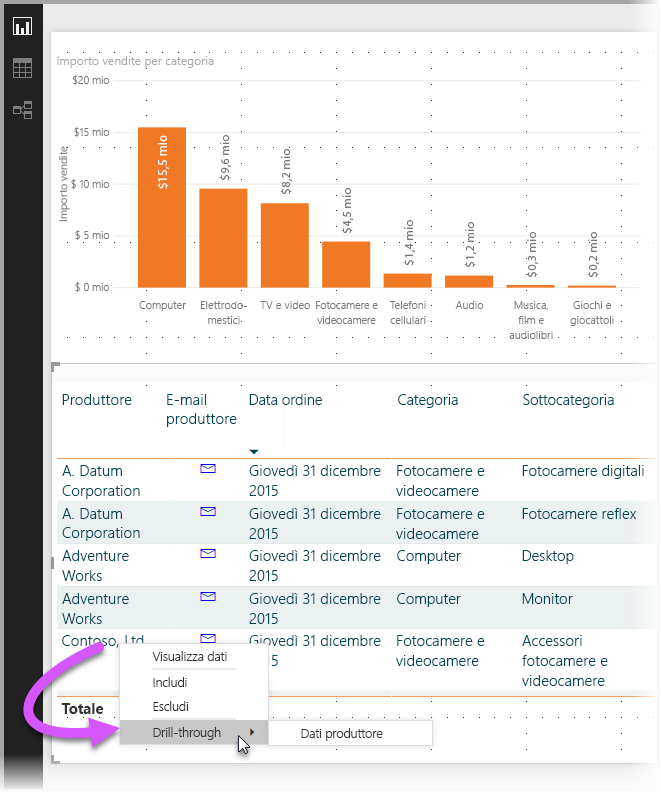
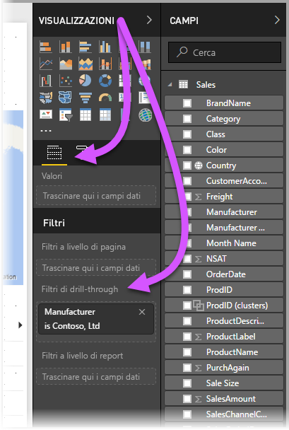
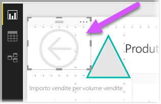
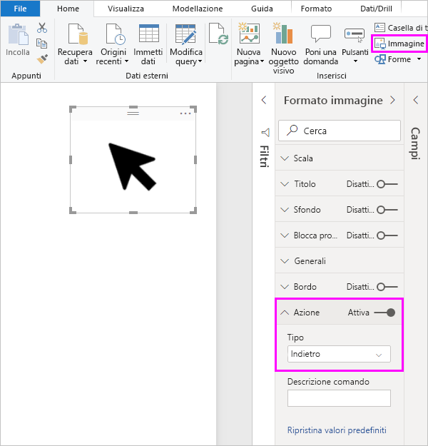
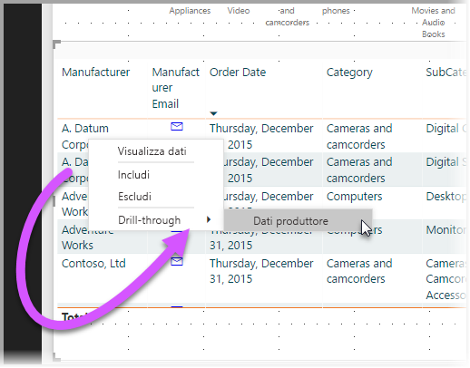
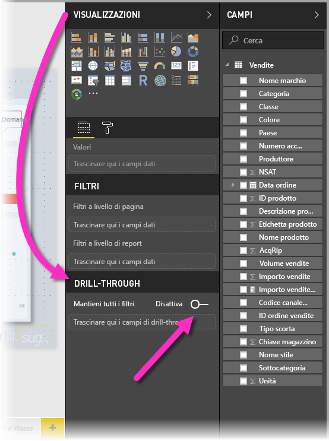
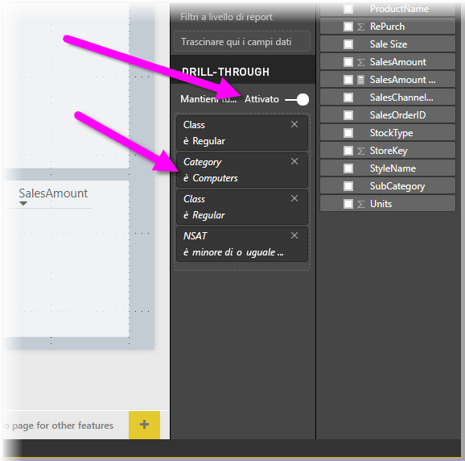
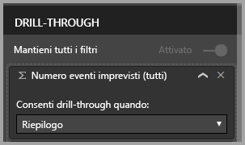

# Usare il drill-through in Power BI Desktop
Con il **drill-through** in **Power BI Desktop**, è possibile creare una pagina nel report incentrata su una specifica entità, ad esempio un fornitore, un cliente o un produttore. Gli utenti possono fare clic con il pulsante destro del mouse su un punto dati in altre pagine del report. Possono quindi eseguire il drill-through fino alla pagina di interesse per ottenere informazioni dettagliate filtrate in base al contesto.

## Uso del drill-through
1. Per usare il **drill-through**, creare una pagina di report con gli oggetti visivi desiderati per il tipo di entità per la quale si fornirà il drill-through. 

    Si supponga, ad esempio, di voler fornire il drill-through per i produttori. È quindi possibile creare una pagina di drill-through con oggetti visivi che mostrano le vendite totali, le unità spedite totali, le vendite per categoria, le vendite per area e così via. In questo modo, quando si esegue il drill-through a tale pagina, gli oggetti visivi saranno specifici per il produttore selezionato.

2. Nella pagina di drill-through, nella sezione **Campi** del riquadro **Visualizzazioni**, trascinare quindi il campo per cui si vuole abilitare il drill-through nell'area **Filtri di drill-through**.

    

    Quando si aggiunge un campo all'area **Filtri di drill-through**, **Power BI Desktop** crea automaticamente un oggetto visivo pulsante *Indietro*. Tale oggetto visivo diventa un pulsante nei report pubblicati. Gli utenti che utilizzano il report nel **servizio Power BI** possono usare questo pulsante per tornare alla pagina del report da cui sono arrivati.

    

## Usare un'immagine personalizzata per un pulsante Indietro    
 Poiché il pulsante Indietro è un'immagine, è possibile sostituire l'immagine di tale oggetto visivo con qualsiasi altra immagine desiderata. Tale immagine continuerà a funzionare come pulsante Indietro per permettere agli utenti del report di tornare alla pagina originale. Per usare un'immagine personalizzata per un pulsante Indietro, eseguire questa procedura:

1. Nella scheda **Home** selezionare **Immagine**. Individuare quindi l'immagine e inserirla nella pagina di drill-through.

2. Selezionare la nuova immagine nella pagina di drill-through. Nella sezione **Formato immagine** impostare il dispositivo di scorrimento **Collegamento** su **Attivato** e quindi impostare **Tipo** su **Indietro**. A questo punto, l'immagine funziona come pulsante Indietro.

    

    
     Ora gli utenti possono fare clic con il pulsante destro del mouse su un punto dati nel report e ottenere un menu di scelta rapida che supporta il drill-through a tale pagina. 

    

    Quando gli utenti del report scelgono di eseguire il drill-through, la pagina viene filtrata per visualizzare le informazioni sul punto dati su cui hanno fatto clic con il pulsante destro del mouse. Si immagini, ad esempio, che l'utente abbia fatto clic con il pulsante destro del mouse su un punto dati relativo a Contoso (un produttore) e abbia scelto di eseguire il drill-through. La pagina di drill-through visualizzata verrà filtrata in base a Contoso.

## Filtri in drill-through

A partire dalla versione di maggio 2018 di **Power BI Desktop**, è possibile eseguire tutti i filtri applicati alla finestra di drill-through. Ad esempio, è possibile selezionare solo una determinata categoria di prodotti e gli oggetti visivi filtrati per tale categoria e quindi selezionare il drill-through. È interessante vedere che aspetto ha il drill-through con tutti questi filtri applicati.

Per mantenere tutti i filtri applicati, nella sezione **Drill-through** del riquadro **Visualizzazioni** impostare l'interruttore **Mantieni tutti i filtri** su **Attiva**. 

Nelle versioni di **Power BI Desktop** precedenti a quella di maggio 2018, il comportamento equivale a impostare l'interruttore su **Disattiva**.

Quando si esegue il drill-through su un oggetto visivo, è possibile vedere quali filtri sono stati applicati come risultato dell'applicazione di filtri temporanei all'oggetto visivo di origine. Nella finestra di drill-through tali filtri temporanei vengono visualizzati in corsivo. 

Sarebbe possibile eseguire questa operazione con le pagine di descrizioni comando, ma tale operazione risulterebbe insolita in quanto la descrizione comando non funzionerebbe correttamente. Per questo motivo, non è consigliabile eseguire l'operazione con le descrizioni comando.

## Aggiungere una misura al drill-through

Oltre a passare tutti i filtri alla finestra di drill-through, è anche possibile aggiungere una misura o una colonna numerica di riepilogo all'area di drill-through. Trascinare il campo di drill-through nella scheda Drill-through per applicarlo. 

Quando si aggiunge una misura o una colonna numerica di riepilogo, è possibile eseguire il drill-through alla pagina quando il campo viene usato nell'area *Valore* di un oggetto visivo.

Non sono necessarie altre operazioni per l'uso del **drill-through** nei report. Questo strumento è ideale per ottenere una visualizzazione espansa delle informazioni sulle entità selezionate per il filtro di drill-through.

## Passaggi successivi

Potrebbero essere interessanti anche gli articoli seguenti:

* [Uso dei filtri dei dati in Power BI Desktop](visuals/desktop-slicers.md)

