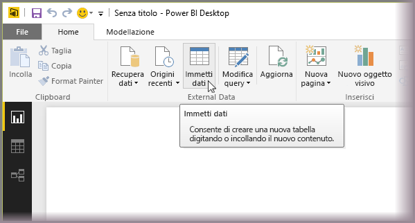
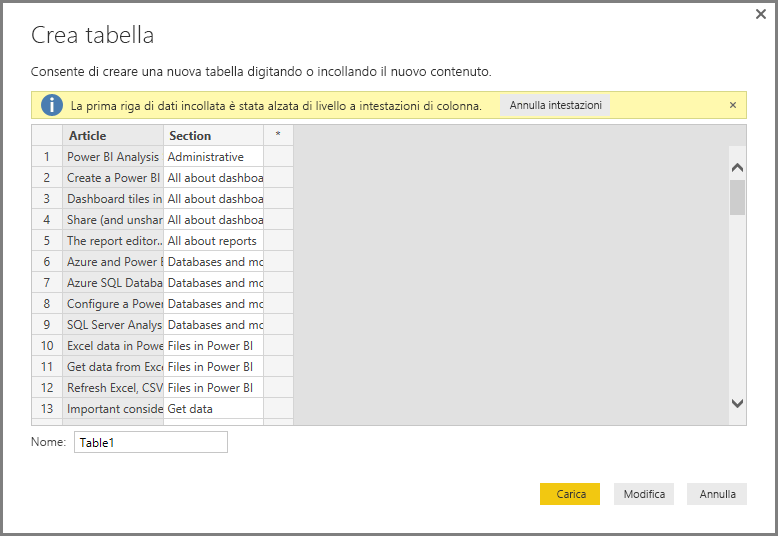
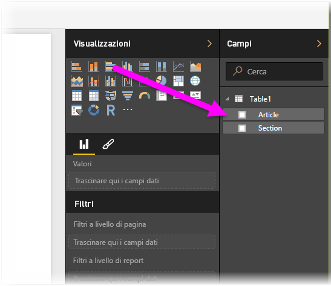

# Immettere dati direttamente in Power BI Desktop
Power BI Desktop consente l'immissione diretta di dati e l'uso dei dati nei report e nelle visualizzazioni. È ad esempio possibile copiare parti di una cartella di lavoro o di una pagina Web e quindi incollarli in Power BI Desktop.

Per immettere direttamente i dati, selezionare **Immettere i dati** dalla barra multifunzione **Home**.

Power BI Desktop potrebbe provare ad applicare trasformazioni minime ai dati, se appropriate, esattamente come per il caricamento di dati da qualsiasi altra origine. Nel caso seguente, ad esempio, la prima riga di dati viene alzata di livello e impostata come intestazioni.

Per modificare i dati immessi o incollati, è possibile selezionare il pulsante Modifica per visualizzare l'**Editor di query**, che consente di modificare e trasformare i dati prima di trasferirli in Power BI Desktop. In alternativa, è possibile selezionare il pulsante **Carica** per importare i dati senza modifiche.

Quando si seleziona **Carica**, Power BI Desktop crea una nuova tabella dai dati e la rende disponibile nel riquadro **Campi**. Nell'immagine seguente Power BI Desktop mostra la nuova tabella, denominata *Table1* per impostazione predefinita, e i due campi creati entro la tabella.

Non sono necessarie altre operazioni. L'inserimento di dati in Power BI Desktop è molto semplice.

È ora possibile usare i dati in Power BI Desktop per creare oggetti visivi e report o per interagire con qualsiasi dato a cui ci si vuole connettere e che si vuole importare, ad esempio cartelle di lavoro di Excel, database o altre origini dati.

### Passaggi successivi
È possibile connettersi a molti tipi di dati usando Power BI Desktop. Per altre informazioni sulle origini dati, vedere le risorse seguenti:

* [Che cos'è Power BI Desktop?](desktop-what-is-desktop.md)
* [Origini dati in Power BI Desktop](desktop-data-sources.md)
* [Effettuare il data shaping e combinare i dati con Power BI Desktop](desktop-shape-and-combine-data.md)
* [Connettersi a cartelle di lavoro di Excel in Power BI Desktop](desktop-connect-excel.md)   
* [Connettersi a file CSV in Power BI Desktop](desktop-connect-csv.md)   

