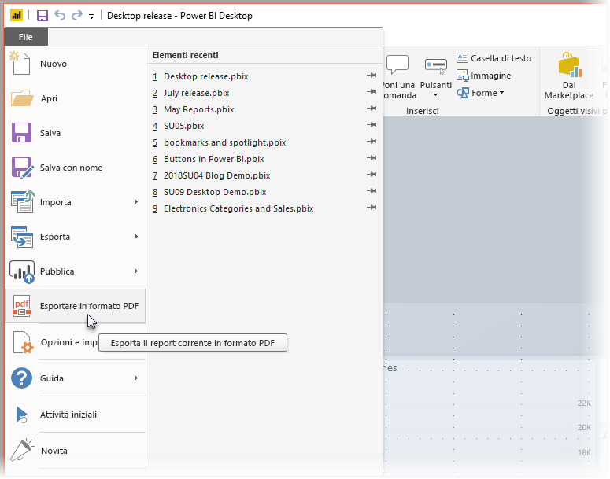
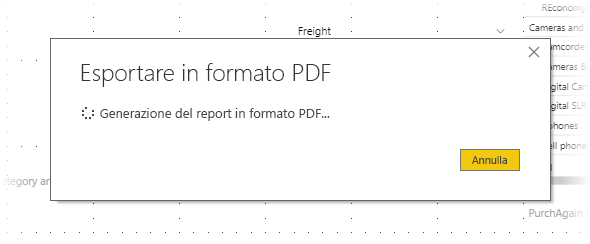

# Esportare report in formato PDF da Power BI Desktop
In **Power BI Desktop** è possibile esportare i report in un file PDF e in tal modo condividere o stampare facilmente i report da tale file PDF.

Il processo di esportazione del report da **Power BI Desktop** a un file PDF, in modo da poter stampare o condividere il file PDF, è facile. È sufficiente selezionare **File > Esporta in PDF** da Power BI Desktop.

Il processo **Esporta in PDF** esporterà tutte le pagine *visibili* nel report e ogni pagina del report verrà esportata come singola pagina nel file PDF. Le pagine del report non visibili, ad esempio eventuali descrizioni comando o le pagine nascoste, non vengono esportate nel file PDF. 

Quando si seleziona **File > Esporta in PDF**, l'esportazione viene avviata e viene visualizzata una finestra di dialogo che mostra che il processo di esportazione è in corso. La finestra di dialogo rimane sullo schermo finché non viene completato il processo di esportazione. Durante il processo di esportazione, tutte le interazioni con il report esportato sono disabilitate. L'unico modo per interagire con il report è attendere il completamento del processo di esportazione o annullare l'esportazione. 

Al termine dell'esportazione, il PDF viene caricato nel visualizzatore PDF predefinito nel computer. 

## Considerazioni e limitazioni
Esistono alcune considerazioni da tenere presenti con la funzionalità **Esporta in PDF**:

* La funzionalità **Esporta in PDF** è disponibile solo con **Power BI Desktop** e non è attualmente disponibile nel **servizio Power BI**.
* La funzionalità esporta gli oggetti visivi personalizzati, ma *non* esporta eventuali sfondi applicati al report.

Dato che lo sfondo non viene esportato nel PDF, è necessario prestare particolare attenzione ai report che usano uno sfondo scuro. Se il testo nel report è chiaro o bianco, per farlo risaltare su sfondo scuro, sarà difficile da leggere o illeggibile nell'esportazione in formato PDF perché lo sfondo non verrà esportato con il resto del report. 

## Passaggi successivi
Esistono molti elementi visivi e funzionalità interessanti in **Power BI Desktop**. Per altre informazioni, vedere le risorse seguenti:

* [Usare gli elementi visivi per migliorare i report di Power BI](desktop-visual-elements-for-reports.md)
* [Che cos'è Power BI Desktop?](desktop-what-is-desktop.md)

