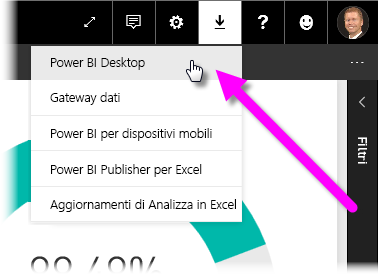
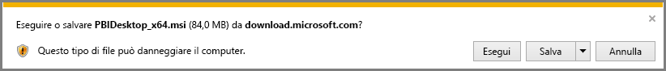
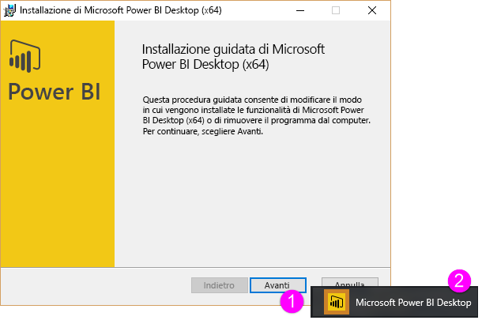
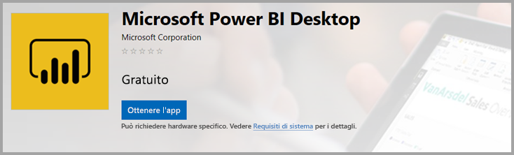
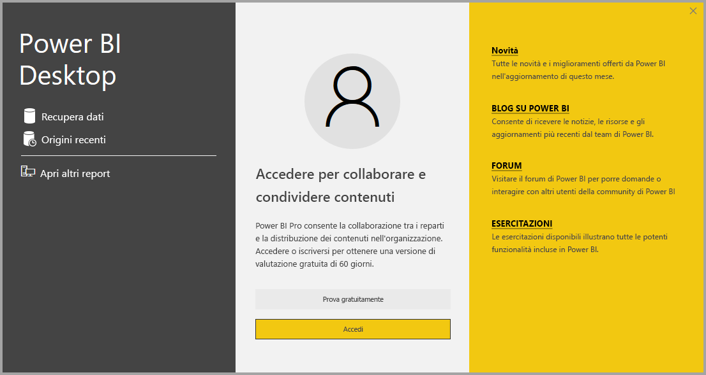

# Ottenere Power BI Desktop
**Power BI Desktop** consente di creare query, modelli e report avanzati per la visualizzazione dei dati. Con **Power BI Desktop**, è possibile creare modelli di dati, creare report e condividere il proprio lavoro pubblicandolo nel servizio Power BI.  Il download di **Power BI Desktop** è gratuito.

È possibile ottenere **Power BI Desktop** in due modi, ognuno dei quali viene descritto nelle sezioni seguenti:

* **Download** diretto (pacchetto MSI da scaricare e installare in questo computer)
* Installazione come app da **Microsoft Store**

Con entrambi gli approcci si otterrà la versione più recente di **Power BI Desktop** nel computer, ma esistono alcune differenze che vale la pena osservare e che vengono descritte nelle sezioni seguenti.

## Scarica Power BI Desktop
Per scaricare la versione più recente di **Power BI Desktop** è possibile selezionare l'icona di download nell'angolo in alto a destra del servizio Power BI e selezionare **Power BI Desktop**.

È anche possibile scaricare la versione più recente di Power BI Desktop dalla seguente pagina di download:

* [**Download di Power BI Desktop** (entrambe le versioni a 32 e a 64 bit)](https://powerbi.microsoft.com/desktop).
  
  

Indipendentemente dal download scelto, dopo aver scaricato **Power BI Desktop** verrà chiesto di eseguire il file di installazione:

**Power BI Desktop** viene installato come applicazione ed eseguito sul desktop.

> [!NOTE]
> L'installazione della versione scaricata (MSI) e della versione in **Microsoft Store** di **Power BI Desktop** nello stesso computer (anche detta installazione *side-by-side*) non è supportata.
> 
> 

## Installazione come app da Microsoft Store
È possibile ottenere **Power BI Desktop** anche da Microsoft Store usando il collegamento seguente:

* [Installare **Power BI Desktop** da **Microsoft Store**](http://aka.ms/pbidesktopstore)

Esistono alcuni vantaggi nell'ottenere **Power BI Desktop** da Microsoft Store:

* **Aggiornamenti automatici**: Windows scarica la versione più recente automaticamente in background non appena è disponibile, per cui la versione usata è sempre aggiornata.
* **Download più piccoli**: **Microsoft Store** assicura che vengano scaricati nel computer solo i componenti modificati in ogni aggiornamento, in modo da ottenere download più piccoli per ogni aggiornamento.
* **Non sono necessari privilegi di amministratore**: per scaricare direttamente il pacchetto MSI e installarlo, è necessario essere un amministratore affinché l'installazione venga completata correttamente. Se si ottiene **Power BI Desktop** da Microsoft Store, il privilegio di amministratore *non* è necessario.
* **Abilitazione dell'implementazione IT**: la versione di **Microsoft Store** può essere distribuita (*implementata*) più facilmente per tutti gli utenti dell'organizzazione ed è possibile rendere disponibile **Power BI Desktop** tramite **Microsoft Store per le aziende**.
* **Rilevamento della lingua**: la versione di **Microsoft Store** include tutte le lingue supportate e controlla la lingua usata nel computer a ogni avvio. Questo influisce anche sulla localizzazione dei modelli creati in **Power BI Desktop**. Ad esempio, le gerarchie di date predefinite corrisponderanno alla lingua usata da **Power BI Desktop** quando viene creato il file con estensione pbix.

Esistono alcune considerazioni e limitazioni per l'installazione di **Power BI Desktop** da Microsoft Store, che includono quanto segue:

* Se si usa il connettore SAP, potrebbe essere necessario spostare i file del driver SAP per la cartella *Windows\System32*.
* L'installazione di **Power BI Desktop** da Microsoft Store non copia le impostazioni utente dalla versione MSI. Potrebbe essere necessario ristabilire la connessione alle origini dati recenti e immettere nuovamente le credenziali dell'origine dati. 

> [!NOTE]
> L'installazione della versione scaricata (MSI) e della versione in **Microsoft Store** di **Power BI Desktop** nello stesso computer (anche detta installazione *side-by-side*) non è supportata. È necessario disinstallare manualmente **Power BI Desktop** prima di scaricarlo da **Microsoft Store**
> 
> [!NOTE]
> La versione Server di report di Power BI di **Power BI Desktop** è un'installazione separata e diversa rispetto alle versioni illustrate in questo articolo. Per informazioni sulla versione Server di report di **Power BI Desktop**, vedere [Creare un report di Power BI per il Server di report di Power BI](report-server/quickstart-create-powerbi-report.md).
> 
> 

## Uso di Power BI Desktop
Quando si avvia **Power BI Desktop** viene visualizzata una *schermata iniziale*.

Se si usa per la prima volta **Power BI Desktop**, ovvero se l'installazione non è un aggiornamento, verrà richiesta la compilazione di un modulo e la risposta ad alcune domande o sarà necessario accedere al **servizio Power BI** per poter continuare.

Da qui è possibile iniziare a creare modelli di dati o report, quindi condividerli con altri utenti nel servizio Power BI. Vedere i collegamenti **Altre informazioni** alla fine di questo articolo per i collegamenti a guide sulle attività iniziali in **Power BI Desktop**.

## Requisiti minimi
Di seguito sono elencati i requisiti minimi per l'esecuzione di **Power BI Desktop**:

* Windows 7 / Windows Server 2008 R2 o versioni successive
* .NET 4.5
* Internet Explorer 10 o versioni successive
* **Memoria (RAM):** almeno 1 GB disponibile, 1,5 GB o più consigliati.
* **Schermo:** almeno 1440x900 o 1600x900 (16:9) consigliato. Risoluzioni inferiori, ad esempio 1024 x 768 o 1280 x 800 non sono consigliate, perché alcuni controlli (ad esempio la chiusura della schermata iniziale) vengono visualizzati oltre tali risoluzioni.
* **Impostazioni dello schermo di Windows:** se le impostazioni di visualizzazione sono configurate per la modifica delle dimensioni di testo, app e altri elementi fino a un valore superiore al 100%, è possibile che non si riesca a visualizzare alcune finestre di dialogo che devono essere chiuse o a cui occorre rispondere per poter continuare a usare **Power BI Desktop**. Se si verifica questo problema, controllare le **Impostazioni dello schermo** passando a **Impostazioni > Sistema > Schermo** in Windows, quindi usare il dispositivo di scorrimento per ripristinare il valore 100% per le impostazioni di visualizzazione.
* **CPU:** 1 gigahertz (GHz) o più veloce, consigliato processore x86 o x64 bit.

## Considerazioni e limitazioni

Microsoft desidera offrire un'esperienza straordinaria con Power BI Desktop. In alcuni casi potrebbe verificarsi un problema con Power BI Desktop, quindi in questa sezione vengono indicate le soluzioni o forniti suggerimenti per risolvere i problemi che potrebbero verificarsi. 

### Problemi nell'uso delle versioni precedenti di Power BI Desktop

Alcuni utenti rilevano un errore simile al seguente quando usano una versione obsoleta di **Power BI Desktop**: 

    "We weren't able to restore the saved database to the model" 

In genere l'aggiornamento alla versione corrente di Power BI Desktop risolve il problema.

### Disabilitazione delle notifiche
È consigliabile eseguire l'aggiornamento alla versione più recente di Power BI Desktop per sfruttare i miglioramenti apportati alle funzionalità, alle prestazioni e alla stabilità e le altre novità. Alcune organizzazioni potrebbero preferire che gli utenti non eseguano l'aggiornamento a ogni nuova versione. È possibile disabilitare le notifiche modificando il Registro di sistema seguendo questa procedura:

1. Nell'editor del Registro di sistema passare a *HKEY_LOCAL_MACHINE\SOFTWARE\Microsoft\Microsoft Power BI Desktop*
2. Creare una nuova voce con le impostazioni seguenti: *REG_DWORD: DisableUpdateNotification*
3. Impostare il valore della nuova voce su **1**.

Per rendere effettiva la modifica, sarà necessario riavviare il computer.

### Power BI Desktop viene caricato con una schermata parziale

In alcune circostanze, tra cui determinate configurazioni di risoluzione dello schermo, Power BI Desktop potrebbe eseguire il rendering del contenuto con grandi aree nere. Ciò è in genere dovuto ad aggiornamenti recenti del sistema operativo che influiscono sulla modalità di rendering degli elementi e non è un risultato diretto del modo in cui Power BI Desktop presenta il contenuto. Le grandi aree nere non sono comunque oggetti visivi piacevoli, quindi per risolvere questo problema, eseguire questa procedura:

1. Fare clic su Start e digitare *sfocate* nella barra di ricerca che viene visualizzata.
2. Nella finestra di dialogo visualizzata selezionare l'opzione *Risolvere i problemi delle app che sono sfocate.*
3. Riavviare Power BI Desktop.

Questo problema potrebbe risolversi dopo il rilascio degli aggiornamenti successivi di Windows. 
 

## Passaggi successivi
Dopo aver installato **Power BI Desktop**, il contenuto seguente consente di svolgere rapidamente le attività iniziali:

* [Che cos'è Power BI Desktop?](desktop-what-is-desktop.md)
* [Panoramica delle query con Power BI Desktop](desktop-query-overview.md)
* [Origini dati in Power BI Desktop](desktop-data-sources.md)
* [Connettersi ai dati in Power BI Desktop](desktop-connect-to-data.md)
* [Effettuare il data shaping e combinare i dati con Power BI Desktop](desktop-shape-and-combine-data.md)
* [Attività di query comuni in Power BI Desktop](desktop-common-query-tasks.md)   

