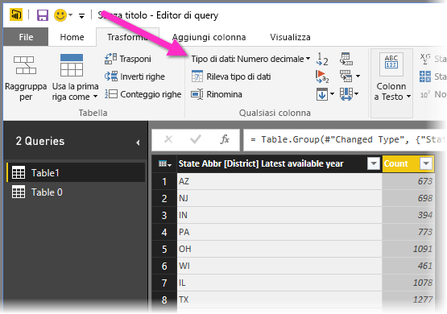

# Introduzione a Power BI Desktop
Questa guida introduttiva a Power BI Desktop offre informazioni di base sul funzionamento del programma, illustra le operazioni che è possibile eseguire e aiuta a creare rapidamente modelli di dati affidabili e report straordinari, a supporto delle attività di business intelligence.

Per una rapida panoramica di come funziona Power BI Desktop e di come usare il programma, è possibile esaminare le schermate di questa guida in pochi minuti. Per un approfondimento, è possibile leggere ogni sezione, eseguire i passaggi e creare un file di Power BI Desktop pronto per la pubblicazione nel [servizio Power BI](https://app.powerbi.com/) e la condivisione con altri utenti.

È anche possibile guardare il video [introduttivo a Power BI Desktop](https://www.youtube.com/watch?v=Qgam9M8I0xA) e scaricare la cartella di lavoro [Financial Sample](https://go.microsoft.com/fwlink/?LinkID=521962) di Excel da visualizzare insieme al video.

## Funzionamento di Power BI Desktop
Con Power BI Desktop, è possibile:
1. Connettersi ai dati, incluse più origini dati.
1. Eseguire il data shaping con query che creano modelli di dati utili e accattivanti.
1. Usare i modelli di dati per creare visualizzazioni e report. 
1. Condividere i file di report che altri utenti possono usare, ampliare e condividere. È possibile condividere i file con estensione *pbix* di Power BI Desktop come qualsiasi altro file, ma il metodo più efficace consiste nel caricarli nel [servizio Power BI](https://preview.powerbi.com/). 

Power BI Desktop integra le tecnologie collaudate di Microsoft Query Engine, modellazione dei dati e visualizzazione. Analisti di dati e altri utenti possono creare raccolte di query, connessioni dati, modelli e report e condividerli facilmente. Grazie alla combinazione di Power BI Desktop con il servizio Power BI, è possibile modellare, creare, condividere ed estendere con maggiore facilità nuove informazioni dettagliate ricavate dai dati.

Power BI Desktop centralizza, semplifica e ottimizza quello che altrimenti sarebbe un processo confuso, disconnesso e complesso per la progettazione e la creazione di repository e report di business intelligence.
Se si è pronti per un tentativo, Le informazioni seguenti descrivono come eseguire queste operazioni.

> [!NOTE]
> Per i dati e i report che devono rimanere in locale è disponibile anche una versione separata e specializzata di Power BI denominata [Server di report di Power BI](report-server/get-started.md). Per l'uso con tale versione è disponibile una versione separata e specializzata di Power BI Desktop, denominata Power BI Desktop per Server di report di Power BI, che funziona solo con la versione Server di report di Power BI. In questo articolo viene illustrata la versione standard di Power BI Desktop.

## Installare ed eseguire Power BI Desktop
Per scaricare Power BI Desktop, accedere alla [pagina di download di Power BI Desktop](https://powerbi.microsoft.com/desktop) e selezionare **Scarica gratis**. In alternativa, per le opzioni di download, selezionare [Visualizza le opzioni per il download o per il linguaggio](https://www.microsoft.com/download/details.aspx?id=58494). 

È anche possibile scaricare Power BI Desktop dal servizio Power BI. Selezionare l'icona **Download** nella barra dei menu superiore, quindi selezionare **Power BI Desktop**.

Nella pagina di Microsoft Store selezionare **Ottieni** e seguire le istruzioni per installare Power BI Desktop nel computer. Avviare Power BI Desktop dal menu **Start** di Windows o dall'icona nella barra delle applicazioni di Windows.

Al primo avvio di Power BI Desktop viene visualizzata la schermata **iniziale**.

Dalla schermata **iniziale** è possibile **scaricare i dati**, vedere **origini recenti**, aprire report recenti, **aprire altri report** oppure selezionare altri collegamenti. È anche possibile scegliere se visualizzare sempre la schermata **iniziale** all'avvio. Selezionare l'icona di chiusura per chiudere la schermata **iniziale**.

Lungo il lato sinistro della schermata di Power BI Desktop sono presenti icone per le tre viste di Power BI Desktop: dall'alto verso il basso **Report**, **Dati** e **Relazioni**. La vista corrente è indicata dalla barra gialla sulla sinistra. Per passare a un'altra vista, selezionare una delle icone. 

La vista predefinita è **Report**. 

Power BI Desktop include anche l'**editor di Power Query**, che viene aperto in una finestra separata. Nell'**editor di Power Query** è possibile creare query e trasformare i dati, quindi caricare il modello di dati ottimizzato in Power BI Desktop per creare report.

## Connettersi ai dati
Dopo avere installato Power BI Desktop, è possibile connettersi al mondo dei dati in continua espansione. Per visualizzare i diversi tipi di origini dati disponibili, selezionare **Recupera dati** > **Altro** nella scheda **Home** di Power BI Desktop e, nella finestra **Recupera dati**, scorrere l'elenco di **Tutte** le origini dati. In questa breve panoramica ci si connetterà a due origini dati **Web** diverse.

Si supponga di lavorare come analista di dati per un rivenditore di occhiali da sole. Si intende aiutare il proprio cliente a concentrare le vendite nei luoghi con il clima migliore, in cui le giornate di sole sono più frequenti. La pagina di Bankrate.com sugli [Stati americani ideali dove trasferirsi dopo la pensione](https://www.bankrate.com/retirement/best-and-worst-states-for-retirement/) offre dati interessanti su questo argomento.

Nella scheda **Home** di Power BI Desktop selezionare **Recupera dati** > **Web** per connettersi a un'origine dati Web. 

Nella finestra di dialogo **Da Web** incollare l'indirizzo *https:\//www.bankrate.com/retirement/best-and-worst-states-for-retirement/* nel campo **URL** e selezionare **OK**. 

Se richiesto, nella schermata **Accedi a contenuto Web** selezionare **Connetti** per usare l'accesso anonimo. 

La funzionalità per le query di Power BI Desktop viene attivata e contatta la risorsa Web. La finestra **Strumento di navigazione** restituisce i dati trovati nella pagina Web, in questo caso una tabella denominata **Ranking of best and worst states for retirement** e un documento. Le informazioni interessanti sono riportate nella tabella, quindi selezionarla per visualizzarla in anteprima.

A questo punto è possibile selezionare **Carica** per caricare la tabella oppure **Trasforma dati** per apportare modifiche alla tabella prima di caricarla.

Quando si seleziona **Trasforma dati**, viene avviato l'editor di Power Query con una vista rappresentativa della tabella. Sulla destra è riportato il riquadro **Impostazioni query**, che è possibile visualizzare anche selezionando **Impostazioni query** nella scheda **Visualizza** dell'editor di Power Query. 

Per altre informazioni sulla connessione ai dati, vedere [Connettersi ai dati in Power BI Desktop](desktop-connect-to-data.md).

## Data shaping
Dopo aver stabilito la connessione a un'origine dati, è possibile modificare i dati in base alle proprie esigenze. Per il *data shaping* è necessario fornire all'editor di Power Query istruzioni dettagliate per la modifica dei dati durante il caricamento e la presentazione. L'origine dati originale non subisce alcuna modifica. Viene modificata solo questa vista specifica. 

> [!NOTE]
> I dati della tabella usati in questa guida potrebbero cambiare nel tempo. Di conseguenza, la procedura da seguire potrebbe variare. Sarà quindi necessario essere creativi per adeguare i vari passaggi o i risultati, operazioni comunque utili per l'apprendimento. 

Il data shaping può comportare una *trasformazione* dei dati, ad esempio la ridenominazione di colonne o tabelle, la rimozione di righe o colonne o la modifica dei tipi di dati. L'editor di Power Query acquisisce questi passaggi in sequenza nell'elenco **Passaggi applicati** del riquadro **Impostazioni query**. Ogni volta che la query si connette all'origine dati, vengono eseguiti questi passaggi in modo che i dati abbiano sempre la forma specificata. Questo processo si verifica quando si usa la query in Power BI Desktop oppure quando altri utenti usano la query condivisa, ad esempio nel servizio Power BI. 

Si noti che nell'area **Passaggi applicati** in **Impostazioni query** sono già presenti alcuni passaggi. È possibile selezionare ogni passaggio per verificarne l'effetto nell'editor di Power Query. Per prima cosa è stata specificata un'origine Web, quindi è stata visualizzata l'anteprima della tabella nella finestra **Strumento di navigazione**. Nel terzo passaggio, **Modificato tipo**, Power BI ha riconosciuto dati di numeri interi durante l'importazione e ha modificato il *tipo di dati* **Testo** Web originale in **Numero intero**. 

Se è necessario modificare un tipo di dati, selezionare le colonne da modificare. Tenere premuto **MAIUSC** per selezionare più colonne adiacenti oppure **CTRL** per selezionare colonne non adiacenti. Fare clic con il pulsante destro del mouse su un'intestazione di colonna, selezionare **Modifica tipo** e scegliere un nuovo tipo di dati dal menu oppure fare clic sulla freccia dell'elenco a discesa accanto a **Tipo di dati** nel gruppo **Trasforma** della scheda **Home** e selezionare un nuovo tipo di dati.

> [!NOTE]
> Nell'editor di Power Query in Power BI Desktop è possibile usare la barra multifunzione o i menu di scelta rapida per le attività disponibili. La maggior parte delle opzioni che è possibile selezionare nella scheda **Home** o **Trasforma** della barra multifunzione è disponibile anche facendo clic con il pulsante destro del mouse su un elemento e scegliendo un'opzione dal menu visualizzato.

È ora possibile applicare le modifiche e le trasformazioni ai dati e visualizzarle in **Passaggi applicati**. 

Ad esempio, per le vendite di occhiali da sole si è maggiormente interessati alla classificazione basata sul clima, quindi si decide di ordinare la tabella in base alla colonna **Weather** in sostituzione di **Overall rank**. Fare clic sulla freccia del menu a discesa accanto all'intestazione **Weather** e selezionare **Ordinamento crescente**. I dati vengono ora ordinati in base al clima e in **Passaggi applicati** viene visualizzato il passaggio **Righe ordinate**. 

Poiché gli Stati con il clima peggiore sono poco interessanti ai fini della vendita di occhiali da sole, si decide di rimuoverli dalla tabella. Dal gruppo **Riduci righe** della scheda **Home** selezionare **Rimuovi righe** > **Rimuovi ultime righe**. Nella finestra di dialogo **Rimuovi ultime righe** immettere *10* e quindi selezionare **OK**. 

Le ultime 10 righe relative agli Stati con il clima peggiore vengono rimosse dalla tabella e in **Passaggi applicati** viene visualizzato il passaggio **Ultime righe rimosse**.

Poiché la tabella contiene troppe informazioni in più rispetto alle proprie esigenze, si decide di rimuovere le colonne **Affordability**, **Crime**, **Culture** e **Wellness**. Selezionare l'intestazione di ogni colonna da rimuovere. Tenere premuto **MAIUSC** per selezionare più colonne adiacenti oppure **CTRL** per selezionare colonne non adiacenti. 

Dal gruppo **Gestisci colonne** della scheda **Home** selezionare **Rimuovi colonne**. È anche possibile fare clic con il pulsante destro del mouse su una delle intestazioni di colonna selezionate e scegliere **Rimuovi colonne** dal menu. Le colonne selezionate vengono rimosse e in **Passaggi applicati** viene visualizzato il passaggio **Colonne rimosse**.

Ripensandoci, però, la colonna **Affordability** potrebbe essere pertinente per le vendite di occhiali da sole. Si vuole quindi ripristinare tale colonna. È possibile annullare facilmente l'ultimo passaggio nel riquadro **Passaggi applicati** selezionando l'icona di eliminazione **X** corrispondente. A questo punto, ripetere il passaggio, selezionando solo le colonne da eliminare. Per maggiore flessibilità, può essere utile eliminare ogni colonna come passaggio separato. 

È possibile fare clic con il pulsante destro del mouse su qualsiasi passaggio nel riquadro **Passaggi applicati** e scegliere di eliminarlo, rinominarlo, spostarlo verso l'alto o verso il basso nella sequenza oppure aggiungere o eliminare i passaggi successivi. Per i passaggi intermedi, Power BI Desktop avvisa l'utente che la modifica potrebbe influire sui passaggi successivi e causare l'interruzione della query.  

Si supponga, ad esempio, di non voler più ordinare la tabella in base a **Weather** e di provare a eliminare il passaggio **Righe ordinate**. Power BI Desktop avvisa che l'eliminazione di questo passaggio potrebbe causare l'interruzione della query. Sono state rimosse le ultime 10 righe dopo l'ordinamento in base al clima e pertanto, se si annulla l'ordinamento, verranno rimosse righe diverse. Viene visualizzato un avviso anche se si seleziona il passaggio **Righe ordinate** e si prova ad aggiungere un nuovo passaggio intermedio in corrispondenza di quel punto.  

Si modifica infine il titolo della tabella per indicare che si riferisce alle vendite di occhiali da sole e non di luoghi in cui vivere da pensionati. Nell'area **Proprietà** nel riquadro **Impostazioni query** sostituire il vecchio titolo con *Best states for sunglass sales*.

La query completata per i dati sottoposti a data shaping avrà l'aspetto seguente:

Per altre informazioni sul data shaping, vedere [Data shaping e combinazione di dati in Power BI Desktop](desktop-shape-and-combine-data.md).

## Combinare i dati
I dati sui diversi stati sono interessanti e saranno utili per la creazione di analisi e query aggiuntive. Si nota tuttavia un problema. Nella maggior parte dei dati viene usata un'abbreviazione di due lettere per i codici relativi allo Stato e non il nome completo. Per usare tali dati, è necessario trovare un modo per associare i nomi degli Stati e le rispettive abbreviazioni.

Per fortuna, è disponibile un'altra origine dati pubblica che esegue proprio questa operazione, ma è necessaria una certa attività di data shaping prima di poter *combinare* tale origine dati con la tabella relativa agli occhiali da sole.

Per importare i dati delle abbreviazioni degli Stati nell'editor di Power Query, selezionare **Nuova origine** > **Web** dal gruppo **Nuova query** nella scheda **Home** della barra multifunzione. 

Nella finestra di dialogo **Da Web** immettere l'URL relativo al sito delle abbreviazioni degli Stati: *https:\//en.wikipedia.org/wiki/List_of_U.S._state_abbreviations*.

Nella finestra **Strumento di navigazione** selezionare la tabella **Codes and abbreviations for U.S. states, federal district, territories, and other regions** e quindi selezionare **OK**. La tabella verrà aperta nell'editor di Power Query.

Rimuovere tutte le colonne ad eccezione di **Name and status of region**, **Name and status of region2** e **ANSI**. Per mantenere solo queste colonne, tenere premuto **CTRL** e selezionare le colonne. Fare quindi clic con il pulsante destro del mouse su una delle intestazioni di colonna e selezionare **Rimuovi altre colonne** oppure, dal gruppo **Gestisci colonne** della scheda **Home**, selezionare **Rimuovi altre colonne**. 

Fare clic sulla freccia del menu a discesa accanto all'intestazione di colonna **Name and status of region2** e selezionare **Filtri** > **Uguale a**. Nella finestra di dialogo **Filtra righe**, fare clic sulla freccia del menu a discesa **Immettere o selezionare un valore** accanto a **uguale a** e selezionare **State**. 

Selezionare **Or**, quindi selezionare **State ("Commonwealth")** accanto al secondo campo **uguale a**. Seleziona **OK**. 

Con i valori aggiuntivi come **Federal District** e **island** rimossi, è ora disponibile l'elenco dei 50 Stati con le abbreviazioni ufficiali di due lettere. È possibile modificare i nomi delle colonne in modo da renderli più comprensibili, ad esempio **State name**, **Status** e **Abbreviation**, facendo clic con il pulsante destro del mouse sulle intestazioni di colonna e scegliendo **Rinomina**.

Si noti che tutti questi passaggi vengono registrati in **Passaggi applicati** nel riquadro **Impostazioni query**.

La tabella sottoposta a data shaping ha ora un aspetto simile al seguente:

Modificare il titolo della tabella specificando *State codes* nel campo **Proprietà** di **Impostazioni query**. 

Al termine del data shaping della tabella **State codes**, è possibile *combinare* le due tabelle. Poiché queste tabelle sono il risultato di query applicate ai dati, vengono chiamate anche *query*. È possibile combinare le query in due modi principali, ovvero tramite *merge* e *accodamento*. 

Quando una o più colonne devono essere aggiunte a un'altra query, è consigliabile eseguire il *merge* delle query. Quando altre righe di dati devono essere aggiunte a una query esistente, è consigliabile *accodare* la query.

In questo caso, si vuole eseguire il *merge* della query **State codes** nella query **Best states for sunglasses**. Per eseguire il merge, passare alla query **Best states for sunglasses** selezionandola dal riquadro **Query** sul lato sinistro dell'editor di Power Query. Selezionare quindi **Merge di query** dal gruppo **Combina** nella scheda **Home** della barra multifunzione.

Nella finestra **Merge** fare clic sulla freccia del menu a discesa per selezionare **State codes** dalle altre query disponibili. Da ciascuna delle due tabelle selezionare la colonna da associare, in questo caso **State** dalla query **Best states for sunglasses** e **State name** dalla query **State codes**. 

Se viene visualizzata una finestra di dialogo **Livelli di privacy**, selezionare **Ignora i controlli dei livelli di privacy per questo file** e quindi scegliere **Salva**. Seleziona **OK**. 

Nella parte destra della tabella **Best states for sunglass sales** viene visualizzata una nuova colonna denominata **State codes**. Contiene la query relativa ai codici degli Stati di cui è stato eseguito il merge con la query sui migliori Stati per le vendite di occhiali da sole. Tutte le colonne della tabella sottoposta a merge vengono condensate nella colonna **State codes**. È possibile *espandere* tabella e includere solo le colonne desiderate. 

Per espandere la tabella sottoposta a merge e selezionare le colonne da includere, selezionare l'icona **Espandi** nell'intestazione di colonna. Nella finestra di dialogo **Espandi** selezionare solo la colonna **Abbreviation**. Deselezionare **Usa il nome della colonna originale come prefisso** e quindi selezionare **OK**. 

> [!NOTE]
> È possibile esplorare vari modi per inserire la tabella **State codes**. Fare qualche prova e, se i risultati non sono quelli desiderati, è sufficiente eliminare il passaggio dall'elenco **Passaggi applicati** nel riquadro **Impostazioni query**. È possibile ripetere più volte l'operazione di espansione, fino a ottenere il risultato desiderato.

Per una descrizione completa dei passaggi di data shaping e combinazione di dati, vedere [Data shaping e combinazione di dati in Power BI Desktop](desktop-shape-and-combine-data.md).

È ora disponibile una singola tabella di query che combina due origini dati, ognuna delle quali è stata sottoposta a data shaping in base a esigenze specifiche. Questa query può essere usata come base per molte altre connessioni dati interessanti, ad esempio i dati demografici, i livelli di benessere o le opportunità ricreative nei vari Stati.

Per il momento la quantità di dati è sufficiente per creare un report interessante in Power BI Desktop. Poiché si tratta di un'attività cardine, applicare le modifiche nell'**editor di Power Query** e caricarle in Power BI Desktop selezionando **Chiudi e applica** nella scheda **Home** della barra multifunzione. È anche possibile selezionare semplicemente **Applica** per mantenere aperta la query nell'editor di Power Query mentre si lavora in Power BI Desktop. 

È possibile apportare più modifiche a una tabella dopo che è stata caricata in Power BI Desktop e ricaricare il modello per applicare le eventuali modifiche apportate. Per riaprire l'**editor di Power Query** da Power BI Desktop, selezionare **Modifica query** nella scheda **Home** della barra multifunzione di Power BI Desktop. 

## Creare report
Nella vista **Report** di Power BI Desktop è possibile creare visualizzazioni e report. La vista **Report** include sei aree principali:

1. La barra multifunzione nella parte superiore della vista, che include le attività comuni associate ai report e alle visualizzazioni.
2. L'area di disegno nella parte centrale, dove vengono create e disposte le visualizzazioni.
3. La scheda delle pagine nella parte inferiore, che consente di selezionare o aggiungere pagina di report.
4. Il riquadro **Filtri**, in cui è possibile filtrare le visualizzazioni dei dati.
5. Il riquadro **Visualizzazioni**, in cui è possibile aggiungere, modificare o personalizzare le visualizzazioni e applicare il drill-through.
6. Il riquadro **Campi**, che mostra i campi disponibili nelle query. È possibile trascinare questi campi nell'area di disegno, nel riquadro **Filtri** o nel riquadro **Visualizzazioni** per creare o modificare le visualizzazioni.

È possibile espandere e comprimere i riquadri **Filtri**, **Visualizzazioni** e **Campi** selezionando le frecce nelle parti superiori dei riquadri. È possibile comprimere i riquadri per ottenere più spazio nell'area di disegno e creare visualizzazioni accattivanti. 

Per creare una visualizzazione semplice, è sufficiente selezionare un campo dall'elenco **Campi** oppure trascinarlo dall'elenco nell'area di disegno. Ad esempio, trascinare il campo **State** da **Best states for sunglass sales** nell'area di disegno.

Osservare cosa accade. Power BI Desktop ha riconosciuto che il campo **State** include dati di georilevazione e ha creato automaticamente una visualizzazione basata su mappa. La visualizzazione mostra i punti dati per i 40 Stati del modello di dati. 

Il riquadro **Visualizzazioni** mostra le informazioni sulla visualizzazione e consente di modificarle. 

1. Le icone mostrano il tipo di visualizzazione creata. È possibile modificare il tipo di una visualizzazione selezionata facendo clic su un'icona diversa oppure creare una nuova visualizzazione facendo clic su un'icona senza selezionare alcuna visualizzazione esistente. 
2. L'opzione **Campi** nel riquadro **Visualizzazione** consente di trascinare i campi dati in **Legenda** e altre aree di campi nel riquadro. 
3. L'opzione **Formato** consente di applicare la formattazione e altri controlli alle visualizzazioni. 

Le opzioni disponibili nelle aree **Campi** e **Formato** dipendono dal tipo di visualizzazione e dai dati disponibili.

Si vuole che la visualizzazione della mappa includa solo i primi 10 Stati con il clima migliore. Per visualizzarli, nel riquadro **Filtri** passare il mouse su **State è (Tutto)** e fare clic sulla freccia per espandere l'elenco. In **Tipo di filtro** fare clic sulla freccia del menu a discesa e selezionare **Primi N**. In **Mostra elementi** selezionare **In basso** per visualizzare gli elementi con le classificazioni numeriche più basse e immettere *10* nel campo successivo.

Trascinare il campo **Weather** dal riquadro **Campi** nel campo **Per valore** e quindi selezionare **Applica filtro**. 

Nella visualizzazione della mappa sono ora visibili solo i primi 10 Stati con il clima migliore. 

Modificare il titolo della visualizzazione. Per eseguire questa operazione, selezionare l'icona **Formato** nel riquadro **Visualizzazione**, selezionare **Titolo** e digitare *Top 10 weather states* in **Testo titolo**. 

Per aggiungere una visualizzazione che mostra i nomi dei primi 10 Stati con il clima migliore e le rispettive classificazioni da 1 a 10, selezionare un'area vuota nell'area di disegno e quindi fare clic sull'icona **Istogramma** nel riquadro **Visualizzazione**. Nel riquadro **Campi** selezionare **State** e **Weather**. Viene visualizzato un istogramma che mostra i 40 Stati della query, ordinati in base alla classificazione numerica, dal valore più alto a quello più basso, ovvero da quello con il clima peggiore a quello con il clima migliore. 

Per cambiare l'ordine della classificazione in modo che il numero 1 venga visualizzato per primo, fare clic sull'icona **Altre opzioni** con i puntini di sospensione, nell'angolo in alto destra della visualizzazione, quindi selezionare **Ordinamento crescente** dal menu. 

Per limitare la tabella ai primi 10 Stati, applicare lo stesso filtro per le 10 righe con il valore più basso usato per la visualizzazione della mappa. 

Modificare il titolo della visualizzazione come si è fatto per la quella relativa alla mappa. Inoltre, nella sezione **Formato** del riquadro **Visualizzazione**, in **Asse Y** > **Titolo asse** sostituire **Weather** con *Weather ranking* per specificare più chiaramente il titolo dell'asse. Impostare quindi il selettore **Asse Y** su **Off** ed **Etichette dati** su **On**. 

A questo punto, i primi 10 Stati con il clima migliore vengono visualizzati in ordine, con le rispettive classificazioni numeriche. 

È possibile creare visualizzazioni simili o di altro tipo per i campi **Affordability** e **Overall ranking** oppure combinare più campi in una sola visualizzazione. È possibile creare molti report e visualizzazioni interessanti. Queste visualizzazioni **Tabella** e **Grafico a linee e istogramma a colonne raggruppate** mostrano i 10 Stati con il clima migliore con i dati relativi all'economicità e alla classificazione generale:

È possibile mostrare diverse visualizzazioni in diverse pagine del report. Per aggiungere una nuova pagina, selezionare il simbolo **+** accanto alle pagine esistenti sulla barra delle pagine oppure selezionare **Inserisci** > **Nuova pagina** nella scheda **Home** della barra multifunzione. Per rinominare una pagina, fare doppio clic sul nome corrispondente nella barra delle pagine oppure fare clic con il pulsante destro del mouse su di essa e scegliere **Rinomina pagina**, quindi digitare il nuovo nome. Per passare a una pagina diversa del report, selezionarla dalla barra delle pagine. 

È possibile aggiungere caselle di testo, immagini e pulsanti alle pagine del report dal gruppo **Inserisci** della scheda **Home**. Per impostare le opzioni di formattazione per le visualizzazioni, selezionare una visualizzazione e quindi fare clic sull'icona **Formato** nel riquadro **Visualizzazioni**. Per configurare le dimensioni delle pagine, gli sfondi e altre informazioni sulle pagine, selezionare l'icona **Formato** senza alcuna visualizzazione selezionata.

Dopo aver creato le pagine e le visualizzazioni, selezionare **File** > **Salva** e salvare il report. 

Per altre informazioni sui report, vedere [Visualizzazione report in Power BI Desktop](desktop-report-view.md).

## Condividere il lavoro
Dopo aver creato un report di Power BI Desktop, è possibile condividerlo con altri utenti. Esistono diversi modi per condividere il proprio lavoro. È possibile distribuire il file del report con estensione *pbix* come qualsiasi altro file, caricare il file con estensione *pbix* dal servizio Power BI oppure pubblicare direttamente da Power BI Desktop nel servizio Power BI. Per pubblicare o caricare i report nel servizio Power BI è necessario disporre di un account di Power BI. 

Per pubblicare nel servizio **Power BI** da Power BI Desktop, nella scheda **Home** della barra multifunzione selezionare **Pubblica**.

È possibile che venga chiesto di accedere a Power BI o selezionare una destinazione.

Al termine del processo di pubblicazione viene visualizzata la finestra di dialogo seguente:

Quando si seleziona il collegamento per aprire il report in Power BI, il report viene aperto nel sito di Power BI in **Area di lavoro personale** > **Report**. 

È possibile condividere il lavoro anche caricandolo dal servizio **Power BI** . Accedere a *https:\//app.powerbi.com* per aprire Power BI in un browser. Nella pagina **Home** di Power BI selezionare **Recupera dati** per avviare il processo di caricamento del report di Power BI Desktop.

Nella pagina successiva selezionare **Recupera** dalla sezione **File**.

Nella pagina successiva selezionare **File locale**. Individuare e selezionare il file con estensione *pbix* di Power BI Desktop e selezionare **Apri**. 

Dopo l'importazione del file, è possibile visualizzarlo nell'elenco **Area di lavoro personale** > **Report** nel riquadro a sinistra della schermata del servizio Power BI.

Quando si seleziona il file, viene visualizzata la prima pagina del report. È possibile selezionare pagine diverse dalle schede a sinistra del report. 

È possibile apportare modifiche a un report nel servizio **Power BI** selezionando **Altre opzioni** > **Modifica** nella parte superiore dell'area di disegno del report. Per salvare le modifiche, selezionare **Salva una copia**.

Dal report è possibile creare molti tipi di elementi visivi interessanti nel servizio **Power BI** e quindi aggiungerli a un *dashboard*. Per informazioni sui dashboard nel servizio **Power BI**, vedere [Suggerimenti per la progettazione di un dashboard ottimale](service-dashboards-design-tips.md). Per altre informazioni su creazione, condivisione e modifica dei dashboard, vedere [Condividere un dashboard](service-share-dashboards.md).

Per condividere un report o un dashboard, selezionare **Condividi** nella parte superiore della pagina del report o del dashboard aperto oppure selezionare l'icona **Condividi** accanto al nome del report o del dashboard negli elenchi **Area di lavoro personale** > **Report** o **Area di lavoro personale** > **Dashboard**.

Per inviare un messaggio di posta elettronica o ottenere un collegamento per condividere il report o il dashboard con altri utenti, completare la schermata **Condividi report** o **Condividi dashboard**. 

Power BI Desktop e il servizio Power BI consentono di creare molti tipi di visualizzazioni e mashup accattivanti correlati a dati. 

## Passaggi successivi
Power BI Desktop supporta la connessione a una porta di diagnostica, che offre altri strumenti a cui connettersi e consente di eseguire analisi per scopi diagnostici. Quando si usa la porta di diagnostica, *le modifiche al modello non sono supportate. Le modifiche al modello potrebbero causare danneggiamento e perdita dei dati.*

Per altre informazioni sulle numerose funzionalità di Power BI Desktop, vedere le risorse seguenti:

* [Panoramica delle query in Power BI Desktop](desktop-query-overview.md)
* [Origini dati in Power BI Desktop](desktop-data-sources.md)
* [Connettersi ai dati in Power BI Desktop](desktop-connect-to-data.md)
* [Esercitazione: Data shaping e combinazione di dati in Power BI Desktop](desktop-shape-and-combine-data.md)
* [Attività di query comuni in Power BI Desktop](desktop-common-query-tasks.md)   