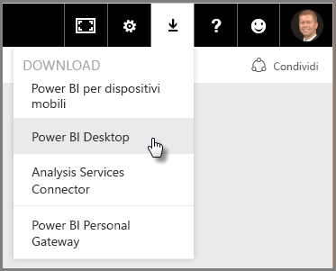
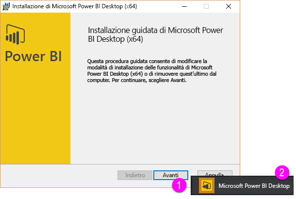
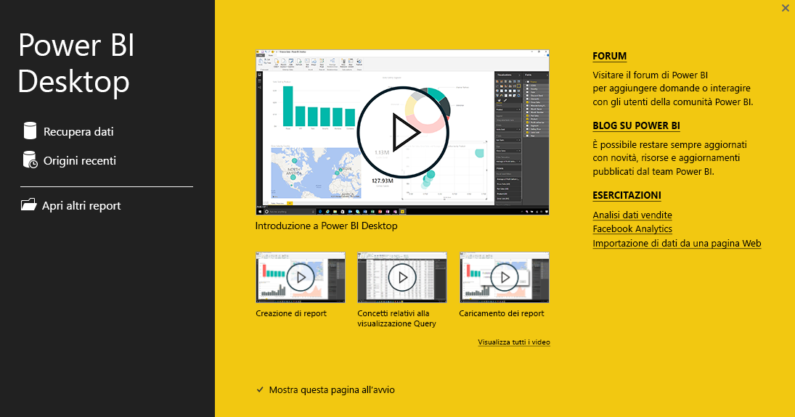
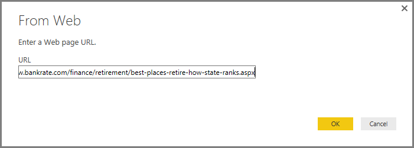
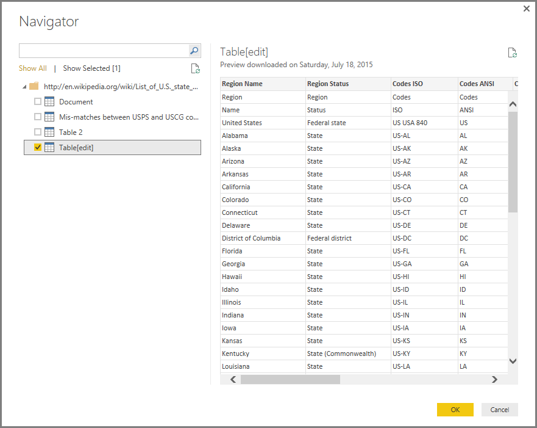
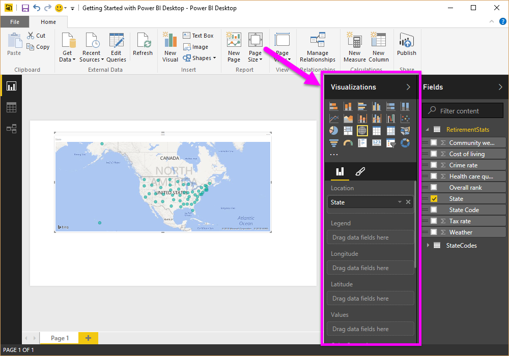
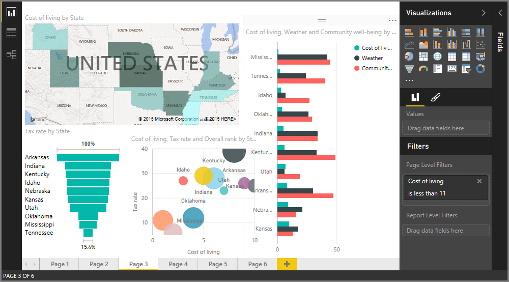
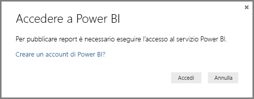

# Introduzione a Power BI Desktop
Questo articolo fornisce una **Guida introduttiva a Power BI Desktop**. Questa breve panoramica di Power BI Desktop fornisce informazioni di base sul funzionamento, illustra le operazioni che è possibile eseguire e aiuta a creare rapidamente modelli di dati affidabili, oltre a report straordinari, a supporto delle attività di business intelligence. 

Se si preferisce guardare un video invece di leggere un documento, è disponibile un [video introduttivo](desktop-videos.md). Per seguire le procedure del video usando dati di esempio corrispondenti, è possibile [scaricare questa cartella di lavoro di Excel di esempio](http://go.microsoft.com/fwlink/?LinkID=521962).

Power BI Desktop permette di creare una raccolta di query, connessioni dati e report che possono essere condivisi facilmente con altri utenti. Power BI Desktop integra tecnologie Microsoft collaudate, come il motore di query avanzato, la modellazione dei dati e le visualizzazioni, e interagisce facilmente con il [**servizio Power BI**](https://app.powerbi.com/) online.

Grazie alla combinazione di **Power BI Desktop** (con cui gli analisti e altri utenti possono creare connessioni dati, modelli e report avanzati) e del [**servizio Power BI**](https://preview.powerbi.com/) (in cui è possibile condividere i report di Power BI Desktop, in modo che gli utenti possano visualizzarli e interagire con essi), è possibile modellare, creare, condividere ed estendere con maggiore facilità nuove informazioni dettagliate ricavate dai dati.

Gli analisti apprezzeranno le capacità, la flessibilità e l'accessibilità elevata dello strumento Power BI Desktop per la connessione ai dati e le attività di data shaping, lo sviluppo di modelli affidabili e la creazione di report ben strutturati.

## Come usare questa Guida
È possibile usare questa guida in due modi, ovvero esaminarla per una veloce panoramica oppure leggere ogni sezione per comprendere a fondo il funzionamento di Power BI Desktop.

Se il tempo è limitato, è possibile scorrere visivamente la guida in un paio di minuti, per farsi un'idea del funzionamento di Power BI Desktop e di come usare questo strumento. La maggior parte di questa guida è costituita da schermate che illustrano visivamente il funzionamento di Power BI Desktop.

Per una comprensione migliore, è possibile leggere ogni sezione, eseguire i passaggi e creare un file di Power BI Desktop pronto per l'inserimento nel servizio **Power BI** e la condivisione con altri utenti.

>[!NOTE]
>È disponibile anche una versione separata e specializzata di **Power BI** denominata [**Server di report di Power BI**](report-server/get-started.md), destinata ai clienti che necessitano che i dati e i report rimangano locali. Per l'uso con tale versione specializzata è disponibile anche una versione separata e specializzata di **Power BI Desktop** denominata **Power BI Desktop per Server di report di Power BI**, che funziona solo con la versione Server di report di Power BI. Questo articolo illustra la versione standard di **Power BI Desktop**.

## Funzionamento di Power BI Desktop
Power BI Desktop permette di *connettersi ai dati* (in genere più origini dati), *eseguire il data shaping* (con query che creano modelli di dati utili e accattivanti) e usare il modello per *creare report* (che altri utenti possono usare, ampliare e condividere).

Dopo avere completato i passaggi di connessione, data shaping e creazione di report, è possibile salvare il lavoro nel formato di file di Power BI Desktop, con estensione pbix. I file di Power BI Desktop possono essere condivisi in modo analogo a tutti gli altri file, ma il modo migliore per condividere file di Power BI Desktop consiste nel caricarli (condividerli) nel [**servizio Power BI**](https://preview.powerbi.com/). 

Power BI Desktop centralizza, semplifica e ottimizza quello che altrimenti sarebbe un processo confuso, disconnesso e complesso per la progettazione e la creazione di repository e report di business intelligence.

Se si è pronti per un tentativo, è possibile iniziare subito.

## Installare ed eseguire Power BI Desktop
È possibile scaricare Power BI Desktop dal servizio **Power BI** selezionando l'icona a forma di **ingranaggio** e quindi selezionando **Power BI Desktop**.

Power BI Desktop viene installato come applicazione ed eseguito sul desktop.

Quando si esegue Power BI Desktop, viene visualizzata una *schermata iniziale* .

È possibile usare i comandi **Recupera dati**, **Origini recenti**o **Apri altri** **report** direttamente dalla *schermata iniziale* , usando i collegamenti disponibili nel riquadro sinistro. Se si chiude la schermata (selezionare la **x** nell'angolo superiore destro), viene aperta la vista **Report** di Power BI Desktop.

In Power BI Desktop sono disponibili tre viste: **Report** , **Dati** e **Relazioni** . Power BI Desktop include anche un **Editor di query**, che viene aperto in una finestra separata. Nell' **Editor di query**è possibile creare query e trasformare i dati, quindi caricare il modello di dati ottimizzato in Power BI Desktop e creare report.

La schermata seguente mostra le icone delle tre viste disponibili sul lato sinistro di Power BI Desktop: dall'alto verso il basso **Report**, **Dati**e **Relazioni**. La vista in uso è indicata dalla barra gialla a sinistra. In questo caso, è attiva la vista **Report** . È possibile cambiare la vista selezionando una di queste tre icone.

Dopo avere installato Power BI Desktop, è possibile connettersi ai dati, eseguire operazioni di data shaping e creare report, in genere in questo ordine. Le prossime sezioni illustrano ogni passaggio.

## Connettersi ai dati
Dopo avere installato Power BI Desktop, è possibile connettersi al mondo dei dati in continua espansione. Nella finestra Query sono disponibili origini dati *di ogni tipo* . La figura seguente illustra come connettersi ai dati, selezionando la scheda **Home** della barra multifunzione e quindi facendo clic su **Recupera dati \> Altro**.

 

Per questa breve panoramica ci si connetterà a un paio di origini dati **Web** diverse.

Si supponga di andare in pensione e di volere abitare in un luogo con clima mite, pressione fiscale ridotta e assistenza sanitaria di buona qualità o si supponga di essere un analista di dati e di avere bisogno di informazioni per aiutare i clienti. Ad esempio, è possibile che si voglia aiutare un rivenditore di occhiali da sole a concentrare le vendite nei luoghi in cui le giornate di sole sono più frequenti.

In ogni caso, la risorsa Web seguente offre dati interessanti su questi argomenti e altro ancora:

[*http://www.bankrate.com/finance/retirement/best-places-retire-how-state-ranks.aspx*](http://www.bankrate.com/finance/retirement/best-places-retire-how-state-ranks.aspx)

Selezionare **Recupera dati \> Web** e incollare l'indirizzo.

 

Quando si seleziona **OK**, la funzionalità **Query** di Power BI Desktop viene attivata. La funzionalità Query contatta la risorsa Web e la finestra **Strumento di navigazione** restituisce i dati trovati nella pagina Web. In questo caso, sono stati trovati una tabella (*Table 0*) e il documento Web complessivo. Nella procedura verrà usata la tabella, quindi occorre selezionarla dall'elenco. La finestra **Strumento di navigazione** mostra un'anteprima.

 

A questo punto è possibile modificare la query prima di caricare la tabella, selezionando **Modifica** nella parte inferiore della finestra, oppure è possibile caricare la tabella.

Se si seleziona **Modifica**, viene avviato l'Editor di query e viene presentata una vista rappresentativa della tabella. Verrà visualizzato il riquadro **Impostazioni query**. In caso contrario, selezionare **Visualizza** sulla barra multifunzione e quindi **Mostra\> Impostazioni query** per visualizzare il riquadro **Impostazioni query**. che ha un aspetto analogo al seguente.

 

Per altre informazioni sulla connessione ai dati, vedere [Connettersi ai dati in Power BI Desktop](desktop-connect-to-data.md).

Nella sezione successiva i dati verranno modificati per essere adattati alle esigenze specifiche. Il processo di modifica dei dati connessi viene definito *data shaping* .

## Effettuare il data shaping e combinare i dati
Dopo la connessione a un'origine dati, sarà necessario modificare i dati per adattarli alle esigenze specifiche. In alcuni casi per modifica si intende la *trasformazione* dei dati, ad esempio rinominando colonne o tabelle, cambiando il testo in numeri, rimuovendo righe, impostando la prima riga come intestazione e così via.

L'Editor di query di Power BI Desktop fa ampio uso dei menu di scelta rapida e le attività sono inoltre disponibili sulla barra multifunzione. La maggior parte delle opzioni che è possibile selezionare nella scheda **Trasforma** della barra multifunzione è disponibile anche facendo clic con il pulsante destro del mouse su un elemento, ad esempio una colonna, e scegliendo un'opzione dal menu visualizzato.

## Data shaping
Quando si eseguono operazioni di data shaping nell'**Editor di query**, si forniscono istruzioni dettagliate, eseguite automaticamente dall'**Editor di query**, che permettono di modificare i dati durante la fase di caricamento e di presentazione nell'**Editor di query**. L'origine dati originale non subisce alcuna modifica. Viene modificata, o sottoposta a *data shaping*, solo questa vista specifica dei dati.

I passaggi specificati (ad esempio rinominare una tabella, trasformare un tipo di dati o eliminare colonne) vengono registrati dall' **Editor di query**ed eseguiti ogni volta che questa query si connette all'origine dati, in modo che i dati abbiano sempre la forma specificata. Questo processo si verifica ogni volta che si usa la query in Power BI Desktop oppure per chiunque usi la query condivisa, ad esempio nel servizio **Power BI** . Questi passaggi vengono acquisiti, in sequenza, nel riquadro **Impostazioni query** in **Passaggi applicati**.

La figura seguente illustra il riquadro **Impostazioni query** per una query sottoposta a data shaping. Ogni passaggio verrà esaminato nei prossimi paragrafi.

 

È ora possibile tornare ai dati relativi al pensionamento, trovati tramite la connessione a un'origine dati Web e il data shaping in base alle esigenze specifiche.

Come si può notare prima di tutto, la maggior parte delle classificazioni è stata inserita nell' **Editor di query** sotto forma di numeri interi, ma non tutte le classificazioni: una colonna contiene testo e numeri e quindi non è stata convertita automaticamente. È necessario che i dati siano costituiti da numeri. È sufficiente fare clic con il pulsante destro del mouse sull'intestazione di colonna e quindi scegliere **Modifica tipo \> Numero intero** per modificare il tipo di dati. Se fosse necessario scegliere più colonne, si potrebbe selezionare prima di tutto una colonna, tenere premuto **MAIUSC**, selezionare altre colonne adiacenti e quindi fare clic con il pulsante destro del mouse su un'intestazione di colonna per cambiare tutte le colonne selezionate. È anche possibile usare **CTRL** per selezionare colonne non adiacenti.

 

È poi possibile cambiare, o *trasformare* , queste colonne da testo a intestazione usando la scheda **Trasforma** della barra multifunzione. Di seguito è illustrata la scheda **Trasforma** della barra multifunzione, con una freccia che indica il pulsante **Tipo di dati** , che permette di trasformare il tipo di dati corrente in un altro.

 

Si noti che in **Impostazioni query**la sezione **Passaggi applicati** riflette le modifiche apportate. Per rimuovere eventuali passaggi dal processo di data shaping, è sufficiente selezionare il passaggio e quindi fare clic sulla **X** a sinistra del passaggio.

 

Sono necessarie ancora alcune modifiche per ottenere la query desiderata:

* *Rimuovere la prima colonna* : non è necessaria, include solo righe ridondanti con il testo "Check out how your state ranks for retirement", perché si tratta di una tabella basata sul Web.

<!-- -->

* *Correggere alcuni errori* : nella pagina Web una colonna contiene un misto di testo e numeri, perché per alcuni stati è indicato che hanno un valore uguale ad altri in una categoria. Questa impostazione è corretta per il sito Web ma non è adatta all'analisi dei dati. In questo caso, si tratta di un problema semplice da risolvere e che consente di capire alcune funzionalità e capacità interessanti dell'**Editor di query** e della sezione **Passaggi applicati**

<!-- -->

* *Modificare il nome della tabella* : il valore **Table 0** non è un descrittore utile, ma può essere modificato facilmente.

Ognuno di questi passaggi è illustrato in **[Effettuare il data shaping e combinare i dati in Power BI Desktop](desktop-shape-and-combine-data.md)**. È possibile passare a questa pagina o continuare a leggere questo documento per verificare le operazioni successive. La prossima sezione parte dal punto successivo all'applicazione delle modifiche precedenti.

## Combinare i dati
I dati sui diversi stati sono interessanti e saranno utili per la creazione di analisi e query aggiuntivi. Esiste tuttavia un problema: la maggior parte dei dati usa un'abbreviazione di due lettere per i codici relativi allo stato, non il nome completo dello stato. È necessario trovare un modo per associare i nomi degli stati e le rispettive abbreviazioni.

Fortunatamente, è disponibile un'altra origine dati pubblica che esegue proprio questa operazione, ma è necessaria una quantità elevata di data shaping prima che sia possibile connettersi alla tabella relativa al pensionamento. La risorsa Web per le abbreviazioni dei nomi degli stati è la seguente:

<http://en.wikipedia.org/wiki/List_of_U.S._state_abbreviations>

Sulla scheda **Home** della barra multifunzione nell'**Editor di query** selezionare **Recupera dati \> Web** e digitare l'indirizzo, quindi selezionare **OK**. La finestra **Strumento di navigazione** mostra i dati trovati nella pagina Web.

 

Selezionare **Table[edit]** , perché include i dati desiderati, ma saranno necessarie alcune operazioni di data shaping per ridurre la quantità di dati della tabella. Ognuno di questi passaggi è illustrato anche in **[Effettuare il data shaping e combinare i dati in Power BI Desktop](desktop-shape-and-combine-data.md)**. Per riepilogare, verranno eseguiti i passaggi seguenti:

Selezionare **Modifica**, quindi:

* *Rimuovere le prime due righe* : sono il risultato del modo in cui è stata creata la tabella della pagina Web e non sono necessarie.

<!-- -->

* *Rimuovere le ultime 26 righe* : sono relative a tutti i territori, che non è necessario includere.

<!-- -->
* *Escludere Washington DC con un filtro* : la tabella relativa alle statistiche sul pensionamento non include DC, che dunque verrà escluso dall'elenco.

<!-- -->

* *Rimuovere alcune colonne non necessarie* : è necessario solo il mapping dello stato alla rispettiva abbreviazione di due lettere ufficiale ed è quindi possibile rimuovere le altre colonne.

<!-- -->

* *Usare la prima riga come intestazione* : siccome le prime tre righe sono state rimosse, la prima riga attuale corrisponde all'intestazione desiderata.

    >[!NOTE]
    >È utile notare che la *sequenza* dei passaggi applicati nell'**Editor di query** è importante e può influire sul data shaping. È anche importante valutare l'eventuale impatto di un passaggio su un passaggio successivo. Se si rimuove un passaggio in **Passaggi applicati**, i passaggi successivi potrebbero non dare gli stessi risultati previsti inizialmente, a causa dell'impatto della sequenza di passaggi della query.

* *Rinominare le colonne e la tabella stessa* : come sempre, sono disponibili un paio di modi per rinominare una colonna ed è possibile scegliere il metodo preferito.

Dopo il data shaping della tabella *StateCodes*, sarà possibile combinare le due tabelle, o query, in una sola. Poiché le tabelle ora disponibili sono il risultato delle query applicate ai dati, vengono spesso definite *query*.

È possibile combinare le query in due modi principali, ovvero tramite *merge* e *accodamento*.

Quando sono presenti una o più colonne da aggiungere a un'altra query, è consigliabile eseguire il **merge** delle query. Quando sono presenti righe aggiuntive di dati da aggiungere a una query esistente, è consigliabile **accodare** la query.

In questo caso verrà eseguita l'unione delle query. È prima di tutto necessario selezionare la query *in cui* si vuole eseguire il merge dell'altra query, quindi selezionare **Merge di query** nella scheda **Home** della barra multifunzione.

 

Viene visualizzata la finestra **Merge** in cui viene chiesto di selezionare la tabella di cui eseguire il merge nella tabella selezionata e quindi le colonne corrispondenti da usare per il merge. Selezionare *State* dalla tabella *RetirementStats* (query), quindi selezionare la query *StateCodes*. L'operazione è molto semplice in questo caso, perché è presente solo un'altra query. Quando ci si connette a molte origini dati, ci sono molte query tra cui scegliere. Quando si selezionano le colonne corrispondenti corrette, ovvero *State* da *RetirementStats* e *State Name* da *StateCodes*, la finestra **Merge** avrà un aspetto analogo al seguente e il pulsante **OK** sarà abilitato.

 

Alla fine della query viene creato un oggetto **NewColumn** , che include i contenuti della tabella (query) dopo il merge con la query esistente. Tutte le colonne della query sottoposta a merge vengono condensate in **NewColumn**, ma è possibile selezionare **Espandi** per la tabella e includere le colonne desiderate. Per espandere la tabella sottoposta a merge e selezionare le colonne da includere, fare clic sull'icona di espansione (). Verrà visualizzata la finestra **Espandi** .

 

Poiché in questo caso è necessaria solo la colonna *State Code*, selezionare solo questa colonna e quindi scegliere **OK**. Deselezionare la casella di controllo **Usa il nome della colonna originale come prefisso**, perché l'operazione non è necessaria. Se si lascia selezionata questa opzione, la colonna sottoposta a merge verrà denominata *NewColumn.State Code*, usando cioè il nome della colonna originale, *NewColumn*, seguito da un punto e quindi dal nome della colonna da inserire nella query.

>[!NOTE]
>È possibile scegliere diversi modi per inserire la tabella *NewColumn*. È possibile fare alcune prove e, se i risultati non sono quelli desiderati, sarà sufficiente eliminare il passaggio dall'elenco **Passaggi applicati** nel riquadro **Impostazioni query**. La query tornerà allo stato precedente all'applicazione del passaggio **Espandi**. È possibile ripetere più volte l'operazione, fino a ottenere il risultato desiderato dal processo di espansione.

È ora disponibile una singola query (tabella) che combina due origini dati, ognuna delle quali è stata sottoposta a data shaping per soddisfare le esigenze specifiche. Questa query può essere usata come base per connessioni dati aggiuntive e interessanti, ad esempio le statistiche relative ai costi delle abitazioni, i dati demografici o le opportunità di lavoro in ogni stato.

Per una descrizione più completa di ogni passaggio di data shaping e di combinazione dei dati, vedere [Effettuare il data shaping e combinare i dati in Power BI Desktop](desktop-shape-and-combine-data.md).

Per il momento la quantità di dati è sufficiente per creare alcuni report interessanti in Power BI Desktop. Poiché si tratta di un'attività cardine, salvare questo file di Power BI Desktop con il nome **Introduzione a Power BI Desktop**. Per applicare le modifiche nell'**Editor di query** e caricarle in Power BI Desktop, selezionare **Chiudi e applica** nella scheda **Home** della barra multifunzione.

## Creare report
È possibile apportare altre modifiche dopo il caricamento della tabella e ricaricare un modello per applicare le modifiche apportate. Per il momento queste operazioni non verranno eseguite. Nella vista **Report** di Power BI Desktop è possibile iniziare a creare report.

La vista **Report** include cinque aree principali:

1. La barra multifunzione, che mostra le attività comuni associate ai report e alle visualizzazioni.
2. La vista **Report** , o area di disegno, dove vengono create e disposte le visualizzazioni.
3. La scheda **Pagine** nella parte inferiore, che consente di selezionare o aggiungere una pagina del report.
4. Il riquadro **Visualizzazioni** , dove è possibile modificare le visualizzazioni, personalizzare i colori o gli assi, applicare filtri, trascinare i campi e altro ancora.
5. Il riquadro **Campi** in cui gli elementi della query e i filtri possono essere trascinati nella vista **Report** oppure nell'area **Filtri** del riquadro **Visualizzazioni** .
   
   

I riquadri **Visualizzazioni** e **Campi** possono essere compressi selezionando la piccola freccia lungo il bordo, in modo da ottenere più spazio nella vista **Report** per la creazione di visualizzazioni accattivanti. Quando si modificano le visualizzazioni, vengono visualizzate anche queste frecce rivolte verso l'alto o verso il basso, che indicano che è possibile espandere o comprimere la sezione.

 

Per creare una visualizzazione, trascinare un campo dall'elenco **Campi** alla vista **Report** . In questo caso, trascinare il campo *State* da *RetirementStats* e verificare il risultato.

 

Osservare cosa accade... Power BI Desktop ha creato automaticamente una visualizzazione basata su mappa, dopo aver riconosciuto che il campo *State* includeva dati di georilevazione.

Si noti che il riquadro **Visualizzazioni** consente di selezionare diversi tipi di visualizzazioni e nell'area sotto le icone è possibile trascinare i campi in aree diverse per applicare una legenda o modificare in altro modo la visualizzazione.

 

Avanzando rapidamente è possibile verificare l'aspetto della vista **Report** dopo l'aggiunta di alcune visualizzazioni, oltre ad alcune nuove pagine Report. Per altre informazioni sui report, vedere [Visualizzazione report in Power BI Desktop](desktop-report-view.md).

La prima pagina Report offre una prospettiva dei dati basata su *Overall rank*. Quando si seleziona una delle visualizzazioni, il riquadro **Campi e filtri** mostra i campi selezionati e la struttura della visualizzazione, ovvero i campi applicati ad **Asse condiviso**, **Valori colonna**e **Valori riga**.

 

Questo report include sei **pagine** , ognuna delle quali visualizza determinati elementi dei dati.

1. La prima pagina, riportata sopra, mostra tutti gli stati in base a *Overall rank*.
2. La seconda pagina è incentrata sui primi dieci stati in base a *Overall rank*.
3. Nella terza pagina vengono visualizzati i 10 stati migliori per quanto riguarda il costo della vita, insieme ai dati associati.
4. Il clima è il tema della quarta pagina, in cui vengono visualizzati i 15 stati con il numero maggiore di giornate di sole.
5. Nella quinta pagina sono disponibili dati relativi al benessere della comunità per i primi 15 stati, anche sotto forma di grafici.
6. Vengono infine visualizzate le statistiche relative al crimine, per mostrare i dieci stati migliori (e i peggiori).

La pagina del report relativa al costo della vita avrà un aspetto analogo al seguente.

 

È possibile creare molti report e visualizzazioni interessanti.

## Condividere il lavoro
Dopo avere creato un report di Power BI Desktop ragionevolmente completo, è possibile condividerlo con altri utenti nel servizio **Power BI** . È possibile condividere il lavoro in Power BI Desktop in diversi modi. È possibile eseguire la pubblicazione nel servizio **Power BI** , caricare il file con estensione pbix direttamente dal servizio Power BI oppure salvare il file con estensione pbix e inviarlo come qualsiasi altro file.

Verrà prima di tutto esaminata la pubblicazione nel servizio **Power BI** direttamente da Power BI Desktop. Sulla scheda **Home** della barra multifunzione selezionare **Pubblica**.

Potrebbe essere richiesto di accedere a Power BI.

Dopo che l'accesso è stato effettuato e il processo di pubblicazione è stato completato, viene visualizzata la finestra di dialogo seguente.

Quando si accede a Power BI è possibile vedere il file di Power BI Desktop appena caricato nelle sezioni **Dashboard**, **Report**e **Set di dati** del servizio.

È possibile condividere il lavoro anche caricandolo dal servizio **Power BI** . Il collegamento seguente consente di visualizzare il servizio **Power BI** in un browser:

`https://app.powerbi.com`

Selezionare **Recupera dati** per avviare il processo di caricamento del report di Power BI Desktop.

 

Viene visualizzata la pagina **Recupera dati** , da cui è possibile selezionare la posizione da cui ottenere i dati. In questo caso selezionare **Recupera** nella casella **File** .

Verrà aperta la vista **File** . In questo caso selezionare **File locale**.

Quando si seleziona il file, Power BI lo carica.

Dopo aver caricato il file sarà possibile selezionarlo da **Report** nel riquadro a sinistra del servizio Power BI.

Il servizio **Power BI** mostra la prima pagina del report. Nella parte inferiore della pagina, è possibile selezionare qualsiasi scheda per visualizzare la pagina del report.

 

È possibile apportare modifiche a un report nel servizio **Power BI** selezionando **Modifica report** nella parte superiore dell'area di disegno del report.

Per salvare il report, selezionare **File \> Salva con nome** dal servizio. È possibile creare molti elementi visivi interessanti nel servizio **Power BI** dal report e quindi aggiungerli a un *dashboard*. Per informazioni sui dashboard nel servizio **Power BI****[, vedere Suggerimenti per la progettazione di un dashboard ottimale](service-dashboards-design-tips.md)**.

 

Dopo il salvataggio, selezionare l'icona **Condividi** nella pagina principale.

 

Sarà quindi possibile inviare un messaggio di posta elettronica ai colleghi con cui si vuole condividere il dashboard.

 

Per altre informazioni su creazione, condivisione e modifica dei dashboard, vedere [Condividere un dashboard](service-share-dashboards.md).

Power BI Desktop e il servizio Power BI consentono di creare accattivanti visualizzazioni e mashup correlati a dati di molti tipi. Per altre informazioni, vedere la sezione successiva.

## Passaggi successivi
Power BI Desktop offre infinite possibilità. Per altre informazioni sulle capacità disponibili, vedere le risorse seguenti:

* [Panoramica delle query con Power BI Desktop](desktop-query-overview.md)
* [Origini dati in Power BI Desktop](desktop-data-sources.md)
* [Connettersi ai dati in Power BI Desktop](desktop-connect-to-data.md)
* [Effettuare il data shaping e combinare i dati con Power BI Desktop](desktop-shape-and-combine-data.md)
* [Attività di query comuni in Power BI Desktop](desktop-common-query-tasks.md)   

