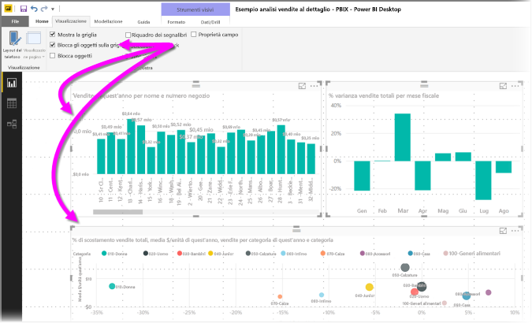
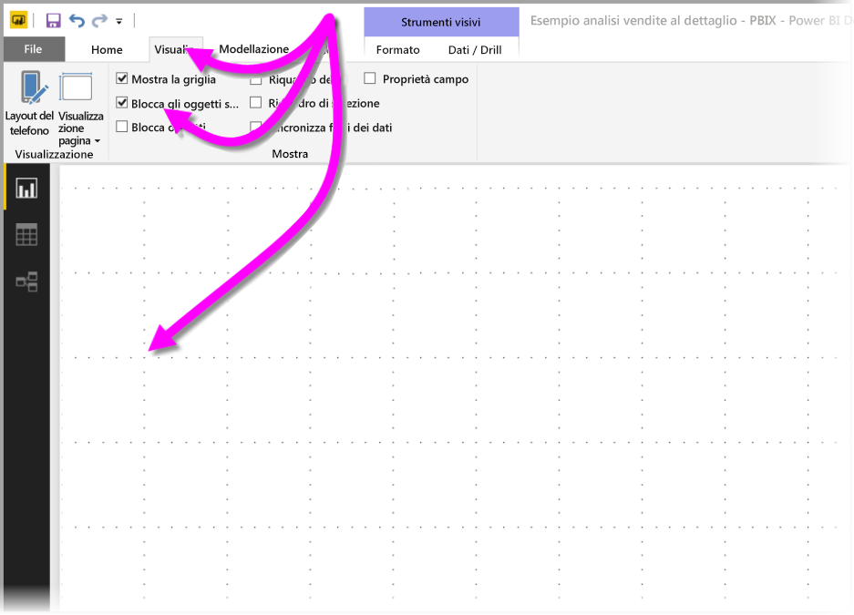
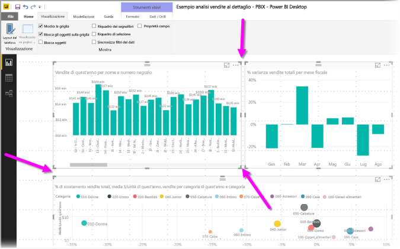
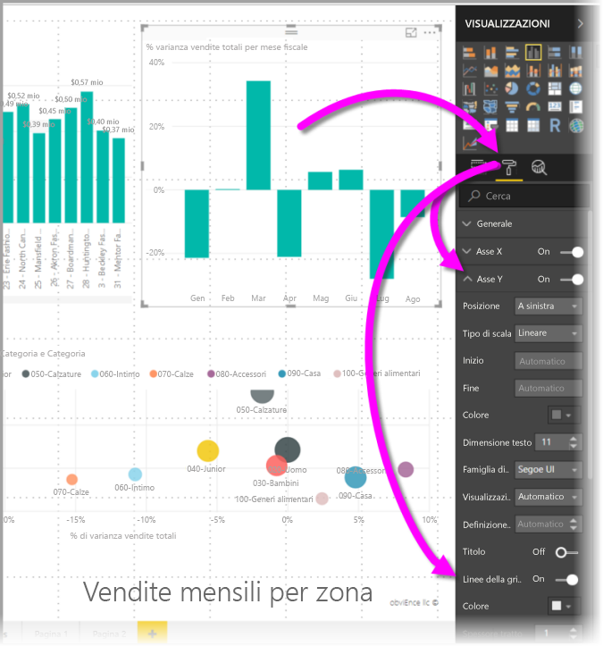
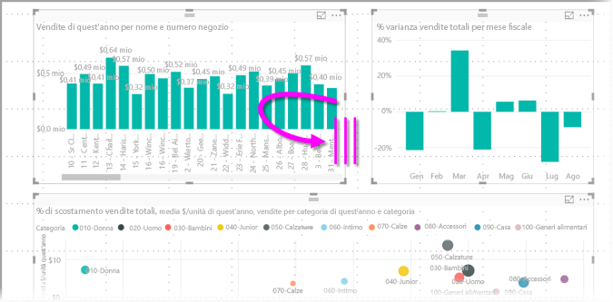
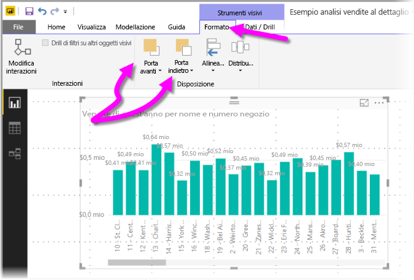
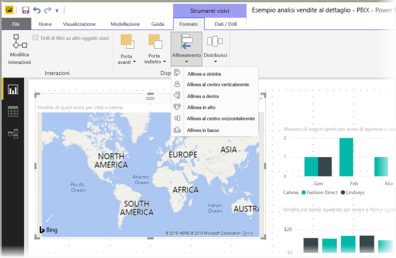
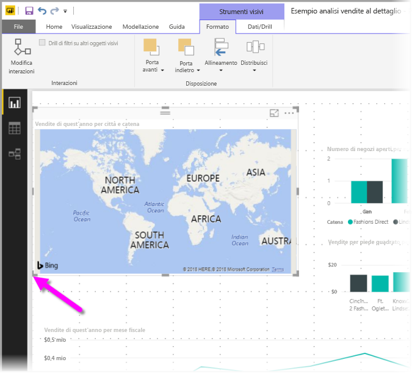
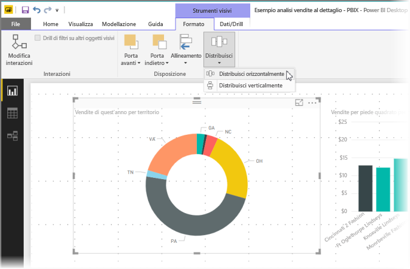

# Usare le linee della griglia e il blocco alla griglia nei report di Power BI Desktop
L'area di disegno dei report **Power BI Desktop** offre linee della griglia che consentono di allineare accuratamente gli oggetti visivi in una pagina del report e fornisce anche funzionalità per bloccare alla griglia tali oggetti dei report per un aspetto pulito, allineato e distribuito in modo uniforme.

In **Power BI Desktop** è anche possibile modificare l'ordine Z (portare avanti o indietro) degli oggetti in un report, nonché allineare o distribuire uniformemente gli oggetti visivi selezionati nell'area di disegno.

### Abilitazione delle linee guida della griglia e del blocco alla griglia
Per abilitare le linee della griglia, selezionare la barra multifunzione **Visualizzazione**, quindi selezionare le caselle di controllo **Mostra griglia** e **Blocca sulla griglia**. È possibile selezionare una o entrambe le caselle poiché funzionano in modo indipendente.

> [!NOTE]
> Se le opzioni **Mostra griglia** e **Blocca sulla griglia** sono disabilitate, connettersi a qualsiasi origine dati per attivarle.
> 
> 

### Uso delle linee delle griglie
Le linee della griglia sono guide visive che consentono di controllare se due o più oggetti visivi sono allineati correttamente. Per stabilire se due o più oggetti visivi sono allineati orizzontalmente o verticalmente, usare le linee della griglia per determinare visivamente se allineare i bordi.

È possibile usare *CTRL + clic* per selezionare più di un oggetto visivo contemporaneamente e visualizzare i bordi di tutti gli oggetti visivi selezionati, al fine di vedere se gli elementi visivi sono allineati correttamente.

#### Uso delle linee della griglia negli oggetti visivi
In Power BI sono anche disponibili linee della griglia negli oggetti visivi, per una guida visiva utile nel confronto di valori e punti dati. A partire dalla versione di settembre 2017 di **Power BI Desktop**, è possibile gestire le linee della griglia negli oggetti visivi usando la scheda **Asse X** o **Asse Y** (in base al tipo di oggetto visivo) nella sezione **Formato** del riquadro **Visualizzazioni**. È possibile gestire gli elementi seguenti delle linee della griglia in un oggetto visivo:

* Attivare o disattivare le linee della griglia
* Modificare il colore delle linee della griglia
* Modificare la larghezza delle linee della griglia
* Selezionare lo stile delle linee della griglia nell'oggetto visivo, ad esempio continuo, tratteggiato o punteggiato

Modificare alcuni elementi delle linee della griglia può risultare particolarmente utile nei report in cui vengono usati sfondi scuri per gli oggetti visivi. L'immagine seguente mostra la sezione *Linee della griglia* nella scheda **Asse X**.

### Uso di Blocca sulla griglia
Quando si abilita **Blocca sulla griglia**, tutti gli oggetti visivi nell'area di disegno di **Power BI Desktop** spostati o ridimensionati vengono automaticamente allineati all'asse della griglia più vicino, rendendo molto l'allineamento di due o più oggetti visivi alle dimensioni o alla stessa posizione orizzontale o verticale.

Non è necessaria nessuna altra azione per usare la **griglia** e il **blocco alla griglia** ai fini dell'allineamento corretto degli oggetti visivi nei report.

### Uso di ordine Z, allineamento e distribuzione
È anche possibile gestire l'ordine dalla parte anteriore a quella posteriore degli oggetti visivi in un report, noto anche come *ordine Z* degli elementi. In questo modo è possibile sovrapporre gli oggetti visivi in qualsiasi modo desiderato, quindi modificare l'ordine dalla parte anteriore a quella posteriore di ogni oggetto visivo. Questo ordinamento viene eseguito usando i pulsanti **Porta avanti** e **Porta indietro** nella sezione **Disponi** della barra multifunzione **Formato**, che viene visualizzata non appena si selezionano uno o più oggetti visivi nella pagina (e non è disponibile se non viene selezionato alcun oggetto visivo).

La barra multifunzione **Formato** consente anche di allineare gli oggetti visivi in molti modi diversi. Ciò consente di verificare che gli oggetti visivi siano allineati nel modo che si ritiene più funzionale.

Quando viene selezionato un oggetto visivo, il pulsante **Allinea** consente di allineare tale oggetto visivo al bordo (o al centro) dell'area di disegno del report, come illustrato nella figura seguente.

Quando si selezionano due o più oggetti visivi, questi vengono allineati tra loro usando il limite di allineamento esistente. Ad esempio, con due oggetti visivi selezionati e il pulsante *Allinea a sinistra* selezionato, gli oggetti visivi verranno allineati al limite più a sinistra di tutti gli oggetti visivi selezionati.

È anche possibile distribuire gli oggetti visivi in modo uniforme tra l'area di disegno del report, in orizzontale o verticale. Usare semplicemente il pulsante **Distribuisci** della barra multifunzione **Formato**.

Selezionando alcuni di questi strumenti di linee griglia, allineamento e distribuzione, i report avranno esattamente l'aspetto desiderato.

