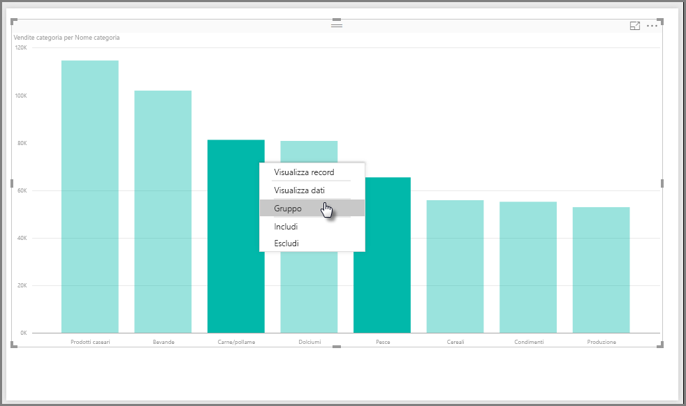
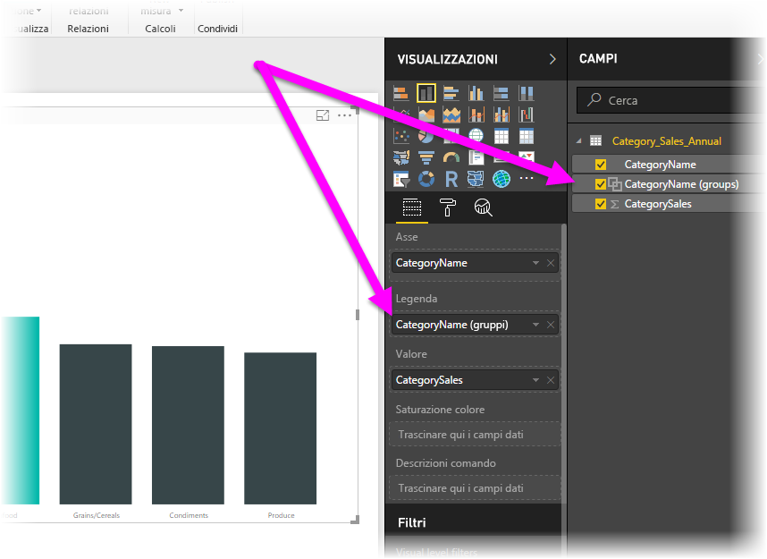
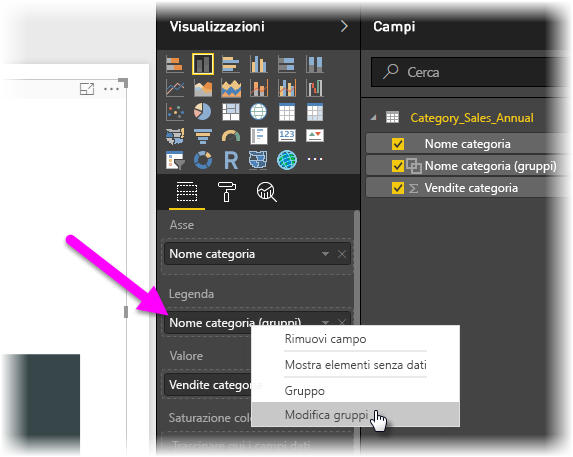
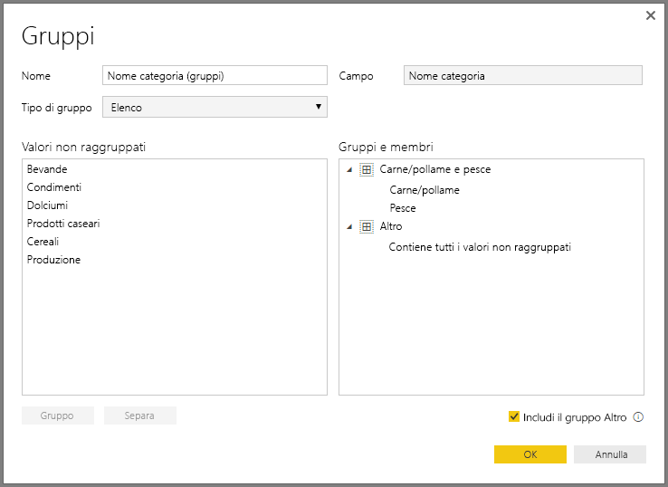
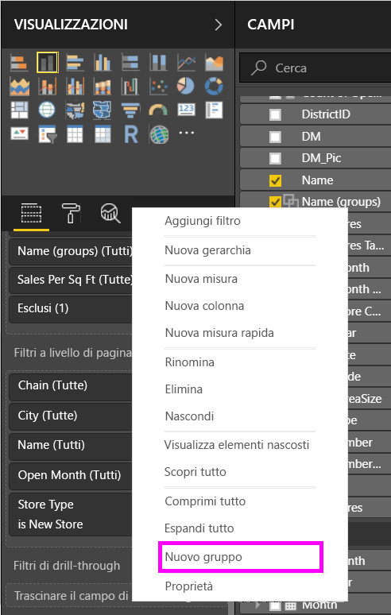
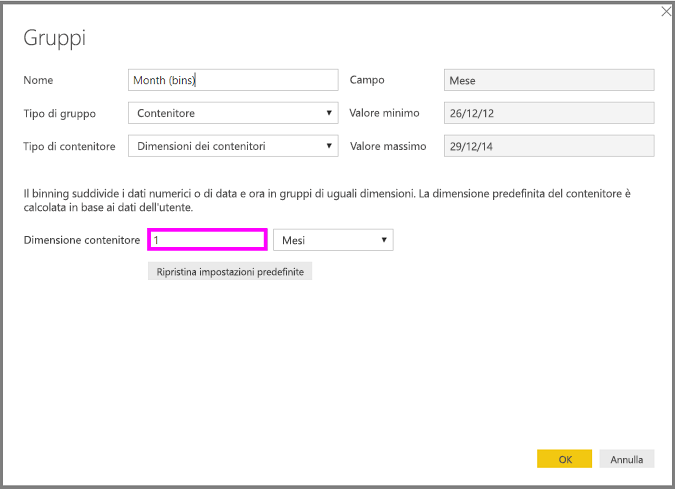
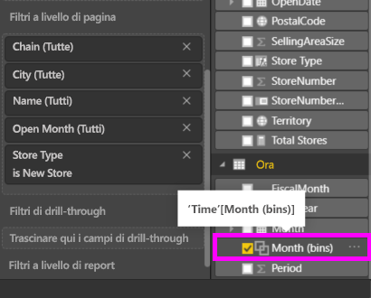

# Usare il raggruppamento e la creazione di contenitori in Power BI Desktop
Quando **Power BI Desktop** crea oggetti visivi, aggrega i dati in blocchi (o **gruppi**) in base ai valori rilevati nei dati sottostanti. Tuttavia, a volte si potrebbe voler perfezionare la modalità di presentazione di tali blocchi. Ad esempio, si potrebbero voler inserire tre categorie di prodotti in una categoria maggiore (un *gruppo*). In alternativa, si potrebbero voler visualizzare le cifre delle vendite in dimensioni del contenitore di 1.000.000 euro, anziché 923.983 euro divisi uniformemente.

In Power BI Desktop, è possibile **raggruppare** punti dati che consentono di visualizzare, analizzare ed esplorare più chiaramente dati e tendenze negli oggetti visivi. È anche possibile definire le **dimensioni del contenitore** in modo da inserire i valori in gruppi di uguali dimensioni che consentono una migliore visualizzazione dei dati.

### Uso del raggruppamento
Per usare il **raggruppamento** selezionare due o più elementi in un oggetto visivo usando CTRL+clic per selezionare più elementi. Quindi, fare clic con il pulsante destro su uno degli elementi di selezione multipla e selezionare *Gruppo* dal menu visualizzato.

Una volta creato, il gruppo viene aggiunto al bucket **Legenda** per l'oggetto visivo e viene visualizzato anche nel campo **Campi**.

Dopo aver creato un gruppo, è possibile modificare facilmente i relativi membri facendo clic con il pulsante destro del mouse sul campo dal bucket **Legenda** o dall'elenco **Campi** e selezionando *Modifica gruppi*.

Nella finestra **Gruppi** visualizzata è possibile creare nuovi gruppi o modificare i gruppi esistenti. È anche possibile *rinominare* qualsiasi gruppo facendo doppio clic sul titolo **Gruppo** nella casella **Gruppi e membri** e digitando un nuovo nome.

I gruppi in questa finestra offrono infinite possibilità. È possibile aggiungere elementi dall'elenco **Valori non raggruppati** in un nuovo gruppo o in uno dei gruppi esistenti. Per creare un nuovo gruppo, selezionare due o più elementi (usando CTRL+clic) dalla casella **Valori non raggruppati** e quindi fare clic sul pulsante **Gruppo** sotto tale casella.

È possibile aggiungere un valore non raggruppato in un gruppo esistente: è sufficiente selezionare il valore non raggruppato, quindi selezionare il gruppo esistente a cui si vuole aggiungerlo e fare clic sul pulsante **Gruppo**. Per rimuovere un elemento da un gruppo, selezionarlo dalla casella **Gruppi e membri** e quindi fare clic su **Separa**. È anche possibile selezionare se le categorie separate devono essere inserite nel gruppo **Altro** o se devono rimanere non raggruppate.

> [!NOTE]
> È possibile creare gruppi per qualsiasi campo nell'area **Campi** senza la necessità di eseguire la selezione multipla da un oggetto visivo esistente. Fare clic con il pulsante destro sul campo e selezionare **Gruppo** dal menu visualizzato.
> 
> 

### Uso della creazione di contenitori
È possibile impostare le dimensioni del contenitore per i campi numerici e ora in **Power BI Desktop**. È possibile usare la creazione di contenitori per assegnare le dimensioni appropriate ai dati visualizzati da **Power BI Desktop**.

Per applicare una dimensione al contenitore, fare clic con il pulsante destro del mouse su un **Campo** e selezionare **Gruppi**.

Nella finestra **Gruppi** impostare le **Dimensioni contenitore** sulle dimensioni desiderate.

Quando si seleziona **OK**, verrà visualizzato un nuovo campo nel riquadro **Campi** con *(contenitori)* accodato. È quindi possibile trascinare il campo nell'area di disegno per usare la dimensione del contenitore in un oggetto visivo.

Per vedere in azione la **creazione di contenitori**, dare uno sguardo a questo [video](https://youtu.be/UXEYSvgvMaQ?t=12m17s).

E questo è tutto per quanto riguarda l'uso del **raggruppamento** e della **creazione di contenitori** per assicurarsi che gli oggetti visivi nei report mostrino i dati nel modo desiderato.

